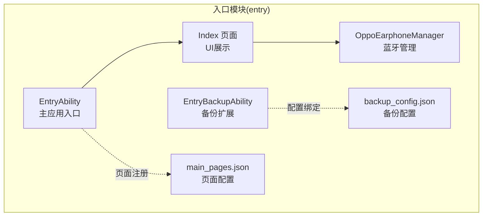
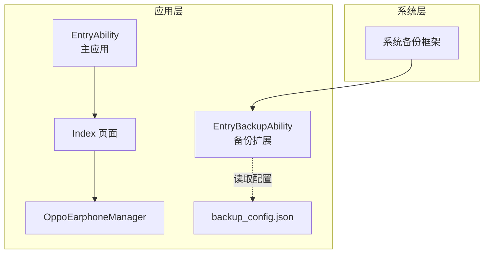
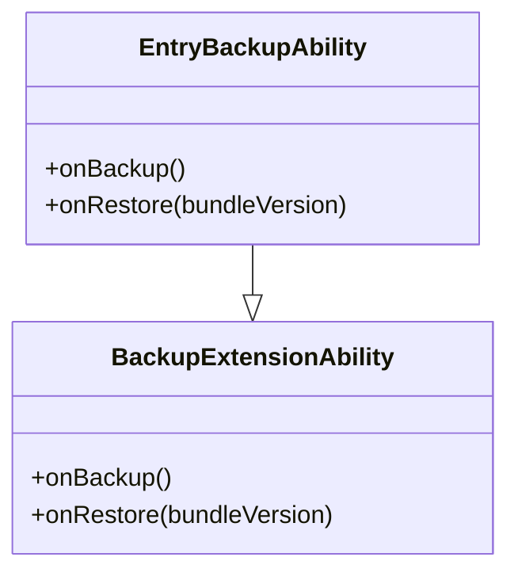
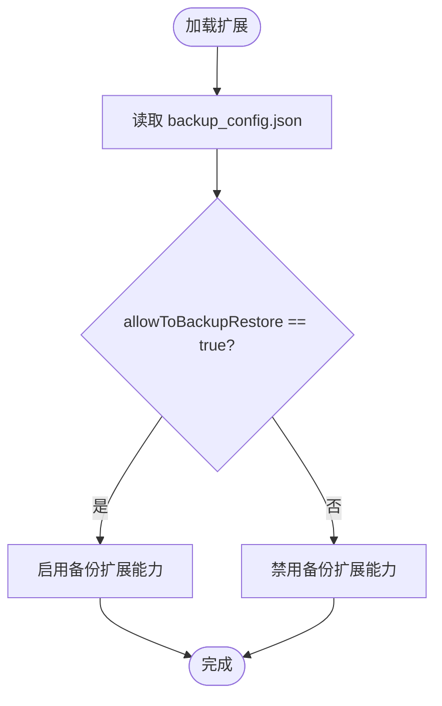
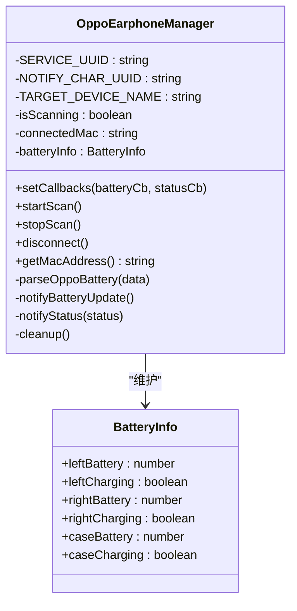
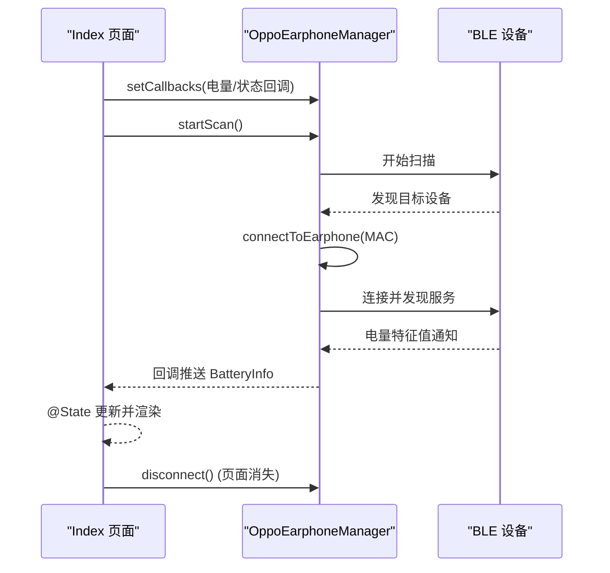
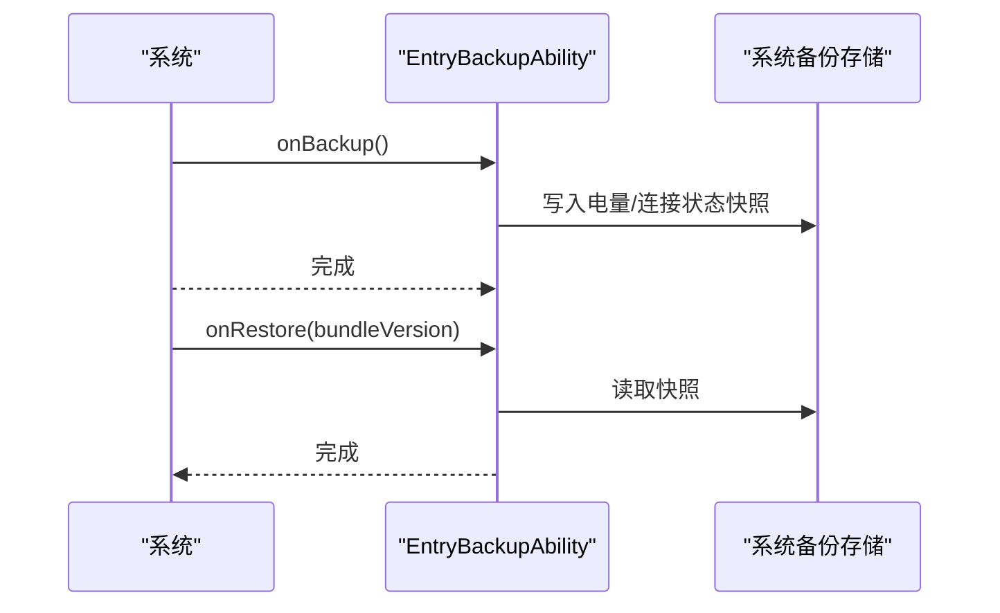
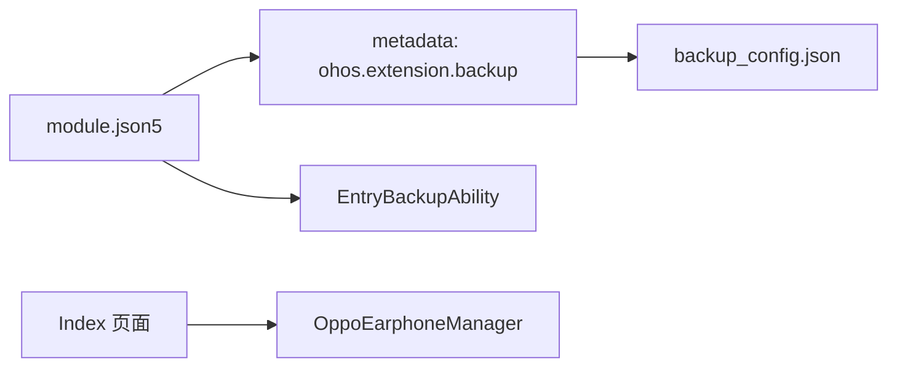

# 备份扩展机制

<cite>
**本文档引用的文件**
- [EntryBackupAbility.ets](file://entry/src/main/ets/entrybackupability/EntryBackupAbility.ets)
- [backup_config.json](file://entry/src/main/resources/base/profile/backup_config.json)
- [module.json5](file://entry/src/main/module.json5)
- [OppoEarphoneManager.ets](file://entry/src/main/ets/manager/OppoEarphoneManager.ets)
- [Index.ets](file://entry/src/main/ets/pages/Index.ets)
- [Ability.test.ets](file://entry/src/ohosTest/ets/test/Ability.test.ets)
- [List.test.ets](file://entry/src/test/List.test.ets)
- [main_pages.json](file://entry/src/main/resources/base/profile/main_pages.json)
</cite>

## 目录
1. [简介](#简介)
2. [项目结构](#项目结构)
3. [核心组件](#核心组件)
4. [架构总览](#架构总览)
5. [详细组件分析](#详细组件分析)
6. [依赖关系分析](#依赖关系分析)
7. [性能考虑](#性能考虑)
8. [故障排除指南](#故障排除指南)
9. [结论](#结论)
10. [附录](#附录)

## 简介
本文件系统性阐述 OPPO Enco Air5 Pro 应用的备份扩展机制，重点覆盖以下方面：
- EntryBackupAbility 的实现原理与备份能力配置
- 备份配置文件 backup_config.json 的结构与参数
- 应用数据备份的触发条件与执行流程（自动与手动）
- 备份数据的格式规范与存储位置（电量历史记录与连接状态的持久化）
- 备份恢复的完整流程（数据迁移与状态恢复）
- 备份扩展与主应用的集成方式（生命周期管理与数据同步）
- 测试方法与验证标准
- 备份数据的加密与安全保护建议
- 版本兼容性与升级策略

当前仓库中的备份扩展实现较为基础，主要提供扩展能力声明与日志输出，尚未实现具体的数据持久化与恢复逻辑。本文在不改变现有代码的前提下，给出可落地的扩展方案与最佳实践。

## 项目结构
项目采用“模块化 + 扩展能力”的组织方式，入口模块包含主应用与备份扩展两部分：
- 主应用模块：EntryAbility 作为主入口，页面 Index 展示蓝牙连接与电量状态
- 备份扩展模块：EntryBackupAbility 作为备份扩展，通过 metadata 绑定 backup_config.json 配置
- 蓝牙管理模块：OppoEarphoneManager 负责扫描、连接、订阅与电量解析

**图表来源**
- [module.json5:48-61](file://entry/src/main/module.json5#L48-L61)
- [backup_config.json:1-3](file://entry/src/main/resources/base/profile/backup_config.json#L1-L3)
- [main_pages.json:1-6](file://entry/src/main/resources/base/profile/main_pages.json#L1-L6)

**章节来源**
- [module.json5:1-63](file://entry/src/main/module.json5#L1-L63)
- [backup_config.json:1-3](file://entry/src/main/resources/base/profile/backup_config.json#L1-L3)
- [main_pages.json:1-6](file://entry/src/main/resources/base/profile/main_pages.json#L1-L6)

## 核心组件
- EntryBackupAbility：继承系统备份扩展基类，提供 onBackup 与 onRestore 生命周期钩子，当前实现仅记录日志
- backup_config.json：声明允许备份/恢复的开关，用于控制扩展能力启用
- OppoEarphoneManager：封装蓝牙扫描、GATT 连接、服务发现与电量特征值解析，负责电量与连接状态的实时更新
- Index 页面：展示连接状态、MAC 地址与三路电量信息，负责调用 Manager 并渲染 UI
- module.json5：声明扩展能力类型为 backup，并通过 metadata 将扩展与配置文件关联

**章节来源**
- [EntryBackupAbility.ets:1-16](file://entry/src/main/ets/entrybackupability/EntryBackupAbility.ets#L1-L16)
- [backup_config.json:1-3](file://entry/src/main/resources/base/profile/backup_config.json#L1-L3)
- [OppoEarphoneManager.ets:1-709](file://entry/src/main/ets/manager/OppoEarphoneManager.ets#L1-L709)
- [Index.ets:1-408](file://entry/src/main/ets/pages/Index.ets#L1-L408)
- [module.json5:48-61](file://entry/src/main/module.json5#L48-L61)

## 架构总览
备份扩展与主应用通过模块化配置进行集成，备份扩展以 metadata 方式引用备份配置文件，主应用通过页面与蓝牙管理器交互。

**图表来源**
- [module.json5:48-61](file://entry/src/main/module.json5#L48-L61)
- [backup_config.json:1-3](file://entry/src/main/resources/base/profile/backup_config.json#L1-L3)
- [EntryBackupAbility.ets:1-16](file://entry/src/main/ets/entrybackupability/EntryBackupAbility.ets#L1-L16)

## 详细组件分析

### EntryBackupAbility 组件分析
- 继承关系：继承自系统提供的 BackupExtensionAbility
- 生命周期钩子：
  - onBackup：备份触发时调用，当前实现为空操作，仅记录日志
  - onRestore：恢复触发时调用，接收 BundleVersion 参数，当前实现为空操作，仅记录日志
- 日志域与标签：使用 hilog 输出调试信息，便于追踪备份/恢复事件

**图表来源**
- [EntryBackupAbility.ets:6-15](file://entry/src/main/ets/entrybackupability/EntryBackupAbility.ets#L6-L15)

**章节来源**
- [EntryBackupAbility.ets:1-16](file://entry/src/main/ets/entrybackupability/EntryBackupAbility.ets#L1-L16)

### 备份配置文件 backup_config.json 分析
- 文件路径：entry/src/main/resources/base/profile/backup_config.json
- 结构与字段：
  - allowToBackupRestore：布尔值，控制是否允许备份/恢复
- 作用：通过 module.json5 的 metadata 将扩展能力与配置文件关联，决定备份扩展是否生效

**图表来源**
- [module.json5:54-58](file://entry/src/main/module.json5#L54-L58)
- [backup_config.json:1-3](file://entry/src/main/resources/base/profile/backup_config.json#L1-L3)

**章节来源**
- [backup_config.json:1-3](file://entry/src/main/resources/base/profile/backup_config.json#L1-L3)
- [module.json5:48-61](file://entry/src/main/module.json5#L48-L61)

### 蓝牙电量管理器 OppoEarphoneManager 分析
- 职责：
  - 扫描周边设备并连接目标耳机
  - 发现 GATT 服务并订阅电量特征值通知
  - 解析电量数据包，维护左右耳与充电仓的电量及充电状态
- 关键接口：
  - setCallbacks：设置电量与连接状态回调
  - startScan / stopScan / disconnect：连接生命周期管理
  - getMacAddress：获取已连接设备的 MAC 地址
- 数据模型：
  - BatteryInfo：包含 leftBattery/leftCharging/rightBattery/rightCharging/caseBattery/caseCharging
  - ConnectionStatus：枚举 disconnected/scanning/connecting/connected/subscribed

**图表来源**
- [OppoEarphoneManager.ets:49-707](file://entry/src/main/ets/manager/OppoEarphoneManager.ets#L49-L707)

**章节来源**
- [OppoEarphoneManager.ets:1-709](file://entry/src/main/ets/manager/OppoEarphoneManager.ets#L1-L709)

### Index 页面与数据流分析
- 页面职责：展示连接状态、MAC 地址与三路电量；根据用户操作调用 Manager 控制扫描/连接/断开
- 数据流：
  - Manager 通过回调推送 BatteryInfo 与 ConnectionStatus
  - 页面 @State 响应式更新，驱动 UI 重新渲染
  - 页面在消失时主动断开连接，释放资源

**图表来源**
- [Index.ets:116-142](file://entry/src/main/ets/pages/Index.ets#L116-L142)
- [OppoEarphoneManager.ets:131-207](file://entry/src/main/ets/manager/OppoEarphoneManager.ets#L131-L207)
- [OppoEarphoneManager.ets:289-341](file://entry/src/main/ets/manager/OppoEarphoneManager.ets#L289-L341)
- [OppoEarphoneManager.ets:419-473](file://entry/src/main/ets/manager/OppoEarphoneManager.ets#L419-L473)

**章节来源**
- [Index.ets:1-408](file://entry/src/main/ets/pages/Index.ets#L1-L408)
- [OppoEarphoneManager.ets:1-709](file://entry/src/main/ets/manager/OppoEarphoneManager.ets#L1-L709)

### 备份触发条件与执行流程
- 触发条件（基于系统行为）：
  - 系统检测到应用需要进行备份或恢复时，会调用对应扩展的 onBackup/onRestore
  - 具体触发时机由系统策略决定，如应用升级、设备迁移等场景
- 当前实现：
  - onBackup：空操作，仅记录日志
  - onRestore：接收 BundleVersion 参数，空操作，仅记录日志
- 建议扩展点（待实现）：
  - 在 onBackup 中收集当前电量与连接状态，序列化后写入系统备份存储
  - 在 onRestore 中从备份存储读取数据，反序列化并回放至 OppoEarphoneManager，触发 UI 更新

**图表来源**
- [EntryBackupAbility.ets:7-15](file://entry/src/main/ets/entrybackupability/EntryBackupAbility.ets#L7-L15)

**章节来源**
- [EntryBackupAbility.ets:1-16](file://entry/src/main/ets/entrybackupability/EntryBackupAbility.ets#L1-L16)

### 备份数据格式规范与存储位置
- 数据格式建议（基于当前业务）：
  - 电量历史记录：以时间戳为键，包含 left/right/case 电量与充电状态
  - 连接状态：记录最近一次连接的 MAC 地址与连接时间
- 存储位置：
  - 使用系统提供的备份存储接口（当前扩展未实现具体写入/读取）
- 持久化机制：
  - 建议在 onBackup 中将 BatteryInfo 与连接状态序列化为 JSON 字符串
  - 在 onRestore 中反序列化并回放到 Manager，触发 UI 更新

[本节为设计建议，当前仓库未实现具体持久化逻辑]

### 备份恢复的完整流程
- 数据迁移：
  - 从备份存储读取上次的电量与连接状态
  - 将数据回放到 OppoEarphoneManager 的内部状态
- 状态恢复：
  - 触发电池与连接状态回调，使 UI 即时反映最新状态
- 错误处理：
  - 若读取失败或数据损坏，应回退到默认初始状态并记录错误日志

[本节为设计建议，当前仓库未实现具体恢复逻辑]

### 备份扩展与主应用的集成方式
- 生命周期管理：
  - 主应用在页面消失时主动断开连接，避免资源泄漏
  - 备份扩展在 onRestore 后应保持与主应用一致的状态
- 数据同步机制：
  - 通过回调机制将电量与连接状态从 Manager 同步到页面
  - 备份扩展应在 onRestore 后触发相同的回调链路

**章节来源**
- [Index.ets:116-142](file://entry/src/main/ets/pages/Index.ets#L116-L142)
- [OppoEarphoneManager.ets:603-625](file://entry/src/main/ets/manager/OppoEarphoneManager.ets#L603-L625)

## 依赖关系分析
- 模块依赖：
  - module.json5 声明扩展能力类型为 backup，并通过 metadata 引用 backup_config.json
- 组件耦合：
  - EntryBackupAbility 与 backup_config.json 通过 metadata 强耦合
  - Index 页面与 OppoEarphoneManager 通过回调弱耦合，便于扩展备份功能时解耦

**图表来源**
- [module.json5:48-61](file://entry/src/main/module.json5#L48-L61)
- [backup_config.json:1-3](file://entry/src/main/resources/base/profile/backup_config.json#L1-L3)

**章节来源**
- [module.json5:1-63](file://entry/src/main/module.json5#L1-L63)

## 性能考虑
- 备份时机选择：
  - 避免在高频连接/断开时频繁触发备份，可在稳定状态（如断开连接后）进行
- 数据体积控制：
  - 电量历史记录应限制长度，定期清理过期数据
- I/O 开销：
  - 备份/恢复应异步执行，避免阻塞主线程 UI

[本节为通用建议，当前仓库未实现具体备份逻辑]

## 故障排除指南
- 备份/恢复无效果：
  - 检查 backup_config.json 中 allowToBackupRestore 是否为 true
  - 确认 EntryBackupAbility 的 metadata 是否正确指向配置文件
- 日志排查：
  - 通过 hilog 查看 onBackup/onRestore 的调用情况
- 测试验证：
  - 使用现有测试套件验证基本断言能力

**章节来源**
- [Ability.test.ets:1-35](file://entry/src/ohosTest/ets/test/Ability.test.ets#L1-L35)
- [List.test.ets:1-5](file://entry/src/test/List.test.ets#L1-L5)

## 结论
当前仓库实现了备份扩展的基础能力声明与日志输出，尚未实现具体的备份/恢复逻辑。建议在 EntryBackupAbility 中补充数据采集与回放机制，结合 OppoEarphoneManager 的状态，实现电量与连接状态的持久化与恢复。同时完善测试用例与安全策略，确保在真实设备上的稳定性与可靠性。

## 附录

### 备份数据字段定义（建议）
- 电量历史记录：
  - 时间戳：number
  - 左耳电量：number（0-100 或 -1 表示未知）
  - 左耳充电：boolean
  - 右耳电量：number
  - 右耳充电：boolean
  - 充电仓电量：number
  - 充电仓充电：boolean
- 连接状态：
  - 最近连接 MAC：string
  - 连接时间：number

### 加密与安全保护建议
- 数据加密：
  - 对备份数据进行对称加密（如 AES），密钥由系统安全模块管理
- 传输安全：
  - 仅通过系统提供的备份通道进行读写，避免直接访问文件系统
- 权限控制：
  - 严格限制备份扩展的权限范围，遵循最小权限原则

### 版本兼容性与升级策略
- 版本号管理：
  - 在 onRestore 中读取 BundleVersion，判断是否需要迁移数据格式
- 渐进式升级：
  - 新增字段时保留默认值，旧版本忽略新增字段
- 回滚策略：
  - 备份前生成校验和，失败时回滚至上一版本状态