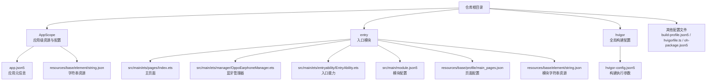
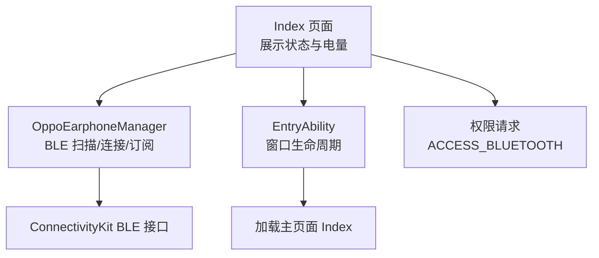
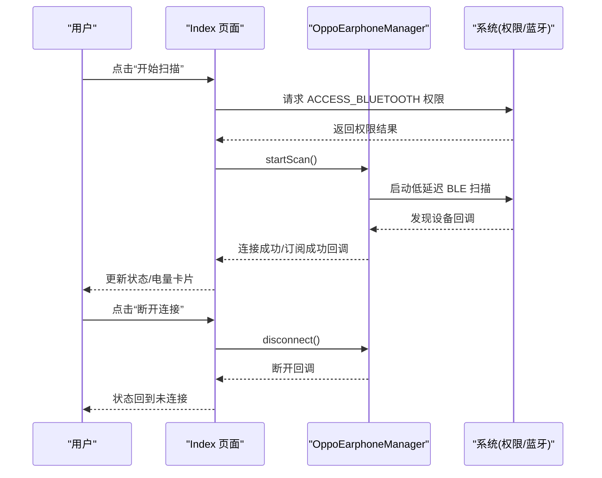
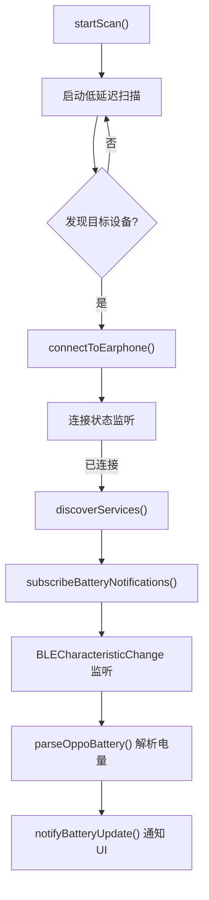
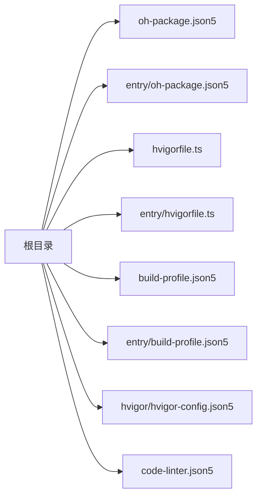

# 快速开始

<cite>
**本文引用的文件**
- [build-profile.json5](file://build-profile.json5)
- [entry/build-profile.json5](file://entry/build-profile.json5)
- [hvigorfile.ts](file://hvigorfile.ts)
- [entry/hvigorfile.ts](file://entry/hvigorfile.ts)
- [oh-package.json5](file://oh-package.json5)
- [entry/oh-package.json5](file://entry/oh-package.json5)
- [AppScope/app.json5](file://AppScope/app.json5)
- [entry/src/main/module.json5](file://entry/src/main/module.json5)
- [hvigor/hvigor-config.json5](file://hvigor/hvigor-config.json5)
- [code-linter.json5](file://code-linter.json5)
- [entry/src/main/ets/pages/Index.ets](file://entry/src/main/ets/pages/Index.ets)
- [entry/src/main/ets/manager/OppoEarphoneManager.ets](file://entry/src/main/ets/manager/OppoEarphoneManager.ets)
- [entry/src/main/ets/entryability/EntryAbility.ets](file://entry/src/main/ets/entryability/EntryAbility.ets)
- [entry/src/main/resources/base/profile/main_pages.json](file://entry/src/main/resources/base/profile/main_pages.json)
- [entry/src/main/resources/base/element/string.json](file://entry/src/main/resources/base/element/string.json)
- [AppScope/resources/base/element/string.json](file://AppScope/resources/base/element/string.json)
</cite>

## 目录
1. [简介](#简介)
2. [项目结构](#项目结构)
3. [核心组件](#核心组件)
4. [架构总览](#架构总览)
5. [详细组件分析](#详细组件分析)
6. [依赖分析](#依赖分析)
7. [性能考虑](#性能考虑)
8. [故障排除指南](#故障排除指南)
9. [结论](#结论)
10. [附录](#附录)

## 简介
本指南面向新手开发者，帮助你在最短时间内完成 OPPO Enco Air5 Pro 电量监控应用的开发环境搭建与真机调试运行。内容涵盖 DevEco Studio 安装与配置、HarmonyOS SDK 准备、OPPO Enco Air5 Pro 真机调试环境准备、项目克隆与依赖安装、构建配置文件说明、编译与部署流程，以及常见问题排查与性能优化建议。

## 项目结构
该项目采用多模块结构，包含应用级配置与入口模块（entry），入口模块负责 UI 页面、能力定义与蓝牙电量管理逻辑。

图表来源
- [AppScope/app.json5:1-11](file://AppScope/app.json5#L1-L11)
- [entry/src/main/module.json5:1-63](file://entry/src/main/module.json5#L1-L63)
- [entry/src/main/resources/base/profile/main_pages.json:1-6](file://entry/src/main/resources/base/profile/main_pages.json#L1-L6)
- [hvigor/hvigor-config.json5:1-24](file://hvigor/hvigor-config.json5#L1-L24)

章节来源
- [build-profile.json5:1-56](file://build-profile.json5#L1-L56)
- [entry/build-profile.json5:1-33](file://entry/build-profile.json5#L1-L33)
- [hvigorfile.ts:1-6](file://hvigorfile.ts#L1-L6)
- [entry/hvigorfile.ts:1-6](file://entry/hvigorfile.ts#L1-L6)
- [oh-package.json5:1-11](file://oh-package.json5#L1-L11)
- [entry/oh-package.json5:1-11](file://entry/oh-package.json5#L1-L11)

## 核心组件
- 应用入口能力（EntryAbility）：负责窗口生命周期与页面加载。
- 主页面（Index）：展示连接状态、MAC 地址与左右耳及充电仓电量卡片；请求蓝牙权限并控制扫描/连接/断开。
- 蓝牙管理器（OppoEarphoneManager）：封装 BLE 扫描、GATT 连接、服务发现、特征订阅与电量解析逻辑。
- 模块与应用配置：声明模块类型、页面、权限与能力导出等。

章节来源
- [entry/src/main/ets/entryability/EntryAbility.ets:1-48](file://entry/src/main/ets/entryability/EntryAbility.ets#L1-L48)
- [entry/src/main/ets/pages/Index.ets:1-408](file://entry/src/main/ets/pages/Index.ets#L1-L408)
- [entry/src/main/ets/manager/OppoEarphoneManager.ets:1-709](file://entry/src/main/ets/manager/OppoEarphoneManager.ets#L1-L709)
- [entry/src/main/module.json5:1-63](file://entry/src/main/module.json5#L1-L63)
- [AppScope/app.json5:1-11](file://AppScope/app.json5#L1-L11)

## 架构总览
应用以“入口能力 → 主页面 → 蓝牙管理器”的链路工作。主页面负责用户交互与状态展示，蓝牙管理器负责底层蓝牙通信与数据解析。

图表来源
- [entry/src/main/ets/pages/Index.ets:100-142](file://entry/src/main/ets/pages/Index.ets#L100-L142)
- [entry/src/main/ets/manager/OppoEarphoneManager.ets:131-207](file://entry/src/main/ets/manager/OppoEarphoneManager.ets#L131-L207)
- [entry/src/main/ets/entryability/EntryAbility.ets:21-32](file://entry/src/main/ets/entryability/EntryAbility.ets#L21-L32)

## 详细组件分析

### 组件一：入口能力（EntryAbility）
- 职责：设置颜色模式、加载主页面 Index、处理前后台切换日志。
- 关键点：通过 WindowStage 加载页面，错误时记录日志。

章节来源
- [entry/src/main/ets/entryability/EntryAbility.ets:1-48](file://entry/src/main/ets/entryability/EntryAbility.ets#L1-L48)
- [entry/src/main/resources/base/profile/main_pages.json:1-6](file://entry/src/main/resources/base/profile/main_pages.json#L1-L6)

### 组件二：主页面（Index）
- 职责：展示连接状态、MAC 地址、三路电量卡片；根据状态渲染操作按钮；请求蓝牙权限；与蓝牙管理器交互。
- 关键点：使用 @State/@Prop 实现响应式更新；根据连接状态改变按钮与提示；扫描提示在 5 秒后自动隐藏。

图表来源
- [entry/src/main/ets/pages/Index.ets:307-370](file://entry/src/main/ets/pages/Index.ets#L307-L370)
- [entry/src/main/ets/pages/Index.ets:116-142](file://entry/src/main/ets/pages/Index.ets#L116-L142)
- [entry/src/main/ets/manager/OppoEarphoneManager.ets:131-207](file://entry/src/main/ets/manager/OppoEarphoneManager.ets#L131-L207)

章节来源
- [entry/src/main/ets/pages/Index.ets:100-408](file://entry/src/main/ets/pages/Index.ets#L100-L408)

### 组件三：蓝牙管理器（OppoEarphoneManager）
- 职责：固定服务与特征 UUID 的扫描、连接、服务发现、订阅通知与电量解析。
- 关键点：支持低延迟扫描、连接状态变更监听、特征值变化监听、统一回调通知 UI 更新。

图表来源
- [entry/src/main/ets/manager/OppoEarphoneManager.ets:131-207](file://entry/src/main/ets/manager/OppoEarphoneManager.ets#L131-L207)
- [entry/src/main/ets/manager/OppoEarphoneManager.ets:289-341](file://entry/src/main/ets/manager/OppoEarphoneManager.ets#L289-L341)
- [entry/src/main/ets/manager/OppoEarphoneManager.ets:419-473](file://entry/src/main/ets/manager/OppoEarphoneManager.ets#L419-L473)
- [entry/src/main/ets/manager/OppoEarphoneManager.ets:497-593](file://entry/src/main/ets/manager/OppoEarphoneManager.ets#L497-L593)

章节来源
- [entry/src/main/ets/manager/OppoEarphoneManager.ets:1-709](file://entry/src/main/ets/manager/OppoEarphoneManager.ets#L1-L709)

### 组件四：模块与应用配置
- 模块配置：声明模块类型、主元素、页面、权限与能力导出。
- 应用配置：声明 bundleName、版本、图标与标签等。

章节来源
- [entry/src/main/module.json5:1-63](file://entry/src/main/module.json5#L1-L63)
- [AppScope/app.json5:1-11](file://AppScope/app.json5#L1-L11)

## 依赖分析
- 包管理：顶层与模块层的包配置文件分别声明依赖与开发依赖。
- 构建工具：Hvigor 默认任务与插件配置，支持系统任务与自定义扩展。
- 代码规范：ESLint 风格规则与安全规则集合。

图表来源
- [oh-package.json5:1-11](file://oh-package.json5#L1-L11)
- [entry/oh-package.json5:1-11](file://entry/oh-package.json5#L1-L11)
- [hvigorfile.ts:1-6](file://hvigorfile.ts#L1-L6)
- [entry/hvigorfile.ts:1-6](file://entry/hvigorfile.ts#L1-L6)
- [build-profile.json5:1-56](file://build-profile.json5#L1-L56)
- [entry/build-profile.json5:1-33](file://entry/build-profile.json5#L1-L33)
- [hvigor/hvigor-config.json5:1-24](file://hvigor/hvigor-config.json5#L1-L24)
- [code-linter.json5:1-32](file://code-linter.json5#L1-L32)

章节来源
- [oh-package.json5:1-11](file://oh-package.json5#L1-L11)
- [entry/oh-package.json5:1-11](file://entry/oh-package.json5#L1-L11)
- [hvigorfile.ts:1-6](file://hvigorfile.ts#L1-L6)
- [entry/hvigorfile.ts:1-6](file://entry/hvigorfile.ts#L1-L6)
- [build-profile.json5:1-56](file://build-profile.json5#L1-L56)
- [entry/build-profile.json5:1-33](file://entry/build-profile.json5#L1-L33)
- [hvigor/hvigor-config.json5:1-24](file://hvigor/hvigor-config.json5#L1-L24)
- [code-linter.json5:1-32](file://code-linter.json5#L1-L32)

## 性能考虑
- 构建优化：可启用并行编译、增量编译与守护进程以提升构建速度（参考 hvigor-config.json5 中相关注释项）。
- 类型检查：可在开发阶段开启类型检查以提前发现潜在问题（参考 hvigor-config.json5 中注释项）。
- 日志级别：按需调整日志等级以平衡可观测性与性能（参考 hvigor-config.json5 中 logging.level 注释项）。
- 代码质量：遵循 code-linter.json5 中的安全与性能规则，避免不安全加密与潜在性能隐患。

章节来源
- [hvigor/hvigor-config.json5:5-22](file://hvigor/hvigor-config.json5#L5-L22)
- [code-linter.json5:14-31](file://code-linter.json5#L14-L31)

## 故障排除指南
- 权限未授予导致无法扫描
  - 现象：点击“开始扫描”无反应或按钮不可用。
  - 处理：确认已在页面中触发权限请求并获得 ACCESS_BLUETOOTH 授权；检查模块配置中的 requestPermissions 是否正确声明。
  章节来源
  - [entry/src/main/ets/pages/Index.ets:147-161](file://entry/src/main/ets/pages/Index.ets#L147-L161)
  - [entry/src/main/module.json5:14-25](file://entry/src/main/module.json5#L14-L25)

- 扫描不到设备
  - 现象：扫描长时间无结果。
  - 处理：确保耳机充电仓盖子打开、耳机处于配对模式且在蓝牙范围内；确认设备名包含目标型号关键字；尝试降低扫描间隔或切换匹配策略（如需修改，请参考 BLE 扫描接口文档）。
  章节来源
  - [entry/src/main/ets/manager/OppoEarphoneManager.ets:183-193](file://entry/src/main/ets/manager/OppoEarphoneManager.ets#L183-L193)

- 连接后无电量更新
  - 现象：连接成功但电量卡片不刷新。
  - 处理：确认已成功订阅通知；检查特征值变化回调是否触发；验证数据解析逻辑是否命中对应标识位；查看日志输出定位异常。
  章节来源
  - [entry/src/main/ets/manager/OppoEarphoneManager.ets:457-471](file://entry/src/main/ets/manager/OppoEarphoneManager.ets#L457-L471)
  - [entry/src/main/ets/manager/OppoEarphoneManager.ets:497-593](file://entry/src/main/ets/manager/OppoEarphoneManager.ets#L497-L593)

- 真机调试无法运行
  - 现象：安装后无法启动或黑屏。
  - 处理：检查签名配置与构建模式；确认设备已开启 USB 调试与开发者选项；重新安装并观察日志输出；必要时清理缓存后重试。
  章节来源
  - [build-profile.json5:2-17](file://build-profile.json5#L2-L17)
  - [entry/src/main/ets/entryability/EntryAbility.ets:25-31](file://entry/src/main/ets/entryability/EntryAbility.ets#L25-L31)

## 结论
通过本指南，你可以完成从环境准备到真机运行的全流程。建议先在模拟器验证功能，再进行真机联调；遇到问题优先查看日志与权限状态，结合本文提供的排查步骤逐项验证。

## 附录

### A. 开发环境与工具准备
- DevEco Studio：下载并安装最新版本，确保支持 HarmonyOS SDK。
- HarmonyOS SDK：在 DevEco Studio 中安装目标 SDK 版本（与项目 targetSdkVersion/compatibleSdkVersion 对齐）。
- OPPO Enco Air5 Pro 真机：开启开发者选项与 USB 调试，允许安装测试应用与调试。

### B. 项目克隆与依赖安装
- 克隆仓库至本地后，在 DevEco Studio 中选择“打开已有项目”指向仓库根目录。
- 依赖安装：首次打开项目会自动拉取包依赖；如需手动安装，可在终端执行包管理命令（具体命令以项目使用的包管理器为准）。

### C. 构建与部署
- 构建配置文件说明
  - 根级 build-profile.json5：定义签名配置、产品配置（targetSdkVersion、compatibleSdkVersion）、构建模式（debug/release）与模块映射。
  - 模块级 build-profile.json5：定义 API 类型（stageMode）、资源复制策略、发布模式下的混淆规则等。
  - hvigorfile.ts：定义系统任务与插件扩展；默认使用内置任务。
  - hvigor-config.json5：定义构建执行参数（并行、增量、守护进程等）。
  - code-linter.json5：定义 ESLint 规则集与忽略路径。
- 编译与运行
  - 在 DevEco Studio 中选择目标设备（模拟器或真机），点击“运行”或使用命令行构建后安装。
  - 真机首次运行需授权安装与调试权限。

章节来源
- [build-profile.json5:1-56](file://build-profile.json5#L1-L56)
- [entry/build-profile.json5:1-33](file://entry/build-profile.json5#L1-L33)
- [hvigorfile.ts:1-6](file://hvigorfile.ts#L1-L6)
- [entry/hvigorfile.ts:1-6](file://entry/hvigorfile.ts#L1-L6)
- [hvigor/hvigor-config.json5:1-24](file://hvigor/hvigor-config.json5#L1-L24)
- [code-linter.json5:1-32](file://code-linter.json5#L1-L32)

### D. 真机调试要点
- 开启 USB 调试：在设备设置中启用开发者选项与 USB 调试。
- 授权安装：首次安装可能需要在设备端确认“允许来自此来源的应用”。
- 首次连接测试：运行应用后，点击“开始扫描”，等待出现“已连接”状态；若无反应，检查耳机状态与范围。

章节来源
- [entry/src/main/ets/pages/Index.ets:307-333](file://entry/src/main/ets/pages/Index.ets#L307-L333)
- [entry/src/main/ets/pages/Index.ets:116-142](file://entry/src/main/ets/pages/Index.ets#L116-L142)