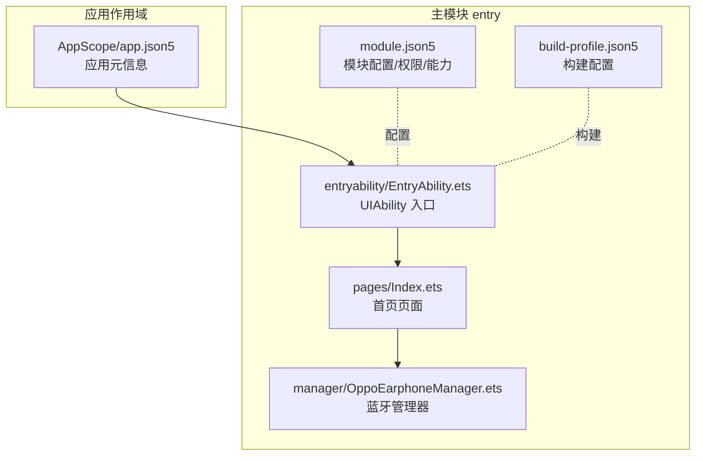
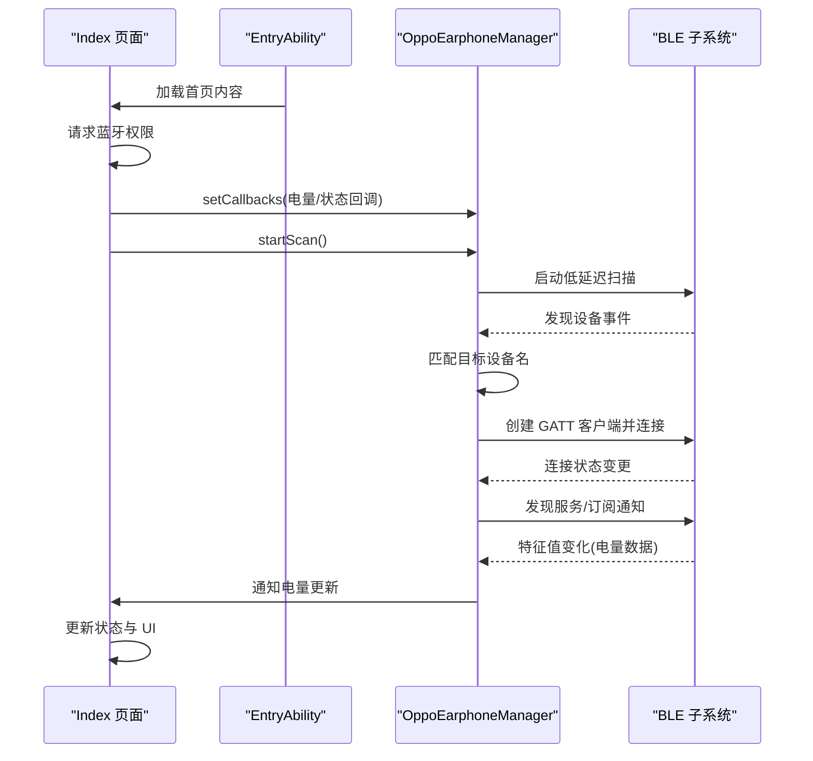
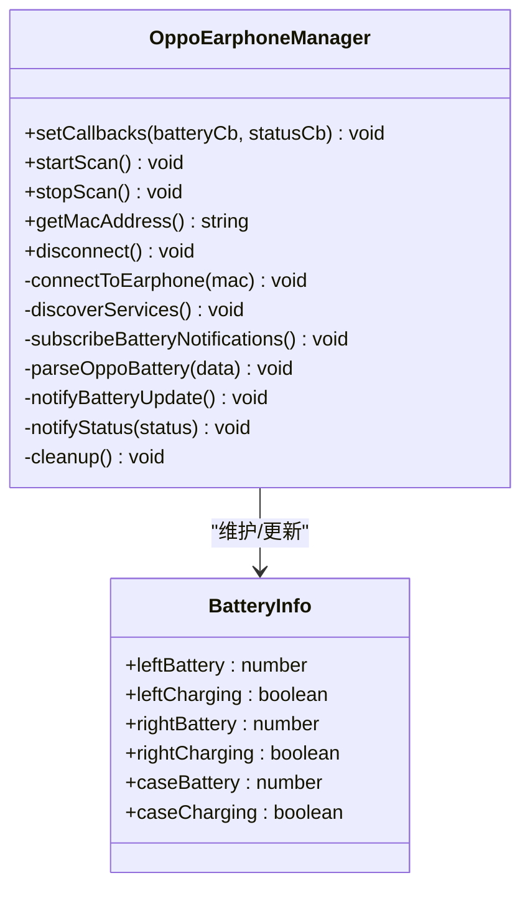
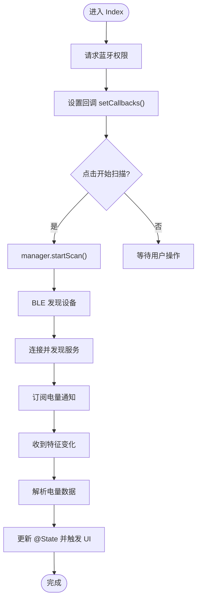
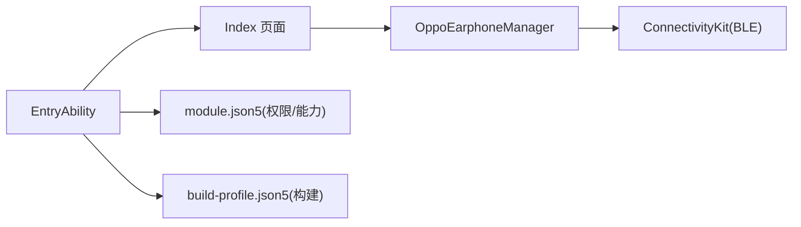

# 扩展开发

<cite>
**本文引用的文件**
- [AppScope/app.json5](file://AppScope/app.json5)
- [entry/src/main/ets/entryability/EntryAbility.ets](file://entry/src/main/ets/entryability/EntryAbility.ets)
- [entry/src/main/ets/manager/OppoEarphoneManager.ets](file://entry/src/main/ets/manager/OppoEarphoneManager.ets)
- [entry/src/main/ets/pages/Index.ets](file://entry/src/main/ets/pages/Index.ets)
- [entry/src/main/module.json5](file://entry/src/main/module.json5)
- [entry/build-profile.json5](file://entry/build-profile.json5)
- [hvigorfile.ts](file://hvigorfile.ts)
- [code-linter.json5](file://code-linter.json5)
- [entry/src/ohosTest/ets/test/Ability.test.ets](file://entry/src/ohosTest/ets/test/Ability.test.ets)
- [entry/src/test/List.test.ets](file://entry/src/test/List.test.ets)
</cite>

## 目录
1. [简介](#简介)
2. [项目结构](#项目结构)
3. [核心组件](#核心组件)
4. [架构总览](#架构总览)
5. [详细组件分析](#详细组件分析)
6. [依赖分析](#依赖分析)
7. [性能考虑](#性能考虑)
8. [故障排查指南](#故障排查指南)
9. [结论](#结论)
10. [附录](#附录)

## 简介
本指南面向需要在 OPPO Enco Air5 Pro 应用基础上进行扩展开发的工程师，围绕以下目标展开：  
- 新功能开发最佳实践：如何基于现有架构新增蓝牙设备支持  
- 组件复用策略：电量卡片组件的二次开发与自定义 UI 组件创建  
- 第三方集成方法：兼容其他蓝牙设备与云服务集成思路  
- 插件化开发方案：动态加载与模块化设计  
- API 扩展设计原则：向后兼容与版本管理  
- 代码规范与最佳实践：质量与一致性保障  
- 性能优化建议与技巧  
- 测试驱动开发在扩展开发中的应用  

## 项目结构
项目采用“主模块 + 能力入口 + 管理器 + 页面组件”的分层组织方式，核心能力集中在入口 Ability、蓝牙管理器与页面组件之间形成清晰的职责边界。

图示来源
- [AppScope/app.json5:1-11](file://AppScope/app.json5#L1-L11)
- [entry/src/main/module.json5:1-63](file://entry/src/main/module.json5#L1-L63)
- [entry/src/main/ets/entryability/EntryAbility.ets:1-48](file://entry/src/main/ets/entryability/EntryAbility.ets#L1-L48)
- [entry/src/main/ets/manager/OppoEarphoneManager.ets:1-709](file://entry/src/main/ets/manager/OppoEarphoneManager.ets#L1-L709)
- [entry/src/main/ets/pages/Index.ets:1-408](file://entry/src/main/ets/pages/Index.ets#L1-L408)
- [entry/build-profile.json5:1-33](file://entry/build-profile.json5#L1-L33)

章节来源
- [AppScope/app.json5:1-11](file://AppScope/app.json5#L1-L11)
- [entry/src/main/module.json5:1-63](file://entry/src/main/module.json5#L1-L63)
- [entry/src/main/ets/entryability/EntryAbility.ets:1-48](file://entry/src/main/ets/entryability/EntryAbility.ets#L1-L48)
- [entry/src/main/ets/manager/OppoEarphoneManager.ets:1-709](file://entry/src/main/ets/manager/OppoEarphoneManager.ets#L1-L709)
- [entry/src/main/ets/pages/Index.ets:1-408](file://entry/src/main/ets/pages/Index.ets#L1-L408)
- [entry/build-profile.json5:1-33](file://entry/build-profile.json5#L1-L33)

## 核心组件
- UIAbility 入口：负责窗口阶段生命周期与内容加载，承载主页面
- 蓝牙管理器：封装 BLE 扫描、连接、服务发现、特征订阅与电量解析
- 页面组件：以响应式状态驱动 UI，展示连接状态与三路电量卡片

章节来源
- [entry/src/main/ets/entryability/EntryAbility.ets:1-48](file://entry/src/main/ets/entryability/EntryAbility.ets#L1-L48)
- [entry/src/main/ets/manager/OppoEarphoneManager.ets:1-709](file://entry/src/main/ets/manager/OppoEarphoneManager.ets#L1-L709)
- [entry/src/main/ets/pages/Index.ets:1-408](file://entry/src/main/ets/pages/Index.ets#L1-L408)

## 架构总览
下图展示了从 UI 到蓝牙管理器的数据流与控制流，以及权限请求与状态回调的交互路径。

图示来源
- [entry/src/main/ets/entryability/EntryAbility.ets:21-32](file://entry/src/main/ets/entryability/EntryAbility.ets#L21-L32)
- [entry/src/main/ets/pages/Index.ets:116-138](file://entry/src/main/ets/pages/Index.ets#L116-L138)
- [entry/src/main/ets/manager/OppoEarphoneManager.ets:131-207](file://entry/src/main/ets/manager/OppoEarphoneManager.ets#L131-L207)
- [entry/src/main/ets/manager/OppoEarphoneManager.ets:289-341](file://entry/src/main/ets/manager/OppoEarphoneManager.ets#L289-L341)
- [entry/src/main/ets/manager/OppoEarphoneManager.ets:351-409](file://entry/src/main/ets/manager/OppoEarphoneManager.ets#L351-L409)
- [entry/src/main/ets/manager/OppoEarphoneManager.ets:419-473](file://entry/src/main/ets/manager/OppoEarphoneManager.ets#L419-L473)
- [entry/src/main/ets/manager/OppoEarphoneManager.ets:497-593](file://entry/src/main/ets/manager/OppoEarphoneManager.ets#L497-L593)

## 详细组件分析

### 蓝牙管理器（OppoEarphoneManager）设计
- 职责边界清晰：仅负责 OPPO Enco Air5 Pro 的扫描、连接、服务发现与电量解析
- 状态机：disconnected → scanning → connecting → connected → subscribed
- 数据模型：BatteryInfo 提供三路电量与充电状态
- 回调机制：分离电量与连接状态回调，便于 UI 分离处理
- 资源管理：统一的清理流程，避免句柄泄漏

图示来源
- [entry/src/main/ets/manager/OppoEarphoneManager.ets:13-27](file://entry/src/main/ets/manager/OppoEarphoneManager.ets#L13-L27)
- [entry/src/main/ets/manager/OppoEarphoneManager.ets:49-709](file://entry/src/main/ets/manager/OppoEarphoneManager.ets#L49-L709)

章节来源
- [entry/src/main/ets/manager/OppoEarphoneManager.ets:1-709](file://entry/src/main/ets/manager/OppoEarphoneManager.ets#L1-L709)

### 电量卡片组件（BatteryCardComponent）与页面（Index）
- 电量卡片组件：通过 @Prop 接收数据，内部根据电量与充电状态计算颜色与文案，使用环形进度条展示
- 页面 Index：集中管理连接状态、MAC 地址、权限状态与三路电量；通过回调更新状态并驱动 UI
- 响应式绑定：@State 与 @Prop 形成单向数据流，避免 @Builder 值传递导致的依赖缺失

图示来源
- [entry/src/main/ets/pages/Index.ets:116-138](file://entry/src/main/ets/pages/Index.ets#L116-L138)
- [entry/src/main/ets/pages/Index.ets:291-302](file://entry/src/main/ets/pages/Index.ets#L291-L302)
- [entry/src/main/ets/manager/OppoEarphoneManager.ets:131-207](file://entry/src/main/ets/manager/OppoEarphoneManager.ets#L131-L207)
- [entry/src/main/ets/manager/OppoEarphoneManager.ets:419-473](file://entry/src/main/ets/manager/OppoEarphoneManager.ets#L419-L473)
- [entry/src/main/ets/manager/OppoEarphoneManager.ets:497-593](file://entry/src/main/ets/manager/OppoEarphoneManager.ets#L497-L593)

章节来源
- [entry/src/main/ets/pages/Index.ets:1-408](file://entry/src/main/ets/pages/Index.ets#L1-L408)

### 新增蓝牙设备支持的最佳实践
- 设计原则
  - 将设备特定的 UUID、匹配规则与解析算法抽象为可配置或可替换的策略
  - 保持状态机与回调接口一致，降低 UI 适配成本
  - 在管理器内隔离 BLE 与解析细节，对外暴露统一接口
- 实施步骤
  - 定义设备能力接口与数据模型
  - 新增扫描过滤条件与服务特征映射
  - 实现设备专属解析算法
  - 通过回调将统一数据模型回传给 UI
- 向后兼容
  - 保留旧设备接口不变，新增设备以扩展类或工厂模式接入
  - 对外 API 保持稳定，内部通过策略切换实现多设备支持

### 组件复用策略：电量卡片组件二次开发与自定义 UI
- 二次开发
  - 通过 @Prop 注入不同字段（如设备类型、图标、阈值），在组件内部根据传入参数渲染
  - 将颜色与文案策略抽离为可配置项，便于主题化与本地化
- 自定义 UI 组件
  - 以组合与样式参数为主，避免硬编码业务逻辑
  - 通过 @State/@Prop 建立与父组件的响应式关系，确保数据驱动 UI
  - 将交互行为下沉至父组件，组件专注展示与少量轻量交互

### 第三方集成：兼容其他蓝牙设备与云服务
- 兼容性开发
  - 以接口抽象替代硬编码设备信息，通过配置或工厂注入不同解析策略
  - 对扫描与连接流程进行模块化封装，按设备族归类
- 云服务集成
  - 将解析后的统一数据模型作为上报载体，减少设备差异带来的适配成本
  - 在 UI 层增加“云端同步”状态与提示，保证用户体验一致性

### 插件化开发：动态加载与模块化设计
- 模块化
  - 将设备能力拆分为独立模块，按需引入
  - 通过统一的设备管理器调度各模块，实现按设备类型自动选择
- 动态加载
  - 利用构建配置与模块化打包，按设备族生成可选包
  - 在运行时根据设备识别结果动态加载对应模块

### API 扩展设计原则：向后兼容与版本管理
- 接口稳定性
  - 保持回调签名与状态枚举不变，新增字段以可选方式提供
- 版本管理
  - 通过模块版本号与能力声明区分不同设备族
  - 在入口模块中进行能力检测与降级处理

## 依赖分析
- 模块依赖
  - EntryAbility 依赖页面 Index，Index 依赖 OppoEarphoneManager
  - 权限与能力在 module.json5 中声明，构建配置在 build-profile.json5 中定义
- 外部依赖
  - ConnectivityKit（BLE）、BasicServicesKit（错误模型）、AbilityKit（权限与能力）

图示来源
- [entry/src/main/ets/entryability/EntryAbility.ets:1-48](file://entry/src/main/ets/entryability/EntryAbility.ets#L1-L48)
- [entry/src/main/ets/pages/Index.ets:1-408](file://entry/src/main/ets/pages/Index.ets#L1-L408)
- [entry/src/main/ets/manager/OppoEarphoneManager.ets:1-709](file://entry/src/main/ets/manager/OppoEarphoneManager.ets#L1-L709)
- [entry/src/main/module.json5:1-63](file://entry/src/main/module.json5#L1-L63)
- [entry/build-profile.json5:1-33](file://entry/build-profile.json5#L1-L33)

章节来源
- [entry/src/main/module.json5:1-63](file://entry/src/main/module.json5#L1-L63)
- [entry/build-profile.json5:1-33](file://entry/build-profile.json5#L1-L33)

## 性能考虑
- 扫描策略
  - 使用低延迟扫描模式，缩短发现时间；在发现目标后及时停止扫描，释放资源
- 连接与订阅
  - 连接成功后尽快执行服务发现与订阅，减少无效等待
  - 订阅开启后仅处理有效数据段，避免重复解析
- UI 渲染
  - 使用响应式状态更新，避免不必要的重建
  - 控制组件层级深度，减少布局计算压力
- 构建优化
  - 构建配置中关闭无意义的混淆规则，减少编译开销

## 故障排查指南
- 权限问题
  - 确认 module.json5 中声明了蓝牙权限，运行时检查权限结果
- 连接失败
  - 检查连接状态回调与异常捕获，确认设备名匹配与服务存在
- 电量不更新
  - 确认订阅通知已开启，特征变化事件是否触发解析流程
- 资源泄漏
  - 在断开连接与页面销毁时调用清理流程，确保句柄释放

章节来源
- [entry/src/main/ets/pages/Index.ets:147-161](file://entry/src/main/ets/pages/Index.ets#L147-L161)
- [entry/src/main/ets/manager/OppoEarphoneManager.ets:267-275](file://entry/src/main/ets/manager/OppoEarphoneManager.ets#L267-L275)
- [entry/src/main/ets/manager/OppoEarphoneManager.ets:653-705](file://entry/src/main/ets/manager/OppoEarphoneManager.ets#L653-L705)

## 结论
通过将设备能力抽象为可插拔模块、统一状态机与回调接口，以及以组件为中心的数据驱动设计，可以在不破坏现有功能的前提下高效扩展新设备支持与第三方集成。配合严格的代码规范与测试体系，可确保扩展过程的稳定性与可维护性。

## 附录

### 代码规范与最佳实践
- 规范工具
  - 使用 linter 配置，启用性能与 TypeScript 推荐规则
- 编码建议
  - 统一回调接口与状态枚举，避免硬编码字符串
  - 将设备特定逻辑收敛到管理器内部，保持 UI 简洁
  - 对外部依赖进行错误处理与降级策略

章节来源
- [code-linter.json5:1-32](file://code-linter.json5#L1-L32)

### 测试驱动开发（TDD）在扩展开发中的应用
- 单元测试
  - 为解析算法与状态机编写断言，覆盖正常与异常分支
- 集成测试
  - 使用框架提供的测试桩模拟 BLE 事件，验证回调链路
- 示例参考
  - 参考现有测试样例，建立扩展功能的测试套件

章节来源
- [entry/src/ohosTest/ets/test/Ability.test.ets:1-35](file://entry/src/ohosTest/ets/test/Ability.test.ets#L1-L35)
- [entry/src/test/List.test.ets:1-5](file://entry/src/test/List.test.ets#L1-L5)