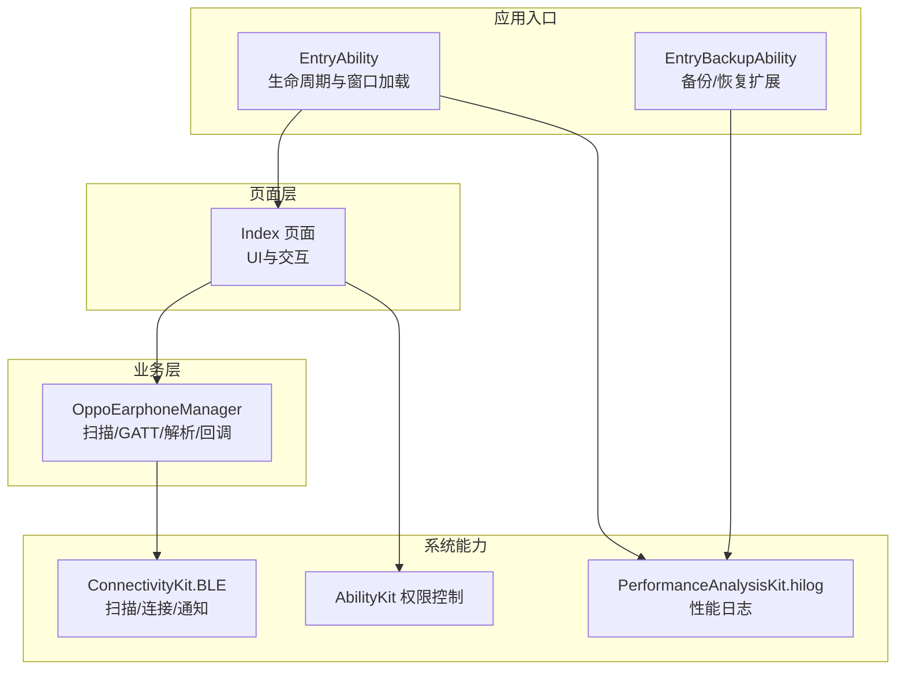
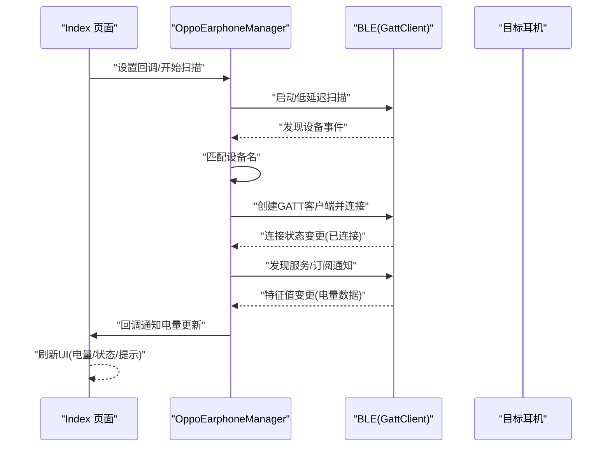
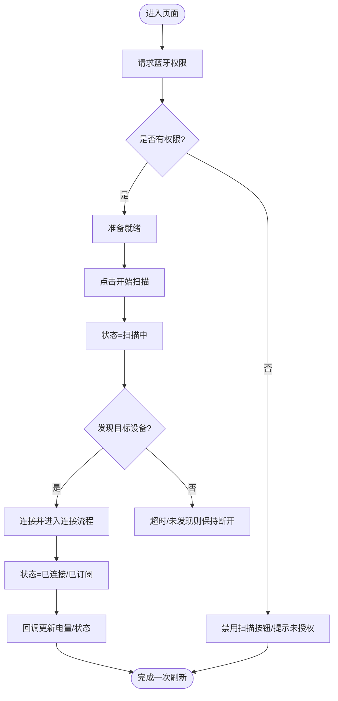
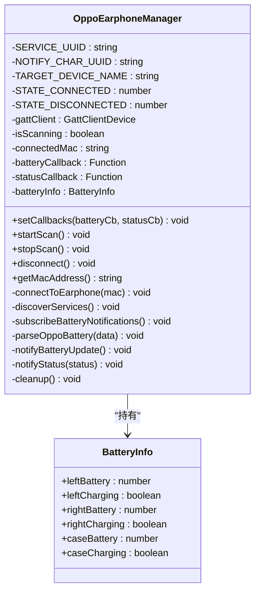
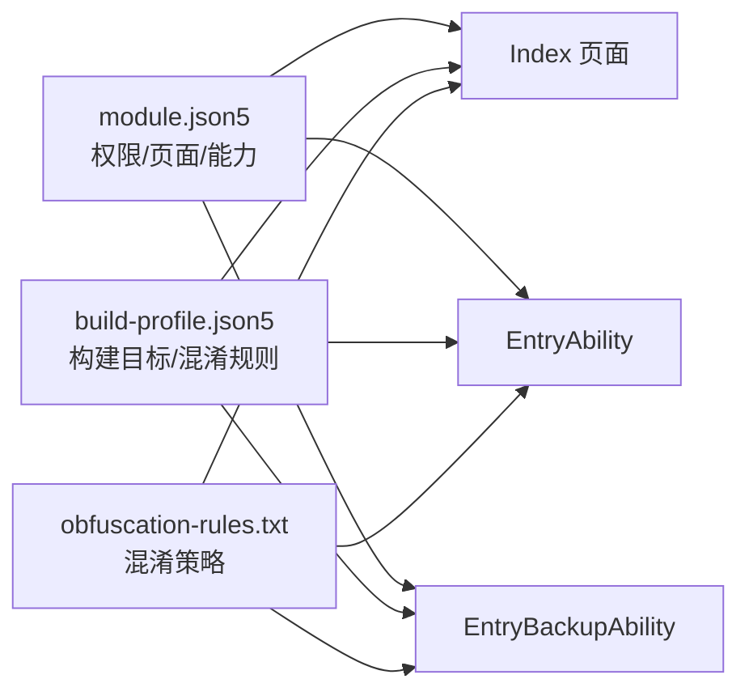

# 故障排除

<cite>
**本文引用的文件**   
- [Index.ets](file://entry/src/main/ets/pages/Index.ets)
- [OppoEarphoneManager.ets](file://entry/src/main/ets/manager/OppoEarphoneManager.ets)
- [EntryAbility.ets](file://entry/src/main/ets/entryability/EntryAbility.ets)
- [EntryBackupAbility.ets](file://entry/src/main/ets/entrybackupability/EntryBackupAbility.ets)
- [module.json5](file://entry/src/main/module.json5)
- [build-profile.json5](file://entry/build-profile.json5)
- [obfuscation-rules.txt](file://entry/obfuscation-rules.txt)
- [hvigor-config.json5](file://hvigor/hvigor-config.json5)
- [Ability.test.ets](file://entry/src/ohosTest/ets/test/Ability.test.ets)
- [string.json](file://entry/src/main/resources/base/element/string.json)
- [main_pages.json](file://entry/src/main/resources/base/profile/main_pages.json)
</cite>

## 目录
1. [简介](#简介)
2. [项目结构](#项目结构)
3. [核心组件](#核心组件)
4. [架构总览](#架构总览)
5. [详细组件分析](#详细组件分析)
6. [依赖关系分析](#依赖关系分析)
7. [性能问题诊断](#性能问题诊断)
8. [日志与调试工具](#日志与调试工具)
9. [常见问题与解决方案](#常见问题与解决方案)
10. [网络与权限排查](#网络与权限排查)
11. [设备兼容性处理](#设备兼容性处理)
12. [错误代码与含义](#错误代码与含义)
13. [用户反馈分类与处理流程](#用户反馈分类与处理流程)
14. [结论](#结论)

## 简介
本指南面向OPPO Enco Air5 Pro应用的运维与支持团队，聚焦于蓝牙连接失败、电量数据解析错误、UI显示异常等常见问题的定位与修复；同时提供日志分析方法、性能诊断手段、网络与权限排查流程、设备兼容性处理策略、调试工具使用指南以及错误代码对照表，帮助快速恢复用户体验。

## 项目结构
应用采用Stage模式工程，入口模块为entry，页面位于pages/Index，业务逻辑集中在OppoEarphoneManager，能力入口由EntryAbility承载，备份扩展能力由EntryBackupAbility提供。

**图表来源**
- [EntryAbility.ets:1-48](file://entry/src/main/ets/entryability/EntryAbility.ets#L1-L48)
- [EntryBackupAbility.ets:1-16](file://entry/src/main/ets/entrybackupability/EntryBackupAbility.ets#L1-L16)
- [Index.ets:100-142](file://entry/src/main/ets/pages/Index.ets#L100-L142)
- [OppoEarphoneManager.ets:131-207](file://entry/src/main/ets/manager/OppoEarphoneManager.ets#L131-L207)

**章节来源**
- [module.json5:1-63](file://entry/src/main/module.json5#L1-L63)
- [main_pages.json:1-6](file://entry/src/main/resources/base/profile/main_pages.json#L1-L6)

## 核心组件
- 页面(Index): 负责UI渲染、权限请求、连接状态展示、操作按钮与提示信息。
- 管理器(OppoEarphoneManager): 负责BLE扫描、GATT连接、服务发现、特征通知订阅与电量数据解析。
- 能力入口(EntryAbility): 生命周期钩子与窗口加载，配合hilog输出运行期日志。
- 备份扩展(EntryBackupAbility): 提供备份/恢复扩展点的日志记录。

**章节来源**
- [Index.ets:100-142](file://entry/src/main/ets/pages/Index.ets#L100-L142)
- [OppoEarphoneManager.ets:49-709](file://entry/src/main/ets/manager/OppoEarphoneManager.ets#L49-L709)
- [EntryAbility.ets:7-48](file://entry/src/main/ets/entryability/EntryAbility.ets#L7-L48)
- [EntryBackupAbility.ets:6-16](file://entry/src/main/ets/entrybackupability/EntryBackupAbility.ets#L6-L16)

## 架构总览
应用以“页面-管理器-系统能力”分层组织，页面通过回调接收连接状态与电量更新，管理器封装BLE细节并通过统一接口向上层暴露。

**图表来源**
- [Index.ets:116-142](file://entry/src/main/ets/pages/Index.ets#L116-L142)
- [OppoEarphoneManager.ets:131-207](file://entry/src/main/ets/manager/OppoEarphoneManager.ets#L131-L207)
- [OppoEarphoneManager.ets:289-341](file://entry/src/main/ets/manager/OppoEarphoneManager.ets#L289-L341)
- [OppoEarphoneManager.ets:419-473](file://entry/src/main/ets/manager/OppoEarphoneManager.ets#L419-L473)
- [OppoEarphoneManager.ets:497-593](file://entry/src/main/ets/manager/OppoEarphoneManager.ets#L497-L593)

## 详细组件分析

### 页面(Index)分析
- 责任边界
  - 权限请求与状态展示：请求蓝牙权限、根据连接状态渲染UI、显示MAC地址与提示。
  - 交互控制：扫描/取消/断开连接按钮的启用与点击行为。
  - 生命周期：进入时注册回调与权限请求，退出时断开连接。
- 关键流程
  - 权限请求：通过权限管理器异步申请ACCESS_BLUETOOTH，失败或拒绝均记录日志。
  - 连接状态：维护状态枚举，映射颜色与文案，支持断开时清空MAC。
  - UI更新：通过回调将电量与充电状态注入@State，驱动响应式渲染。
- 异常与边界
  - 无权限时禁用扫描按钮，避免无效调用。
  - 扫描提示仅在扫描阶段短暂显示，避免干扰。

**图表来源**
- [Index.ets:147-161](file://entry/src/main/ets/pages/Index.ets#L147-L161)
- [Index.ets:307-370](file://entry/src/main/ets/pages/Index.ets#L307-L370)
- [Index.ets:116-142](file://entry/src/main/ets/pages/Index.ets#L116-L142)

**章节来源**
- [Index.ets:100-407](file://entry/src/main/ets/pages/Index.ets#L100-L407)

### 管理器(OppoEarphoneManager)分析
- 职责
  - 扫描：低延迟扫描，匹配目标设备名，停止扫描并发起连接。
  - 连接：创建GATT客户端，监听连接状态，连接成功后发现服务。
  - 订阅：订阅指定特征值通知，监听特征值变更事件。
  - 解析：解析电量数据包，识别左右耳与充电仓，区分充电状态与电量值。
  - 回调：向UI推送电量与连接状态。
- 关键数据结构
  - BatteryInfo：三路电量与充电状态。
  - ConnectionStatus：离线/扫描/连接中/已连接/已订阅。
- 错误路径
  - 扫描启动/停止异常、连接失败、服务发现失败、订阅失败、解析越界或非法值。
- 资源清理
  - 断开连接时移除事件监听、断开并关闭GATT客户端，重置电量状态。

**图表来源**
- [OppoEarphoneManager.ets:49-709](file://entry/src/main/ets/manager/OppoEarphoneManager.ets#L49-L709)

**章节来源**
- [OppoEarphoneManager.ets:131-207](file://entry/src/main/ets/manager/OppoEarphoneManager.ets#L131-L207)
- [OppoEarphoneManager.ets:289-341](file://entry/src/main/ets/manager/OppoEarphoneManager.ets#L289-L341)
- [OppoEarphoneManager.ets:419-473](file://entry/src/main/ets/manager/OppoEarphoneManager.ets#L419-L473)
- [OppoEarphoneManager.ets:497-593](file://entry/src/main/ets/manager/OppoEarphoneManager.ets#L497-L593)
- [OppoEarphoneManager.ets:653-705](file://entry/src/main/ets/manager/OppoEarphoneManager.ets#L653-L705)

### 能力入口与备份扩展
- EntryAbility：负责窗口加载与生命周期日志输出，便于定位页面加载失败与前后台切换问题。
- EntryBackupAbility：提供备份/恢复扩展日志，便于验证数据迁移场景。

**章节来源**
- [EntryAbility.ets:7-48](file://entry/src/main/ets/entryability/EntryAbility.ets#L7-L48)
- [EntryBackupAbility.ets:6-16](file://entry/src/main/ets/entrybackupability/EntryBackupAbility.ets#L6-L16)

## 依赖关系分析
- 模块声明与权限
  - 模块类型为entry，声明主页面与能力入口，请求ACCESS_BLUETOOTH权限并在使用时说明用途。
- 构建与混淆
  - 构建配置包含release与ohosTest目标，混淆规则开启属性/全局/文件名/导出混淆，但未启用删除console语句。
- 日志与性能
  - hilog用于输出能力生命周期与页面加载日志，便于定位异常。

**图表来源**
- [module.json5:14-25](file://entry/src/main/module.json5#L14-L25)
- [build-profile.json5:10-33](file://entry/build-profile.json5#L10-L33)
- [obfuscation-rules.txt:20-23](file://entry/obfuscation-rules.txt#L20-L23)

**章节来源**
- [module.json5:14-25](file://entry/src/main/module.json5#L14-L25)
- [build-profile.json5:10-33](file://entry/build-profile.json5#L10-L33)
- [obfuscation-rules.txt:20-23](file://entry/obfuscation-rules.txt#L20-L23)

## 性能问题诊断
- 内存泄漏检测
  - 关注GATT客户端生命周期：连接成功后需确保不再残留旧引用；断开时移除事件监听并关闭客户端。
  - 观察UI渲染：大量重复渲染可能源于回调未去重或状态更新过于频繁。
- CPU使用率分析
  - 扫描阶段使用低延迟扫描参数，注意避免长时间持续扫描导致CPU占用上升。
  - 订阅通知后解析逻辑应尽量轻量，避免在主线程执行耗时计算。
- 构建与混淆
  - 当前混淆策略开启多类混淆，建议在回归测试中对比混淆前后性能差异，必要时调整混淆规则。

**章节来源**
- [OppoEarphoneManager.ets:653-705](file://entry/src/main/ets/manager/OppoEarphoneManager.ets#L653-L705)
- [OppoEarphoneManager.ets:185-193](file://entry/src/main/ets/manager/OppoEarphoneManager.ets#L185-L193)
- [build-profile.json5:13-23](file://entry/build-profile.json5#L13-L23)
- [obfuscation-rules.txt:20-23](file://entry/obfuscation-rules.txt#L20-L23)

## 日志与调试工具
- hilog日志
  - EntryAbility与EntryBackupAbility均使用hilog输出关键节点日志，便于定位页面加载、前后台切换与备份恢复问题。
- 控制台日志
  - 页面与管理器广泛使用console输出扫描、连接、解析与错误信息，便于快速定位问题阶段。
- DevEco Studio调试
  - 使用DevEco Studio连接设备进行本地调试，结合断点与日志双通道定位问题。
- 远程调试
  - 在设备端开启开发者选项与调试模式，通过USB或无线方式接入IDE进行远程调试。

**章节来源**
- [EntryAbility.ets:14-18](file://entry/src/main/ets/entryability/EntryAbility.ets#L14-L18)
- [EntryBackupAbility.ets:8-15](file://entry/src/main/ets/entrybackupability/EntryBackupAbility.ets#L8-L15)
- [Index.ets:118-137](file://entry/src/main/ets/pages/Index.ets#L118-L137)
- [OppoEarphoneManager.ets:141-205](file://entry/src/main/ets/manager/OppoEarphoneManager.ets#L141-L205)

## 常见问题与解决方案

### 蓝牙连接失败
- 症状
  - 扫描无设备、连接超时、状态停留在“扫描/连接中”。
- 排查步骤
  - 确认权限：页面已请求ACCESS_BLUETOOTH，若拒绝需引导用户授权。
  - 设备状态：确保耳机仓盖打开、处于可发现状态且在蓝牙范围内。
  - 扫描参数：确认使用低延迟扫描，避免扫描失败返回断开状态。
  - 连接链路：检查连接状态事件是否触发，服务发现是否成功。
- 解决方案
  - 重新授权蓝牙权限并再次扫描。
  - 将耳机靠近设备，确保信号良好。
  - 若多次失败，断开后重试，避免并发连接。

**章节来源**
- [Index.ets:147-161](file://entry/src/main/ets/pages/Index.ets#L147-L161)
- [OppoEarphoneManager.ets:185-205](file://entry/src/main/ets/manager/OppoEarphoneManager.ets#L185-L205)
- [OppoEarphoneManager.ets:305-325](file://entry/src/main/ets/manager/OppoEarphoneManager.ets#L305-L325)

### 电量数据解析错误
- 症状
  - UI显示“--”或电量异常波动。
- 排查步骤
  - 检查特征值变更事件是否到达解析函数。
  - 核对解析算法：左/右耳/充电仓标识与前置字节判断、充电标志与电量换算。
  - 验证数据范围：电量应在0-100之间，否则视为未知。
- 解决方案
  - 确保订阅成功后再等待通知。
  - 如解析命中多个标识，确保按顺序遍历并仅接受有效范围内的值。

**章节来源**
- [OppoEarphoneManager.ets:445-451](file://entry/src/main/ets/manager/OppoEarphoneManager.ets#L445-L451)
- [OppoEarphoneManager.ets:497-593](file://entry/src/main/ets/manager/OppoEarphoneManager.ets#L497-L593)

### UI显示异常
- 症状
  - 电量不更新、状态颜色不随状态变化、按钮不可用。
- 排查步骤
  - 检查回调是否正确设置与触发。
  - 确认@State变量更新后是否触发响应式渲染。
  - 检查权限状态影响按钮可用性。
- 解决方案
  - 确保在aboutToAppear中设置回调，在aboutToDisappear中断开连接。
  - 检查hasPermission与enabled/opacity绑定逻辑。

**章节来源**
- [Index.ets:116-142](file://entry/src/main/ets/pages/Index.ets#L116-L142)
- [Index.ets:307-370](file://entry/src/main/ets/pages/Index.ets#L307-L370)

## 网络与权限排查
- 权限声明与使用
  - 模块已声明ACCESS_BLUETOOTH权限并在使用场景中说明用途。
- 用户授权流程
  - 页面请求权限，拒绝时记录警告日志并禁用相关功能。
- 建议
  - 在首次使用前主动提醒用户授权蓝牙权限，避免后续连接失败。

**章节来源**
- [module.json5:14-25](file://entry/src/main/module.json5#L14-L25)
- [Index.ets:147-161](file://entry/src/main/ets/pages/Index.ets#L147-L161)
- [string.json:16-18](file://entry/src/main/resources/base/element/string.json#L16-L18)

## 设备兼容性处理
- 目标设备
  - 固定服务与特征UUID针对OPPO Enco Air5 Pro，解析算法适用于同型号设备。
- 兼容性建议
  - 对于其他OPPO耳机型号，需评估服务/特征UUID是否一致，必要时增加设备白名单与差异化解析。
  - 保留“未找到目标服务UUID但仍尝试订阅”的降级策略，提升鲁棒性。

**章节来源**
- [OppoEarphoneManager.ets:53-57](file://entry/src/main/ets/manager/OppoEarphoneManager.ets#L53-L57)
- [OppoEarphoneManager.ets:397-401](file://entry/src/main/ets/manager/OppoEarphoneManager.ets#L397-L401)

## 错误代码与含义
- 连接状态枚举
  - disconnected/scanning/connecting/connected/subscribed：分别对应离线、扫描中、连接中、已连接、已订阅通知。
- 常见错误来源
  - 扫描启动失败、连接失败、服务发现失败、订阅失败、解析越界或非法值。
- 定位方法
  - 结合hilog与console日志，定位失败发生在扫描、连接、服务发现还是订阅阶段。

**章节来源**
- [OppoEarphoneManager.ets:37](file://entry/src/main/ets/manager/OppoEarphoneManager.ets#L37)
- [OppoEarphoneManager.ets:195-205](file://entry/src/main/ets/manager/OppoEarphoneManager.ets#L195-L205)
- [OppoEarphoneManager.ets:331-339](file://entry/src/main/ets/manager/OppoEarphoneManager.ets#L331-L339)
- [OppoEarphoneManager.ets:363-369](file://entry/src/main/ets/manager/OppoEarphoneManager.ets#L363-L369)
- [OppoEarphoneManager.ets:457-471](file://entry/src/main/ets/manager/OppoEarphoneManager.ets#L457-L471)

## 用户反馈分类与处理流程
- 分类
  - 连接类：扫描无设备、连接失败、频繁断连。
  - 电量类：电量不更新、显示异常、解析错误。
  - UI类：按钮不可用、状态不更新、界面卡顿。
  - 权限类：未授权导致功能受限。
- 处理流程
  - 收集日志：hilog与console日志，截图UI状态。
  - 复现步骤：提供设备型号、耳机仓盖状态、距离与环境。
  - 修复验证：在相同环境下验证修复效果并回溯版本。

[本节为通用流程说明，无需特定文件引用]

## 结论
通过规范的日志采集、清晰的组件职责划分与完善的错误路径处理，可显著降低OPPO Enco Air5 Pro应用的故障率与定位成本。建议在回归测试中重点覆盖权限、扫描、连接、订阅与解析五大环节，并结合DevEco Studio与hilog进行端到端验证。