# 权限管理系统

<cite>
**本文档引用的文件**
- [module.json5](file://entry/src/main/module.json5)
- [Index.ets](file://entry/src/main/ets/pages/Index.ets)
- [OppoEarphoneManager.ets](file://entry/src/main/ets/manager/OppoEarphoneManager.ets)
- [EntryAbility.ets](file://entry/src/main/ets/entryability/EntryAbility.ets)
- [string.json](file://entry/src/main/resources/base/element/string.json)
- [build-profile.json5](file://build-profile.json5)
- [AppScope app.json5](file://AppScope/app.json5)
</cite>

## 目录
1. [简介](#简介)
2. [项目结构](#项目结构)
3. [核心组件](#核心组件)
4. [架构概览](#架构概览)
5. [详细组件分析](#详细组件分析)
6. [依赖关系分析](#依赖关系分析)
7. [性能考虑](#性能考虑)
8. [故障排除指南](#故障排除指南)
9. [结论](#结论)
10. [附录](#附录)

## 简介

OPPO Enco Air5 Pro 应用的权限管理系统专注于蓝牙权限的申请和管理，特别是 ACCESS_BLUETOOTH 权限的配置和用户授权过程。该系统实现了完整的权限生命周期管理，包括权限声明、运行时检查、用户授权回调和权限状态跟踪。

本系统基于 HarmonyOS 的权限框架，采用模块化的权限管理模式，确保应用能够在需要时动态获取必要的蓝牙访问权限。系统支持从设备启动到功能使用的完整权限生命周期，并提供了完善的错误处理和用户体验优化。

## 项目结构

项目采用分层架构设计，权限管理系统主要分布在以下层次：

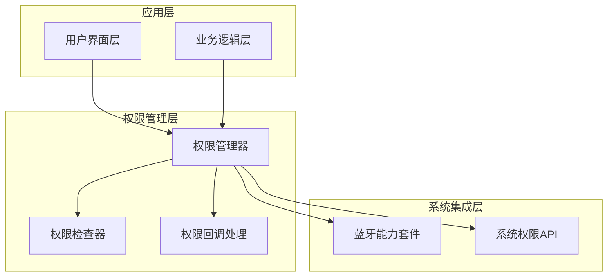

**图表来源**
- [module.json5:14-25](file://entry/src/main/module.json5#L14-L25)
- [Index.ets:147-161](file://entry/src/main/ets/pages/Index.ets#L147-L161)

**章节来源**
- [module.json5:1-63](file://entry/src/main/module.json5#L1-L63)
- [build-profile.json5:18-32](file://build-profile.json5#L18-L32)

## 核心组件

### 权限配置组件

系统采用声明式权限配置方式，在模块配置文件中明确声明所需的蓝牙权限：

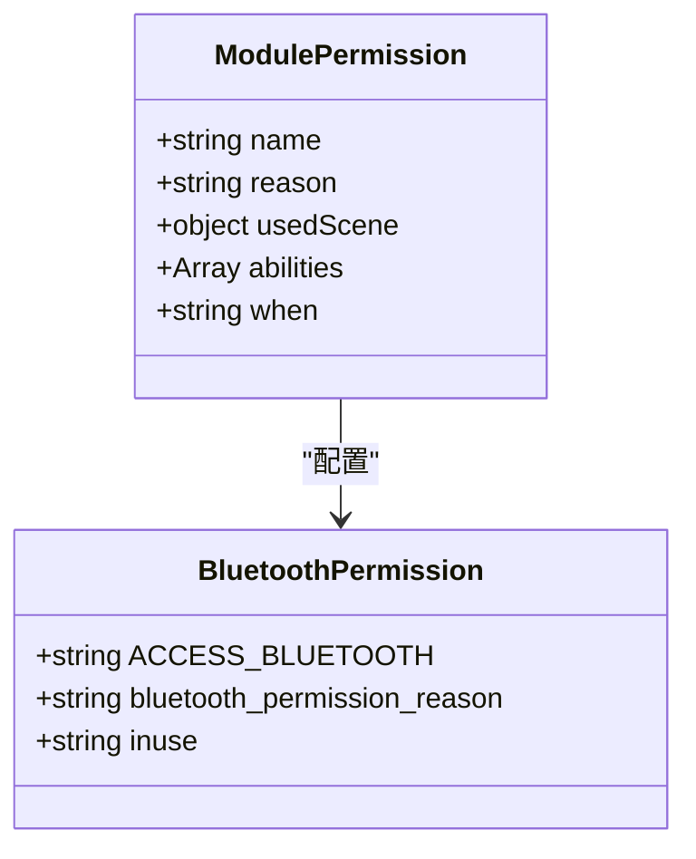

**图表来源**
- [module.json5:14-25](file://entry/src/main/module.json5#L14-L25)

### 权限管理器

权限管理器负责协调整个权限申请流程，包括权限检查、用户授权和状态跟踪：

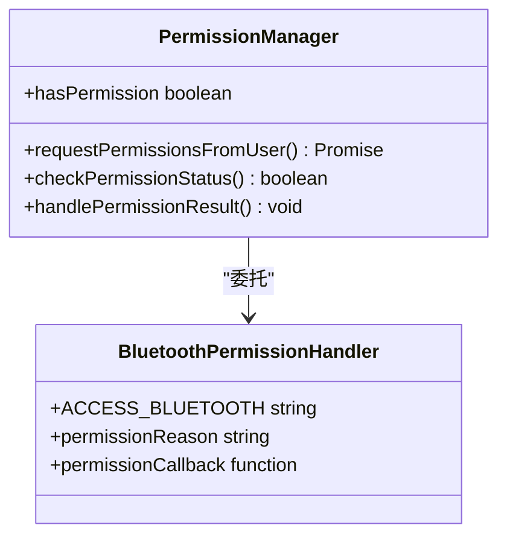

**图表来源**
- [Index.ets:147-161](file://entry/src/main/ets/pages/Index.ets#L147-L161)

**章节来源**
- [module.json5:14-25](file://entry/src/main/module.json5#L14-L25)
- [Index.ets:147-161](file://entry/src/main/ets/pages/Index.ets#L147-L161)

## 架构概览

权限管理系统采用分层架构，确保权限管理的独立性和可维护性：

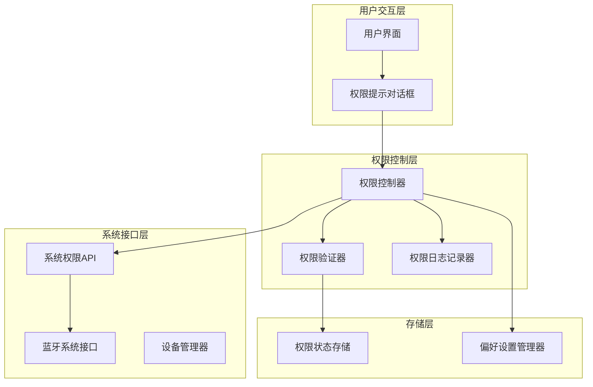

**图表来源**
- [Index.ets:147-161](file://entry/src/main/ets/pages/Index.ets#L147-L161)
- [OppoEarphoneManager.ets:131-207](file://entry/src/main/ets/manager/OppoEarphoneManager.ets#L131-L207)

## 详细组件分析

### 权限申请流程组件

#### 权限申请序列图

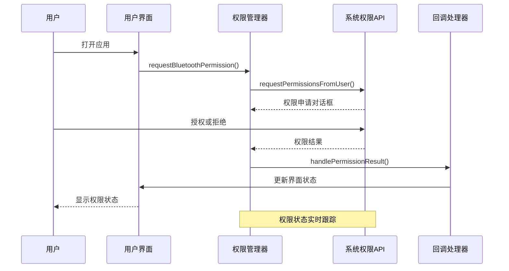

**图表来源**
- [Index.ets:147-161](file://entry/src/main/ets/pages/Index.ets#L147-L161)

#### 权限状态跟踪机制

系统实现了多层次的权限状态跟踪机制：

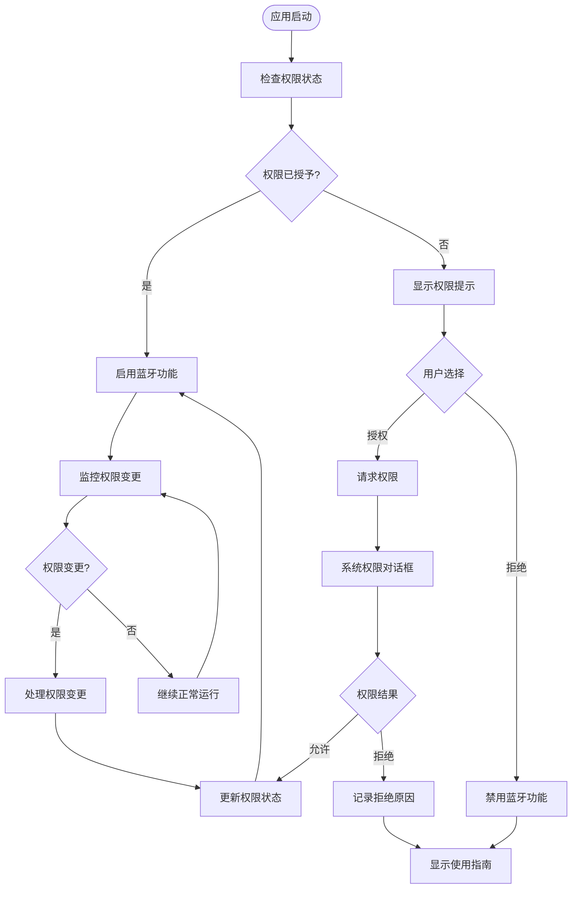

**图表来源**
- [Index.ets:116-161](file://entry/src/main/ets/pages/Index.ets#L116-L161)

**章节来源**
- [Index.ets:116-161](file://entry/src/main/ets/pages/Index.ets#L116-L161)

### 权限缺失处理策略

#### 权限请求界面设计

系统为权限缺失情况设计了完整的用户引导机制：

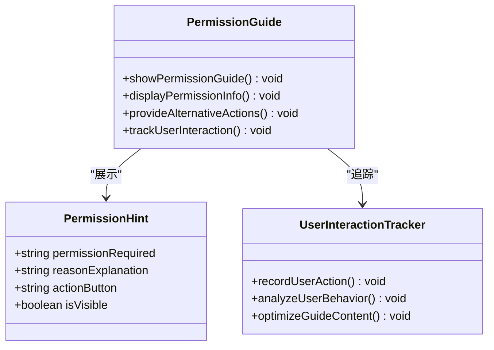

**图表来源**
- [Index.ets:372-378](file://entry/src/main/ets/pages/Index.ets#L372-L378)

#### 权限变更监听机制

系统实现了实时的权限变更监听，确保应用能够及时响应系统权限状态的变化：

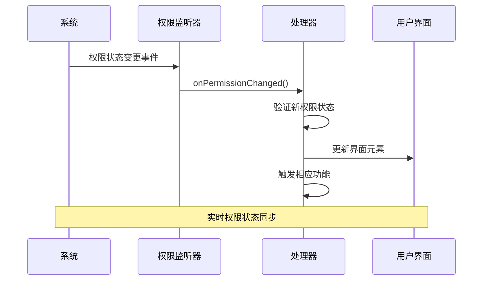

**图表来源**
- [OppoEarphoneManager.ets:305-324](file://entry/src/main/ets/manager/OppoEarphoneManager.ets#L305-L324)

**章节来源**
- [Index.ets:372-378](file://entry/src/main/ets/pages/Index.ets#L372-L378)
- [OppoEarphoneManager.ets:305-324](file://entry/src/main/ets/manager/OppoEarphoneManager.ets#L305-L324)

### 权限配置示例

#### 模块权限声明配置

应用在模块配置中声明了必要的蓝牙权限：

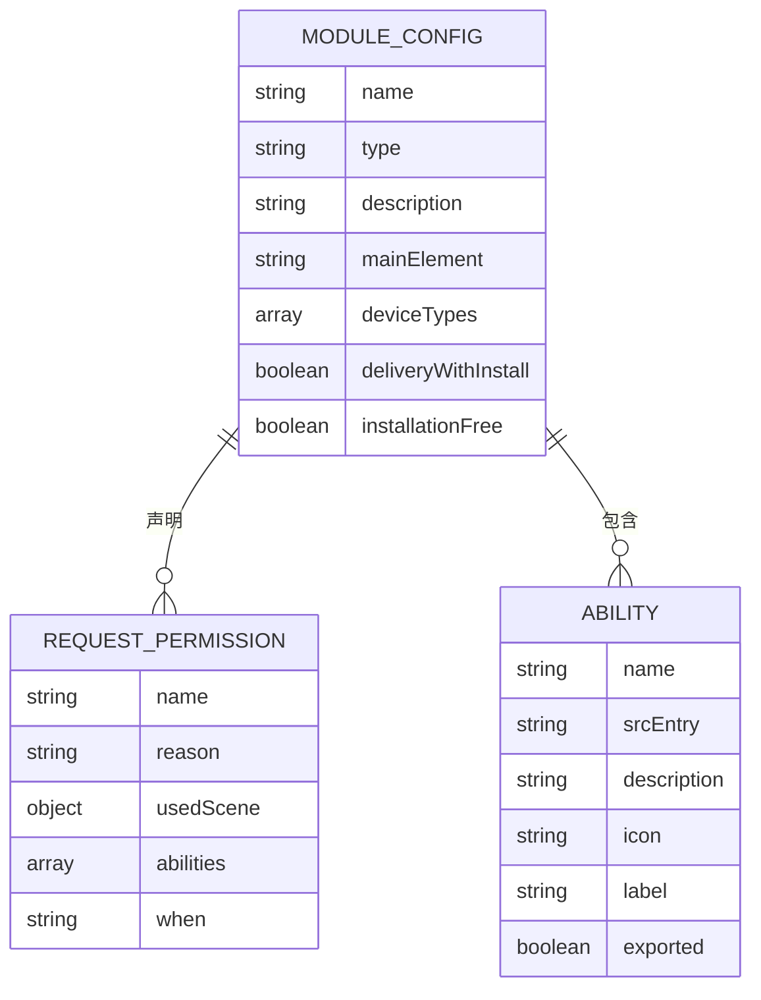

**图表来源**
- [module.json5:14-46](file://entry/src/main/module.json5#L14-L46)

**章节来源**
- [module.json5:14-25](file://entry/src/main/module.json5#L14-L25)
- [string.json:16-17](file://entry/src/main/resources/base/element/string.json#L16-L17)

### HarmonyOS 版本兼容性

#### 兼容性处理策略

系统针对不同 HarmonyOS 版本实现了相应的权限兼容性处理：

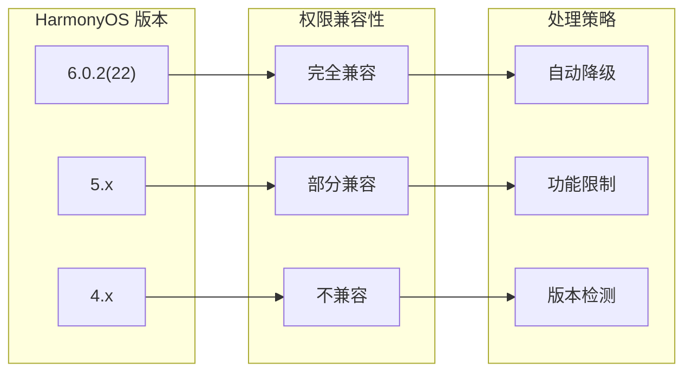

**图表来源**
- [build-profile.json5:22-24](file://build-profile.json5#L22-L24)

**章节来源**
- [build-profile.json5:22-24](file://build-profile.json5#L22-L24)

## 依赖关系分析

### 权限系统依赖图

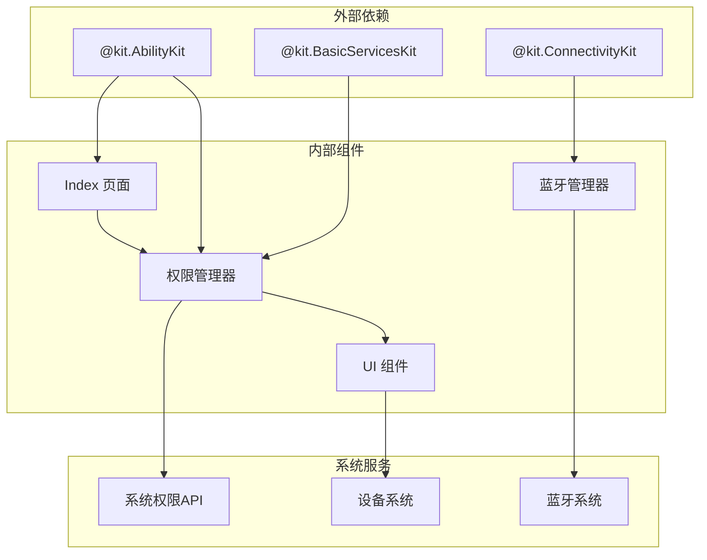

**图表来源**
- [Index.ets:1-3](file://entry/src/main/ets/pages/Index.ets#L1-L3)
- [OppoEarphoneManager.ets](file://entry/src/main/ets/manager/OppoEarphoneManager.ets#L1)

**章节来源**
- [Index.ets:1-3](file://entry/src/main/ets/pages/Index.ets#L1-L3)
- [OppoEarphoneManager.ets](file://entry/src/main/ets/manager/OppoEarphoneManager.ets#L1)

## 性能考虑

### 权限检查性能优化

系统在权限检查方面采用了多项性能优化策略：

1. **懒加载机制**：权限检查仅在需要时执行，避免不必要的系统调用
2. **缓存策略**：权限状态在内存中缓存，减少重复查询
3. **异步处理**：权限请求采用异步方式，避免阻塞主线程
4. **批量检查**：多个权限检查合并处理，提高效率

### 内存管理

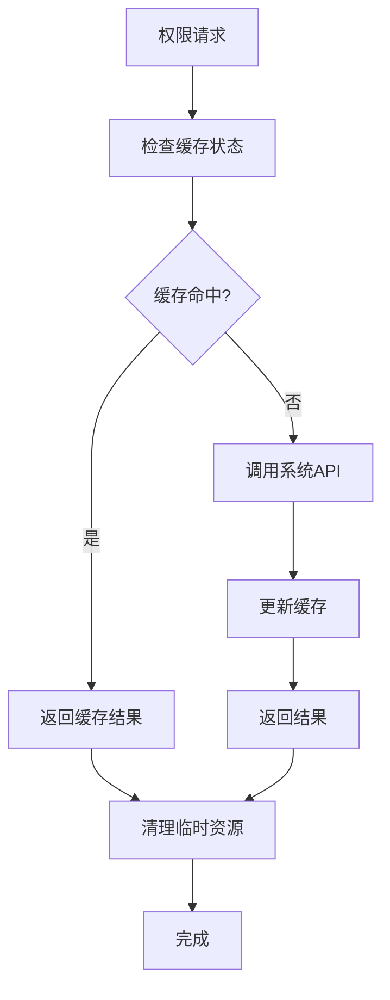

**图表来源**
- [Index.ets:147-161](file://entry/src/main/ets/pages/Index.ets#L147-L161)

## 故障排除指南

### 常见权限问题及解决方案

#### 权限申请失败

**问题描述**：权限申请过程中出现异常或失败

**可能原因**：
1. 系统权限API调用异常
2. 用户拒绝权限申请
3. 应用上下文无效

**解决方案**：
1. 检查系统权限API的可用性
2. 验证应用上下文的有效性
3. 实现重试机制和错误恢复

#### 权限状态不同步

**问题描述**：应用显示的权限状态与系统状态不一致

**解决步骤**：
1. 实施权限状态轮询机制
2. 监听系统权限状态变化
3. 实现状态同步和补偿机制

#### 权限回调未触发

**问题描述**：权限申请完成后回调函数未执行

**排查要点**：
1. 检查回调函数注册
2. 验证权限申请参数
3. 确认应用生命周期状态

**章节来源**
- [Index.ets:157-160](file://entry/src/main/ets/pages/Index.ets#L157-L160)

### 权限诊断工具

系统提供了多种权限诊断和调试工具：

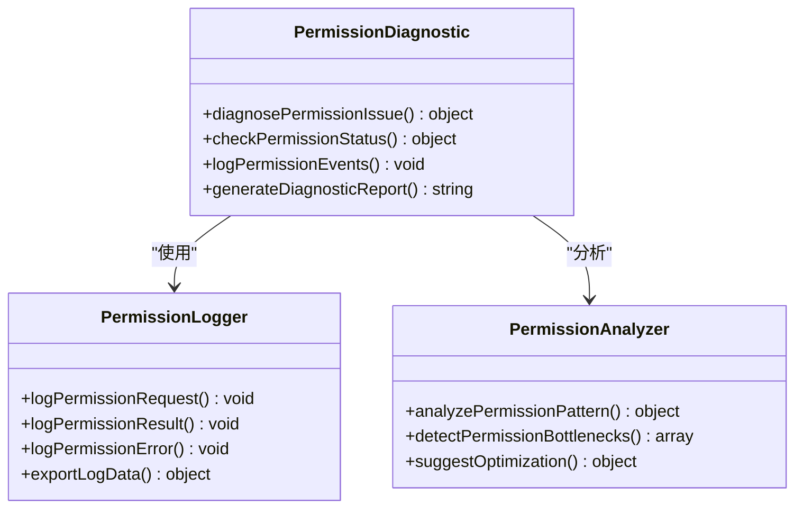

**图表来源**
- [Index.ets:157-160](file://entry/src/main/ets/pages/Index.ets#L157-L160)

## 结论

OPPO Enco Air5 Pro 应用的权限管理系统展现了现代移动应用权限管理的最佳实践。系统通过声明式权限配置、运行时权限检查、用户友好的授权流程和完善的错误处理机制，为用户提供了一个安全、可靠且易于使用的蓝牙权限管理体验。

系统的核心优势包括：

1. **完整的权限生命周期管理**：从权限声明到状态跟踪的全流程覆盖
2. **用户友好的授权体验**：清晰的权限说明和直观的操作界面
3. **健壮的错误处理机制**：全面的异常捕获和恢复策略
4. **良好的性能表现**：优化的权限检查和状态管理
5. **跨版本兼容性**：针对不同 HarmonyOS 版本的适配方案

该权限管理系统不仅满足了 OPPO Enco Air5 Pro 应用的功能需求，也为其他 HarmonyOS 应用的权限管理提供了有价值的参考和借鉴。

## 附录

### 安全考虑和最佳实践

#### 权限最小化原则
- 仅申请应用运行所必需的权限
- 定期审查和清理不再使用的权限
- 提供权限使用的透明度和可解释性

#### 用户隐私保护
- 明确告知权限使用的具体目的
- 提供用户控制和撤销权限的能力
- 实施数据最小化和加密存储

#### 权限管理最佳实践
- 实现权限状态的实时监控和同步
- 提供清晰的权限使用反馈
- 建立完善的权限变更通知机制

### 版本兼容性矩阵

| HarmonyOS 版本 | 权限支持 | 兼容性状态 | 处理策略 |
|---------------|----------|------------|----------|
| 6.0.2(22) | 完整支持 | ✅ 完全兼容 | 标准实现 |
| 5.x | 部分支持 | ⚠️ 部分兼容 | 功能降级 |
| 4.x | 基础支持 | ❌ 不推荐 | 版本检测 |

**章节来源**
- [build-profile.json5:22-24](file://build-profile.json5#L22-L24)
- [AppScope app.json5:1-11](file://AppScope/app.json5#L1-L11)