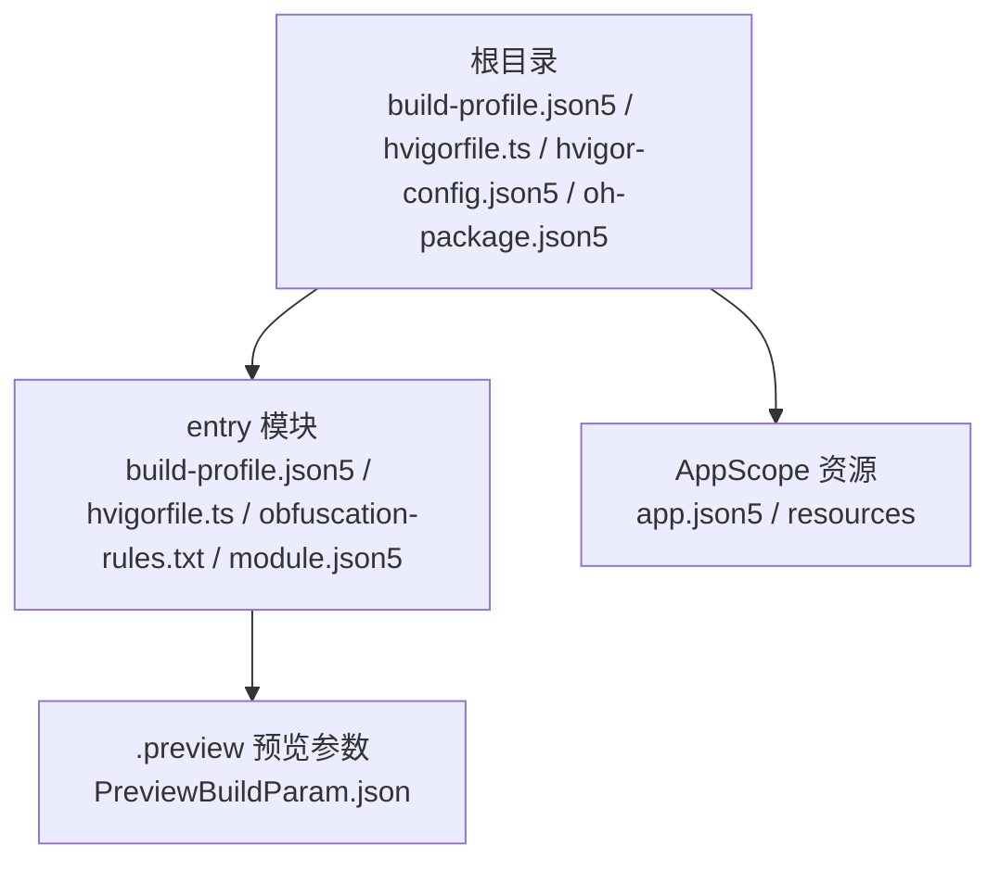
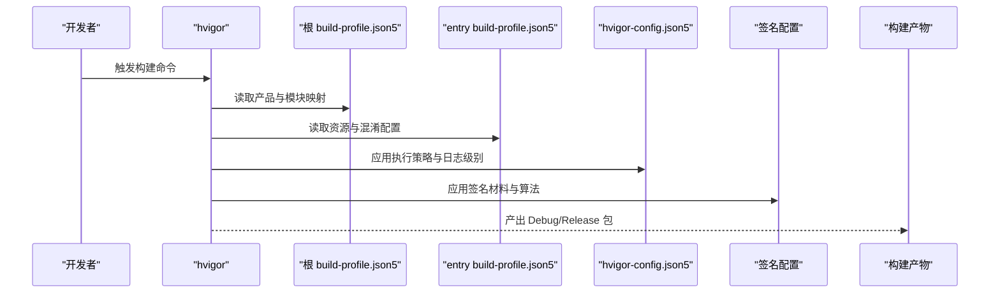
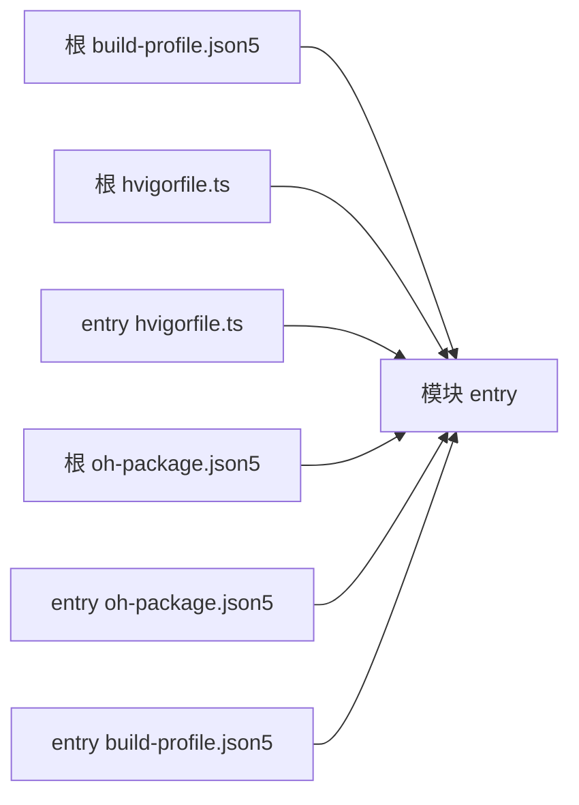

# 构建配置

<cite>
**本文引用的文件**
- [build-profile.json5（根）](file://build-profile.json5)
- [build-profile.json5（entry 模块）](file://entry/build-profile.json5)
- [hvigorfile.ts（根）](file://hvigorfile.ts)
- [hvigorfile.ts（entry 模块）](file://entry/hvigorfile.ts)
- [hvigor-config.json5](file://hvigor/hvigor-config.json5)
- [oh-package.json5（根）](file://oh-package.json5)
- [oh-package.json5（entry 模块）](file://entry/oh-package.json5)
- [obfuscation-rules.txt（entry 模块）](file://entry/obfuscation-rules.txt)
- [AppScope/app.json5](file://AppScope/app.json5)
- [entry/src/main/module.json5](file://entry/src/main/module.json5)
- [entry/.preview/PreviewBuildParam.json](file://entry/.preview/PreviewBuildParam.json)
- [code-linter.json5](file://code-linter.json5)
</cite>

## 目录
1. [简介](#简介)
2. [项目结构](#项目结构)
3. [核心组件](#核心组件)
4. [架构总览](#架构总览)
5. [详细组件分析](#详细组件分析)
6. [依赖分析](#依赖分析)
7. [性能考虑](#性能考虑)
8. [故障排查指南](#故障排查指南)
9. [结论](#结论)
10. [附录](#附录)

## 简介
本文件面向 OPPO Enco Air5 Pro 应用的构建配置，系统性说明以下内容：
- 根与模块级 build-profile.json5 的配置项与作用域
- hvigor 构建工具的使用方式、自定义任务与脚本扩展
- 依赖管理（oh-package.json5）与版本控制策略
- 不同构建模式（Debug/Release）的差异化配置
- 代码混淆与优化策略（含混淆规则文件）
- 构建产物的分析与验证方法
- 多模块项目的构建配置与依赖关系管理
- 常见构建问题的诊断与解决思路

## 项目结构
该工程采用“单仓多模块”布局，根目录包含应用级配置与全局构建脚本，entry 子模块为应用入口模块，包含其独立的构建配置与资源。

图表来源
- [build-profile.json5（根）:1-56](file://build-profile.json5#L1-L56)
- [hvigorfile.ts（根）:1-6](file://hvigorfile.ts#L1-L6)
- [hvigor-config.json5:1-24](file://hvigor/hvigor-config.json5#L1-L24)
- [oh-package.json5（根）:1-11](file://oh-package.json5#L1-L11)
- [entry/build-profile.json5:1-33](file://entry/build-profile.json5#L1-L33)
- [entry/hvigorfile.ts:1-6](file://entry/hvigorfile.ts#L1-L6)
- [entry/obfuscation-rules.txt:1-23](file://entry/obfuscation-rules.txt#L1-L23)
- [entry/src/main/module.json5:1-63](file://entry/src/main/module.json5#L1-L63)
- [entry/.preview/PreviewBuildParam.json:1-2](file://entry/.preview/PreviewBuildParam.json#L1-L2)

章节来源
- [build-profile.json5（根）:1-56](file://build-profile.json5#L1-L56)
- [entry/build-profile.json5:1-33](file://entry/build-profile.json5#L1-L33)
- [hvigorfile.ts（根）:1-6](file://hvigorfile.ts#L1-L6)
- [hvigorfile.ts（entry 模块）:1-6](file://entry/hvigorfile.ts#L1-L6)
- [hvigor-config.json5:1-24](file://hvigor/hvigor-config.json5#L1-L24)
- [oh-package.json5（根）:1-11](file://oh-package.json5#L1-L11)
- [oh-package.json5（entry 模块）:1-11](file://entry/oh-package.json5#L1-L11)
- [entry/obfuscation-rules.txt:1-23](file://entry/obfuscation-rules.txt#L1-L23)
- [entry/src/main/module.json5:1-63](file://entry/src/main/module.json5#L1-L63)
- [entry/.preview/PreviewBuildParam.json:1-2](file://entry/.preview/PreviewBuildParam.json#L1-L2)

## 核心组件
- 根级构建配置（build-profile.json5）
  - 定义签名配置、产品维度（products）、构建模式集合（buildModeSet），以及模块映射（modules）
  - 关键点：签名材料路径、目标/兼容 SDK 版本、严格模式检查开关
- 模块级构建配置（entry/build-profile.json5）
  - 定义资源处理选项（resOptions）、目标产物（default/ohosTest）、以及按构建模式的 Ark/混淆配置
- hvigor 构建脚本
  - 根与模块 hvigorfile.ts 分别引入系统任务（appTasks/hapTasks），支持通过 plugins 扩展
- hvigor 全局配置（hvigor-config.json5）
  - 提供执行策略（并行/增量/类型检查等）、日志级别、调试开关、Node 进程内存等可选参数
- 依赖管理（oh-package.json5）
  - 根与模块分别声明 dependencies/devDependencies，用于运行时与开发期依赖的版本约束
- 混淆规则（entry/obfuscation-rules.txt）
  - 定义属性名、全局名、文件名、导出符号等混淆策略与保留项
- 预览参数（entry/.preview/PreviewBuildParam.json）
  - 指定资源路径、生成目录、预览编译模块名等，辅助本地预览与调试

章节来源
- [build-profile.json5（根）:1-56](file://build-profile.json5#L1-L56)
- [entry/build-profile.json5:1-33](file://entry/build-profile.json5#L1-L33)
- [hvigorfile.ts（根）:1-6](file://hvigorfile.ts#L1-L6)
- [hvigorfile.ts（entry 模块）:1-6](file://entry/hvigorfile.ts#L1-L6)
- [hvigor-config.json5:1-24](file://hvigor/hvigor-config.json5#L1-L24)
- [oh-package.json5（根）:1-11](file://oh-package.json5#L1-L11)
- [oh-package.json5（entry 模块）:1-11](file://entry/oh-package.json5#L1-L11)
- [entry/obfuscation-rules.txt:1-23](file://entry/obfuscation-rules.txt#L1-L23)
- [entry/.preview/PreviewBuildParam.json:1-2](file://entry/.preview/PreviewBuildParam.json#L1-L2)

## 架构总览
下图展示从配置到产物的关键流程：根配置驱动模块装配与签名策略；hvigor 依据模块配置执行编译、资源处理与打包；产物在不同构建模式下具备差异化行为（如混淆开关）。

图表来源
- [build-profile.json5（根）:1-56](file://build-profile.json5#L1-L56)
- [entry/build-profile.json5:1-33](file://entry/build-profile.json5#L1-L33)
- [hvigor-config.json5:1-24](file://hvigor/hvigor-config.json5#L1-L24)

## 详细组件分析

### 根级构建配置（build-profile.json5）
- 签名配置（signingConfigs）
  - 包含证书路径、密钥别名、密钥密码、profile 文件、签名算法、store 文件与 store 密码
  - 用途：为发布包提供签名材料，确保安装与分发安全
- 产品维度（products）
  - 指定目标 SDK、兼容 SDK、运行时 OS，并开启严格模式（大小写敏感检查、OHM URL 规范化）
- 构建模式（buildModeSet）
  - 定义 debug/release 两种模式，作为后续模块级配置的生效基础
- 模块映射（modules）
  - 将 entry 模块与默认产品关联，限定其适用范围

章节来源
- [build-profile.json5（根）:1-56](file://build-profile.json5#L1-L56)

### 模块级构建配置（entry/build-profile.json5）
- apiType 与构建目标
  - stageMode API 类型，目标 default/ohosTest
- 资源处理（resOptions）
  - 控制是否复制代码资源（当前关闭）
- 构建模式集（buildOptionSet.release）
  - Ark/混淆相关规则启用与否，以及混淆规则文件路径（指向 obfuscation-rules.txt）

章节来源
- [entry/build-profile.json5:1-33](file://entry/build-profile.json5#L1-L33)

### hvigor 构建脚本与插件
- 根 hvigorfile.ts
  - 引入 appTasks，作为应用级构建任务系统
- 模块 hvigorfile.ts（entry）
  - 引入 hapTasks，作为 HAP 模块构建任务系统
- 插件扩展
  - plugins 数组预留自定义插件入口，便于扩展编译、测试或打包阶段的任务

章节来源
- [hvigorfile.ts（根）:1-6](file://hvigorfile.ts#L1-L6)
- [hvigorfile.ts（entry 模块）:1-6](file://entry/hvigorfile.ts#L1-L6)

### hvigor 全局配置（hvigor-config.json5）
- 执行策略
  - analyze、daemon、incremental、parallel、typeCheck、optimizationStrategy 等可选参数
- 日志与调试
  - logging.level、debugging.stacktrace 可调
- Node 进程参数
  - nodeOptions.maxOldSpaceSize、exposeGC 等可调

章节来源
- [hvigor-config.json5:1-24](file://hvigor/hvigor-config.json5#L1-L24)

### 依赖管理（oh-package.json5）
- 根级（oh-package.json5）
  - modelVersion、devDependencies（如 @ohos/hypium、@ohos/hamock）
- 模块级（entry/oh-package.json5）
  - name/version/description/dependencies 等模块元信息

章节来源
- [oh-package.json5（根）:1-11](file://oh-package.json5#L1-L11)
- [oh-package.json5（entry 模块）:1-11](file://entry/oh-package.json5#L1-L11)

### 代码混淆与优化（entry/obfuscation-rules.txt）
- 混淆能力
  - 属性名混淆、全局名混淆、文件名混淆、导出符号混淆
- 保留策略
  - 支持保留特定属性名与全局名（通过相应保留选项）
- 与构建配置联动
  - entry/build-profile.json5 中 release 模式可启用混淆并指定规则文件

章节来源
- [entry/obfuscation-rules.txt:1-23](file://entry/obfuscation-rules.txt#L1-L23)
- [entry/build-profile.json5:10-24](file://entry/build-profile.json5#L10-L24)

### 预览参数与资源映射（entry/.preview/PreviewBuildParam.json）
- APP_RESOURCES/MODULE_RESOURCES/HAR_RESOURCES
- PREVIEW_GENERATE_SOURCE_DIR/PREVIEW_COMPILE_MODULE_NAMES
- 作用：指导预览编译器定位资源与生成目录，提升本地预览效率

章节来源
- [entry/.preview/PreviewBuildParam.json:1-2](file://entry/.preview/PreviewBuildParam.json#L1-L2)

### 应用与模块元数据（AppScope/app.json5、entry/src/main/module.json5）
- 应用层（AppScope/app.json5）
  - bundleName、versionCode/versionName、图标与标签等
- 模块层（entry/src/main/module.json5）
  - 模块类型、主元素、设备类型、页面与权限声明、能力与扩展能力定义

章节来源
- [AppScope/app.json5:1-11](file://AppScope/app.json5#L1-L11)
- [entry/src/main/module.json5:1-63](file://entry/src/main/module.json5#L1-L63)

### 构建流程与模式差异（Debug/Release）
- Debug 模式
  - 通常不启用混淆，便于调试与定位问题
- Release 模式
  - 可启用 Ark/混淆规则，减小包体并提升安全性
- 配置要点
  - 根 build-profile.json5 定义模式集合
  - entry/build-profile.json5 在 release 下启用混淆与规则文件

章节来源
- [build-profile.json5（根）:33-40](file://build-profile.json5#L33-L40)
- [entry/build-profile.json5:10-24](file://entry/build-profile.json5#L10-L24)

### 代码质量与静态检查（code-linter.json5）
- 目标文件与忽略路径
- 规则集与具体规则（如安全类 ESLint 插件规则）
- 用途：统一编码规范，降低安全与性能风险

章节来源
- [code-linter.json5:1-32](file://code-linter.json5#L1-L32)

## 依赖分析
- 组件耦合
  - 根 build-profile.json5 与 hvigorfile.ts 协同决定模块装配与任务系统
  - entry 模块的构建行为由其 own build-profile.json5 与 hvigorfile.ts 决定
- 外部依赖
  - 开发期依赖（如测试框架）在根与模块的 oh-package.json5 中声明
- 潜在环路
  - 当前结构为单向依赖（根 -> 模块），无循环依赖迹象

图表来源
- [build-profile.json5（根）:42-55](file://build-profile.json5#L42-L55)
- [hvigorfile.ts（根）:1-6](file://hvigorfile.ts#L1-L6)
- [hvigorfile.ts（entry 模块）:1-6](file://entry/hvigorfile.ts#L1-L6)
- [oh-package.json5（根）:1-11](file://oh-package.json5#L1-L11)
- [oh-package.json5（entry 模块）:1-11](file://entry/oh-package.json5#L1-L11)
- [entry/build-profile.json5:1-33](file://entry/build-profile.json5#L1-L33)

章节来源
- [build-profile.json5（根）:42-55](file://build-profile.json5#L42-L55)
- [hvigorfile.ts（根）:1-6](file://hvigorfile.ts#L1-L6)
- [hvigorfile.ts（entry 模块）:1-6](file://entry/hvigorfile.ts#L1-L6)
- [oh-package.json5（根）:1-11](file://oh-package.json5#L1-L11)
- [oh-package.json5（entry 模块）:1-11](file://entry/oh-package.json5#L1-L11)
- [entry/build-profile.json5:1-33](file://entry/build-profile.json5#L1-L33)

## 性能考虑
- 并行与增量编译
  - 通过 hvigor-config.json5 启用 parallel/incremental，缩短构建时间
- 类型检查与分析
  - 可根据需要开启 typeCheck 与 analyze，平衡构建速度与质量
- 优化策略
  - optimizationStrategy 可选择 memory/performance，按机器资源与需求权衡
- 资源处理
  - resOptions.copyCodeResource 控制是否复制代码资源，避免冗余拷贝
- 混淆策略
  - Release 模式启用混淆，结合规则文件减少体积并增强安全性

章节来源
- [hvigor-config.json5:5-11](file://hvigor/hvigor-config.json5#L5-L11)
- [entry/build-profile.json5:3-8](file://entry/build-profile.json5#L3-L8)
- [entry/build-profile.json5:13-22](file://entry/build-profile.json5#L13-L22)

## 故障排查指南
- 签名失败
  - 检查根 build-profile.json5 中 signingConfigs 的证书与密码路径是否正确
- 构建模式未生效
  - 确认根 build-profile.json5 的 buildModeSet 是否包含 debug/release，entry/build-profile.json5 的 buildOptionSet.release 是否启用混淆
- 资源缺失或预览异常
  - 校验 entry/.preview/PreviewBuildParam.json 的资源路径与生成目录
- 依赖冲突
  - 检查根与模块的 oh-package.json5 中 dependencies/devDependencies，避免版本不一致
- 混淆导致的问题
  - 临时关闭 release 的混淆或调整 obfuscation-rules.txt 的保留项，定位问题后逐步收紧规则

章节来源
- [build-profile.json5（根）:3-17](file://build-profile.json5#L3-L17)
- [entry/build-profile.json5:10-24](file://entry/build-profile.json5#L10-L24)
- [entry/.preview/PreviewBuildParam.json:1-2](file://entry/.preview/PreviewBuildParam.json#L1-L2)
- [oh-package.json5（根）:1-11](file://oh-package.json5#L1-L11)
- [oh-package.json5（entry 模块）:1-11](file://entry/oh-package.json5#L1-L11)
- [entry/obfuscation-rules.txt:1-23](file://entry/obfuscation-rules.txt#L1-L23)

## 结论
本项目以清晰的“根配置 + 模块配置 + hvigor 任务系统”组织构建流程，配合 hvigor-config.json5 的执行策略与 oh-package.json5 的依赖声明，实现了可维护、可扩展且可跨平台的构建体系。通过 Debug/Release 的差异化配置与混淆规则，兼顾开发效率与发布质量。建议在团队内统一遵循 code-linter.json5 的规则，持续提升代码质量与安全性。

## 附录
- 多模块项目建议
  - 为每个子模块维护独立的 hvigorfile.ts 与 build-profile.json5，明确模块间依赖与产物边界
  - 使用 oh-package.json5 明确各模块的运行时与开发期依赖，避免版本漂移
- 自定义构建任务
  - 在 hvigorfile.ts 的 plugins 中注册自定义插件，扩展编译、测试或打包阶段的逻辑
- 产物分析与验证
  - 对比 Debug/Release 的包体与功能差异，结合日志与预览参数进行交叉验证