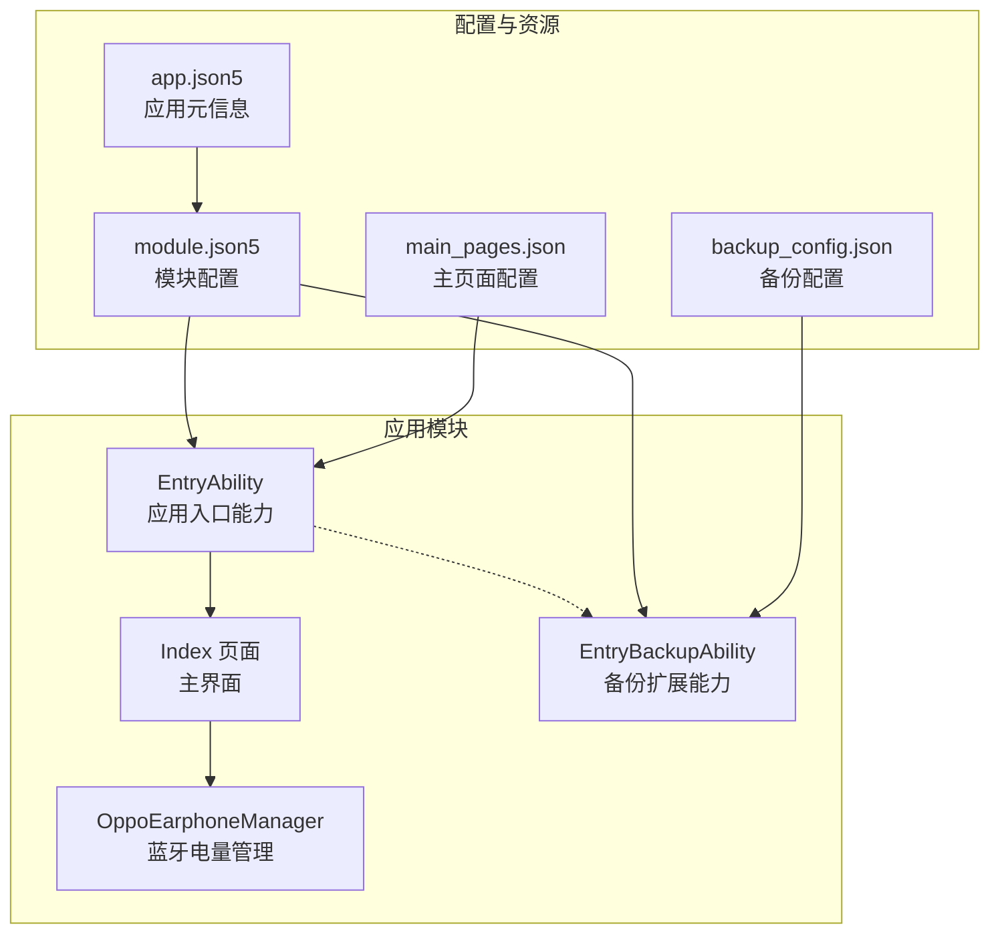
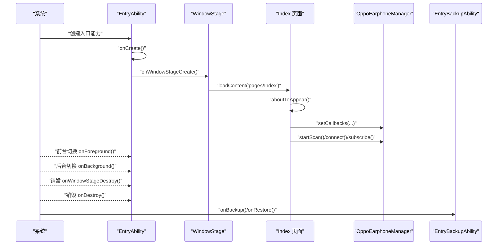
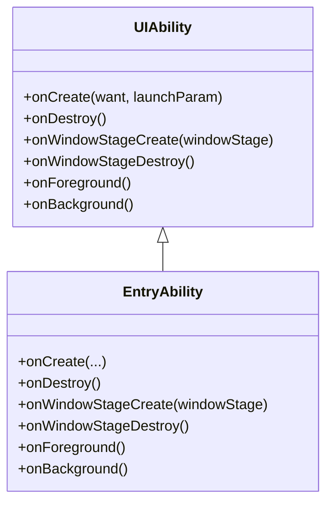
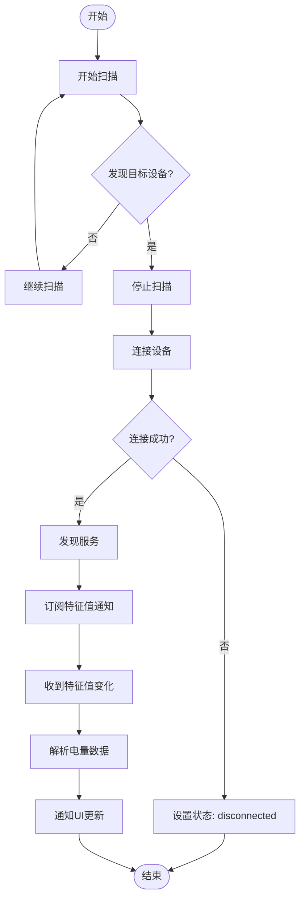
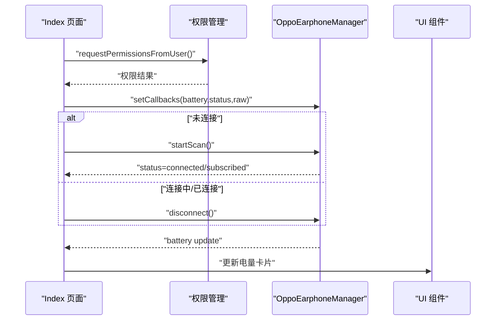
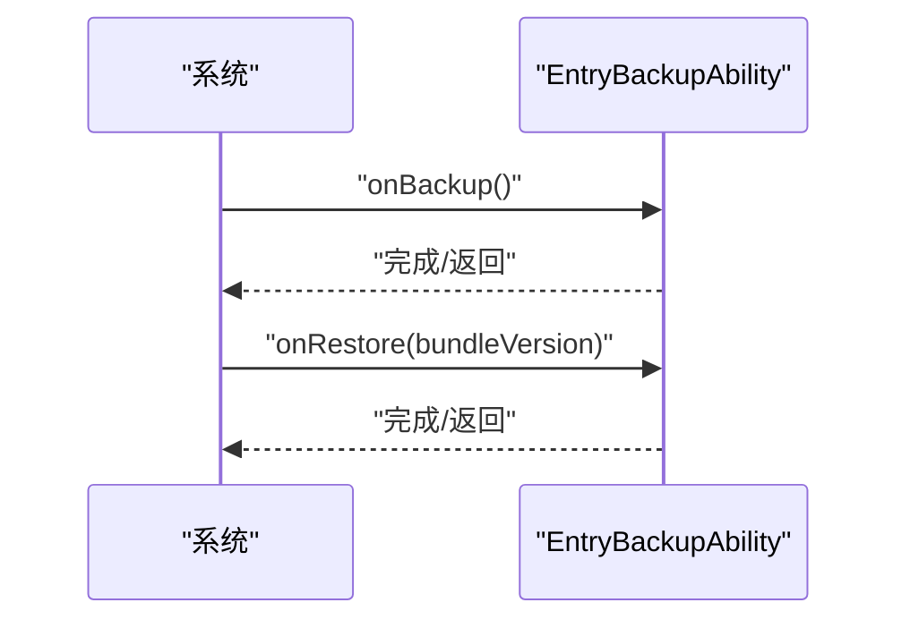
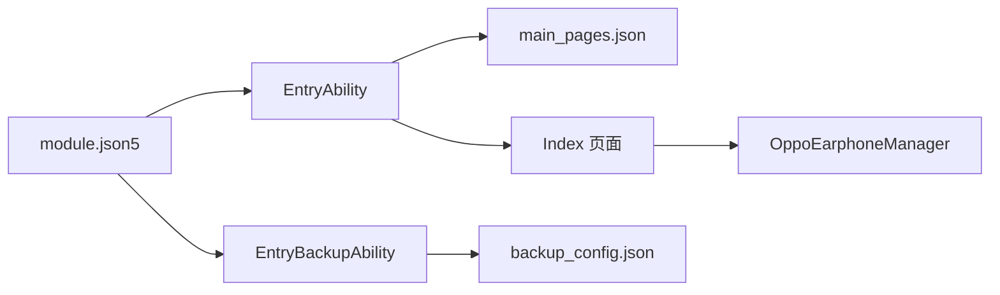

# 应用生命周期管理

<cite>
**本文引用的文件**
- [EntryAbility.ets](file://entry/src/main/ets/entryability/EntryAbility.ets)
- [EntryBackupAbility.ets](file://entry/src/main/ets/entrybackupability/EntryBackupAbility.ets)
- [OppoEarphoneManager.ets](file://entry/src/main/ets/manager/OppoEarphoneManager.ets)
- [Index.ets](file://entry/src/main/ets/pages/Index.ets)
- [module.json5](file://entry/src/main/module.json5)
- [main_pages.json](file://entry/src/main/resources/base/profile/main_pages.json)
- [backup_config.json](file://entry/src/main/resources/base/profile/backup_config.json)
- [app.json5](file://AppScope/app.json5)
- [List.test.ets](file://entry/src/test/List.test.ets)
</cite>

## 目录
1. [简介](#简介)
2. [项目结构](#项目结构)
3. [核心组件](#核心组件)
4. [架构总览](#架构总览)
5. [详细组件分析](#详细组件分析)
6. [依赖关系分析](#依赖关系分析)
7. [性能考虑](#性能考虑)
8. [故障排查指南](#故障排查指南)
9. [结论](#结论)
10. [附录](#附录)

## 简介
本文件面向 OPPO Enco Air5 Pro 的应用生命周期管理，聚焦 EntryAbility 类的实现原理与窗口生命周期管理机制，系统阐述应用启动、暂停、恢复、销毁各阶段的处理逻辑；解释系统回调函数的使用方式与最佳实践；描述应用状态保存与恢复机制；提供性能分析集成方案与内存管理策略；涵盖应用权限管理与安全控制；并给出完整的生命周期事件处理示例与错误处理机制。

## 项目结构
项目采用模块化组织，入口能力（EntryAbility）负责应用生命周期与窗口加载，页面 Index 提供 UI 展示与交互，OppoEarphoneManager 封装蓝牙电量管理逻辑，备份扩展能力（EntryBackupAbility）支持备份与恢复流程。

图表来源
- [module.json5:26-46](file://entry/src/main/module.json5#L26-L46)
- [main_pages.json:1-6](file://entry/src/main/resources/base/profile/main_pages.json#L1-L6)
- [backup_config.json:1-3](file://entry/src/main/resources/base/profile/backup_config.json#L1-L3)
- [app.json5:1-11](file://AppScope/app.json5#L1-L11)

章节来源
- [module.json5:1-63](file://entry/src/main/module.json5#L1-L63)
- [main_pages.json:1-6](file://entry/src/main/resources/base/profile/main_pages.json#L1-L6)
- [backup_config.json:1-3](file://entry/src/main/resources/base/profile/backup_config.json#L1-L3)
- [app.json5:1-11](file://AppScope/app.json5#L1-L11)

## 核心组件
- EntryAbility：继承 UIAbility，实现应用生命周期回调（onCreate、onDestroy、onWindowStageCreate、onWindowStageDestroy、onForeground、onBackground）与窗口内容加载。
- OppoEarphoneManager：封装蓝牙扫描、GATT 连接、服务发现、特征值订阅与电量解析，提供回调接口供 UI 更新。
- Index 页面：基于 @Entry 的页面组件，负责请求蓝牙权限、注册回调、渲染电量卡片与状态指示、处理用户操作。
- EntryBackupAbility：备份扩展能力，提供 onBackup/onRestore 生命周期钩子，配合 backup_config.json 控制备份行为。

章节来源
- [EntryAbility.ets:7-48](file://entry/src/main/ets/entryability/EntryAbility.ets#L7-L48)
- [OppoEarphoneManager.ets:49-747](file://entry/src/main/ets/manager/OppoEarphoneManager.ets#L49-L747)
- [Index.ets:100-476](file://entry/src/main/ets/pages/Index.ets#L100-L476)
- [EntryBackupAbility.ets:6-16](file://entry/src/main/ets/entrybackupability/EntryBackupAbility.ets#L6-L16)

## 架构总览
应用生命周期由 EntryAbility 驱动，Index 页面作为主内容加载；蓝牙功能通过 OppoEarphoneManager 在页面生命周期内按需启用与释放；备份能力在系统需要时触发。

图表来源
- [EntryAbility.ets:8-47](file://entry/src/main/ets/entryability/EntryAbility.ets#L8-L47)
- [Index.ets:119-159](file://entry/src/main/ets/pages/Index.ets#L119-L159)
- [EntryBackupAbility.ets:7-15](file://entry/src/main/ets/entrybackupability/EntryBackupAbility.ets#L7-L15)

## 详细组件分析

### EntryAbility 组件分析
- 生命周期回调职责
  - onCreate：初始化应用上下文参数（如配色模式），记录日志；异常捕获以避免影响启动。
  - onWindowStageCreate：窗口创建时加载主页面 Index，并在加载失败时记录错误日志。
  - onWindowStageDestroy：窗口销毁时记录日志，用于资源回收提示。
  - onForeground/onBackground：前后台切换时记录日志，便于性能分析与调试。
  - onDestroy：应用销毁时记录日志，用于最终清理确认。
- 性能分析集成
  - 使用 hilog 输出关键事件，便于性能分析工具采集与定位问题。
- 最佳实践
  - 在 onCreate 中进行轻量初始化；复杂初始化建议延后至页面首次出现。
  - onWindowStageCreate 中仅做页面加载，避免阻塞主线程。
  - 异常捕获与日志输出应保持一致的标签与域 ID，便于检索。

图表来源
- [EntryAbility.ets:7-48](file://entry/src/main/ets/entryability/EntryAbility.ets#L7-L48)

章节来源
- [EntryAbility.ets:7-48](file://entry/src/main/ets/entryability/EntryAbility.ets#L7-L48)

### OppoEarphoneManager 组件分析
- 功能职责
  - 蓝牙扫描：低延迟扫描，匹配目标设备名称，发现后停止扫描并发起连接。
  - GATT 连接：创建 GattClientDevice，监听连接状态变化，连接成功后发现服务。
  - 特征值订阅：订阅指定服务与特征的通知，接收原始数据并解析电量。
  - 电量解析：解析左耳、右耳、充电仓的电量与充电状态，触发回调更新 UI。
  - 资源清理：断开连接、关闭客户端、清理回调与状态，防止内存泄漏。
- 数据模型与状态
  - BatteryInfo：三路电量与充电状态。
  - ConnectionStatus：连接状态枚举（disconnected/scanning/connecting/connected/subscribed）。
- 回调机制
  - setCallbacks：注册电量、状态、原始数据回调，供页面订阅更新。
- 错误处理
  - 扫描/连接/订阅均包含 try/catch 与错误分支，统一记录日志并回退到断开状态。

图表来源
- [OppoEarphoneManager.ets:135-211](file://entry/src/main/ets/manager/OppoEarphoneManager.ets#L135-L211)
- [OppoEarphoneManager.ets:293-344](file://entry/src/main/ets/manager/OppoEarphoneManager.ets#L293-L344)
- [OppoEarphoneManager.ets:423-481](file://entry/src/main/ets/manager/OppoEarphoneManager.ets#L423-L481)
- [OppoEarphoneManager.ets:505-601](file://entry/src/main/ets/manager/OppoEarphoneManager.ets#L505-L601)

章节来源
- [OppoEarphoneManager.ets:49-747](file://entry/src/main/ets/manager/OppoEarphoneManager.ets#L49-L747)

### Index 页面组件分析
- 生命周期与权限
  - aboutToAppear：请求蓝牙权限，设置回调，启动扫描或连接流程。
  - aboutToDisappear：断开连接，释放资源。
- 状态管理
  - @State 管理连接状态、三路电量、MAC 地址、权限状态、原始 HEX 日志等。
- UI 组件
  - BatteryCardComponent：根据电量与充电状态动态渲染颜色与文本。
  - 状态区域：显示连接状态与 MAC 地址。
  - 电量区域：三个电池卡片展示左右耳与充电仓。
  - 操作区域：根据状态显示“开始扫描”、“取消”、“断开连接”，并处理权限禁用态。
  - 原始数据区域：可展开查看最近 20 条 HEX 日志。
- 性能优化
  - 电量更新按整十刷新，减少不必要的 UI 重绘。
  - HEX 日志限制条数，避免内存膨胀。

图表来源
- [Index.ets:119-159](file://entry/src/main/ets/pages/Index.ets#L119-L159)
- [Index.ets:348-394](file://entry/src/main/ets/pages/Index.ets#L348-L394)
- [OppoEarphoneManager.ets:117-125](file://entry/src/main/ets/manager/OppoEarphoneManager.ets#L117-L125)

章节来源
- [Index.ets:100-476](file://entry/src/main/ets/pages/Index.ets#L100-L476)

### EntryBackupAbility 组件分析
- 职责
  - onBackup：执行备份逻辑（当前为空实现，仅记录日志）。
  - onRestore：执行恢复逻辑（当前为空实现，仅记录日志与版本信息）。
- 配置
  - 通过 backup_config.json 启用备份/恢复能力。
- 最佳实践
  - 在 onBackup/onRestore 中进行轻量异步操作，避免阻塞系统恢复流程。
  - 使用 hilog 记录关键步骤，便于审计与排障。

图表来源
- [EntryBackupAbility.ets:7-15](file://entry/src/main/ets/entrybackupability/EntryBackupAbility.ets#L7-L15)
- [backup_config.json:1-3](file://entry/src/main/resources/base/profile/backup_config.json#L1-L3)

章节来源
- [EntryBackupAbility.ets:6-16](file://entry/src/main/ets/entrybackupability/EntryBackupAbility.ets#L6-L16)
- [backup_config.json:1-3](file://entry/src/main/resources/base/profile/backup_config.json#L1-L3)

## 依赖关系分析
- 模块配置
  - module.json5 定义入口能力 EntryAbility 与备份扩展 EntryBackupAbility，声明主页面与权限。
  - main_pages.json 指定入口页面为 pages/Index。
  - backup_config.json 启用备份/恢复。
- 组件耦合
  - EntryAbility 与 Index 页面通过 WindowStage.loadContent 关联。
  - Index 页面依赖 OppoEarphoneManager 提供的回调与状态。
  - EntryBackupAbility 与系统备份框架集成，独立于 UI。

图表来源
- [module.json5:26-46](file://entry/src/main/module.json5#L26-L46)
- [main_pages.json:1-6](file://entry/src/main/resources/base/profile/main_pages.json#L1-L6)
- [backup_config.json:1-3](file://entry/src/main/resources/base/profile/backup_config.json#L1-L3)

章节来源
- [module.json5:1-63](file://entry/src/main/module.json5#L1-L63)
- [main_pages.json:1-6](file://entry/src/main/resources/base/profile/main_pages.json#L1-L6)
- [backup_config.json:1-3](file://entry/src/main/resources/base/profile/backup_config.json#L1-L3)

## 性能考虑
- 性能分析集成
  - 使用 hilog 输出关键生命周期事件与业务流程节点，便于性能分析工具采集。
  - 建议在 onCreate/onWindowStageCreate/onForeground/onBackground 中记录时间戳与耗时，形成调用链分析。
- 内存管理策略
  - 在 aboutToDisappear 中断开蓝牙连接并清理回调，避免持有闭包导致的内存泄漏。
  - 限制原始 HEX 日志条数，避免长时间运行造成内存占用过高。
  - 电量更新按整十刷新，降低频繁 setState 带来的重绘成本。
- 蓝牙扫描与连接
  - 低延迟扫描模式下注意耗电与干扰，建议在用户交互或明确需求时才启动扫描。
  - 连接成功后及时订阅通知，失败时立即停止扫描与断开连接，避免资源泄露。

章节来源
- [EntryAbility.ets:8-47](file://entry/src/main/ets/entryability/EntryAbility.ets#L8-L47)
- [Index.ets:161-163](file://entry/src/main/ets/pages/Index.ets#L161-L163)
- [OppoEarphoneManager.ets:187-210](file://entry/src/main/ets/manager/OppoEarphoneManager.ets#L187-L210)
- [OppoEarphoneManager.ets:691-743](file://entry/src/main/ets/manager/OppoEarphoneManager.ets#L691-L743)

## 故障排查指南
- 启动阶段
  - 若窗口加载失败，检查 loadContent 的页面路径与 main_pages.json 配置一致性。
  - 检查 hilog 输出的错误日志，定位具体失败原因。
- 蓝牙权限
  - 若权限未授予，页面按钮处于禁用态；可在 aboutToAppear 中再次请求权限并提示用户。
- 连接与订阅
  - 若连接失败或订阅失败，查看 Manager 的错误日志并回退到断开状态。
  - 确认设备名称匹配与服务/特征 UUID 正确。
- 资源清理
  - 页面消失时务必调用 manager.disconnect()，避免后台持续扫描或连接占用资源。
- 备份与恢复
  - onBackup/onRestore 为空实现时，确认 backup_config.json 已启用；必要时补充实际备份/恢复逻辑。

章节来源
- [EntryAbility.ets:25-31](file://entry/src/main/ets/entryability/EntryAbility.ets#L25-L31)
- [Index.ets:168-182](file://entry/src/main/ets/pages/Index.ets#L168-L182)
- [OppoEarphoneManager.ets:199-209](file://entry/src/main/ets/manager/OppoEarphoneManager.ets#L199-L209)
- [OppoEarphoneManager.ets:335-343](file://entry/src/main/ets/manager/OppoEarphoneManager.ets#L335-L343)
- [EntryBackupAbility.ets:7-15](file://entry/src/main/ets/entrybackupability/EntryBackupAbility.ets#L7-L15)

## 结论
本项目通过 EntryAbility 管理应用生命周期，结合 Index 页面与 OppoEarphoneManager 实现蓝牙电量监控的核心功能；EntryBackupAbility 提供备份/恢复扩展点。整体架构清晰、职责分离，具备良好的可维护性与扩展性。建议在现有基础上进一步完善性能分析埋点、权限申请与错误处理的统一策略，并在备份能力中加入实际的数据持久化逻辑。

## 附录
- 测试入口
  - testsuite 导入本地单元测试，便于集成测试与回归验证。
- 配置参考
  - module.json5：定义入口能力、扩展能力、权限与页面映射。
  - main_pages.json：声明主页面路径。
  - backup_config.json：启用备份/恢复能力。
  - app.json5：应用基础元信息。

章节来源
- [List.test.ets:1-5](file://entry/src/test/List.test.ets#L1-L5)
- [module.json5:14-25](file://entry/src/main/module.json5#L14-L25)
- [main_pages.json:1-6](file://entry/src/main/resources/base/profile/main_pages.json#L1-L6)
- [backup_config.json:1-3](file://entry/src/main/resources/base/profile/backup_config.json#L1-L3)
- [app.json5:1-11](file://AppScope/app.json5#L1-L11)