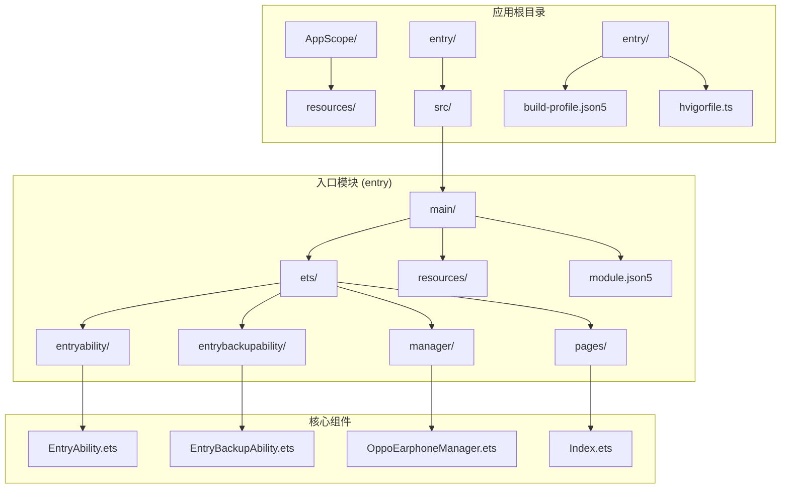
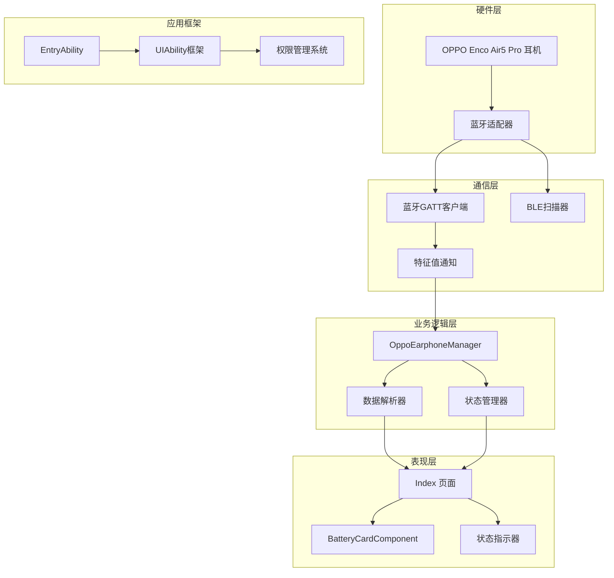
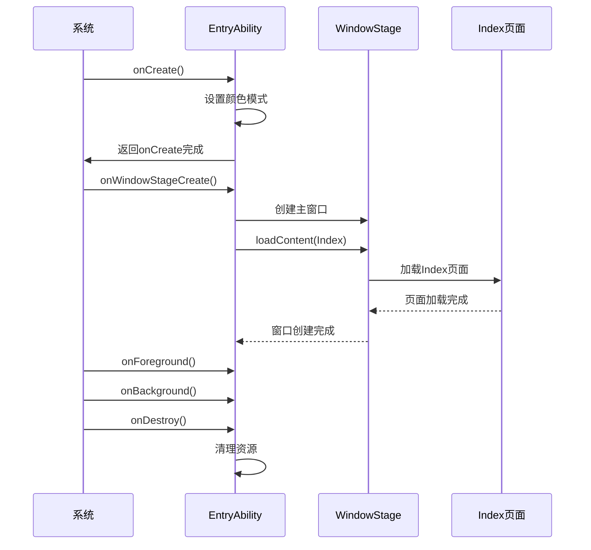
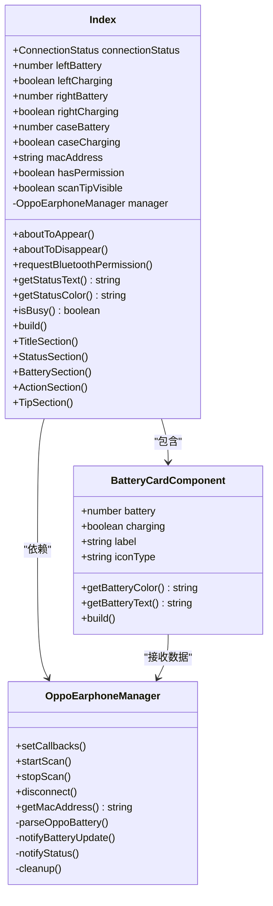
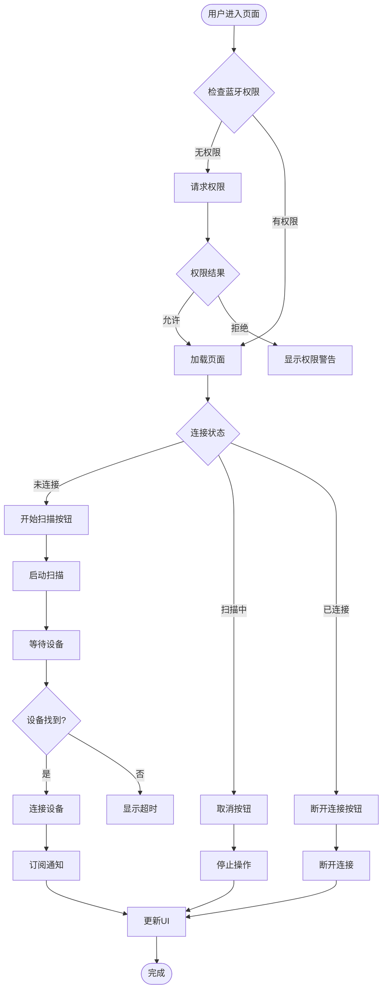
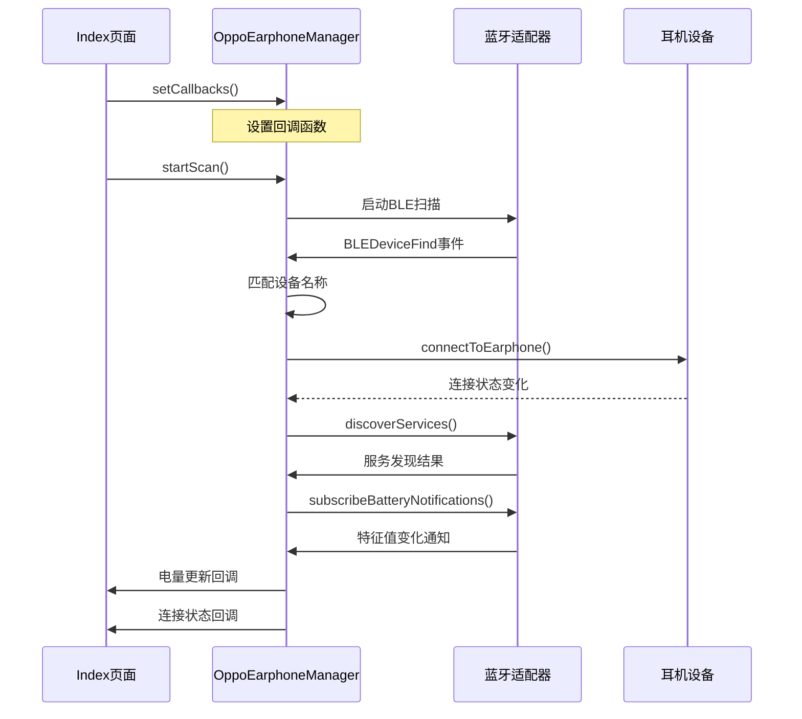
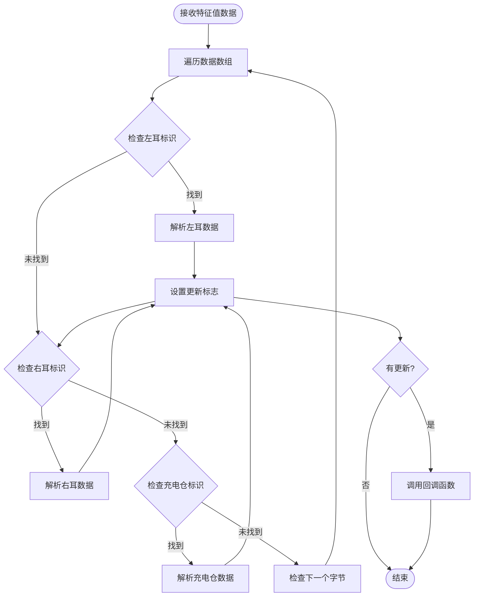
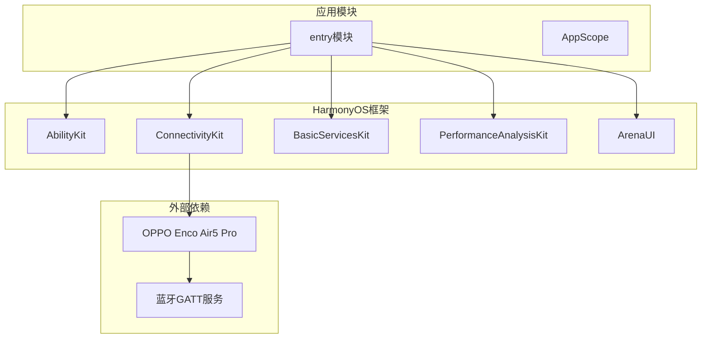
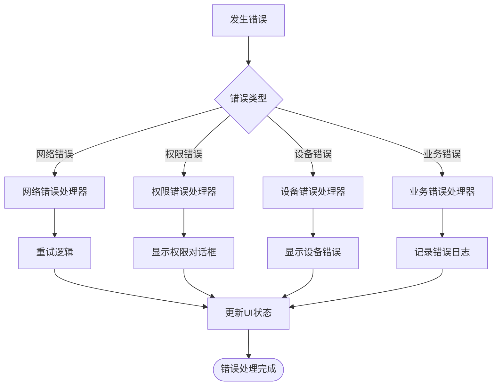

# 核心架构设计

<cite>
**本文档引用的文件**
- [EntryAbility.ets](file://entry/src/main/ets/entryability/EntryAbility.ets)
- [Index.ets](file://entry/src/main/ets/pages/Index.ets)
- [OppoEarphoneManager.ets](file://entry/src/main/ets/manager/OppoEarphoneManager.ets)
- [EntryBackupAbility.ets](file://entry/src/main/ets/entrybackupability/EntryBackupAbility.ets)
- [module.json5](file://entry/src/main/module.json5)
- [main_pages.json](file://entry/src/main/resources/base/profile/main_pages.json)
- [string.json](file://entry/src/main/resources/base/element/string.json)
- [build-profile.json5](file://entry/build-profile.json5)
</cite>

## 目录
1. [引言](#引言)
2. [项目结构](#项目结构)
3. [核心组件](#核心组件)
4. [架构概览](#架构概览)
5. [详细组件分析](#详细组件分析)
6. [依赖关系分析](#依赖关系分析)
7. [性能考虑](#性能考虑)
8. [故障排除指南](#故障排除指南)
9. [结论](#结论)

## 引言

OPPO Enco Air5 Pro电量监控应用是一个基于HarmonyOS开发的蓝牙耳机电量监控系统。该应用采用MVVM架构模式，结合观察者模式和组件化设计原则，实现了从设备扫描到电量显示的完整数据链路。系统通过蓝牙GATT协议与OPPO Enco Air5 Pro耳机进行通信，实时获取左耳、右耳和充电仓的电量信息，并通过直观的UI界面展示给用户。

## 项目结构

项目采用模块化的目录结构，主要分为以下几个层次：

**图表来源**
- [module.json5:1-63](file://entry/src/main/module.json5#L1-L63)
- [main_pages.json:1-6](file://entry/src/main/resources/base/profile/main_pages.json#L1-L6)

**章节来源**
- [module.json5:1-63](file://entry/src/main/module.json5#L1-L63)
- [build-profile.json5:1-33](file://entry/build-profile.json5#L1-L33)

## 核心组件

### MVVM架构模式

系统采用MVVM（Model-View-ViewModel）架构模式，实现了数据层、视图层和业务逻辑层的有效分离：

- **Model层**: `OppoEarphoneManager`负责蓝牙通信和数据解析
- **View层**: `Index`页面负责UI渲染和用户交互
- **ViewModel层**: 通过状态管理和回调机制实现数据绑定

### 观察者模式应用

系统广泛使用观察者模式实现组件间的松耦合通信：

- **状态观察者**: UI组件通过回调函数监听连接状态变化
- **数据观察者**: 电量数据通过观察者模式实时更新UI
- **事件观察者**: 蓝牙事件通过事件监听器处理

### 组件化设计原则

- **单一职责原则**: 每个组件专注于特定功能
- **可复用性**: 组件设计支持跨页面使用
- **可测试性**: 组件接口清晰，便于单元测试

**章节来源**
- [Index.ets:100-138](file://entry/src/main/ets/pages/Index.ets#L100-L138)
- [OppoEarphoneManager.ets:49-121](file://entry/src/main/ets/manager/OppoEarphoneManager.ets#L49-L121)

## 架构概览

系统整体架构采用分层设计，从底层硬件抽象到上层用户界面形成清晰的数据流：

**图表来源**
- [EntryAbility.ets:7-48](file://entry/src/main/ets/entryability/EntryAbility.ets#L7-L48)
- [OppoEarphoneManager.ets:49-709](file://entry/src/main/ets/manager/OppoEarphoneManager.ets#L49-L709)
- [Index.ets:100-408](file://entry/src/main/ets/pages/Index.ets#L100-L408)

## 详细组件分析

### EntryAbility - 应用生命周期管理

`EntryAbility`作为应用的主要入口点，负责应用的生命周期管理和窗口初始化：

#### 核心职责
- **应用启动**: 初始化颜色模式和日志系统
- **窗口管理**: 创建主窗口并加载Index页面
- **前台后台切换**: 处理应用前后台状态转换
- **资源清理**: 在销毁时释放相关资源

#### 生命周期管理流程

**图表来源**
- [EntryAbility.ets:8-32](file://entry/src/main/ets/entryability/EntryAbility.ets#L8-L32)

**章节来源**
- [EntryAbility.ets:1-48](file://entry/src/main/ets/entryability/EntryAbility.ets#L1-L48)

### Index页面 - UI渲染与用户交互

`Index`页面采用组件化设计，实现了响应式的电量监控界面：

#### 组件架构

**图表来源**
- [Index.ets:100-408](file://entry/src/main/ets/pages/Index.ets#L100-L408)
- [OppoEarphoneManager.ets:49-709](file://entry/src/main/ets/manager/OppoEarphoneManager.ets#L49-L709)

#### 状态管理模式

系统采用响应式状态管理，通过装饰器实现数据绑定：

- **@State装饰器**: 管理组件内部状态
- **@Prop装饰器**: 接收父组件传递的数据
- **@Component装饰器**: 定义可复用的UI组件

#### 用户交互流程

**图表来源**
- [Index.ets:305-383](file://entry/src/main/ets/pages/Index.ets#L305-L383)
- [Index.ets:116-142](file://entry/src/main/ets/pages/Index.ets#L116-L142)

**章节来源**
- [Index.ets:100-408](file://entry/src/main/ets/pages/Index.ets#L100-L408)

### OppoEarphoneManager - 蓝牙通信与数据解析

`OppoEarphoneManager`是系统的核心业务逻辑组件，负责与OPPO耳机进行蓝牙通信和数据解析：

#### 蓝牙通信架构

**图表来源**
- [OppoEarphoneManager.ets:131-207](file://entry/src/main/ets/manager/OppoEarphoneManager.ets#L131-L207)
- [OppoEarphoneManager.ets:289-341](file://entry/src/main/ets/manager/OppoEarphoneManager.ets#L289-L341)

#### 数据解析算法

系统实现了专门针对OPPO Enco Air5 Pro的电量数据解析算法：

**图表来源**
- [OppoEarphoneManager.ets:497-593](file://entry/src/main/ets/manager/OppoEarphoneManager.ets#L497-L593)

#### 核心数据结构

系统定义了标准的数据模型来表示电量信息：

| 字段名 | 类型 | 描述 | 默认值 |
|--------|------|------|--------|
| leftBattery | number | 左耳电量百分比 | -1（未知） |
| leftCharging | boolean | 左耳是否充电中 | false |
| rightBattery | number | 右耳电量百分比 | -1（未知） |
| rightCharging | boolean | 右耳是否充电中 | false |
| caseBattery | number | 充电仓电量百分比 | -1（未知） |
| caseCharging | boolean | 充电仓是否充电中 | false |

**章节来源**
- [OppoEarphoneManager.ets:13-27](file://entry/src/main/ets/manager/OppoEarphoneManager.ets#L13-L27)
- [OppoEarphoneManager.ets:49-709](file://entry/src/main/ets/manager/OppoEarphoneManager.ets#L49-L709)

## 依赖关系分析

### 模块依赖图

**图表来源**
- [module.json5:26-46](file://entry/src/main/module.json5#L26-L46)
- [OppoEarphoneManager.ets:1-3](file://entry/src/main/ets/manager/OppoEarphoneManager.ets#L1-L3)

### 组件间交互关系

系统中的组件遵循以下交互模式：

1. **单向数据流**: UI组件只接收数据，不直接修改业务逻辑
2. **事件驱动**: 通过回调函数实现异步通信
3. **状态共享**: 通过全局状态管理实现组件间数据同步

### 错误处理策略

系统采用多层次的错误处理机制：

**图表来源**
- [OppoEarphoneManager.ets:195-205](file://entry/src/main/ets/manager/OppoEarphoneManager.ets#L195-L205)
- [Index.ets:157-161](file://entry/src/main/ets/pages/Index.ets#L157-L161)

**章节来源**
- [OppoEarphoneManager.ets:195-205](file://entry/src/main/ets/manager/OppoEarphoneManager.ets#L195-L205)
- [Index.ets:157-161](file://entry/src/main/ets/pages/Index.ets#L157-L161)

## 性能考虑

### 内存管理

系统采用及时清理的内存管理策略：

- **连接资源清理**: 断开连接时立即释放GATT客户端资源
- **事件监听器管理**: 使用完成后及时移除事件监听器
- **状态重置**: 清理时重置所有状态变量

### 电池优化

- **低功耗扫描**: 使用低延迟扫描模式减少功耗
- **智能连接**: 避免不必要的连接尝试
- **资源回收**: 及时释放不再使用的资源

### 网络优化

- **连接池管理**: 复用GATT连接避免频繁建立连接
- **批量数据处理**: 合并多个电量更新事件
- **缓存策略**: 缓存最近的电量数据减少重复计算

## 故障排除指南

### 常见问题及解决方案

#### 蓝牙权限问题

**问题症状**: 扫描按钮不可用或权限请求失败

**解决方案**:
1. 确认应用已声明蓝牙权限
2. 检查系统设置中的权限状态
3. 重新请求权限并确保用户授权

#### 设备连接问题

**问题症状**: 无法连接到耳机或连接不稳定

**解决方案**:
1. 确保耳机在有效范围内
2. 检查耳机是否已开机并处于配对模式
3. 尝试重新扫描和连接
4. 清理之前的连接状态并重启应用

#### 电量数据异常

**问题症状**: 电量显示为未知或数值异常

**解决方案**:
1. 确认使用的是OPPO Enco Air5 Pro型号
2. 检查耳机是否有足够的电量
3. 重新建立蓝牙连接
4. 查看日志获取更详细的错误信息

### 调试工具

系统提供了完善的日志记录机制：

- **hilog**: 使用高性能日志系统记录关键事件
- **控制台输出**: 使用console.log记录调试信息
- **错误捕获**: 捕获并记录所有异常情况

**章节来源**
- [EntryAbility.ets:10-13](file://entry/src/main/ets/entryability/EntryAbility.ets#L10-L13)
- [OppoEarphoneManager.ets:497-593](file://entry/src/main/ets/manager/OppoEarphoneManager.ets#L497-L593)

## 结论

OPPO Enco Air5 Pro电量监控应用通过采用MVVM架构模式、观察者模式和组件化设计原则，成功构建了一个功能完善、性能优良的蓝牙耳机电量监控系统。系统具有以下特点：

1. **架构清晰**: 分层设计使得各组件职责明确，易于维护和扩展
2. **响应式体验**: 通过观察者模式实现数据的实时更新和UI的自动刷新
3. **可靠性强**: 完善的错误处理和资源管理机制确保系统稳定运行
4. **用户体验佳**: 直观的界面设计和流畅的操作流程提升用户满意度

该架构设计为类似蓝牙设备监控应用提供了良好的参考模板，其组件化的设计思想和观察者模式的应用值得在其他IoT应用中借鉴和推广。