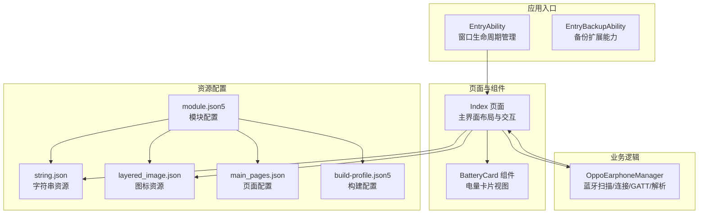
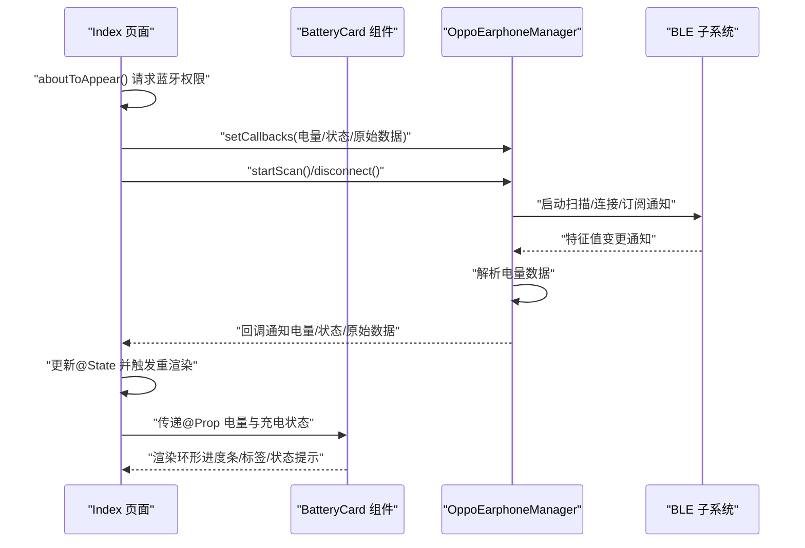
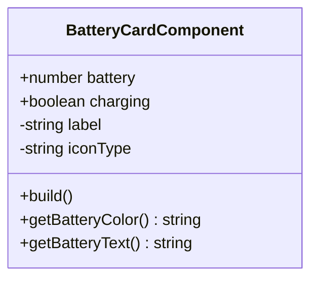
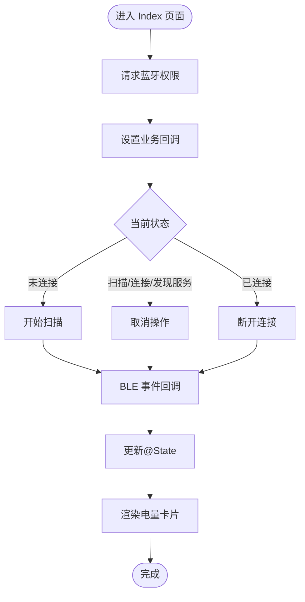
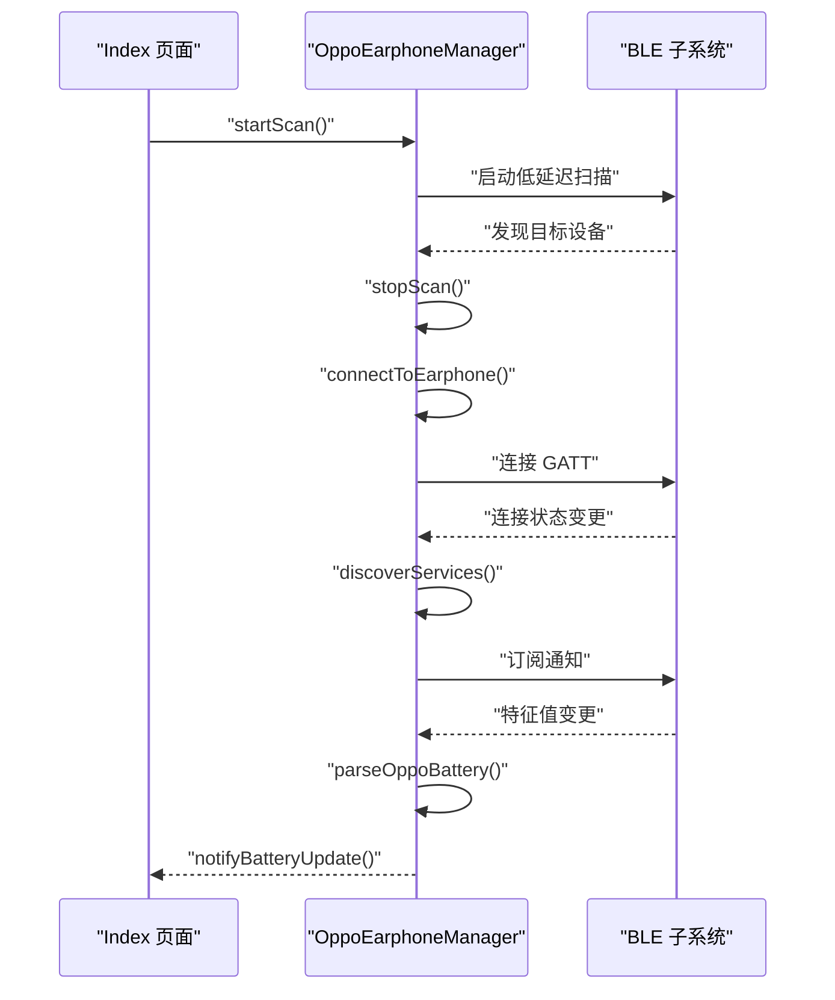
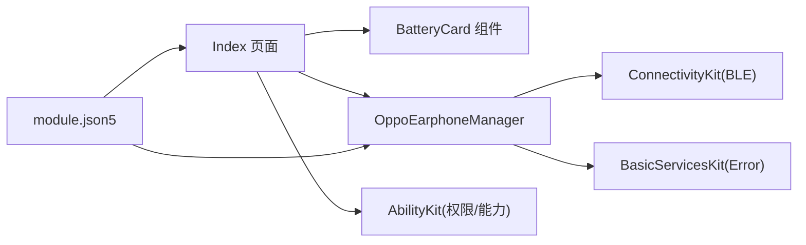

# 用户界面组件设计

<cite>
**本文档引用的文件**
- [Index.ets](file://entry/src/main/ets/pages/Index.ets)
- [OppoEarphoneManager.ets](file://entry/src/main/ets/manager/OppoEarphoneManager.ets)
- [EntryAbility.ets](file://entry/src/main/ets/entryability/EntryAbility.ets)
- [EntryBackupAbility.ets](file://entry/src/main/ets/entrybackupability/EntryBackupAbility.ets)
- [string.json](file://entry/src/main/resources/base/element/string.json)
- [layered_image.json](file://entry/src/main/resources/base/media/layered_image.json)
- [main_pages.json](file://entry/src/main/resources/base/profile/main_pages.json)
- [module.json5](file://entry/src/main/module.json5)
- [build-profile.json5](file://entry/build-profile.json5)
</cite>

## 目录
1. [简介](#简介)
2. [项目结构](#项目结构)
3. [核心组件](#核心组件)
4. [架构总览](#架构总览)
5. [详细组件分析](#详细组件分析)
6. [依赖关系分析](#依赖关系分析)
7. [性能考虑](#性能考虑)
8. [故障排查指南](#故障排查指南)
9. [结论](#结论)
10. [附录](#附录)

## 简介
本项目为 OPPO Enco Air5 Pro 蓝牙耳机电量监控应用，采用 ArkTS/ArkUI 技术栈构建。系统以“主界面 + 业务管理器”的分层架构设计，围绕电量卡片组件实现响应式数据绑定与状态管理，支持蓝牙扫描、连接、GATT 服务发现与通知订阅，实时解析并展示左耳、右耳及充电仓的电量信息。同时提供原始 HEX 数据查看、连接状态指示与权限控制等能力，满足用户对设备电量状态的可视化监控需求。

## 项目结构
项目采用模块化组织，入口模块负责页面加载与窗口生命周期管理，业务逻辑封装于独立的管理器类中，页面组件通过状态与回调与业务层解耦，资源文件集中管理国际化与媒体资源。

**图表来源**
- [EntryAbility.ets:1-48](file://entry/src/main/ets/entryability/EntryAbility.ets#L1-L48)
- [EntryBackupAbility.ets:1-16](file://entry/src/main/ets/entrybackupability/EntryBackupAbility.ets#L1-L16)
- [Index.ets:100-476](file://entry/src/main/ets/pages/Index.ets#L100-L476)
- [OppoEarphoneManager.ets:49-747](file://entry/src/main/ets/manager/OppoEarphoneManager.ets#L49-L747)
- [string.json:1-20](file://entry/src/main/resources/base/element/string.json#L1-L20)
- [layered_image.json:1-7](file://entry/src/main/resources/base/media/layered_image.json#L1-L7)
- [main_pages.json:1-6](file://entry/src/main/resources/base/profile/main_pages.json#L1-L6)
- [module.json5:1-63](file://entry/src/main/module.json5#L1-L63)
- [build-profile.json5:1-33](file://entry/build-profile.json5#L1-L33)

**章节来源**
- [module.json5:1-63](file://entry/src/main/module.json5#L1-L63)
- [main_pages.json:1-6](file://entry/src/main/resources/base/profile/main_pages.json#L1-L6)
- [EntryAbility.ets:1-48](file://entry/src/main/ets/entryability/EntryAbility.ets#L1-L48)

## 核心组件
- 主界面 Index：负责整体布局、状态管理、权限请求、按钮交互与数据展示区域划分。
- 电量卡片 BatteryCardComponent：接收父组件传递的电量与充电状态，渲染环形进度条、设备标签与状态提示。
- OppoEarphoneManager：封装蓝牙扫描、连接、服务发现、通知订阅与数据解析，通过回调向 UI 层推送状态与数据。

**章节来源**
- [Index.ets:100-476](file://entry/src/main/ets/pages/Index.ets#L100-L476)
- [OppoEarphoneManager.ets:49-747](file://entry/src/main/ets/manager/OppoEarphoneManager.ets#L49-L747)

## 架构总览
系统采用“页面组件 + 业务管理器”的分层架构，页面组件通过装饰器与状态进行响应式绑定，业务管理器通过回调与事件驱动 UI 更新。权限与资源通过模块配置统一声明，构建配置控制发布与混淆策略。

**图表来源**
- [Index.ets:119-159](file://entry/src/main/ets/pages/Index.ets#L119-L159)
- [OppoEarphoneManager.ets:117-125](file://entry/src/main/ets/manager/OppoEarphoneManager.ets#L117-L125)
- [OppoEarphoneManager.ets:449-479](file://entry/src/main/ets/manager/OppoEarphoneManager.ets#L449-L479)

## 详细组件分析

### 电量卡片组件 BatteryCardComponent
- 设计模式
  - 单向数据流：通过 @Prop 接收父组件 @State 的值，实现响应式更新；避免使用 @Builder 按值传参，防止失去响应式依赖。
  - 组合式渲染：内部使用 Column/Row/Stack/Progress 等容器与控件组合，形成统一的卡片样式。
- 组件属性
  - battery: number，默认 -1（未知）；用于环形进度条与中间百分比显示。
  - charging: boolean，默认 false；用于判断颜色与状态提示。
  - label/iconType: 内部字段，分别用于显示设备名称与图标类型（左耳/右耳/充电仓）。
- 状态管理
  - 颜色策略：根据电量阈值与充电状态动态选择颜色，低电量高亮、充电中金色提示。
  - 文本策略：未知电量显示占位符，正常范围显示百分比。
- 事件处理机制
  - 由父组件通过 @Prop 将状态传递给子组件，子组件不直接处理事件，保持纯展示职责。
- 视觉与布局
  - 采用 Stack 实现环形进度条叠加百分比文本；外层 Column 容纳图标、进度、标签与状态提示。
  - 统一背景色与边框，居中对齐，适配横向排列的多卡片布局。

**图表来源**
- [Index.ets:10-98](file://entry/src/main/ets/pages/Index.ets#L10-L98)

**章节来源**
- [Index.ets:10-98](file://entry/src/main/ets/pages/Index.ets#L10-L98)

### 主界面 Index
- 布局设计原则
  - 分区清晰：标题、状态、电量卡片、操作按钮、原始数据、底部提示六大区域，层次分明。
  - 响应式适配：使用百分比宽度与 Flex 对齐，保证不同屏幕尺寸下的视觉一致性。
  - 视觉主题：渐变背景与深色卡片风格，突出电量信息与状态指示。
- 状态管理
  - @State 管理连接状态、三路电量与充电状态、MAC 地址、权限状态、扫描提示可见性与原始数据日志。
  - 状态同步：通过业务管理器回调更新 @State，驱动子组件重新渲染。
- 事件处理
  - 按钮交互：根据连接状态切换不同行为（开始扫描/取消/断开），并结合权限状态启用/禁用。
  - 原始数据区域：点击标题行展开/收起日志面板，支持复制。
- 生命周期
  - aboutToAppear：请求蓝牙权限、设置回调、启动扫描流程。
  - aboutToDisappear：断开连接，释放资源。
- 权限与提示
  - 蓝牙权限请求与拒绝处理，权限不足时禁用相关按钮并提示。

**图表来源**
- [Index.ets:119-159](file://entry/src/main/ets/pages/Index.ets#L119-L159)
- [Index.ets:315-326](file://entry/src/main/ets/pages/Index.ets#L315-L326)

**章节来源**
- [Index.ets:100-476](file://entry/src/main/ets/pages/Index.ets#L100-L476)

### 业务管理器 OppoEarphoneManager
- 职责边界
  - 蓝牙扫描：低延迟扫描，匹配目标设备名称，自动连接。
  - 连接与服务发现：建立 GATT 连接，发现目标服务，订阅通知。
  - 数据解析：解析特征值中的电量数据，识别左耳、右耳与充电仓标识，区分充电状态。
  - 回调通知：向 UI 层推送电量、连接状态与原始数据。
- 数据模型
  - BatteryInfo：三路电量与对应充电状态。
  - ConnectionStatus：连接状态枚举。
- 关键流程
  - startScan -> connectToEarphone -> discoverServices -> subscribeBatteryNotifications -> parseOppoBattery -> notifyBatteryUpdate。
- 资源清理
  - 断开连接时移除事件监听、关闭 GATT 客户端、重置电量状态，确保内存与资源安全。

**图表来源**
- [OppoEarphoneManager.ets:135-211](file://entry/src/main/ets/manager/OppoEarphoneManager.ets#L135-L211)
- [OppoEarphoneManager.ets:293-345](file://entry/src/main/ets/manager/OppoEarphoneManager.ets#L293-L345)
- [OppoEarphoneManager.ets:417-481](file://entry/src/main/ets/manager/OppoEarphoneManager.ets#L417-L481)
- [OppoEarphoneManager.ets:505-601](file://entry/src/main/ets/manager/OppoEarphoneManager.ets#L505-L601)

**章节来源**
- [OppoEarphoneManager.ets:49-747](file://entry/src/main/ets/manager/OppoEarphoneManager.ets#L49-L747)

### UI 组件与业务逻辑交互
- 数据绑定
  - 父组件通过 @State 管理数据，子组件通过 @Prop 接收，实现单向响应式绑定，避免 @Builder 按值传参导致的响应失效。
- 状态同步
  - 业务管理器通过 setCallbacks 注册回调，在 BLE 事件发生时更新内部状态并通过回调通知 UI，UI 再更新 @State 触发重绘。
- 回调处理
  - 三类回调：电量更新、连接状态变化、原始数据输出；UI 侧按需消费并展示。
- 权限与生命周期
  - 页面生命周期内请求权限、设置回调、断开连接，确保资源正确释放。

**章节来源**
- [Index.ets:117-159](file://entry/src/main/ets/pages/Index.ets#L117-L159)
- [OppoEarphoneManager.ets:117-125](file://entry/src/main/ets/manager/OppoEarphoneManager.ets#L117-L125)

### 响应式设计与多设备适配
- 响应式布局
  - 使用百分比宽度与 Flex 对齐，配合居中与间距设置，保证在不同屏幕尺寸下保持一致的视觉比例。
- 多设备类型
  - 模块配置声明支持 phone 与 tablet，适配不同设备形态。
- 字体与颜色
  - 通过资源文件集中管理字符串与媒体资源，便于主题与本地化维护。

**章节来源**
- [module.json5:7-10](file://entry/src/main/module.json5#L7-L10)
- [string.json:1-20](file://entry/src/main/resources/base/element/string.json#L1-L20)
- [layered_image.json:1-7](file://entry/src/main/resources/base/media/layered_image.json#L1-L7)

### 组件复用与扩展性
- 复用机制
  - 电量卡片组件通过 @Prop 接收不同设备的电量与充电状态，可直接复用于其他设备或场景。
  - 管理器类封装了通用的蓝牙流程与解析算法，便于扩展到其他型号设备。
- 扩展性设计
  - 回调接口可扩展新增事件类型（如固件版本、设备名称等）。
  - 解析算法可抽象为策略模式，针对不同协议版本提供不同解析器。
  - UI 区域可按功能拆分为更细的 @Builder，提升可维护性。

**章节来源**
- [Index.ets:315-326](file://entry/src/main/ets/pages/Index.ets#L315-L326)
- [OppoEarphoneManager.ets:505-601](file://entry/src/main/ets/manager/OppoEarphoneManager.ets#L505-L601)

### 生命周期管理与性能优化
- 生命周期管理
  - 页面进入时请求权限、设置回调、启动扫描；退出时断开连接，避免资源泄漏。
- 性能优化
  - 电量更新按整十阈值过滤，减少不必要的 UI 刷新。
  - 原始数据日志限制条数，避免内存占用过高。
  - 低延迟扫描参数优化，提高发现效率。

**章节来源**
- [Index.ets:119-159](file://entry/src/main/ets/pages/Index.ets#L119-L159)
- [Index.ets:124-136](file://entry/src/main/ets/pages/Index.ets#L124-L136)
- [Index.ets:147-157](file://entry/src/main/ets/pages/Index.ets#L147-L157)

## 依赖关系分析
- 组件耦合
  - Index 与 BatteryCard 通过 @Prop 单向依赖，耦合度低，职责清晰。
  - Index 与 OppoEarphoneManager 通过回调双向解耦，业务逻辑独立演进。
- 外部依赖
  - ConnectivityKit 提供 BLE 能力；BasicServicesKit 提供错误处理；AbilityKit 提供权限与能力管理。
- 配置依赖
  - 模块配置声明权限与页面映射，构建配置控制发布选项。

**图表来源**
- [Index.ets:100-476](file://entry/src/main/ets/pages/Index.ets#L100-L476)
- [OppoEarphoneManager.ets:49-747](file://entry/src/main/ets/manager/OppoEarphoneManager.ets#L49-L747)
- [module.json5:14-25](file://entry/src/main/module.json5#L14-L25)

**章节来源**
- [module.json5:1-63](file://entry/src/main/module.json5#L1-L63)

## 性能考虑
- 数据更新频率控制：仅在整十电量时刷新 UI，降低重绘次数。
- 日志截断：原始数据最多保留最近 20 条，避免无限增长。
- 蓝牙扫描优化：使用低延迟扫描参数，缩短发现时间。
- 资源释放：断开连接时清理事件监听与客户端，防止内存泄漏。

**章节来源**
- [Index.ets:124-136](file://entry/src/main/ets/pages/Index.ets#L124-L136)
- [Index.ets:147-157](file://entry/src/main/ets/pages/Index.ets#L147-L157)
- [OppoEarphoneManager.ets:189-197](file://entry/src/main/ets/manager/OppoEarphoneManager.ets#L189-L197)
- [OppoEarphoneManager.ets:691-743](file://entry/src/main/ets/manager/OppoEarphoneManager.ets#L691-L743)

## 故障排查指南
- 蓝牙权限问题
  - 现象：扫描按钮不可用或无反应。
  - 处理：检查权限申请结果，确保用户授权；必要时引导用户在系统设置中开启权限。
- 设备未发现
  - 现象：扫描结束无连接。
  - 处理：确认耳机充电仓盖子打开、处于可被发现状态，且在蓝牙范围内。
- 连接不稳定
  - 现象：连接后很快断开。
  - 处理：检查设备 MAC 地址是否为空，确认 GATT 连接状态与服务发现结果。
- 电量显示异常
  - 现象：电量为未知或闪烁。
  - 处理：检查原始数据日志，确认解析算法是否命中目标标识；验证整十更新策略是否生效。

**章节来源**
- [Index.ets:168-182](file://entry/src/main/ets/pages/Index.ets#L168-L182)
- [Index.ets:350-357](file://entry/src/main/ets/pages/Index.ets#L350-L357)
- [OppoEarphoneManager.ets:309-329](file://entry/src/main/ets/manager/OppoEarphoneManager.ets#L309-L329)
- [OppoEarphoneManager.ets:505-601](file://entry/src/main/ets/manager/OppoEarphoneManager.ets#L505-L601)

## 结论
本项目通过清晰的分层架构与组件化设计，实现了 OPPO Enco Air5 Pro 电量监控的完整闭环：从权限请求、蓝牙扫描与连接，到 GATT 服务发现与通知订阅，再到数据解析与 UI 展示。电量卡片组件遵循单向数据流与响应式更新原则，具备良好的复用性与扩展性；业务管理器封装复杂流程并提供稳定回调，保障 UI 的一致性与可靠性。建议后续引入更细粒度的状态管理与解析策略抽象，进一步提升可维护性与跨设备兼容性。

## 附录
- 组件使用示例（路径指引）
  - 电量卡片使用：在主界面中通过 @Builder 调用并传入 @Prop 参数。
    - [Index.ets:315-326](file://entry/src/main/ets/pages/Index.ets#L315-L326)
  - 权限请求与回调设置：在页面生命周期中调用并注册回调。
    - [Index.ets:119-159](file://entry/src/main/ets/pages/Index.ets#L119-L159)
  - 蓝牙扫描与连接：通过管理器方法启动扫描与断开连接。
    - [OppoEarphoneManager.ets:135-211](file://entry/src/main/ets/manager/OppoEarphoneManager.ets#L135-L211)
    - [OppoEarphoneManager.ets:271-279](file://entry/src/main/ets/manager/OppoEarphoneManager.ets#L271-L279)
- 最佳实践
  - 使用 @Prop 接收状态，避免 @Builder 按值传参破坏响应式。
  - 在 aboutToDisappear 中清理资源，确保生命周期安全。
  - 控制数据更新频率与日志长度，平衡用户体验与性能。