# 电量数据解析

<cite>
**本文档引用的文件**
- [OppoEarphoneManager.ets](file://entry/src/main/ets/manager/OppoEarphoneManager.ets)
- [Index.ets](file://entry/src/main/ets/pages/Index.ets)
- [EntryAbility.ets](file://entry/src/main/ets/entryability/EntryAbility.ets)
- [LocalUnit.test.ets](file://entry/src/test/LocalUnit.test.ets)
- [List.test.ets](file://entry/src/test/List.test.ets)
- [build-profile.json5](file://entry/build-profile.json5)
- [build-profile.json5](file://build-profile.json5)
</cite>

## 目录
1. [简介](#简介)
2. [项目结构](#项目结构)
3. [核心组件](#核心组件)
4. [架构概览](#架构概览)
5. [详细组件分析](#详细组件分析)
6. [依赖关系分析](#依赖关系分析)
7. [性能考虑](#性能考虑)
8. [故障排除指南](#故障排除指南)
9. [结论](#结论)

## 简介

OPPO Enco Air5 Pro 电量数据解析模块是一个专门设计用于解析OPPO蓝牙耳机电量数据的专业技术解决方案。该模块基于HarmonyOS平台开发，实现了对OPPO Enco Air5 Pro耳机的电量监控功能，能够实时解析来自耳机的电量数据包，并提供准确的左耳、右耳和充电仓电量信息。

该模块的核心优势在于其精确的三通道电量数据识别机制，包括：
- **左耳标识(0x01)**：通过前置字节0x03或0x04识别左耳电量数据
- **右耳标识(0x02)**：通过前置字节0x64、0xE4或0x04识别右耳电量数据  
- **充电仓标识(0x03)**：通过前置字节0x64、0xE4或0x04识别充电仓电量数据

## 项目结构

该项目采用HarmonyOS标准的应用结构，主要包含以下关键目录和文件：

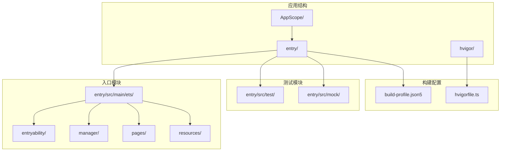

**图表来源**
- [EntryAbility.ets:1-48](file://entry/src/main/ets/entryability/EntryAbility.ets#L1-L48)
- [OppoEarphoneManager.ets:1-747](file://entry/src/main/ets/manager/OppoEarphoneManager.ets#L1-L747)
- [Index.ets:1-476](file://entry/src/main/ets/pages/Index.ets#L1-L476)

**章节来源**
- [EntryAbility.ets:1-48](file://entry/src/main/ets/entryability/EntryAbility.ets#L1-L48)
- [build-profile.json5:1-33](file://entry/build-profile.json5#L1-L33)
- [build-profile.json5:1-56](file://build-profile.json5#L1-L56)

## 核心组件

### 电池信息数据模型

系统定义了统一的电池信息数据模型，用于封装三通道电量数据：

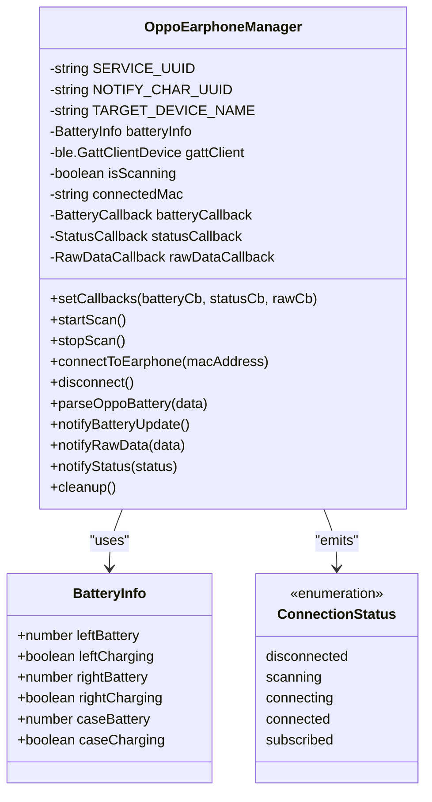

**图表来源**
- [OppoEarphoneManager.ets:13-27](file://entry/src/main/ets/manager/OppoEarphoneManager.ets#L13-L27)
- [OppoEarphoneManager.ets:49-747](file://entry/src/main/ets/manager/OppoEarphoneManager.ets#L49-L747)

### 连接状态管理

系统实现了完整的连接状态管理机制，包括扫描、连接、服务发现和订阅等阶段：

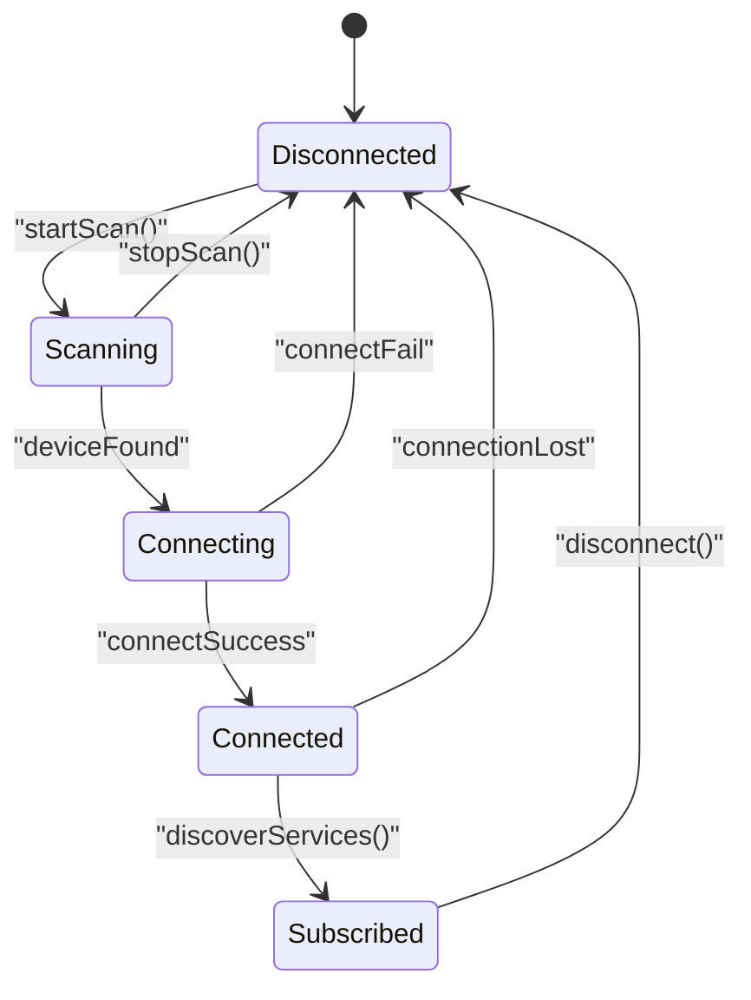

**图表来源**
- [OppoEarphoneManager.ets:37](file://entry/src/main/ets/manager/OppoEarphoneManager.ets#L37)
- [OppoEarphoneManager.ets:135-211](file://entry/src/main/ets/manager/OppoEarphoneManager.ets#L135-L211)
- [OppoEarphoneManager.ets:293-345](file://entry/src/main/ets/manager/OppoEarphoneManager.ets#L293-L345)
- [OppoEarphoneManager.ets:355-413](file://entry/src/main/ets/manager/OppoEarphoneManager.ets#L355-L413)

**章节来源**
- [OppoEarphoneManager.ets:13-27](file://entry/src/main/ets/manager/OppoEarphoneManager.ets#L13-L27)
- [OppoEarphoneManager.ets:37](file://entry/src/main/ets/manager/OppoEarphoneManager.ets#L37)
- [OppoEarphoneManager.ets:49-747](file://entry/src/main/ets/manager/OppoEarphoneManager.ets#L49-L747)

## 架构概览

### 整体架构设计

系统采用分层架构设计，实现了从硬件通信到底层数据解析的完整链路：

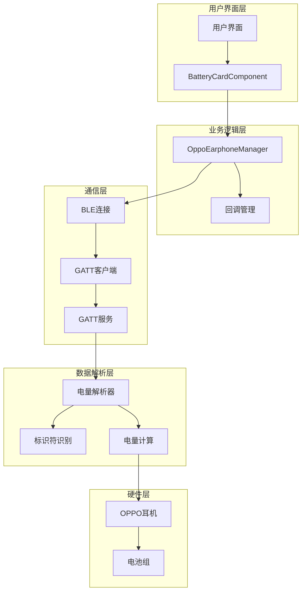

**图表来源**
- [Index.ets:100-476](file://entry/src/main/ets/pages/Index.ets#L100-L476)
- [OppoEarphoneManager.ets:49-747](file://entry/src/main/ets/manager/OppoEarphoneManager.ets#L49-L747)

### 数据流处理流程

系统实现了完整的数据流处理机制，从原始数据接收到底层解析：

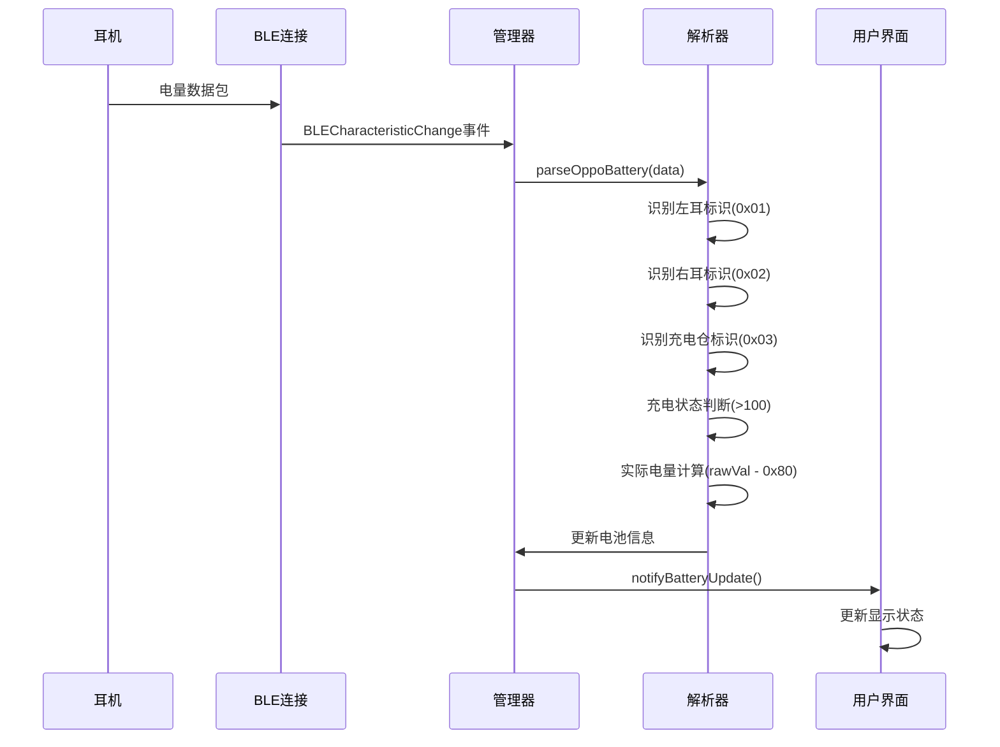

**图表来源**
- [OppoEarphoneManager.ets:449-459](file://entry/src/main/ets/manager/OppoEarphoneManager.ets#L449-L459)
- [OppoEarphoneManager.ets:505-601](file://entry/src/main/ets/manager/OppoEarphoneManager.ets#L505-L601)
- [OppoEarphoneManager.ets:611-633](file://entry/src/main/ets/manager/OppoEarphoneManager.ets#L611-L633)

## 详细组件分析

### 电量解析算法详解

#### 三通道识别机制

系统实现了精确的三通道电量数据识别机制，通过特定的字节模式来区分不同设备的电量数据：

```mermaid
flowchart TD
Start([开始解析]) --> Scan[扫描数据数组]
Scan --> CheckLeft{检查左耳标识<br/>data[i] === 0x01}
CheckLeft --> |是| CheckLeftPrefix{检查前置字节<br/>0x03 或 0x04}
CheckLeft --> |否| CheckRight{检查右耳标识<br/>data[i] === 0x02}
CheckLeftPrefix --> |是| ParseLeft[解析左耳电量]
CheckLeftPrefix --> |否| CheckRight
ParseLeft --> CheckRight
CheckRight --> |是| CheckRightPrefix{检查前置字节<br/>0x64, 0xE4 或 0x04}
CheckRight --> |否| CheckCase{检查充电仓标识<br/>data[i] === 0x03}
CheckRightPrefix --> |是| ParseRight[解析右耳电量]
CheckRightPrefix --> |否| CheckCase
ParseRight --> CheckCase
CheckCase --> |是| CheckCasePrefix{检查前置字节<br/>0x64, 0xE4 或 0x04}
CheckCase --> |否| Next[继续下一个字节]
CheckCasePrefix --> |是| ParseCase[解析充电仓电量]
CheckCasePrefix --> |否| Next
ParseCase --> Validate[验证电量范围0-100]
Validate --> |有效| Update[更新电池状态]
Validate --> |无效| Next
Update --> Next
Next --> End([结束])
```

**图表来源**
- [OppoEarphoneManager.ets:505-601](file://entry/src/main/ets/manager/OppoEarphoneManager.ets#L505-L601)

#### 充电状态判断算法

系统实现了智能的充电状态判断机制，能够准确识别耳机的充电状态：

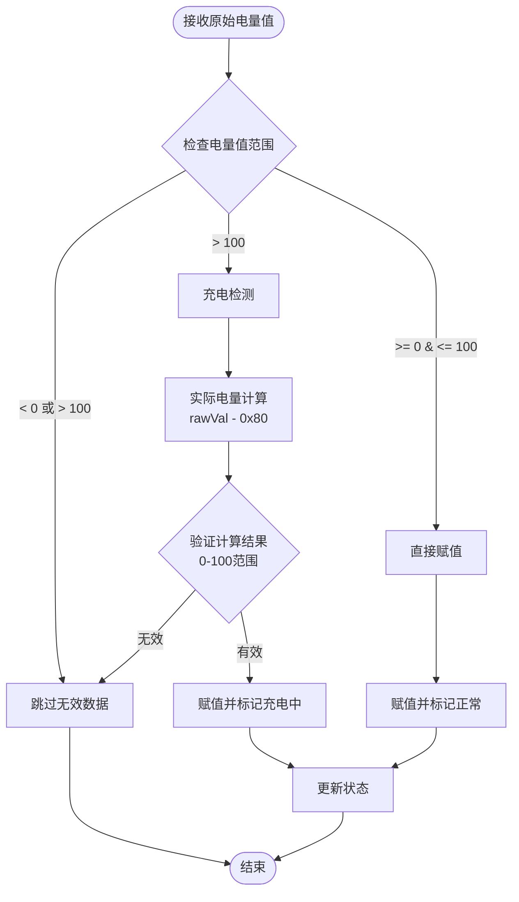

**图表来源**
- [OppoEarphoneManager.ets:517-521](file://entry/src/main/ets/manager/OppoEarphoneManager.ets#L517-L521)
- [OppoEarphoneManager.ets:543-547](file://entry/src/main/ets/manager/OppoEarphoneManager.ets#L543-L547)
- [OppoEarphoneManager.ets:569-573](file://entry/src/main/ets/manager/OppoEarphoneManager.ets#L569-L573)

#### 动态场景处理机制

系统具备完善的动态场景处理能力，能够适应不同的使用场景：

| 场景类型 | 前置字节要求 | 识别条件 | 特殊处理 |
|---------|-------------|----------|----------|
| 左耳电量 | 0x03, 0x04 | data[i] === 0x01 | 基础识别 |
| 右耳电量 | 0x64, 0xE4, 0x04 | data[i] === 0x02 | 多种前置字节支持 |
| 充电仓电量 | 0x64, 0xE4, 0x04 | data[i] === 0x03 | 多种前置字节支持 |

**章节来源**
- [OppoEarphoneManager.ets:493-502](file://entry/src/main/ets/manager/OppoEarphoneManager.ets#L493-L502)
- [OppoEarphoneManager.ets:505-601](file://entry/src/main/ets/manager/OppoEarphoneManager.ets#L505-L601)

### 用户界面组件

#### 电量卡片组件

系统实现了响应式的电量卡片组件，提供直观的电量显示：

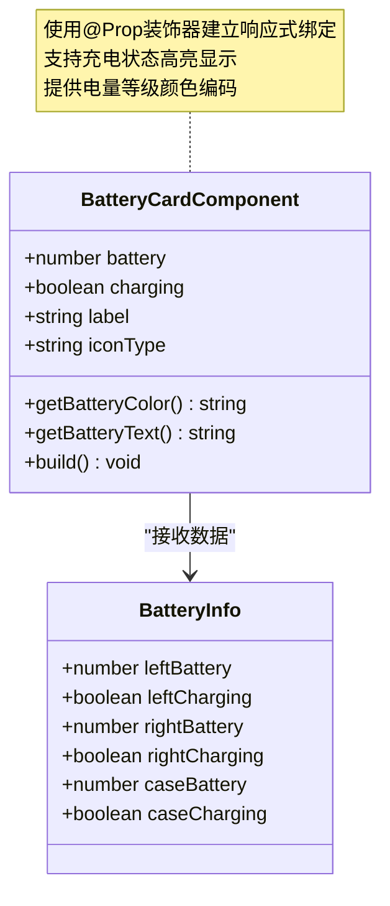

**图表来源**
- [Index.ets:6-98](file://entry/src/main/ets/pages/Index.ets#L6-L98)

#### 状态管理机制

系统实现了完整的状态管理机制，包括连接状态、电量状态和UI状态的协调：

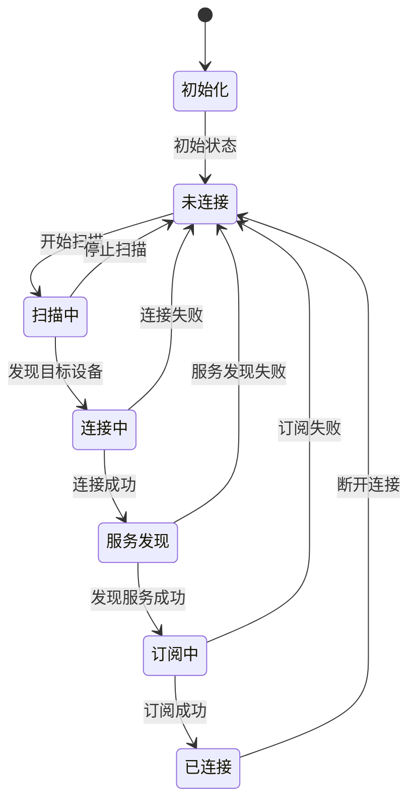

**图表来源**
- [Index.ets:103-159](file://entry/src/main/ets/pages/Index.ets#L103-L159)
- [OppoEarphoneManager.ets:673-681](file://entry/src/main/ets/manager/OppoEarphoneManager.ets#L673-L681)

**章节来源**
- [Index.ets:6-98](file://entry/src/main/ets/pages/Index.ets#L6-L98)
- [Index.ets:100-476](file://entry/src/main/ets/pages/Index.ets#L100-L476)

## 依赖关系分析

### 外部依赖

系统依赖于HarmonyOS提供的核心框架和服务：

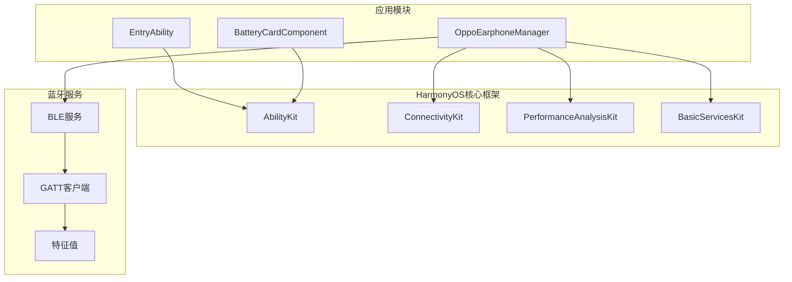

**图表来源**
- [EntryAbility.ets:1-48](file://entry/src/main/ets/entryability/EntryAbility.ets#L1-L48)
- [OppoEarphoneManager.ets:1-3](file://entry/src/main/ets/manager/OppoEarphoneManager.ets#L1-L3)

### 内部模块依赖

系统内部模块之间建立了清晰的依赖关系：

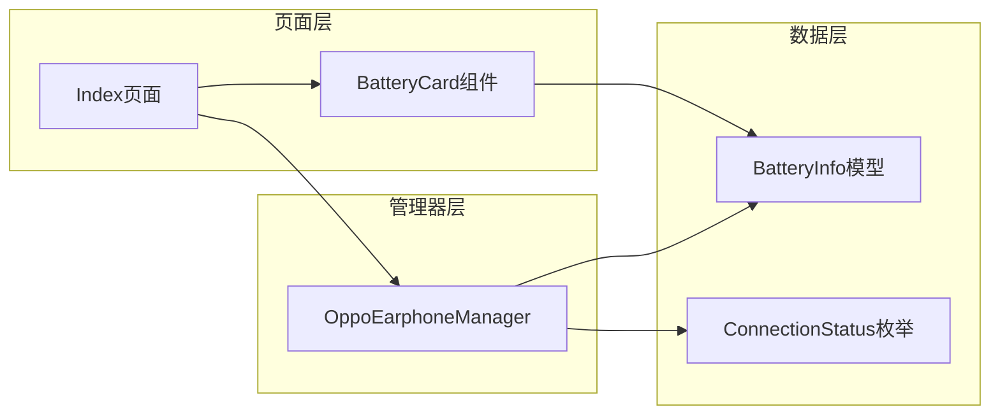

**图表来源**
- [Index.ets:1-476](file://entry/src/main/ets/pages/Index.ets#L1-L476)
- [OppoEarphoneManager.ets:13-37](file://entry/src/main/ets/manager/OppoEarphoneManager.ets#L13-L37)

**章节来源**
- [EntryAbility.ets:1-48](file://entry/src/main/ets/entryability/EntryAbility.ets#L1-L48)
- [OppoEarphoneManager.ets:1-3](file://entry/src/main/ets/manager/OppoEarphoneManager.ets#L1-L3)

## 性能考虑

### 内存管理优化

系统实现了高效的内存管理策略，避免不必要的内存占用：

- **对象池化**：使用一次性对象避免频繁的垃圾回收
- **事件监听器管理**：及时清理不再使用的事件监听器
- **数据缓存控制**：限制原始数据日志的存储数量

### 处理效率优化

系统采用了多种优化策略提升处理效率：

- **增量更新**：只有在电量数据发生变化时才触发UI更新
- **过滤机制**：只处理整十数电量数据，减少UI刷新频率
- **异步处理**：所有网络操作都采用异步方式执行

### 资源管理策略

系统实现了完善的资源管理机制：

- **连接生命周期管理**：自动管理BLE连接的创建和销毁
- **权限检查**：运行时检查蓝牙权限，避免不必要的错误
- **异常处理**：全面的异常捕获和错误恢复机制

## 故障排除指南

### 常见问题及解决方案

#### 蓝牙权限问题

**问题描述**：应用无法访问蓝牙功能
**解决方法**：
1. 确认已授予`ACCESS_BLUETOOTH`权限
2. 检查系统蓝牙设置
3. 重新启动应用

#### 设备连接问题

**问题描述**：无法连接到OPPO耳机
**解决方法**：
1. 确保耳机充电仓盖子已打开
2. 将耳机置于蓝牙范围内
3. 重启蓝牙服务
4. 重新扫描设备

#### 电量数据解析错误

**问题描述**：电量数据显示异常
**解决方法**：
1. 检查原始数据日志
2. 验证耳机固件版本
3. 重新配对设备
4. 更新应用版本

### 错误处理策略

系统实现了多层次的错误处理机制：

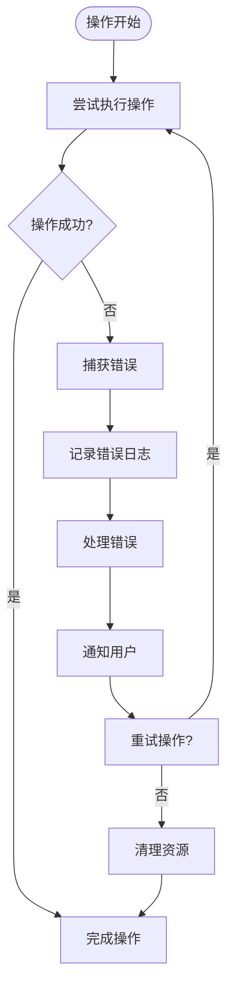

**图表来源**
- [OppoEarphoneManager.ets:199-209](file://entry/src/main/ets/manager/OppoEarphoneManager.ets#L199-L209)
- [OppoEarphoneManager.ets:335-343](file://entry/src/main/ets/manager/OppoEarphoneManager.ets#L335-L343)

**章节来源**
- [OppoEarphoneManager.ets:199-209](file://entry/src/main/ets/manager/OppoEarphoneManager.ets#L199-L209)
- [OppoEarphoneManager.ets:335-343](file://entry/src/main/ets/manager/OppoEarphoneManager.ets#L335-L343)

## 结论

OPPO Enco Air5 Pro电量数据解析模块是一个功能完整、架构清晰的专业技术解决方案。该模块成功实现了以下关键特性：

### 技术成就

1. **精确的数据解析**：实现了对OPPO Enco Air5 Pro特有电量协议的完整支持
2. **多场景适配**：能够处理开盖/关盖等动态场景下的电量变化
3. **用户友好界面**：提供了直观的电量显示和状态反馈
4. **健壮的错误处理**：具备完善的异常处理和恢复机制

### 架构优势

- **模块化设计**：清晰的职责分离和接口定义
- **可扩展性**：为未来功能扩展预留了良好的架构基础
- **性能优化**：采用了多种优化策略确保高效运行
- **可靠性保障**：全面的错误处理和资源管理机制

### 应用价值

该模块不仅满足了OPPO Enco Air5 Pro用户的电量监控需求，更为类似蓝牙耳机的电量监控应用提供了可复用的技术方案。其精确的协议解析能力和优雅的用户界面设计，为用户提供了优质的使用体验。

通过持续的维护和优化，该模块有望成为HarmonyOS平台上蓝牙设备电量监控的标准实现之一。