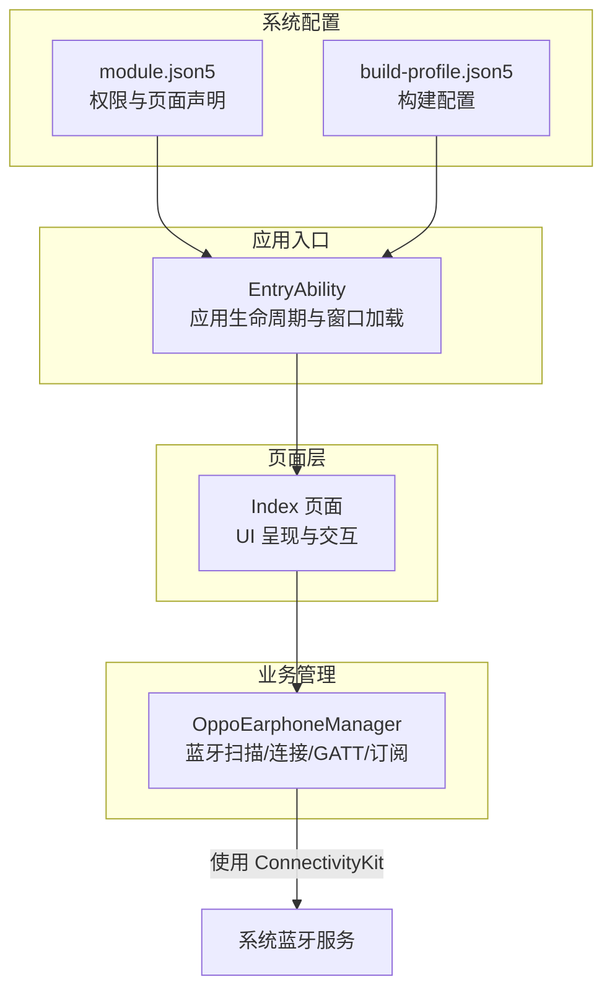
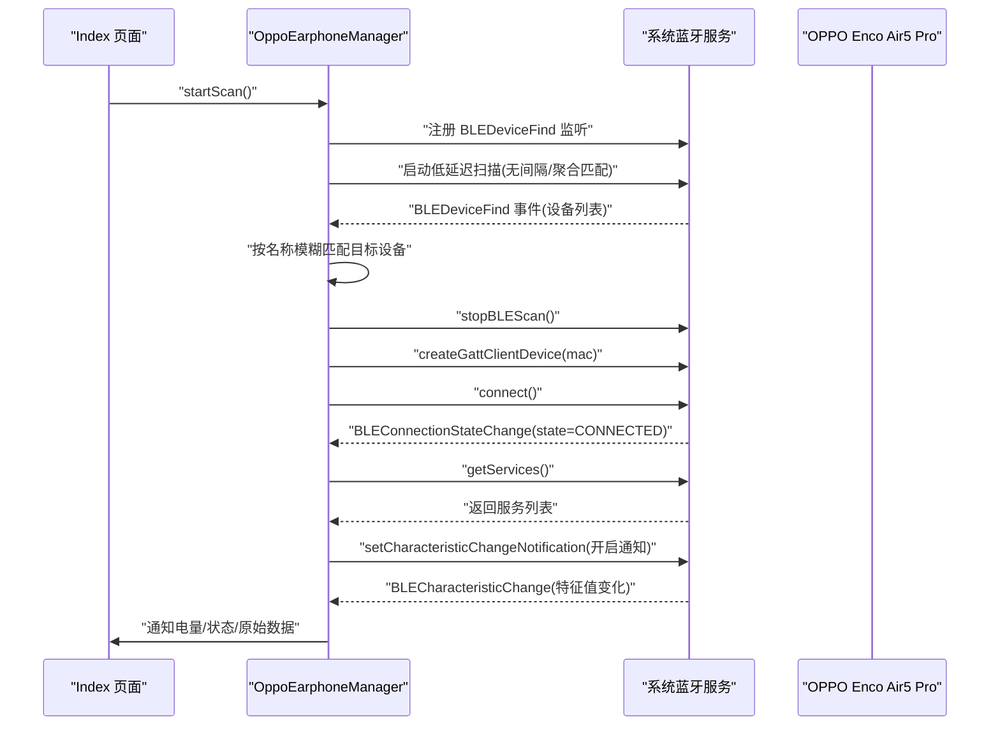
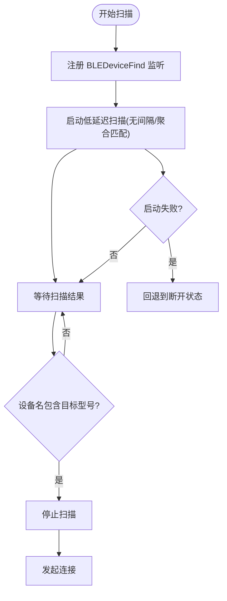
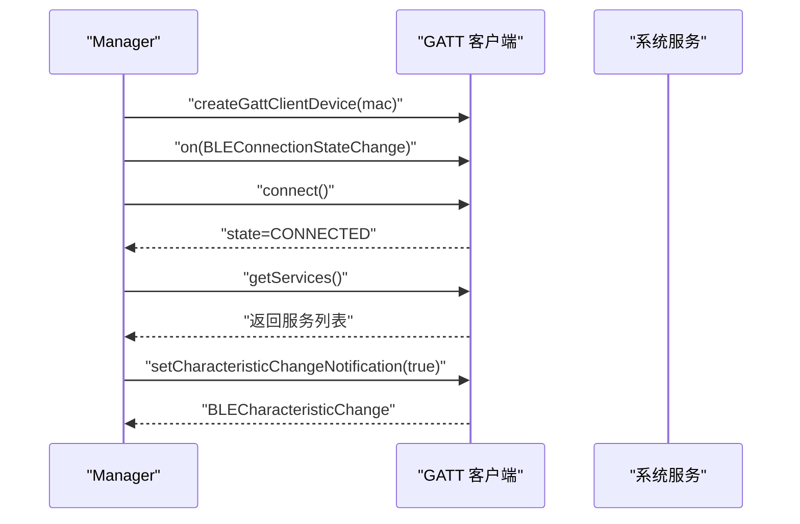
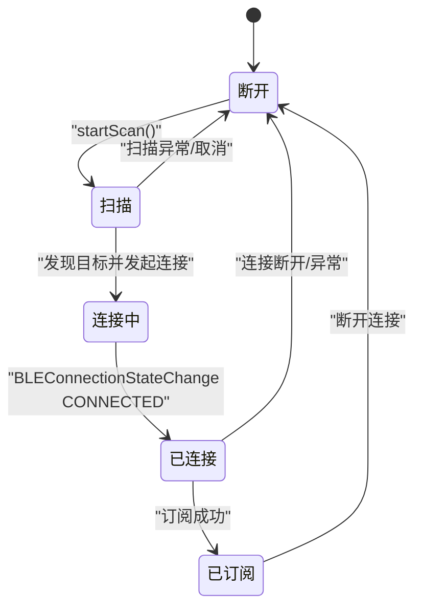
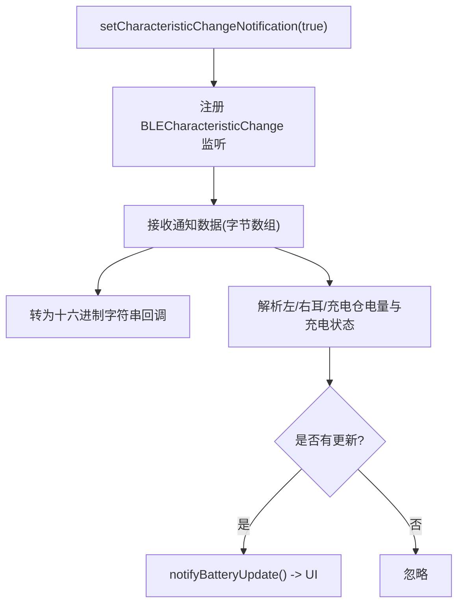
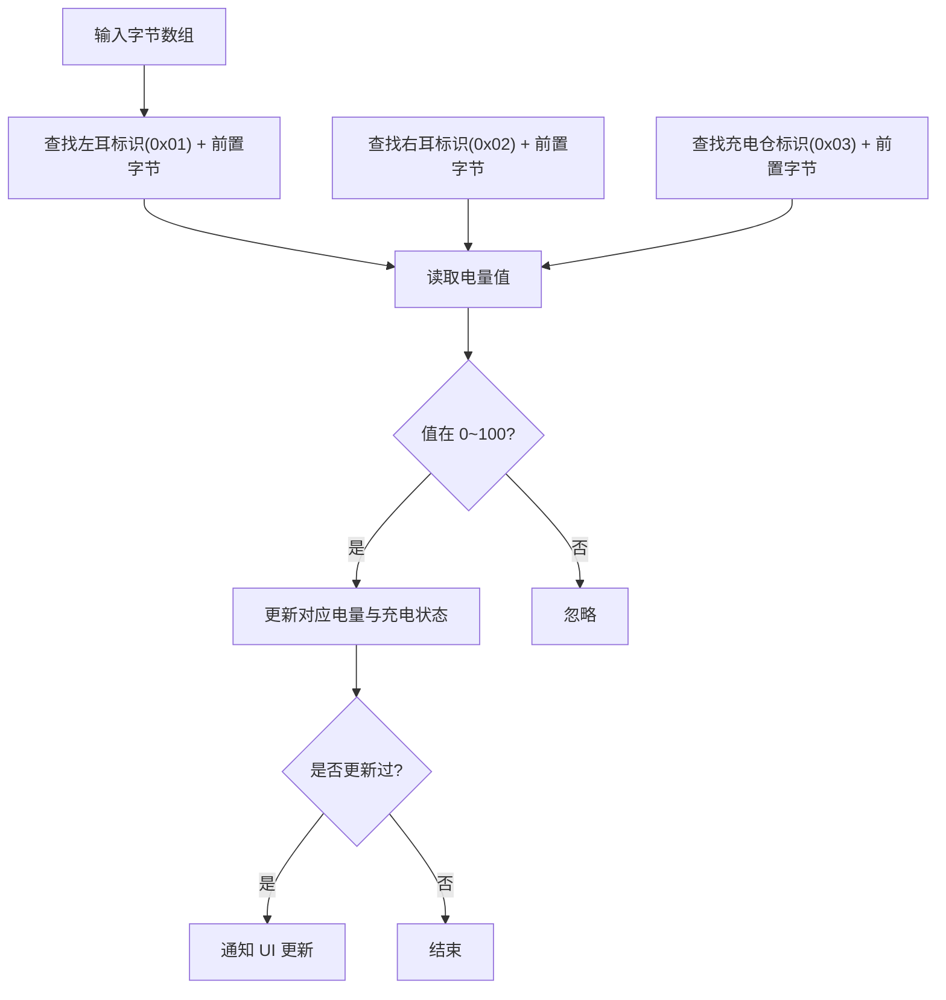

# 蓝牙连接管理

<cite>
**本文引用的文件**
- [EntryAbility.ets](file://entry/src/main/ets/entryability/EntryAbility.ets)
- [OppoEarphoneManager.ets](file://entry/src/main/ets/manager/OppoEarphoneManager.ets)
- [Index.ets](file://entry/src/main/ets/pages/Index.ets)
- [module.json5](file://entry/src/main/module.json5)
- [build-profile.json5](file://build-profile.json5)
</cite>

## 目录
1. [简介](#简介)
2. [项目结构](#项目结构)
3. [核心组件](#核心组件)
4. [架构总览](#架构总览)
5. [详细组件分析](#详细组件分析)
6. [依赖关系分析](#依赖关系分析)
7. [性能考虑](#性能考虑)
8. [故障排查指南](#故障排查指南)
9. [结论](#结论)
10. [附录](#附录)

## 简介
本技术文档围绕 OPPO Enco Air5 Pro 的蓝牙连接管理模块展开，系统性阐述蓝牙扫描实现机制（低延迟扫描配置、设备发现算法、目标设备匹配策略）、GATT 连接建立流程（从设备连接到服务发现的完整过程）、连接状态管理机制（状态枚举、状态转换逻辑与异常处理）、特征值订阅机制与通知监听实现，并提供可直接参考的代码示例路径与常见问题排查指南。文档面向具备基础蓝牙知识的开发者与非技术读者，力求以循序渐进的方式呈现复杂实现。

## 项目结构
项目采用基于模块的组织方式，入口能力负责应用生命周期与窗口加载；页面层负责 UI 呈现与用户交互；管理器层封装蓝牙扫描、连接、服务发现与通知订阅等核心逻辑；模块配置声明权限与页面路由。

图表来源
- [EntryAbility.ets:1-48](file://entry/src/main/ets/entryability/EntryAbility.ets#L1-L48)
- [Index.ets:114-142](file://entry/src/main/ets/pages/Index.ets#L114-L142)
- [OppoEarphoneManager.ets:1-747](file://entry/src/main/ets/manager/OppoEarphoneManager.ets#L1-L747)
- [module.json5:14-25](file://entry/src/main/module.json5#L14-L25)
- [build-profile.json5:42-56](file://build-profile.json5#L42-L56)

章节来源
- [EntryAbility.ets:1-48](file://entry/src/main/ets/entryability/EntryAbility.ets#L1-L48)
- [Index.ets:114-142](file://entry/src/main/ets/pages/Index.ets#L114-L142)
- [OppoEarphoneManager.ets:1-747](file://entry/src/main/ets/manager/OppoEarphoneManager.ets#L1-L747)
- [module.json5:14-25](file://entry/src/main/module.json5#L14-L25)
- [build-profile.json5:42-56](file://build-profile.json5#L42-L56)

## 核心组件
- OppoEarphoneManager：封装蓝牙扫描、GATT 连接、服务发现、特征值通知订阅与电量解析，提供统一的状态回调与数据回调接口。
- Index 页面：负责请求蓝牙权限、渲染连接状态与电量卡片、触发扫描与断开操作，并在组件销毁时清理资源。
- EntryAbility：应用生命周期管理与主窗口加载。
- module.json5：声明 ACCESS_BLUETOOTH 权限与页面路由。
- build-profile.json5：构建产物与签名配置。

章节来源
- [OppoEarphoneManager.ets:49-126](file://entry/src/main/ets/manager/OppoEarphoneManager.ets#L49-L126)
- [Index.ets:114-142](file://entry/src/main/ets/pages/Index.ets#L114-L142)
- [EntryAbility.ets:7-32](file://entry/src/main/ets/entryability/EntryAbility.ets#L7-L32)
- [module.json5:14-25](file://entry/src/main/module.json5#L14-L25)
- [build-profile.json5:42-56](file://build-profile.json5#L42-L56)

## 架构总览
下图展示了从页面触发扫描到完成订阅的端到端流程，以及状态流转与事件回调。

图表来源
- [OppoEarphoneManager.ets:135-211](file://entry/src/main/ets/manager/OppoEarphoneManager.ets#L135-L211)
- [OppoEarphoneManager.ets:293-345](file://entry/src/main/ets/manager/OppoEarphoneManager.ets#L293-L345)
- [OppoEarphoneManager.ets:355-413](file://entry/src/main/ets/manager/OppoEarphoneManager.ets#L355-L413)
- [OppoEarphoneManager.ets:423-481](file://entry/src/main/ets/manager/OppoEarphoneManager.ets#L423-L481)
- [Index.ets:324-333](file://entry/src/main/ets/pages/Index.ets#L324-L333)

## 详细组件分析

### 蓝牙扫描实现机制
- 低延迟扫描配置
  - 使用系统扫描接口，设置扫描间隔为 0，扫描模式为低延迟，匹配模式为激进，以提升发现速度与实时性。
  - 在扫描开始前，注册 BLEDeviceFind 事件监听，用于接收扫描结果。
  - 扫描启动失败时，记录错误并回退到断开状态，避免状态悬挂。
- 设备发现算法
  - 遍历扫描结果，通过设备名称包含“OPPO Enco Air5 Pro”的方式实现模糊匹配，优先发现目标设备。
  - 匹配成功后立即停止扫描并发起连接。
- 目标设备匹配策略
  - 采用字符串包含匹配，兼顾不同固件版本或命名差异下的兼容性。
  - 匹配成功后立即断开扫描并进入连接阶段，减少无效扫描时间。

图表来源
- [OppoEarphoneManager.ets:135-211](file://entry/src/main/ets/manager/OppoEarphoneManager.ets#L135-L211)

章节来源
- [OppoEarphoneManager.ets:135-211](file://entry/src/main/ets/manager/OppoEarphoneManager.ets#L135-L211)

### GATT 连接建立流程
- 连接建立
  - 创建 GATT 客户端设备实例，注册连接状态变更监听，连接成功后切换到“已连接”状态并继续服务发现。
  - 连接失败时回退到断开状态，保证 UI 与状态一致。
- 服务发现
  - 调用获取服务接口，遍历服务列表，确认目标服务存在；即使未找到也尝试订阅，增强健壮性。
- 特征值订阅
  - 组装特征对象（服务 UUID 与特征 UUID），开启通知订阅；订阅成功后切换到“已订阅”状态，开始接收通知。

图表来源
- [OppoEarphoneManager.ets:293-345](file://entry/src/main/ets/manager/OppoEarphoneManager.ets#L293-L345)
- [OppoEarphoneManager.ets:355-413](file://entry/src/main/ets/manager/OppoEarphoneManager.ets#L355-L413)
- [OppoEarphoneManager.ets:423-481](file://entry/src/main/ets/manager/OppoEarphoneManager.ets#L423-L481)

章节来源
- [OppoEarphoneManager.ets:293-345](file://entry/src/main/ets/manager/OppoEarphoneManager.ets#L293-L345)
- [OppoEarphoneManager.ets:355-413](file://entry/src/main/ets/manager/OppoEarphoneManager.ets#L355-L413)
- [OppoEarphoneManager.ets:423-481](file://entry/src/main/ets/manager/OppoEarphoneManager.ets#L423-L481)

### 连接状态管理机制
- 状态枚举
  - disconnected、scanning、connecting、connected、subscribed。
- 状态转换逻辑
  - 扫描阶段：进入 scanning，发现目标后停止扫描并进入 connecting。
  - 连接阶段：收到连接成功事件后进入 connected，随后进入服务发现。
  - 订阅阶段：订阅成功后进入 subscribed。
  - 异常与断开：连接断开或异常时进入 disconnected，并清理资源。
- 异常处理策略
  - 扫描启动失败、连接失败、服务发现失败、订阅失败均记录错误日志并回退到断开状态，防止状态不一致。

图表来源
- [OppoEarphoneManager.ets:37](file://entry/src/main/ets/manager/OppoEarphoneManager.ets#L37)
- [OppoEarphoneManager.ets:135-211](file://entry/src/main/ets/manager/OppoEarphoneManager.ets#L135-L211)
- [OppoEarphoneManager.ets:293-345](file://entry/src/main/ets/manager/OppoEarphoneManager.ets#L293-L345)
- [OppoEarphoneManager.ets:423-481](file://entry/src/main/ets/manager/OppoEarphoneManager.ets#L423-L481)

章节来源
- [OppoEarphoneManager.ets:37](file://entry/src/main/ets/manager/OppoEarphoneManager.ets#L37)
- [OppoEarphoneManager.ets:135-211](file://entry/src/main/ets/manager/OppoEarphoneManager.ets#L135-L211)
- [OppoEarphoneManager.ets:293-345](file://entry/src/main/ets/manager/OppoEarphoneManager.ets#L293-L345)
- [OppoEarphoneManager.ets:423-481](file://entry/src/main/ets/manager/OppoEarphoneManager.ets#L423-L481)

### 特征值订阅机制与通知监听
- 订阅流程
  - 组装特征对象（服务 UUID、特征 UUID、空值与描述符数组）。
  - 注册 BLECharacteristicChange 监听，接收通知数据。
  - 调用设置通知接口开启订阅；成功后切换到 subscribed 状态。
- 通知解析
  - 将原始字节数组转为十六进制字符串并回调给上层。
  - 解析左耳、右耳与充电仓的电量与充电状态，更新内部状态并在有更新时通知 UI。

图表来源
- [OppoEarphoneManager.ets:423-481](file://entry/src/main/ets/manager/OppoEarphoneManager.ets#L423-L481)
- [OppoEarphoneManager.ets:505-601](file://entry/src/main/ets/manager/OppoEarphoneManager.ets#L505-L601)
- [OppoEarphoneManager.ets:611-633](file://entry/src/main/ets/manager/OppoEarphoneManager.ets#L611-L633)

章节来源
- [OppoEarphoneManager.ets:423-481](file://entry/src/main/ets/manager/OppoEarphoneManager.ets#L423-L481)
- [OppoEarphoneManager.ets:505-601](file://entry/src/main/ets/manager/OppoEarphoneManager.ets#L505-L601)
- [OppoEarphoneManager.ets:611-633](file://entry/src/main/ets/manager/OppoEarphoneManager.ets#L611-L633)

### 电量数据解析算法
- 数据格式要点
  - 左耳标识：当前字节为 0x01，前置字节为 0x03 或 0x04。
  - 右耳标识：当前字节为 0x02，前置字节为 0x64 或 0xE4 或 0x04。
  - 充电仓标识：当前字节为 0x03，前置字节为 0x64 或 0xE4 或 0x04。
  - 电量值：当前字节为原始值；若大于 100 表示正在充电，实际电量 = 原始值 - 0x80。
- 解析流程
  - 遍历字节数组，根据标识与前置字节判断类型，提取电量与充电状态，更新内部状态并触发 UI 更新。

图表来源
- [OppoEarphoneManager.ets:505-601](file://entry/src/main/ets/manager/OppoEarphoneManager.ets#L505-L601)

章节来源
- [OppoEarphoneManager.ets:505-601](file://entry/src/main/ets/manager/OppoEarphoneManager.ets#L505-L601)

### 资源清理与生命周期管理
- 清理流程
  - 停止扫描、移除事件监听、断开并关闭 GATT 客户端、清空已连接 MAC、重置电量状态。
  - 页面销毁时主动调用断开接口，确保资源释放。
- 生命周期
  - EntryAbility 负责窗口加载与应用生命周期回调；Index 页面在出现与消失时分别注册与清理回调。

章节来源
- [OppoEarphoneManager.ets:689-743](file://entry/src/main/ets/manager/OppoEarphoneManager.ets#L689-L743)
- [Index.ets:140-142](file://entry/src/main/ets/pages/Index.ets#L140-L142)
- [EntryAbility.ets:21-32](file://entry/src/main/ets/entryability/EntryAbility.ets#L21-L32)

## 依赖关系分析
- 模块依赖
  - Index 页面依赖 OppoEarphoneManager 提供的扫描、连接、订阅与回调能力。
  - OppoEarphoneManager 依赖系统 ConnectivityKit 的 BLE 接口。
  - module.json5 声明 ACCESS_BLUETOOTH 权限，确保运行期可用。
- 耦合与内聚
  - OppoEarphoneManager 内聚了蓝牙相关全部逻辑，对外暴露简洁的回调接口，降低页面层耦合。
  - 页面层仅负责 UI 与权限请求，职责清晰。

图表来源
- [Index.ets:114-142](file://entry/src/main/ets/pages/Index.ets#L114-L142)
- [OppoEarphoneManager.ets:1-747](file://entry/src/main/ets/manager/OppoEarphoneManager.ets#L1-L747)
- [module.json5:14-25](file://entry/src/main/module.json5#L14-L25)

章节来源
- [Index.ets:114-142](file://entry/src/main/ets/pages/Index.ets#L114-L142)
- [OppoEarphoneManager.ets:1-747](file://entry/src/main/ets/manager/OppoEarphoneManager.ets#L1-L747)
- [module.json5:14-25](file://entry/src/main/module.json5#L14-L25)

## 性能考虑
- 扫描优化
  - 使用低延迟扫描模式与激进匹配模式，缩短发现时间；匹配成功后立即停止扫描，避免持续扫描带来的功耗与干扰。
- 连接与订阅
  - 连接成功后尽快执行服务发现与订阅，减少中间态停留时间。
  - 订阅开启后及时处理通知，避免队列堆积。
- UI 响应
  - 仅在电量发生有效更新时通知 UI，降低不必要的重绘与状态变更。

## 故障排查指南
- 无设备发现
  - 确认目标设备处于可被发现状态（充电盒盖子打开、未配对或处于可发现模式）。
  - 检查扫描是否被其他应用占用或权限不足。
  - 查看扫描启动异常日志并确认已回退到断开状态。
- 连接失败
  - 检查设备是否在有效范围内，尝试靠近设备重试。
  - 查看连接异常日志，确认是否触发了断开状态清理。
- 服务未发现
  - 即使未找到目标服务也尝试订阅，可能由于固件差异导致服务 UUID 不同。
  - 确认目标服务 UUID 与特征 UUID 是否正确。
- 订阅失败
  - 检查特征对象参数（服务 UUID、特征 UUID、值与描述符）是否完整。
  - 查看订阅回调中的错误信息并重试。
- 权限问题
  - 确认已在 module.json5 中声明 ACCESS_BLUETOOTH 权限，并在运行时请求成功。
  - 若权限被拒绝，页面按钮将不可用，需引导用户授权。

章节来源
- [OppoEarphoneManager.ets:188-210](file://entry/src/main/ets/manager/OppoEarphoneManager.ets#L188-L210)
- [OppoEarphoneManager.ets:335-344](file://entry/src/main/ets/manager/OppoEarphoneManager.ets#L335-L344)
- [OppoEarphoneManager.ets:401-412](file://entry/src/main/ets/manager/OppoEarphoneManager.ets#L401-L412)
- [OppoEarphoneManager.ets:465-479](file://entry/src/main/ets/manager/OppoEarphoneManager.ets#L465-L479)
- [module.json5:14-25](file://entry/src/main/module.json5#L14-L25)

## 结论
本模块以 OppoEarphoneManager 为核心，实现了从蓝牙扫描、GATT 连接、服务发现到特征值订阅与电量解析的完整链路。通过低延迟扫描与激进匹配策略提升发现效率，通过状态机与异常回退保障稳定性，通过清晰的回调接口降低页面层耦合。结合权限声明与生命周期管理，整体方案具备良好的可维护性与扩展性。

## 附录

### 使用示例（代码片段路径）
- 启动扫描
  - [OppoEarphoneManager.ets:135-211](file://entry/src/main/ets/manager/OppoEarphoneManager.ets#L135-L211)
- 停止扫描
  - [OppoEarphoneManager.ets:221-247](file://entry/src/main/ets/manager/OppoEarphoneManager.ets#L221-L247)
- 连接设备
  - [OppoEarphoneManager.ets:293-345](file://entry/src/main/ets/manager/OppoEarphoneManager.ets#L293-L345)
- 服务发现
  - [OppoEarphoneManager.ets:355-413](file://entry/src/main/ets/manager/OppoEarphoneManager.ets#L355-L413)
- 订阅通知
  - [OppoEarphoneManager.ets:423-481](file://entry/src/main/ets/manager/OppoEarphoneManager.ets#L423-L481)
- 电量解析
  - [OppoEarphoneManager.ets:505-601](file://entry/src/main/ets/manager/OppoEarphoneManager.ets#L505-L601)
- 断开与清理
  - [OppoEarphoneManager.ets:271-279](file://entry/src/main/ets/manager/OppoEarphoneManager.ets#L271-L279)
  - [OppoEarphoneManager.ets:689-743](file://entry/src/main/ets/manager/OppoEarphoneManager.ets#L689-L743)
- 页面回调注册
  - [Index.ets:118-137](file://entry/src/main/ets/pages/Index.ets#L118-L137)
- 权限请求
  - [Index.ets:147-161](file://entry/src/main/ets/pages/Index.ets#L147-L161)