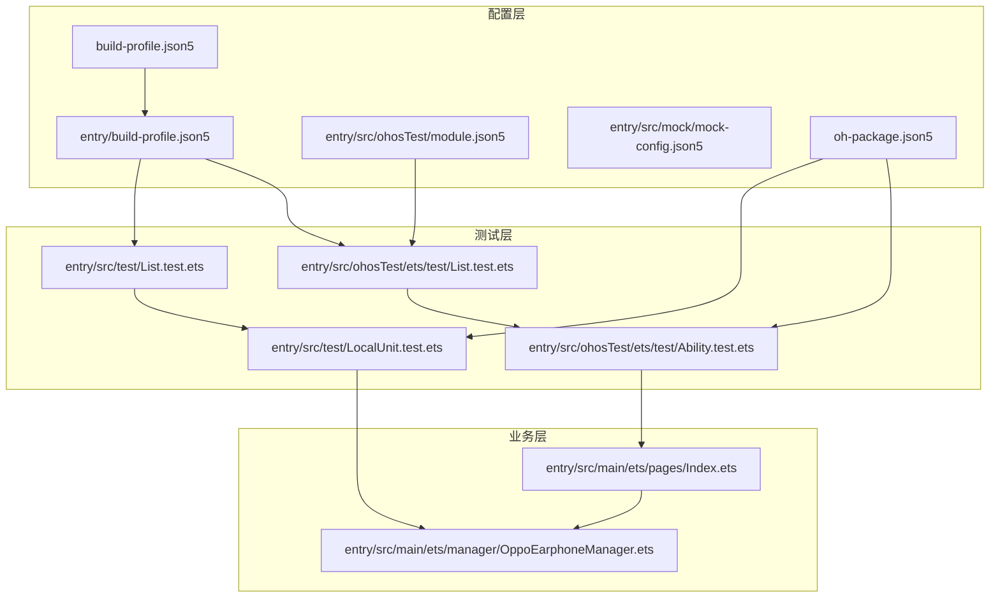
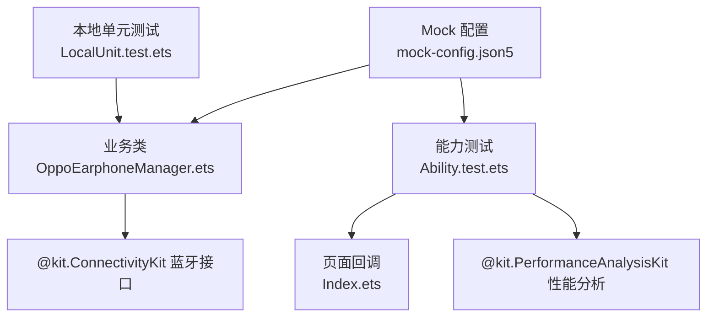
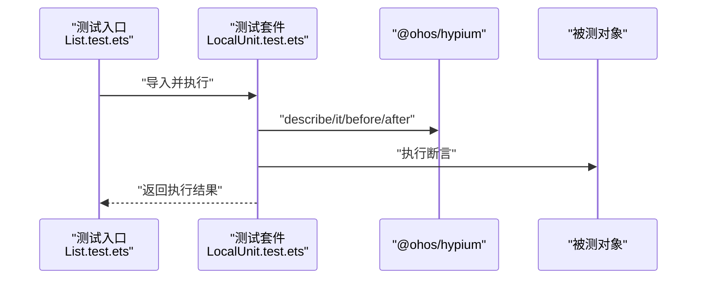
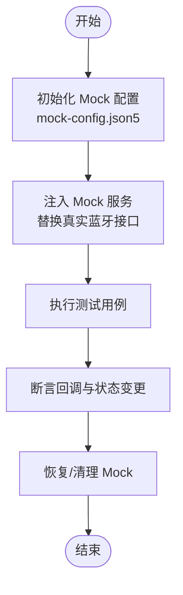
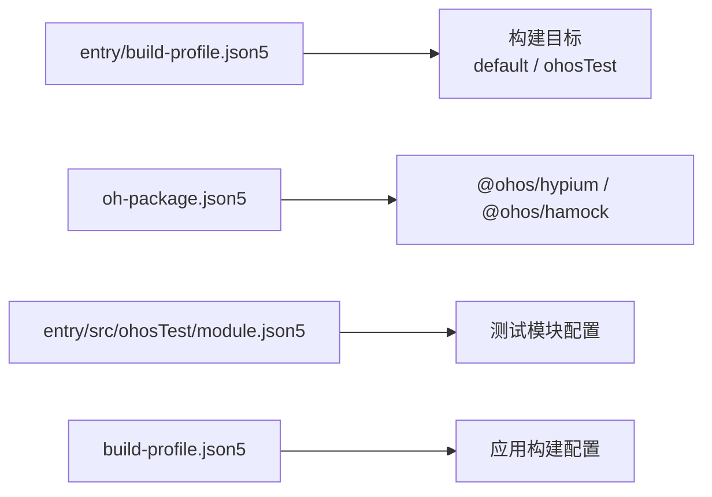
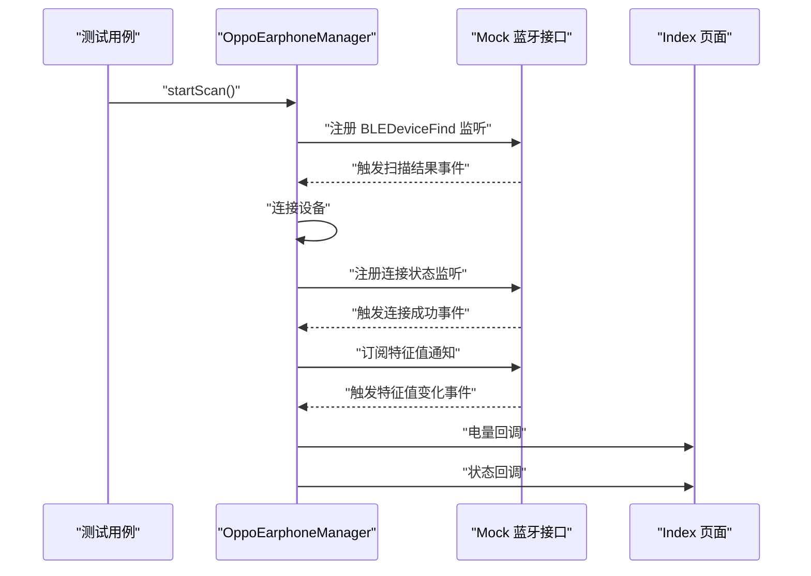
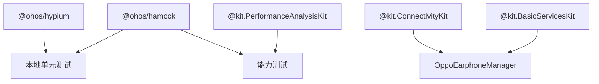

# 测试策略

<cite>
**本文引用的文件**
- [entry\src\test\List.test.ets](file://entry/src/test/List.test.ets)
- [entry\src\test\LocalUnit.test.ets](file://entry/src/test/LocalUnit.test.ets)
- [entry\src\ohosTest\ets\test\List.test.ets](file://entry/src/ohosTest/ets/test/List.test.ets)
- [entry\src\ohosTest\ets\test\Ability.test.ets](file://entry/src/ohosTest/ets/test/Ability.test.ets)
- [entry\src\main\ets\manager\OppoEarphoneManager.ets](file://entry/src/main/ets/manager/OppoEarphoneManager.ets)
- [entry\src\main\ets\pages\Index.ets](file://entry/src/main/ets/pages/Index.ets)
- [entry\build-profile.json5](file://entry/build-profile.json5)
- [build-profile.json5](file://build-profile.json5)
- [entry\src\ohosTest\module.json5](file://entry/src/ohosTest/module.json5)
- [oh-package.json5](file://oh-package.json5)
- [entry\src\mock\mock-config.json5](file://entry/src/mock/mock-config.json5)
</cite>

## 目录
1. [引言](#引言)
2. [项目结构](#项目结构)
3. [核心组件](#核心组件)
4. [架构总览](#架构总览)
5. [详细组件分析](#详细组件分析)
6. [依赖分析](#依赖分析)
7. [性能考虑](#性能考虑)
8. [故障排查指南](#故障排查指南)
9. [结论](#结论)
10. [附录](#附录)

## 引言
本测试策略文档面向 OPPO Enco Air5 Pro 应用，围绕单元测试与能力测试框架的使用进行系统化说明，重点覆盖以下方面：
- 单元测试框架与用例组织：基于 @ohos/hypium 的本地单元测试与能力测试套件。
- Mock 对象策略：蓝牙服务模拟与设备状态模拟的设计思路与落地方式。
- 测试环境配置：测试设备准备、测试数据生成与运行参数设置。
- 测试用例编写指南：正向、负向与边界条件测试实践。
- 异步代码测试：蓝牙回调与 Promise 的测试策略。
- 性能与压力测试：可实施的方案与指标建议。
- 测试覆盖率统计与质量评估：方法与标准。
- 持续集成自动化测试：在本项目的构建配置基础上的落地建议。

## 项目结构
测试相关目录与文件分布如下：
- 本地单元测试入口与套件：entry/src/test
- 能力测试入口与套件：entry/src/ohosTest/ets/test
- 主要业务类：entry/src/main/ets/manager/OppoEarphoneManager.ets
- 页面与回调：entry/src/main/ets/pages/Index.ets
- 构建与模块配置：entry/build-profile.json5、entry/src/ohosTest/module.json5、build-profile.json5
- Mock 配置：entry/src/mock/mock-config.json5
- 依赖声明：oh-package.json5（包含 @ohos/hypium、@ohos/hamock）

**图表来源**
- [entry\src\test\List.test.ets:1-5](file://entry/src/test/List.test.ets#L1-L5)
- [entry\src\test\LocalUnit.test.ets:1-33](file://entry/src/test/LocalUnit.test.ets#L1-L33)
- [entry\src\ohosTest\ets\test\List.test.ets:1-5](file://entry/src/ohosTest/ets/test/List.test.ets#L1-L5)
- [entry\src\ohosTest\ets\test\Ability.test.ets:1-35](file://entry/src/ohosTest/ets/test/Ability.test.ets#L1-L35)
- [entry\src\main\ets\manager\OppoEarphoneManager.ets:1-709](file://entry/src/main/ets/manager/OppoEarphoneManager.ets#L1-L709)
- [entry\src\main\ets\pages\Index.ets:100-181](file://entry/src/main/ets/pages/Index.ets#L100-L181)
- [entry\build-profile.json5:1-33](file://entry/build-profile.json5#L1-L33)
- [entry\src\ohosTest\module.json5:1-13](file://entry/src/ohosTest/module.json5#L1-L13)
- [build-profile.json5:1-56](file://build-profile.json5#L1-L56)
- [oh-package.json5:1-11](file://oh-package.json5#L1-L11)
- [entry\src\mock\mock-config.json5:1-2](file://entry/src/mock/mock-config.json5#L1-L2)

**章节来源**
- [entry\src\test\List.test.ets:1-5](file://entry/src/test/List.test.ets#L1-L5)
- [entry\src\test\LocalUnit.test.ets:1-33](file://entry/src/test/LocalUnit.test.ets#L1-L33)
- [entry\src\ohosTest\ets\test\List.test.ets:1-5](file://entry/src/ohosTest/ets/test/List.test.ets#L1-L5)
- [entry\src\ohosTest\ets\test\Ability.test.ets:1-35](file://entry/src/ohosTest/ets/test/Ability.test.ets#L1-L35)
- [entry\build-profile.json5:1-33](file://entry/build-profile.json5#L1-L33)
- [entry\src\ohosTest\module.json5:1-13](file://entry/src/ohosTest/module.json5#L1-L13)
- [build-profile.json5:1-56](file://build-profile.json5#L1-L56)
- [oh-package.json5:1-11](file://oh-package.json5#L1-L11)
- [entry\src\mock\mock-config.json5:1-2](file://entry/src/mock/mock-config.json5#L1-L2)

## 核心组件
- 单元测试框架与生命周期钩子
  - 使用 @ohos/hypium 提供的 describe、beforeAll、beforeEach、afterEach、afterAll、it、expect 等 API 组织测试套件与用例。
  - 生命周期钩子用于全局/每用例级的初始化与清理，确保测试隔离性与稳定性。
- 本地单元测试样例
  - LocalUnit.test.ets 展示了基本断言与字符串包含判断，适合验证简单逻辑与工具函数。
- 能力测试样例
  - Ability.test.ets 展示了能力测试中的断言与日志输出，适合验证页面行为与回调触发。
- OppoEarphoneManager 业务类
  - 负责蓝牙扫描、GATT 连接、服务发现、特征通知订阅与电量解析，是测试重点覆盖对象。
- Index 页面
  - 作为 UI 侧的回调消费者，负责接收电量与状态回调并更新界面状态。

**章节来源**
- [entry\src\test\LocalUnit.test.ets:1-33](file://entry/src/test/LocalUnit.test.ets#L1-L33)
- [entry\src\ohosTest\ets\test\Ability.test.ets:1-35](file://entry/src/ohosTest/ets/test/Ability.test.ets#L1-L35)
- [entry\src\main\ets\manager\OppoEarphoneManager.ets:1-709](file://entry/src/main/ets/manager/OppoEarphoneManager.ets#L1-L709)
- [entry\src\main\ets\pages\Index.ets:100-181](file://entry/src/main/ets/pages/Index.ets#L100-L181)

## 架构总览
测试架构分为三层：
- 本地单元测试层：针对纯函数与小范围逻辑，快速验证。
- 能力测试层：在设备上运行，验证页面与回调链路。
- Mock 层：通过 @ohos/hamock 与自定义 mock 配置，模拟蓝牙服务与设备状态。

**图表来源**
- [entry\src\test\LocalUnit.test.ets:1-33](file://entry/src/test/LocalUnit.test.ets#L1-L33)
- [entry\src\ohosTest\ets\test\Ability.test.ets:1-35](file://entry/src/ohosTest/ets/test/Ability.test.ets#L1-L35)
- [entry\src\main\ets\manager\OppoEarphoneManager.ets:1-709](file://entry/src/main/ets/manager/OppoEarphoneManager.ets#L1-L709)
- [entry\src\main\ets\pages\Index.ets:100-181](file://entry/src/main/ets/pages/Index.ets#L100-L181)
- [entry\src\mock\mock-config.json5:1-2](file://entry/src/mock/mock-config.json5#L1-L2)
- [oh-package.json5:6-9](file://oh-package.json5#L6-L9)

## 详细组件分析

### 单元测试框架与用例组织
- 测试入口与套件
  - 本地测试入口：List.test.ets 导入 LocalUnit.test 并执行。
  - 能力测试入口：List.test.ets 导入 Ability.test 并执行。
- 生命周期与断言
  - 使用 describe 定义测试套件；beforeAll/beforeEach/afterEach/afterAll 控制环境；it 定义单个用例；expect 提供断言。
- 用例示例
  - 字符串包含与相等断言，便于验证字符串处理与拼接逻辑。

**图表来源**
- [entry\src\test\List.test.ets:1-5](file://entry/src/test/List.test.ets#L1-L5)
- [entry\src\test\LocalUnit.test.ets:1-33](file://entry/src/test/LocalUnit.test.ets#L1-L33)

**章节来源**
- [entry\src\test\List.test.ets:1-5](file://entry/src/test/List.test.ets#L1-L5)
- [entry\src\test\LocalUnit.test.ets:1-33](file://entry/src/test/LocalUnit.test.ets#L1-L33)

### Mock 对象策略
- Mock 框架与配置
  - 依赖 @ohos/hamock，用于在测试中替换真实蓝牙服务与设备状态。
  - mock-config.json5 为空配置，建议在此处扩展 Mock 规则或映射表。
- 蓝牙服务模拟
  - 模拟 ble.on/off、ble.startBLEScan/stopBLEScan、GattClientDevice 的事件与回调。
  - 模拟 getServices/setCharacteristicChangeNotification 等异步操作。
- 设备状态模拟
  - 模拟扫描结果数组、连接状态变更、特征值变化等事件序列。
- 实施建议
  - 在 beforeEach 中注入 Mock，并在 afterEach 中恢复或清理。
  - 将 Mock 注入点抽象为工厂或依赖注入容器，便于替换。

**图表来源**
- [entry\src\mock\mock-config.json5:1-2](file://entry/src/mock/mock-config.json5#L1-L2)
- [oh-package.json5:6-9](file://oh-package.json5#L6-L9)

**章节来源**
- [entry\src\mock\mock-config.json5:1-2](file://entry/src/mock/mock-config.json5#L1-L2)
- [oh-package.json5:6-9](file://oh-package.json5#L6-L9)

### 测试环境配置
- 构建目标与测试模块
  - entry/build-profile.json5 定义了 default 与 ohosTest 目标，支持本地与能力测试。
  - entry/src/ohosTest/module.json5 声明测试模块类型与设备类型。
- 应用级构建配置
  - build-profile.json5 提供签名、产品配置与构建模式，确保测试可正常签名与安装。
- 依赖与工具
  - oh-package.json5 声明 @ohos/hypium 与 @ohos/hamock，保证测试框架与 Mock 能力可用。

**图表来源**
- [entry\build-profile.json5:25-32](file://entry/build-profile.json5#L25-L32)
- [entry\src\ohosTest\module.json5:1-13](file://entry/src/ohosTest/module.json5#L1-L13)
- [build-profile.json5:1-56](file://build-profile.json5#L1-L56)
- [oh-package.json5:6-9](file://oh-package.json5#L6-L9)

**章节来源**
- [entry\build-profile.json5:1-33](file://entry/build-profile.json5#L1-L33)
- [entry\src\ohosTest\module.json5:1-13](file://entry/src/ohosTest/module.json5#L1-L13)
- [build-profile.json5:1-56](file://build-profile.json5#L1-L56)
- [oh-package.json5:1-11](file://oh-package.json5#L1-L11)

### 测试用例编写指南
- 正向测试
  - 验证正常流程：扫描成功、连接成功、服务发现成功、订阅成功、电量解析正确。
  - 断言：状态回调顺序、MAC 地址更新、电量与充电状态字段。
- 负向测试
  - 扫描异常：启动扫描抛错、停止扫描异常。
  - 连接异常：连接失败、连接状态回调断开。
  - 订阅异常：setCharacteristicChangeNotification 返回错误。
  - 解析异常：非法数据、越界索引、未知标识。
- 边界条件测试
  - 电量值边界：0、100、>100（充电）。
  - 数据片段：仅左耳、仅右耳、仅充电仓。
  - 事件序列：多次通知、重复通知、无有效标识。
- 异步与回调
  - 使用 Mock 注入事件序列，逐步推进状态机，断言回调触发时机与参数。

**章节来源**
- [entry\src\main\ets\manager\OppoEarphoneManager.ets:131-207](file://entry/src/main/ets/manager/OppoEarphoneManager.ets#L131-L207)
- [entry\src\main\ets\manager\OppoEarphoneManager.ets:289-341](file://entry/src/main/ets/manager/OppoEarphoneManager.ets#L289-L341)
- [entry\src\main\ets\manager\OppoEarphoneManager.ets:419-473](file://entry/src/main/ets/manager/OppoEarphoneManager.ets#L419-L473)
- [entry\src\main\ets\manager\OppoEarphoneManager.ets:497-593](file://entry/src/main/ets/manager/OppoEarphoneManager.ets#L497-L593)

### 异步代码测试方法
- 蓝牙回调测试
  - 通过 Mock 将 ble.on('BLEDeviceFind')、'BLEConnectionStateChange'、'BLECharacteristicChange' 注入可控事件。
  - 在用例中逐步推进状态机，断言状态回调与电量回调的触发顺序与参数。
- Promise/回调封装
  - 将异步操作封装为可注入的 Promise，便于在测试中控制 resolve/reject。
- 超时与重试
  - 为扫描与连接设置超时断言，避免用例悬挂。

**图表来源**
- [entry\src\main\ets\manager\OppoEarphoneManager.ets:151-177](file://entry/src/main/ets/manager/OppoEarphoneManager.ets#L151-L177)
- [entry\src\main\ets\manager\OppoEarphoneManager.ets:305-325](file://entry/src/main/ets/manager/OppoEarphoneManager.ets#L305-L325)
- [entry\src\main\ets\manager\OppoEarphoneManager.ets:445-451](file://entry/src/main/ets/manager/OppoEarphoneManager.ets#L445-L451)
- [entry\src\main\ets\pages\Index.ets:118-137](file://entry/src/main/ets/pages/Index.ets#L118-L137)

**章节来源**
- [entry\src\main\ets\manager\OppoEarphoneManager.ets:131-207](file://entry/src/main/ets/manager/OppoEarphoneManager.ets#L131-L207)
- [entry\src\main\ets\manager\OppoEarphoneManager.ets:289-341](file://entry/src/main/ets/manager/OppoEarphoneManager.ets#L289-L341)
- [entry\src\main\ets\manager\OppoEarphoneManager.ets:419-473](file://entry/src/main/ets/manager/OppoEarphoneManager.ets#L419-L473)
- [entry\src\main\ets\manager\OppoEarphoneManager.ets:497-593](file://entry/src/main/ets/manager/OppoEarphoneManager.ets#L497-L593)
- [entry\src\main\ets\pages\Index.ets:118-137](file://entry/src/main/ets/pages/Index.ets#L118-L137)

### 性能测试与压力测试
- 性能测试
  - 使用 @kit.PerformanceAnalysisKit 输出性能日志，记录扫描、连接、解析耗时。
  - 在 Ability.test.ets 中结合 hilog.info 输出关键节点时间戳。
- 压力测试
  - 多轮扫描与连接循环，统计平均耗时与失败率。
  - 模拟高频特征值通知，评估 UI 回调与渲染压力。
- 指标建议
  - 扫描完成时间、连接建立时间、首次电量回调延迟、UI 更新帧率。

**章节来源**
- [entry\src\ohosTest\ets\test\Ability.test.ets:1-35](file://entry/src/ohosTest/ets/test/Ability.test.ets#L1-L35)

### 测试覆盖率统计与质量评估
- 覆盖率统计
  - 在构建配置中启用覆盖率收集（如支持），统计行覆盖率、分支覆盖率与函数覆盖率。
- 质量评估标准
  - 关键路径覆盖率 ≥ 80%，核心解析函数覆盖率 ≥ 90%。
  - 回调与异常分支均需覆盖，边界条件用例不少于 3 个。

[本节为通用指导，不直接分析具体文件，故无“章节来源”]

### 持续集成自动化测试配置
- 构建目标
  - 使用 entry/build-profile.json5 中的 ohosTest 目标，确保测试模块可独立构建。
- 自动化步骤建议
  - 安装依赖：npm install（依据 oh-package.json5）。
  - 构建测试模块：hvigor build --target=ohosTest。
  - 运行测试：hvigor test --target=ohosTest。
- 日志与报告
  - 将测试日志与覆盖率导出至 CI 系统，结合性能日志进行趋势分析。

**章节来源**
- [entry\build-profile.json5:25-32](file://entry/build-profile.json5#L25-L32)
- [oh-package.json5:1-11](file://oh-package.json5#L1-L11)

## 依赖分析
- 测试框架依赖
  - @ohos/hypium：提供测试套件与断言能力。
  - @ohos/hamock：提供 Mock 能力，用于替换真实蓝牙服务。
- 业务依赖
  - @kit.ConnectivityKit：蓝牙扫描与 GATT 操作。
  - @kit.BasicServicesKit：错误类型 BusinessError。
- 页面与性能
  - @kit.PerformanceAnalysisKit：能力测试中的性能日志输出。

**图表来源**
- [oh-package.json5:6-9](file://oh-package.json5#L6-L9)
- [entry\src\main\ets\manager\OppoEarphoneManager.ets:1-3](file://entry/src/main/ets/manager/OppoEarphoneManager.ets#L1-L3)
- [entry\src\ohosTest\ets\test\Ability.test.ets:1-2](file://entry/src/ohosTest/ets/test/Ability.test.ets#L1-L2)

**章节来源**
- [oh-package.json5:6-9](file://oh-package.json5#L6-L9)
- [entry\src\main\ets\manager\OppoEarphoneManager.ets:1-3](file://entry/src/main/ets/manager/OppoEarphoneManager.ets#L1-L3)
- [entry\src\ohosTest\ets\test\Ability.test.ets:1-2](file://entry/src/ohosTest/ets/test/Ability.test.ets#L1-L2)

## 性能考虑
- 扫描与连接优化
  - 低延迟扫描模式与匹配策略应结合设备能力与场景选择。
- 回调频率控制
  - 特征值通知可能高频触发，需在 UI 层做去抖或批量更新。
- 内存与资源
  - 连接与监听需在断开时及时 off 与 cleanup，避免内存泄漏。

[本节为通用指导，不直接分析具体文件，故无“章节来源”]

## 故障排查指南
- 扫描失败
  - 检查扫描异常分支与状态回调是否触发断开状态。
- 连接失败
  - 检查连接状态回调与异常捕获，确认断开清理流程。
- 订阅失败
  - 检查 setCharacteristicChangeNotification 的错误回调与日志。
- 电量解析异常
  - 检查解析算法边界与数据越界，补充非法输入用例。

**章节来源**
- [entry\src\main\ets\manager\OppoEarphoneManager.ets:195-205](file://entry/src/main/ets/manager/OppoEarphoneManager.ets#L195-L205)
- [entry\src\main\ets\manager\OppoEarphoneManager.ets:331-339](file://entry/src/main/ets/manager/OppoEarphoneManager.ets#L331-L339)
- [entry\src\main\ets\manager\OppoEarphoneManager.ets:457-471](file://entry/src/main/ets/manager/OppoEarphoneManager.ets#L457-L471)
- [entry\src\main\ets\manager\OppoEarphoneManager.ets:503-581](file://entry/src/main/ets/manager/OppoEarphoneManager.ets#L503-L581)

## 结论
本测试策略以 @ohos/hypium 为基础，结合 @ohos/hamock 实现蓝牙服务与设备状态的模拟，覆盖本地单元测试与能力测试两条主线。通过清晰的生命周期钩子、Mock 注入与异步回调测试方法，能够系统地验证扫描、连接、订阅与电量解析等关键路径。配合性能与压力测试、覆盖率统计与 CI 自动化，可形成稳定的质量保障体系。

[本节为总结性内容，不直接分析具体文件，故无“章节来源”]

## 附录
- 测试入口与套件对照
  - 本地测试入口 → 本地测试套件
  - 能力测试入口 → 能力测试套件
- 关键文件清单
  - 测试入口与套件：List.test.ets、LocalUnit.test.ets、List.test.ets、Ability.test.ets
  - 业务类：OppoEarphoneManager.ets
  - 页面：Index.ets
  - 配置：entry/build-profile.json5、entry/src/ohosTest/module.json5、build-profile.json5、entry/src/mock/mock-config.json5、oh-package.json5

[本节为概览性内容，不直接分析具体文件，故无“章节来源”]