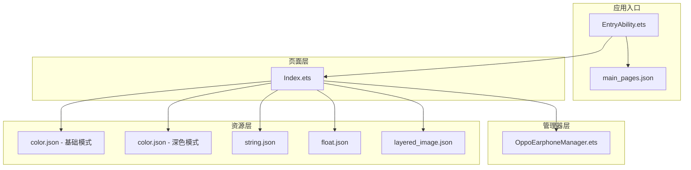
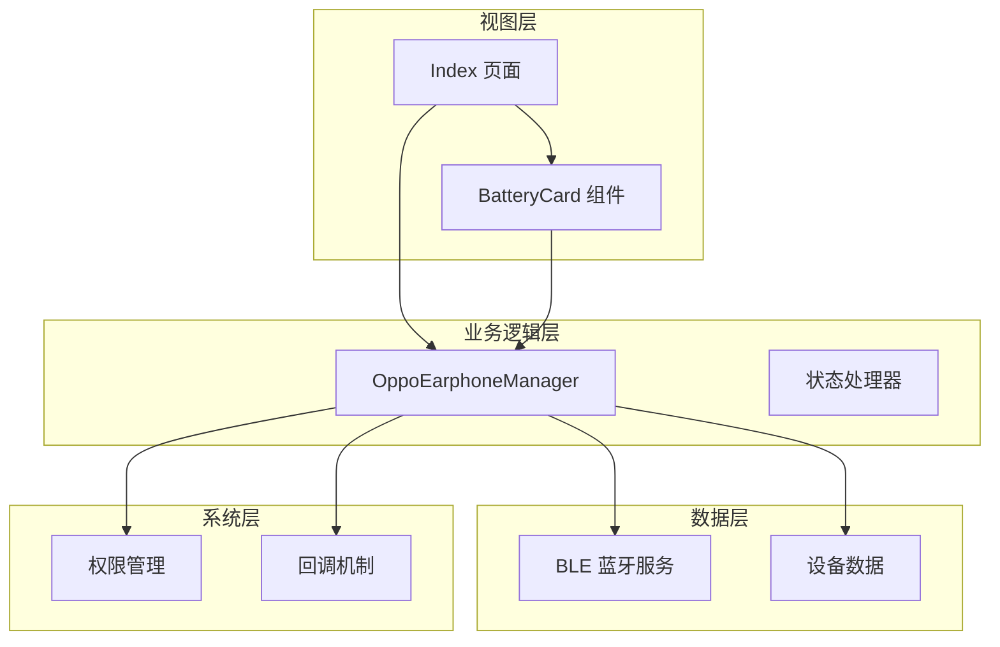
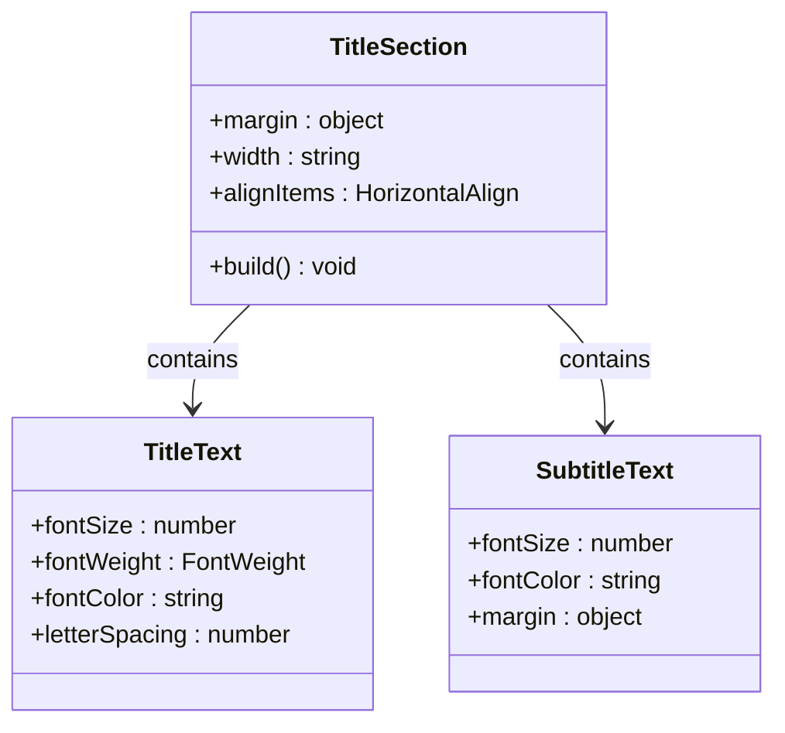
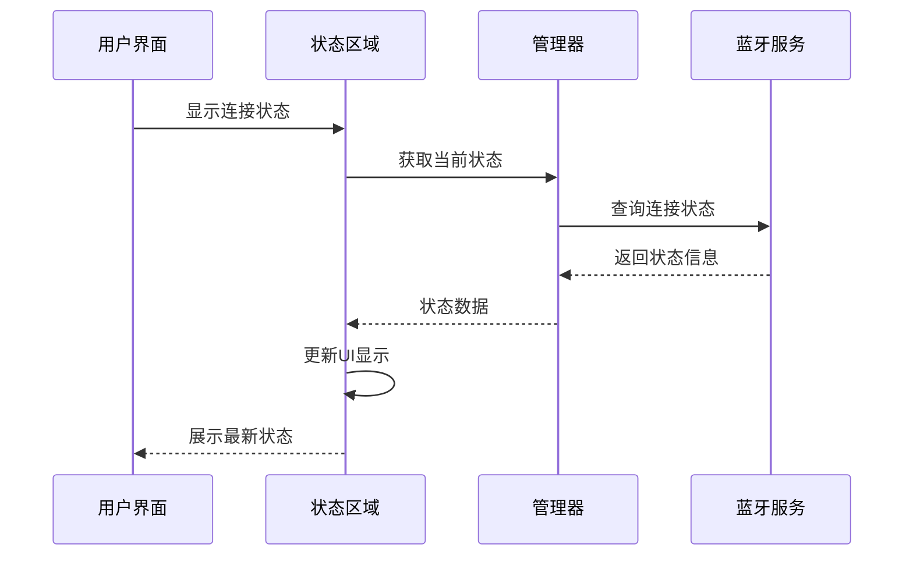
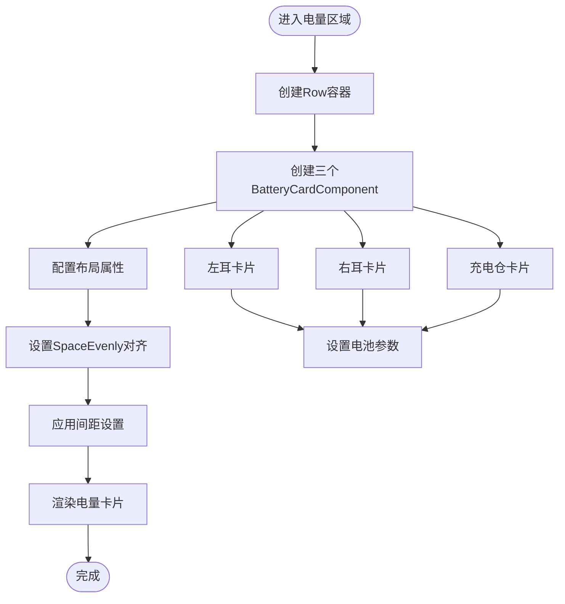
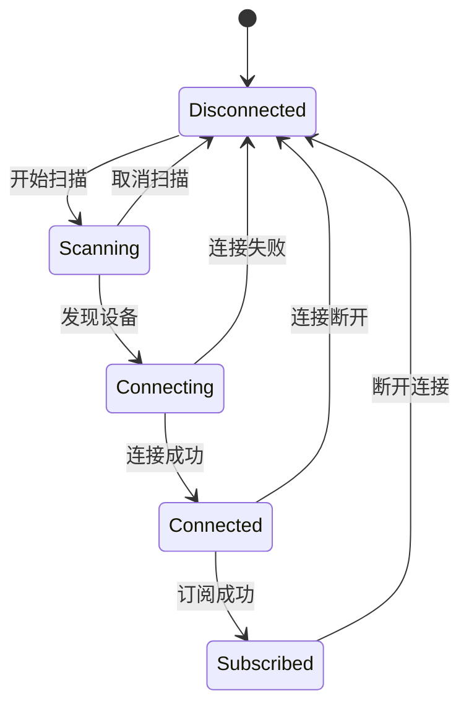

# 主页面布局设计

<cite>
**本文档引用的文件**
- [Index.ets](file://entry/src/main/ets/pages/Index.ets)
- [OppoEarphoneManager.ets](file://entry/src/main/ets/manager/OppoEarphoneManager.ets)
- [EntryAbility.ets](file://entry/src/main/ets/entryability/EntryAbility.ets)
- [color.json](file://entry/src/main/resources/base/element/color.json)
- [color.json](file://entry/src/main/resources/dark/element/color.json)
- [main_pages.json](file://entry/src/main/resources/base/profile/main_pages.json)
- [string.json](file://entry/src/main/resources/base/element/string.json)
- [float.json](file://entry/src/main/resources/base/element/float.json)
- [layered_image.json](file://entry/src/main/resources/base/media/layered_image.json)
</cite>

## 目录
1. [简介](#简介)
2. [项目结构](#项目结构)
3. [核心组件](#核心组件)
4. [架构概览](#架构概览)
5. [详细组件分析](#详细组件分析)
6. [依赖关系分析](#依赖关系分析)
7. [性能考虑](#性能考虑)
8. [故障排除指南](#故障排除指南)
9. [结论](#结论)
10. [附录](#附录)

## 简介

OPPO Enco Air5 Pro主页面布局设计是一个基于ArkTS框架开发的蓝牙耳机电量监控应用的核心界面。该布局采用现代化的响应式设计理念，通过精心设计的区域划分和组件组合，为用户提供直观的设备状态显示和便捷的操作控制。

本设计文档深入分析了Index页面的整体布局架构，包括标题区域、连接状态区域、电量卡片区域、操作按钮区域和底部提示区域的设计理念和实现方式。重点阐述了Column和Row布局容器的使用、FlexAlign属性的配置，以及响应式布局的实现机制。

## 项目结构

该项目采用模块化的文件组织结构，主要包含以下关键目录和文件：



**图表来源**
- [EntryAbility.ets:21-32](file://entry/src/main/ets/entryability/EntryAbility.ets#L21-L32)
- [main_pages.json:1-6](file://entry/src/main/resources/base/profile/main_pages.json#L1-L6)

**章节来源**
- [EntryAbility.ets:1-48](file://entry/src/main/ets/entryability/EntryAbility.ets#L1-L48)
- [main_pages.json:1-6](file://entry/src/main/resources/base/profile/main_pages.json#L1-L6)

## 核心组件

### 主布局容器

Index页面采用Column布局作为根容器，实现了垂直方向的层次化布局结构。整个布局采用百分比宽度和高度设置，确保在不同屏幕尺寸下都能保持良好的视觉效果。

### 电量卡片组件

BatteryCardComponent是一个独立的子组件，专门负责展示单个设备的电量信息。该组件通过@Prop装饰器与父组件建立单向响应式绑定，确保电量数据变化能够实时驱动UI更新。

**章节来源**
- [Index.ets:10-98](file://entry/src/main/ets/pages/Index.ets#L10-L98)
- [Index.ets:291-302](file://entry/src/main/ets/pages/Index.ets#L291-L302)

## 架构概览

系统采用分层架构设计，从上到下分别为：



**图表来源**
- [Index.ets:100-142](file://entry/src/main/ets/pages/Index.ets#L100-L142)
- [OppoEarphoneManager.ets:49-125](file://entry/src/main/ets/manager/OppoEarphoneManager.ets#L49-L125)

## 详细组件分析

### 标题区域设计

标题区域位于页面顶部，采用居中对齐的Column布局容器。该区域包含两个层级的文本内容：主标题和副标题，通过不同的字体大小和颜色区分信息层次。



**图表来源**
- [Index.ets:238-254](file://entry/src/main/ets/pages/Index.ets#L238-L254)

**章节来源**
- [Index.ets:238-254](file://entry/src/main/ets/pages/Index.ets#L238-L254)

### 连接状态区域

连接状态区域采用Row布局容器，实现了水平方向的信息展示。该区域包含状态指示灯、状态文本和MAC地址显示三个组成部分，通过条件渲染实现动态内容更新。



**图表来源**
- [Index.ets:257-289](file://entry/src/main/ets/pages/Index.ets#L257-L289)
- [OppoEarphoneManager.ets:673-681](file://entry/src/main/ets/manager/OppoEarphoneManager.ets#L673-L681)

**章节来源**
- [Index.ets:257-289](file://entry/src/main/ets/pages/Index.ets#L257-L289)

### 电量卡片区域

电量卡片区域采用Row布局容器，使用SpaceEvenly对齐方式实现三个电量卡片的均匀分布。每个卡片都包含设备图标、环形进度条、设备名称和状态信息。



**图表来源**
- [Index.ets:291-302](file://entry/src/main/ets/pages/Index.ets#L291-L302)
- [Index.ets:294-296](file://entry/src/main/ets/pages/Index.ets#L294-L296)

**章节来源**
- [Index.ets:291-302](file://entry/src/main/ets/pages/Index.ets#L291-L302)

### 操作按钮区域

操作按钮区域根据不同的连接状态显示相应的按钮：扫描按钮、取消按钮或断开连接按钮。该区域还包含了权限状态的检查和用户提示功能。



**图表来源**
- [Index.ets:305-383](file://entry/src/main/ets/pages/Index.ets#L305-L383)
- [Index.ets:206-210](file://entry/src/main/ets/pages/Index.ets#L206-L210)

**章节来源**
- [Index.ets:305-383](file://entry/src/main/ets/pages/Index.ets#L305-L383)

### 底部提示区域

底部提示区域采用Column布局容器，并使用layoutWeight属性实现弹性布局。该区域包含扫描提示和版权信息，通过条件渲染实现动态内容显示。

**章节来源**
- [Index.ets:385-406](file://entry/src/main/ets/pages/Index.ets#L385-L406)

## 依赖关系分析

系统的主要依赖关系如下：

```mermaid
graph LR
subgraph "外部依赖"
AbilityKit[@kit.AbilityKit]
BasicServicesKit[@kit.BasicServicesKit]
ConnectivityKit[@kit.ConnectivityKit]
end
subgraph "内部模块"
Index[Index 页面]
Manager[耳机电量管理器]
BatteryCard[BatteryCard 组件]
end
subgraph "系统服务"
BLE[BLE 蓝牙服务]
Permission[权限服务]
end
Index --> Manager
Index --> BatteryCard
Manager --> BLE
Index --> AbilityKit
Index --> BasicServicesKit
Manager --> ConnectivityKit
Index --> Permission
```

**图表来源**
- [Index.ets:1-4](file://entry/src/main/ets/pages/Index.ets#L1-L4)
- [OppoEarphoneManager.ets:1-4](file://entry/src/main/ets/manager/OppoEarphoneManager.ets#L1-L4)

**章节来源**
- [Index.ets:1-4](file://entry/src/main/ets/pages/Index.ets#L1-L4)
- [OppoEarphoneManager.ets:1-4](file://entry/src/main/ets/manager/OppoEarphoneManager.ets#L1-L4)

## 性能考虑

### 响应式布局优化

系统采用了多种响应式布局策略：
- 使用百分比宽度和高度确保在不同屏幕尺寸下的适配
- 采用Flexible布局容器实现内容的自适应排列
- 通过间距和边距的合理设置保证视觉平衡

### 性能优化措施

- 使用@Builder装饰器优化组件渲染性能
- 通过状态管理减少不必要的UI更新
- 采用异步权限请求避免阻塞主线程

## 故障排除指南

### 常见问题及解决方案

1. **蓝牙权限问题**
   - 症状：扫描按钮不可用
   - 解决方案：检查权限申请流程和用户授权状态

2. **连接状态异常**
   - 症状：状态显示不正确
   - 解决方案：验证状态回调函数的正确性和数据传递

3. **电量显示异常**
   - 症状：电量百分比显示错误
   - 解决方案：检查数据解析算法和边界条件处理

**章节来源**
- [Index.ets:147-161](file://entry/src/main/ets/pages/Index.ets#L147-L161)
- [OppoEarphoneManager.ets:505-601](file://entry/src/main/ets/manager/OppoEarphoneManager.ets#L505-L601)

## 结论

OPPO Enco Air5 Pro主页面布局设计展现了现代移动应用界面设计的最佳实践。通过精心设计的区域划分、灵活的响应式布局和高效的组件架构，该设计为用户提供了直观、易用且美观的交互体验。

系统的关键优势包括：
- 清晰的视觉层次和信息架构
- 高度的响应式适配能力
- 完善的状态管理和错误处理机制
- 优秀的性能优化和用户体验设计

## 附录

### 配置文件说明

系统使用了多种资源配置文件来支持不同场景的需求：

| 文件类型 | 用途 | 关键配置 |
|---------|------|----------|
| color.json | 颜色主题配置 | 基础模式和深色模式颜色定义 |
| string.json | 文本资源 | 应用描述和权限说明 |
| float.json | 浮点数配置 | 字体大小等可调整参数 |
| layered_image.json | 图像资源 | 背景和前景图像配置 |

**章节来源**
- [color.json:1-8](file://entry/src/main/resources/base/element/color.json#L1-L8)
- [string.json:1-20](file://entry/src/main/resources/base/element/string.json#L1-L20)
- [float.json:1-9](file://entry/src/main/resources/base/element/float.json#L1-L9)
- [layered_image.json:1-7](file://entry/src/main/resources/base/media/layered_image.json#L1-L7)