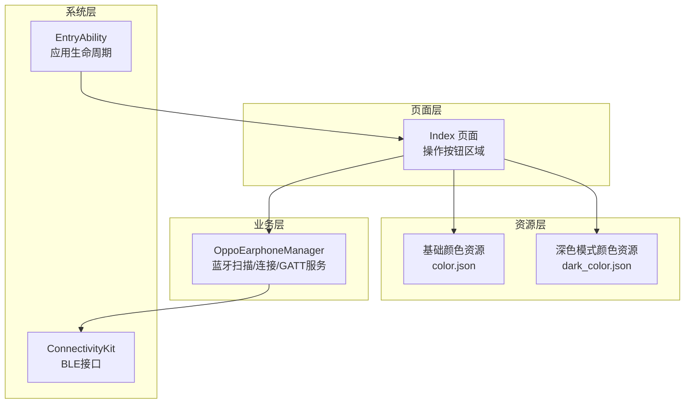
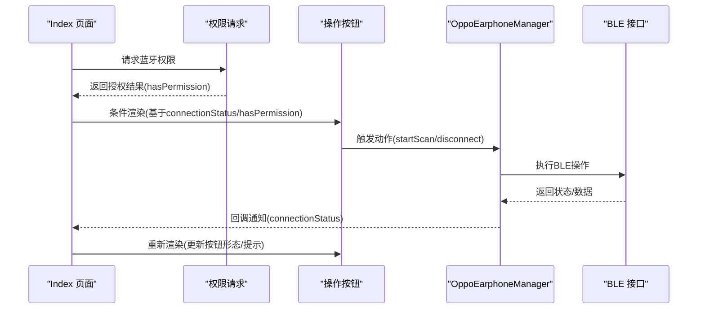
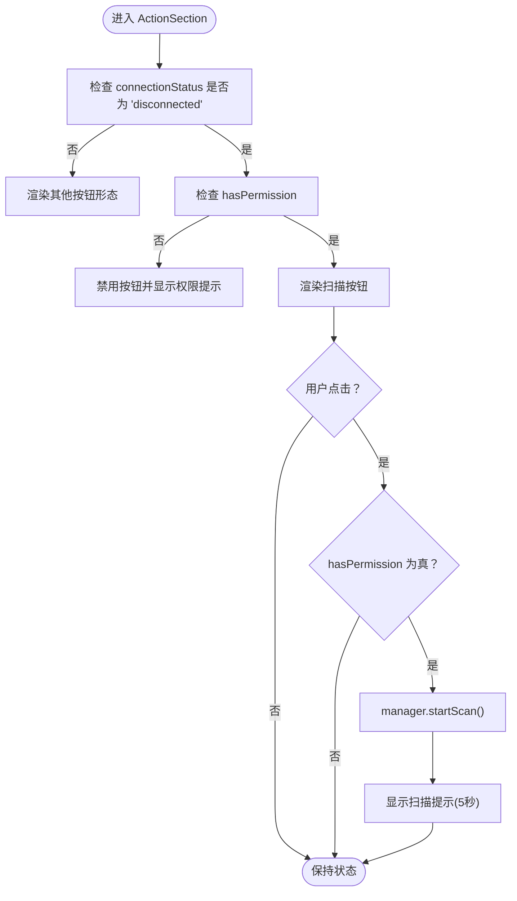
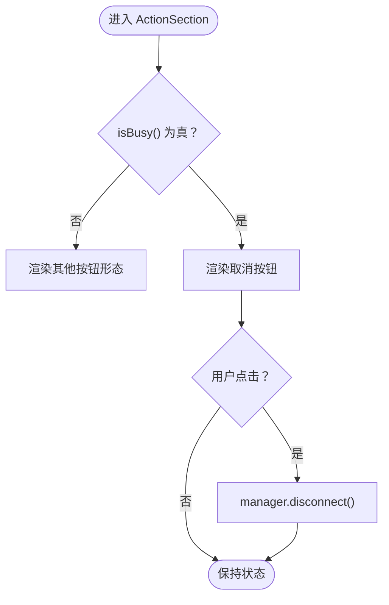
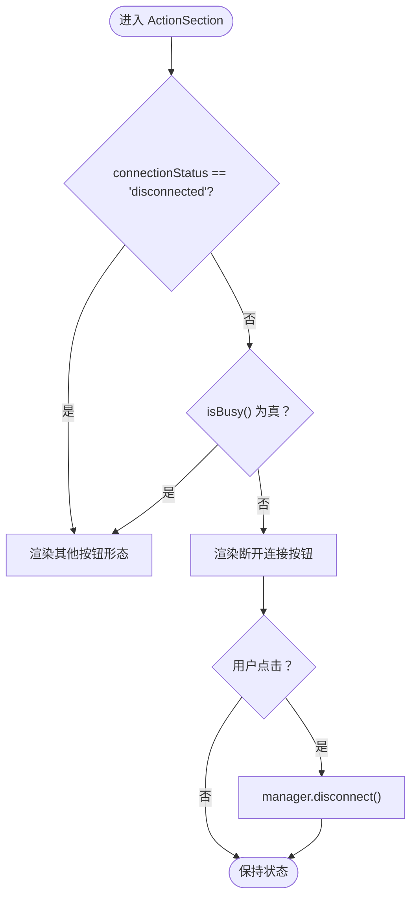
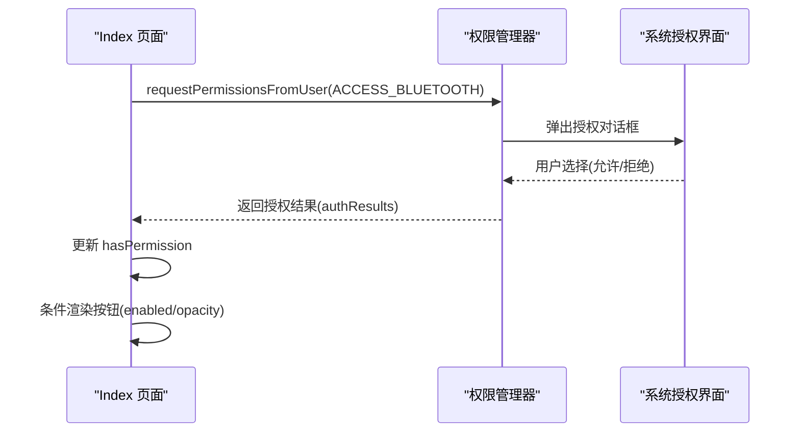
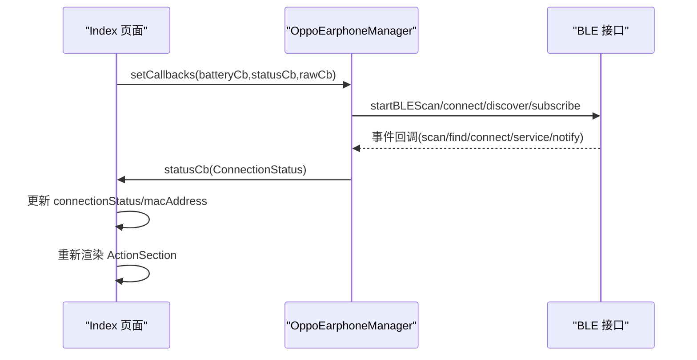
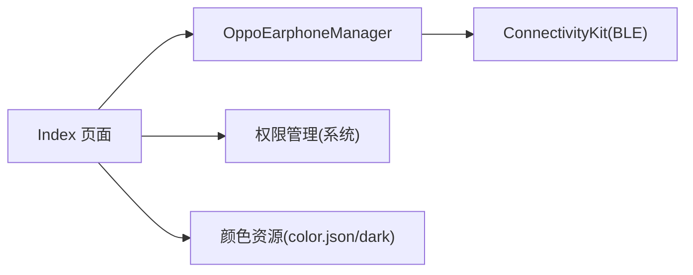

# 操作按钮组件

<cite>
**本文引用的文件**
- [Index.ets](file://entry/src/main/ets/pages/Index.ets)
- [OppoEarphoneManager.ets](file://entry/src/main/ets/manager/OppoEarphoneManager.ets)
- [EntryAbility.ets](file://entry/src/main/ets/entryability/EntryAbility.ets)
- [color.json](file://entry/src/main/resources/base/element/color.json)
- [dark_color.json](file://entry/src/main/resources/dark/element/color.json)
</cite>

## 目录
1. [简介](#简介)
2. [项目结构](#项目结构)
3. [核心组件](#核心组件)
4. [架构总览](#架构总览)
5. [详细组件分析](#详细组件分析)
6. [依赖关系分析](#依赖关系分析)
7. [性能考虑](#性能考虑)
8. [故障排除指南](#故障排除指南)
9. [结论](#结论)
10. [附录](#附录)

## 简介
本文件针对操作按钮组件的完整实现进行系统化文档化，重点覆盖以下三类状态按钮的设计与实现：
- 扫描按钮：当设备处于“未连接”状态时显示，用于启动蓝牙扫描流程。
- 取消按钮：当设备处于“扫描中/连接中/发现服务中”等处理中的状态时显示，用于中断当前操作。
- 断开连接按钮：当设备处于“已连接/已订阅”状态时显示，用于主动断开蓝牙连接。

文档将深入解析按钮的状态切换逻辑（基于 connectionStatus 和 hasPermission 的条件渲染）、样式配置（颜色主题、圆角设计、尺寸规格）、交互行为（点击事件处理、禁用状态控制、透明度变化）、权限检查（蓝牙权限验证与用户授权流程）、视觉反馈与用户体验优化，并提供可访问性设计与键盘导航支持建议以及样式定制与主题适配的最佳实践。

## 项目结构
操作按钮组件位于页面入口 Index 中，通过状态驱动的条件渲染实现三种按钮形态；蓝牙连接与状态管理由 OppoEarphoneManager 统一负责；应用生命周期由 EntryAbility 管理；颜色主题通过资源文件进行配置。

**图表来源**
- [Index.ets:328-407](file://entry/src/main/ets/pages/Index.ets#L328-L407)
- [OppoEarphoneManager.ets:117-125](file://entry/src/main/ets/manager/OppoEarphoneManager.ets#L117-L125)
- [EntryAbility.ets:21-32](file://entry/src/main/ets/entryability/EntryAbility.ets#L21-L32)
- [color.json:1-8](file://entry/src/main/resources/base/element/color.json#L1-L8)
- [dark_color.json:1-8](file://entry/src/main/resources/dark/element/color.json#L1-L8)

**章节来源**
- [Index.ets:328-407](file://entry/src/main/ets/pages/Index.ets#L328-L407)
- [OppoEarphoneManager.ets:117-125](file://entry/src/main/ets/manager/OppoEarphoneManager.ets#L117-L125)
- [EntryAbility.ets:21-32](file://entry/src/main/ets/entryability/EntryAbility.ets#L21-L32)
- [color.json:1-8](file://entry/src/main/resources/base/element/color.json#L1-L8)
- [dark_color.json:1-8](file://entry/src/main/resources/dark/element/color.json#L1-L8)

## 核心组件
- 操作按钮区域（ActionSection）：根据连接状态与权限条件渲染三种按钮形态，统一采用固定尺寸与圆角设计，通过 enabled 与 opacity 控制可用性与视觉权重。
- 权限检查（requestBluetoothPermission）：在页面出现时请求蓝牙权限，将授权结果存储于 hasPermission 状态，影响扫描按钮的可用性与提示文案。
- 状态管理（isBusy）：判断当前是否处于“扫描中/连接中/发现服务中”，用于决定显示取消按钮还是断开连接按钮。
- 蓝牙管理器（OppoEarphoneManager）：封装 BLE 扫描、连接、服务发现与通知订阅，通过回调向页面推送状态变化。

**章节来源**
- [Index.ets:168-182](file://entry/src/main/ets/pages/Index.ets#L168-L182)
- [Index.ets:227-231](file://entry/src/main/ets/pages/Index.ets#L227-L231)
- [Index.ets:328-407](file://entry/src/main/ets/pages/Index.ets#L328-L407)
- [OppoEarphoneManager.ets:135-211](file://entry/src/main/ets/manager/OppoEarphoneManager.ets#L135-L211)

## 架构总览
操作按钮组件的运行时交互流程如下：页面初始化请求权限；根据连接状态与权限条件渲染对应按钮；用户点击触发相应动作；蓝牙管理器执行具体 BLE 操作并通过回调更新状态；页面据此刷新按钮形态与提示信息。

**图表来源**
- [Index.ets:168-182](file://entry/src/main/ets/pages/Index.ets#L168-L182)
- [Index.ets:328-407](file://entry/src/main/ets/pages/Index.ets#L328-L407)
- [OppoEarphoneManager.ets:135-211](file://entry/src/main/ets/manager/OppoEarphoneManager.ets#L135-L211)

## 详细组件分析

### 扫描按钮（未连接态）
- 渲染条件：当 connectionStatus 为 'disconnected' 且 hasPermission 为 true 时显示。
- 尺寸与外观：宽度 80%、高度 52px、圆角半径 26px（等同高度的一半形成标准胶囊形）、背景色使用蓝色系。
- 交互行为：
  - enabled(this.hasPermission)：无权限时禁用。
  - opacity(this.hasPermission ? 1.0 : 0.5)：无权限时降低透明度。
  - onClick：在具备权限时调用 manager.startScan() 并显示扫描提示，5 秒后自动隐藏。
- 视觉反馈：按钮激活时提供明确的颜色与图标提示，配合状态文本与提示区域增强用户体验。

**图表来源**
- [Index.ets:331-357](file://entry/src/main/ets/pages/Index.ets#L331-L357)

**章节来源**
- [Index.ets:331-357](file://entry/src/main/ets/pages/Index.ets#L331-L357)

### 取消按钮（处理中态）
- 渲染条件：当 isBusy() 返回 true（即 connectionStatus 为 'scanning'/'connecting'/'connected'）时显示。
- 尺寸与外观：与扫描按钮一致的尺寸与圆角，背景色采用橙红色系，传达“中止/取消”的警示语义。
- 交互行为：onClick 直接调用 manager.disconnect()，用于中断当前正在进行的操作。
- 视觉反馈：在处理中状态下提供清晰的取消路径，避免用户长时间等待或误操作。

**图表来源**
- [Index.ets:358-375](file://entry/src/main/ets/pages/Index.ets#L358-L375)

**章节来源**
- [Index.ets:358-375](file://entry/src/main/ets/pages/Index.ets#L358-L375)

### 断开连接按钮（已连接态）
- 渲染条件：当不在未连接态且非处理中时显示，通常对应 'subscribed' 状态。
- 尺寸与外观：与前两种按钮一致的尺寸与圆角，背景色采用红色系，传达“断开/结束”的终止语义。
- 交互行为：onClick 调用 manager.disconnect()，同时页面在销毁时也会主动断开连接，确保资源释放。
- 视觉反馈：在已连接状态下提供一键断开能力，提升用户控制感与安全性。

**图表来源**
- [Index.ets:376-394](file://entry/src/main/ets/pages/Index.ets#L376-L394)

**章节来源**
- [Index.ets:376-394](file://entry/src/main/ets/pages/Index.ets#L376-L394)

### 权限检查与授权流程
- 请求时机：页面出现时调用 requestBluetoothPermission()，通过系统权限管理器发起授权请求。
- 授权结果：将 authResults[0] 与 0 比较，决定 hasPermission 的布尔值。
- 对按钮的影响：当 hasPermission 为 false 时，扫描按钮被禁用且透明度降低；同时显示“请授予蓝牙权限后使用”的提示文本。
- 错误处理：捕获权限请求异常并记录错误日志，保证 UI 不崩溃。

**图表来源**
- [Index.ets:168-182](file://entry/src/main/ets/pages/Index.ets#L168-L182)

**章节来源**
- [Index.ets:168-182](file://entry/src/main/ets/pages/Index.ets#L168-L182)

### 状态切换逻辑与回调机制
- 状态枚举：ConnectionStatus 包含 'disconnected'/'scanning'/'connecting'/'connected'/'subscribed'。
- 状态回调：Index 页面通过 manager.setCallbacks() 注册状态回调，在回调中更新 connectionStatus，并在特定状态时同步 MAC 地址。
- 管理器状态推进：OppoEarphoneManager 在扫描、连接、服务发现、通知订阅等阶段通过 notifyStatus() 推送状态变更，驱动 UI 刷新。

**图表来源**
- [Index.ets:119-159](file://entry/src/main/ets/pages/Index.ets#L119-L159)
- [OppoEarphoneManager.ets:117-125](file://entry/src/main/ets/manager/OppoEarphoneManager.ets#L117-L125)
- [OppoEarphoneManager.ets:135-211](file://entry/src/main/ets/manager/OppoEarphoneManager.ets#L135-L211)

**章节来源**
- [Index.ets:119-159](file://entry/src/main/ets/pages/Index.ets#L119-L159)
- [OppoEarphoneManager.ets:117-125](file://entry/src/main/ets/manager/OppoEarphoneManager.ets#L117-L125)
- [OppoEarphoneManager.ets:135-211](file://entry/src/main/ets/manager/OppoEarphoneManager.ets#L135-L211)

### 样式配置与主题适配
- 固定尺寸与圆角：按钮统一采用宽度 80%、高度 52px、圆角 26px 的设计，确保在不同设备上具有一致的触控面积与视觉权重。
- 颜色主题：
  - 扫描按钮：蓝色系背景，传达“开始/探索”的积极语义。
  - 取消按钮：橙红色系背景，传达“中止/谨慎”的警示语义。
  - 断开连接按钮：红色系背景，传达“结束/断开”的终止语义。
- 主题适配：通过资源文件定义基础与深色模式的颜色值，应用在页面背景与组件中，确保在浅色/深色模式下具备良好的对比度与可读性。

**章节来源**
- [Index.ets:342-347](file://entry/src/main/ets/pages/Index.ets#L342-L347)
- [Index.ets:369-372](file://entry/src/main/ets/pages/Index.ets#L369-L372)
- [Index.ets:387-390](file://entry/src/main/ets/pages/Index.ets#L387-L390)
- [color.json:1-8](file://entry/src/main/resources/base/element/color.json#L1-L8)
- [dark_color.json:1-8](file://entry/src/main/resources/dark/element/color.json#L1-L8)

### 交互行为与用户体验优化
- 点击事件处理：扫描按钮在权限满足时才执行 startScan；取消与断开连接按钮直接调用 disconnect。
- 禁用状态控制：通过 enabled 与 opacity 实现视觉与交互上的双重禁用提示。
- 透明度变化：无权限时降低透明度，减少误触概率并引导用户完成授权。
- 提示信息：扫描过程中显示提示文本，5 秒后自动隐藏，避免干扰用户操作。
- 生命周期：页面销毁时主动断开连接，防止资源泄漏。

**章节来源**
- [Index.ets:348-357](file://entry/src/main/ets/pages/Index.ets#L348-L357)
- [Index.ets:373-375](file://entry/src/main/ets/pages/Index.ets#L373-L375)
- [Index.ets:391-393](file://entry/src/main/ets/pages/Index.ets#L391-L393)
- [Index.ets:456-462](file://entry/src/main/ets/pages/Index.ets#L456-L462)
- [Index.ets:161-163](file://entry/src/main/ets/pages/Index.ets#L161-L163)

### 可访问性设计与键盘导航支持
- 当前实现要点：
  - 按钮具备基本的 enabled 与 onClick 交互，满足触控场景。
  - 文本标签包含图标与文字，提升可识别性。
- 建议改进方向（概念性指导，非现有实现）：
  - 为按钮添加无障碍标签（如描述性文本），便于读屏软件朗读。
  - 支持键盘焦点管理与回车键触发，提升桌面端或遥控设备的可用性。
  - 提供高对比度模式下的颜色调整策略，确保色盲用户也能区分不同状态。

[本节为概念性指导，不涉及具体文件分析，故无章节来源]

## 依赖关系分析
- 组件耦合：
  - Index 页面依赖 OppoEarphoneManager 提供的 BLE 能力与状态回调。
  - 权限检查与按钮渲染存在条件依赖（hasPermission → enabled/opacity）。
- 外部依赖：
  - ConnectivityKit 提供 BLE 扫描与连接能力。
  - AbilityKit 提供权限管理与系统窗口生命周期。
- 潜在风险：
  - 若权限请求失败或被拒绝，需确保 UI 不阻塞且提供清晰提示。
  - 状态回调与 UI 更新需保持一致性，避免竞态条件导致的 UI 不一致。

**图表来源**
- [Index.ets:168-182](file://entry/src/main/ets/pages/Index.ets#L168-L182)
- [OppoEarphoneManager.ets:135-211](file://entry/src/main/ets/manager/OppoEarphoneManager.ets#L135-L211)
- [color.json:1-8](file://entry/src/main/resources/base/element/color.json#L1-L8)
- [dark_color.json:1-8](file://entry/src/main/resources/dark/element/color.json#L1-L8)

**章节来源**
- [Index.ets:168-182](file://entry/src/main/ets/pages/Index.ets#L168-L182)
- [OppoEarphoneManager.ets:135-211](file://entry/src/main/ets/manager/OppoEarphoneManager.ets#L135-L211)
- [color.json:1-8](file://entry/src/main/resources/base/element/color.json#L1-L8)
- [dark_color.json:1-8](file://entry/src/main/resources/dark/element/color.json#L1-L8)

## 性能考虑
- 渲染优化：按钮区域采用条件渲染，仅在状态变化时重建对应按钮，减少不必要的重绘。
- 事件处理：点击事件内仅执行必要逻辑（权限校验、调用管理器方法），避免在回调中进行重型计算。
- 生命周期：页面销毁时主动断开连接，避免后台任务占用系统资源。
- 资源加载：颜色资源按主题分离，避免在运行时动态计算颜色带来的开销。

[本节提供一般性指导，不涉及具体文件分析，故无章节来源]

## 故障排除指南
- 权限未授予导致扫描按钮不可用：
  - 现象：扫描按钮禁用且透明度降低，下方显示权限提示。
  - 处理：引导用户在系统设置中授予蓝牙权限，再次进入页面后重新请求授权。
- 扫描失败或超时：
  - 现象：扫描状态持续过久或最终回到未连接态。
  - 处理：检查设备是否在蓝牙范围内、充电仓盖子是否打开、目标设备名称是否匹配。
- 连接不稳定：
  - 现象：连接后状态频繁在连接/断开之间波动。
  - 处理：靠近设备、避免遮挡、重启蓝牙服务或重新配对。
- 断开连接后 UI 未更新：
  - 现象：点击断开连接按钮后状态未刷新。
  - 处理：确认回调是否正确触发，检查状态枚举与条件渲染逻辑。

**章节来源**
- [Index.ets:396-402](file://entry/src/main/ets/pages/Index.ets#L396-L402)
- [OppoEarphoneManager.ets:206-208](file://entry/src/main/ets/manager/OppoEarphoneManager.ets#L206-L208)
- [Index.ets:161-163](file://entry/src/main/ets/pages/Index.ets#L161-L163)

## 结论
操作按钮组件通过简洁的状态机与统一的样式规范，实现了从“未连接”到“处理中”再到“已连接”的完整交互闭环。结合权限检查与生命周期管理，确保了在不同设备与系统环境下的一致体验。未来可在可访问性与键盘导航方面进一步完善，以覆盖更广泛的用户群体。

[本节为总结性内容，不涉及具体文件分析，故无章节来源]

## 附录
- 最佳实践建议：
  - 样式定制：保持按钮尺寸与圆角的一致性，通过主题资源集中管理颜色，避免硬编码。
  - 主题适配：为浅色/深色模式分别提供合适的颜色方案，确保对比度符合无障碍要求。
  - 可访问性：为关键按钮添加无障碍标签与键盘支持，提升跨平台可用性。
  - 错误处理：对权限请求与 BLE 操作进行健壮的异常捕获与用户提示，避免 UI 卡死。

[本节为概念性指导，不涉及具体文件分析，故无章节来源]