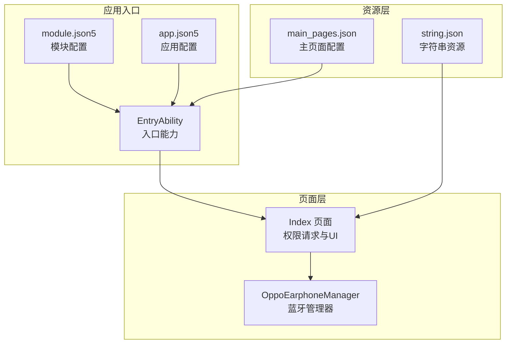
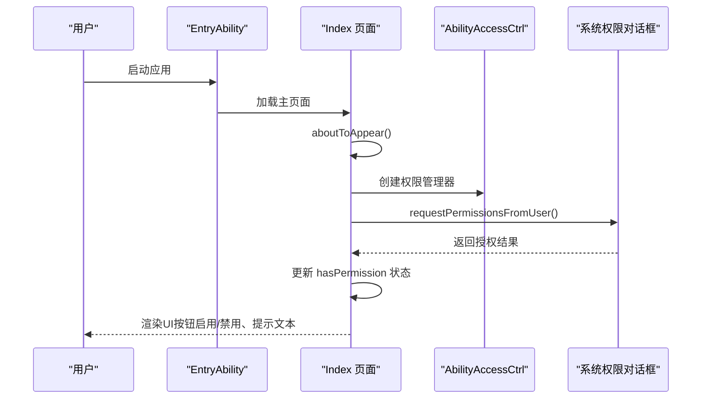
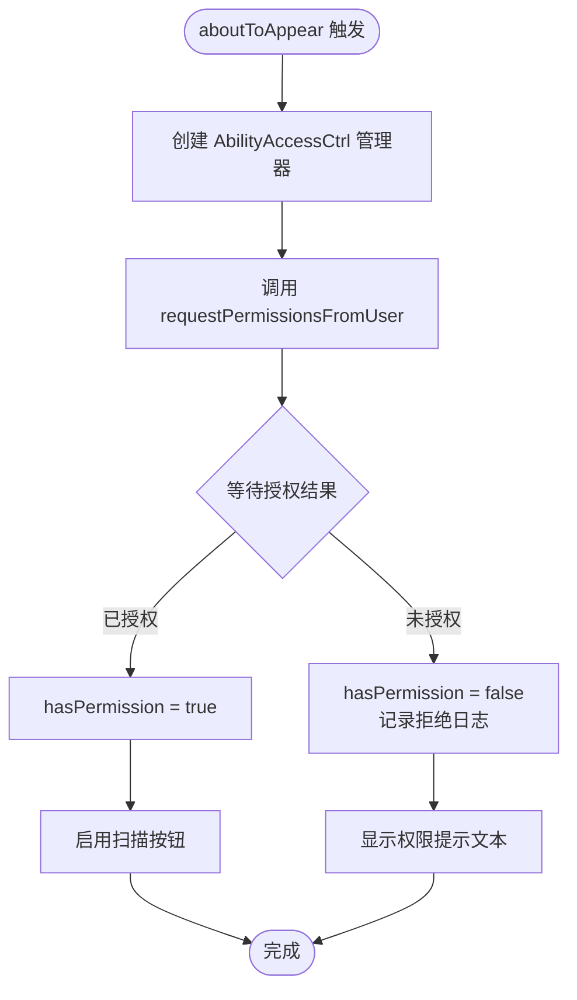
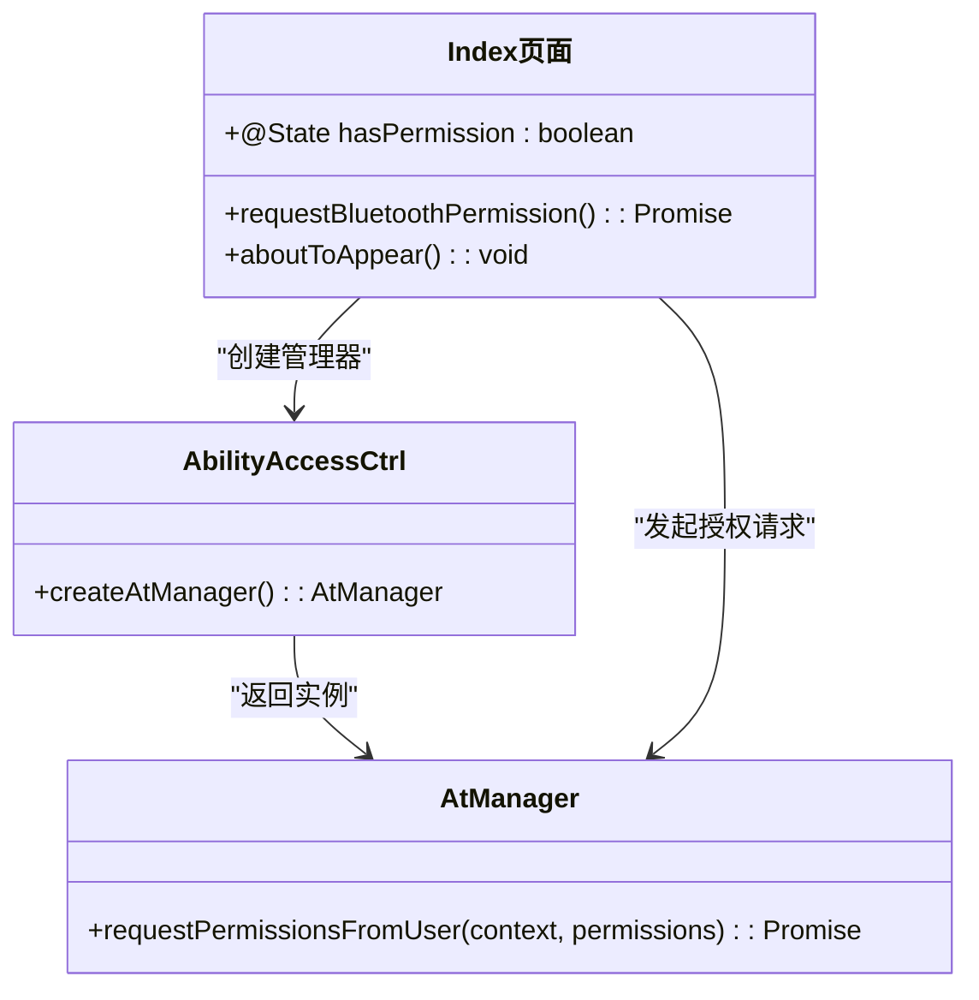
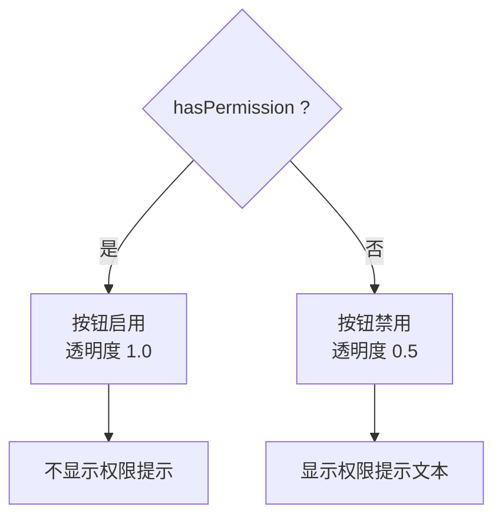
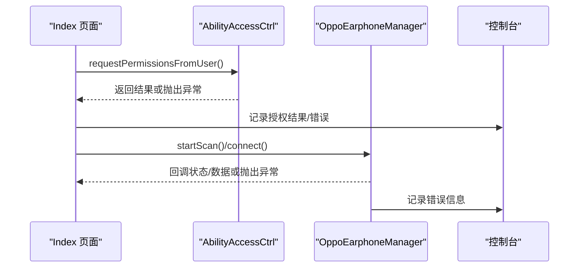
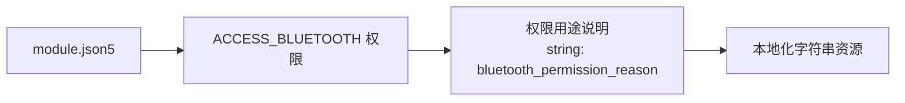
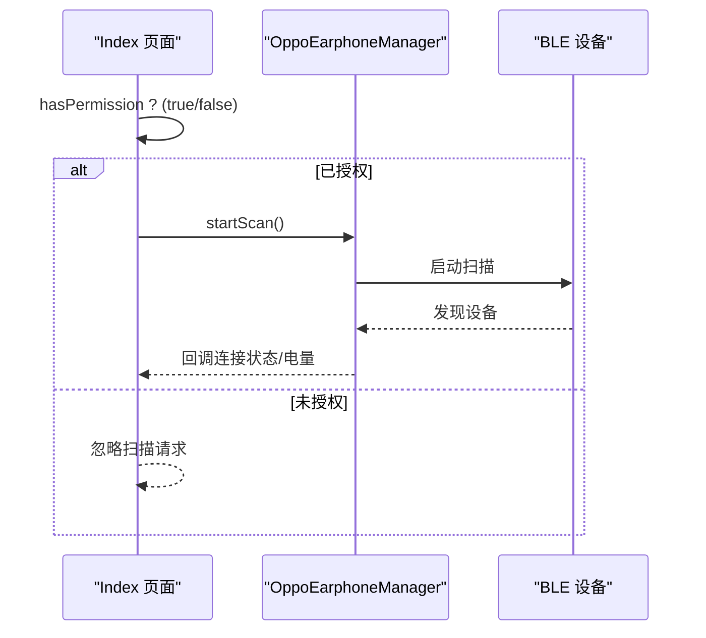
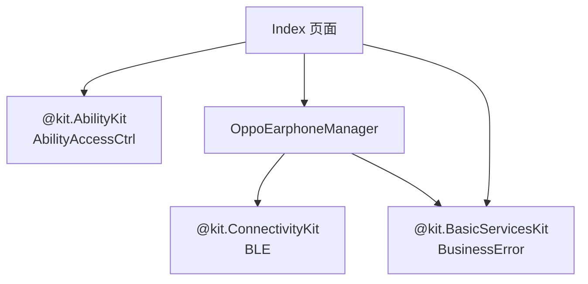

# 权限请求界面

<cite>
**本文档引用的文件**
- [Index.ets](file://entry/src/main/ets/pages/Index.ets)
- [OppoEarphoneManager.ets](file://entry/src/main/ets/manager/OppoEarphoneManager.ets)
- [EntryAbility.ets](file://entry/src/main/ets/entryability/EntryAbility.ets)
- [module.json5](file://entry/src/main/module.json5)
- [string.json](file://entry/src/main/resources/base/element/string.json)
- [main_pages.json](file://entry/src/main/resources/base/profile/main_pages.json)
- [app.json5](file://AppScope/app.json5)
</cite>

## 目录
1. [简介](#简介)
2. [项目结构](#项目结构)
3. [核心组件](#核心组件)
4. [架构概览](#架构概览)
5. [详细组件分析](#详细组件分析)
6. [依赖关系分析](#依赖关系分析)
7. [性能考虑](#性能考虑)
8. [故障排除指南](#故障排除指南)
9. [结论](#结论)
10. [附录](#附录)

## 简介
本文件详细阐述了权限请求界面的实现，重点分析蓝牙权限申请流程、权限检查机制、用户授权对话框交互以及权限状态跟踪。文档深入解析了 `requestBluetoothPermission()` 方法的实现细节，包括 AbilityAccessCtrl 的使用、权限数组配置和异步处理机制；同时涵盖权限状态的 UI 反馈策略、错误处理机制、用户体验设计原则、权限状态的持久化与恢复，以及相关的安全与隐私保护措施。

## 项目结构
该项目采用基于页面的组织方式，入口能力负责加载主页面，主页面包含权限请求逻辑和蓝牙设备管理功能。权限相关的配置位于模块配置文件中，并通过字符串资源提供权限用途说明。

**图表来源**
- [EntryAbility.ets:21-32](file://entry/src/main/ets/entryability/EntryAbility.ets#L21-L32)
- [module.json5:14-25](file://entry/src/main/module.json5#L14-L25)
- [string.json:16-18](file://entry/src/main/resources/base/element/string.json#L16-L18)

**章节来源**
- [EntryAbility.ets:21-32](file://entry/src/main/ets/entryability/EntryAbility.ets#L21-L32)
- [module.json5:14-25](file://entry/src/main/module.json5#L14-L25)
- [main_pages.json:2-5](file://entry/src/main/resources/base/profile/main_pages.json#L2-L5)

## 核心组件
- 权限请求组件：在页面生命周期中触发权限请求，使用 AbilityAccessCtrl 管理权限并更新 UI 状态。
- 蓝牙管理器：封装蓝牙扫描、连接、服务发现和电量数据解析的完整流程。
- 入口能力：负责加载主页面并处理窗口生命周期事件。
- 配置与资源：模块配置声明权限需求及用途，字符串资源提供本地化说明。

**章节来源**
- [Index.ets:168-182](file://entry/src/main/ets/pages/Index.ets#L168-L182)
- [OppoEarphoneManager.ets:49-747](file://entry/src/main/ets/manager/OppoEarphoneManager.ets#L49-L747)
- [EntryAbility.ets:7-48](file://entry/src/main/ets/entryability/EntryAbility.ets#L7-L48)
- [module.json5:14-25](file://entry/src/main/module.json5#L14-L25)

## 架构概览
权限请求界面的整体架构围绕「入口能力 → 主页面 → 蓝牙管理器」展开。权限请求在页面出现时执行，成功与否直接影响操作按钮的可用性与 UI 提示。

**图表来源**
- [EntryAbility.ets:25-31](file://entry/src/main/ets/entryability/EntryAbility.ets#L25-L31)
- [Index.ets:119-121](file://entry/src/main/ets/pages/Index.ets#L119-L121)
- [Index.ets:168-182](file://entry/src/main/ets/pages/Index.ets#L168-L182)

## 详细组件分析

### 权限请求流程与 UI 反馈
- 触发时机：在页面即将出现时调用权限请求方法，确保用户首次进入即可看到权限提示。
- 权限数组配置：当前仅请求 ACCESS_BLUETOOTH 权限，便于最小权限原则。
- 异步处理：使用 await 等待系统授权对话框返回结果，避免 UI 阻塞。
- UI 反馈：
  - 按钮状态：当权限未授予时禁用扫描按钮并降低透明度。
  - 提示文本：显示「请授予蓝牙权限后使用」以引导用户授权。
  - 状态跟踪：通过 @State 变量记录权限状态并在后续逻辑中使用。

**图表来源**
- [Index.ets:119-121](file://entry/src/main/ets/pages/Index.ets#L119-L121)
- [Index.ets:168-182](file://entry/src/main/ets/pages/Index.ets#L168-L182)
- [Index.ets:345-402](file://entry/src/main/ets/pages/Index.ets#L345-L402)

**章节来源**
- [Index.ets:119-121](file://entry/src/main/ets/pages/Index.ets#L119-L121)
- [Index.ets:168-182](file://entry/src/main/ets/pages/Index.ets#L168-L182)
- [Index.ets:345-402](file://entry/src/main/ets/pages/Index.ets#L345-L402)

### requestBluetoothPermission() 方法实现详解
- 上下文获取：通过 getContext 获取 UIAbilityContext，作为权限请求的上下文环境。
- 管理器创建：使用 abilityAccessCtrl.createAtManager() 创建权限管理器实例。
- 权限数组：定义权限数组为 ACCESS_BLUETOOTH，遵循最小权限原则。
- 结果处理：根据 authResults[0] 是否为 0 判断授权状态，并更新 hasPermission。
- 错误处理：捕获异常并记录 BusinessError，保证 UI 不崩溃。

**图表来源**
- [Index.ets:168-182](file://entry/src/main/ets/pages/Index.ets#L168-L182)
- [Index.ets:170-174](file://entry/src/main/ets/pages/Index.ets#L170-L174)

**章节来源**
- [Index.ets:168-182](file://entry/src/main/ets/pages/Index.ets#L168-L182)

### 权限状态的 UI 反馈机制
- 按钮禁用策略：当 hasPermission 为 false 时，扫描按钮 disabled=true，透明度降低，直观提示用户需先授权。
- 提示文本：在操作按钮区域下方显示明确的提示文本，指导用户进行授权。
- 状态联动：权限状态影响后续的扫描行为，只有在授权状态下才会执行扫描逻辑。

**图表来源**
- [Index.ets:345-402](file://entry/src/main/ets/pages/Index.ets#L345-L402)

**章节来源**
- [Index.ets:345-402](file://entry/src/main/ets/pages/Index.ets#L345-L402)

### 错误处理机制与用户友好提示
- 异常捕获：在权限请求和蓝牙管理器各处使用 try/catch 捕获 BusinessError。
- 日志记录：输出错误信息到控制台，便于调试与问题定位。
- 用户提示：通过 UI 层的提示文本和按钮状态向用户传达当前状态。

**图表来源**
- [Index.ets:177-181](file://entry/src/main/ets/pages/Index.ets#L177-L181)
- [OppoEarphoneManager.ets:198-209](file://entry/src/main/ets/manager/OppoEarphoneManager.ets#L198-L209)

**章节来源**
- [Index.ets:177-181](file://entry/src/main/ets/pages/Index.ets#L177-L181)
- [OppoEarphoneManager.ets:198-209](file://entry/src/main/ets/manager/OppoEarphoneManager.ets#L198-L209)

### 权限配置与模块声明
- 权限声明：在模块配置中声明 ACCESS_BLUETOOTH 权限及其用途说明。
- 用途说明：通过字符串资源提供本地化的权限用途描述，增强用户信任。
- 生命周期：权限在应用启动时即进行检查，确保后续功能正常运行。

**图表来源**
- [module.json5:14-25](file://entry/src/main/module.json5#L14-L25)
- [string.json:16-18](file://entry/src/main/resources/base/element/string.json#L16-L18)

**章节来源**
- [module.json5:14-25](file://entry/src/main/module.json5#L14-L25)
- [string.json:16-18](file://entry/src/main/resources/base/element/string.json#L16-L18)

### 蓝牙管理器与权限的关系
- 功能边界：蓝牙管理器负责扫描、连接、服务发现和数据解析，但不直接处理权限请求。
- 依赖关系：只有在权限已授权的情况下，才允许执行扫描等操作。
- 资源清理：在页面消失时断开连接并清理资源，避免后台占用。

**图表来源**
- [Index.ets:348-357](file://entry/src/main/ets/pages/Index.ets#L348-L357)
- [OppoEarphoneManager.ets:135-211](file://entry/src/main/ets/manager/OppoEarphoneManager.ets#L135-L211)

**章节来源**
- [Index.ets:348-357](file://entry/src/main/ets/pages/Index.ets#L348-L357)
- [OppoEarphoneManager.ets:135-211](file://entry/src/main/ets/manager/OppoEarphoneManager.ets#L135-L211)

## 依赖关系分析
- 组件耦合：Index 页面依赖 AbilityAccessCtrl 进行权限请求，依赖 OppoEarphoneManager 进行蓝牙操作。
- 外部依赖：ConnectivityKit 提供 BLE 能力，BasicServicesKit 提供 BusinessError 类型。
- 配置依赖：模块配置声明权限，字符串资源提供本地化说明。

**图表来源**
- [Index.ets:1-3](file://entry/src/main/ets/pages/Index.ets#L1-L3)
- [OppoEarphoneManager.ets:1-3](file://entry/src/main/ets/manager/OppoEarphoneManager.ets#L1-L3)

**章节来源**
- [Index.ets:1-3](file://entry/src/main/ets/pages/Index.ets#L1-L3)
- [OppoEarphoneManager.ets:1-3](file://entry/src/main/ets/manager/OppoEarphoneManager.ets#L1-L3)

## 性能考虑
- 最小权限原则：仅请求 ACCESS_BLUETOOTH，减少权限申请次数与用户负担。
- 异步处理：权限请求与蓝牙操作均采用异步模式，避免阻塞主线程。
- UI 响应：通过状态变量驱动 UI 更新，确保界面流畅响应。
- 资源清理：在页面生命周期结束时断开连接并清理资源，防止内存泄漏。

## 故障排除指南
- 权限被拒绝：检查 hasPermission 状态，确认 UI 是否正确禁用按钮并显示提示。
- 授权对话框无响应：确认 AbilityAccessCtrl 初始化与上下文获取是否正确。
- 蓝牙操作失败：查看 OppoEarphoneManager 的错误日志，关注扫描、连接、订阅过程中的异常。
- 控制台输出：利用日志定位具体错误位置，结合 BusinessError 的 message 字段进行排查。

**章节来源**
- [Index.ets:177-181](file://entry/src/main/ets/pages/Index.ets#L177-L181)
- [OppoEarphoneManager.ets:198-209](file://entry/src/main/ets/manager/OppoEarphoneManager.ets#L198-L209)

## 结论
该权限请求界面通过简洁的流程实现了权限检查、用户授权对话框交互与状态跟踪，并与蓝牙管理器形成清晰的职责分离。UI 层通过按钮状态与提示文本直观反馈权限状态，错误处理机制确保异常情况下的稳定表现。建议在后续版本中进一步完善权限状态的持久化与恢复机制，以提升用户体验的一致性。

## 附录
- 用户体验设计原则：
  - 时机选择：在页面首次出现时请求权限，避免在用户操作中途打断。
  - 信息传达：使用本地化字符串清晰说明权限用途，增强用户信任。
  - 反馈及时：权限状态变化应立即反映在 UI 上，提供明确的操作指引。
- 安全与隐私保护：
  - 最小权限：仅请求必要的 ACCESS_BLUETOOTH 权限。
  - 透明度：通过字符串资源向用户说明权限用途。
  - 资源清理：在页面生命周期结束时断开连接并清理资源，防止后台访问。