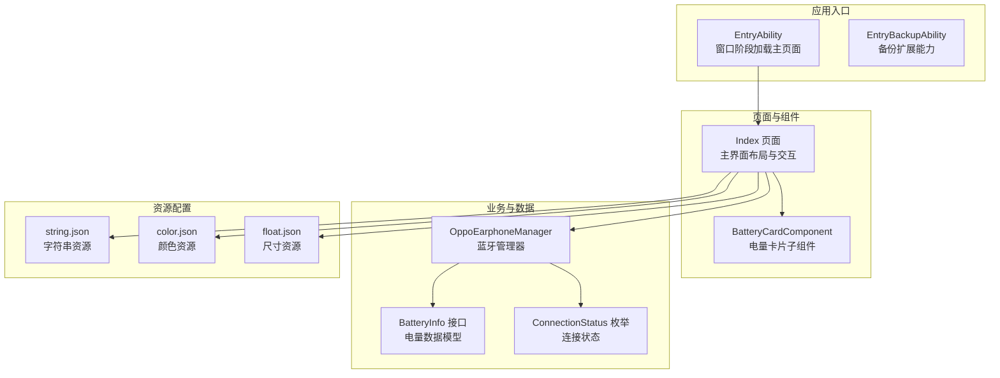
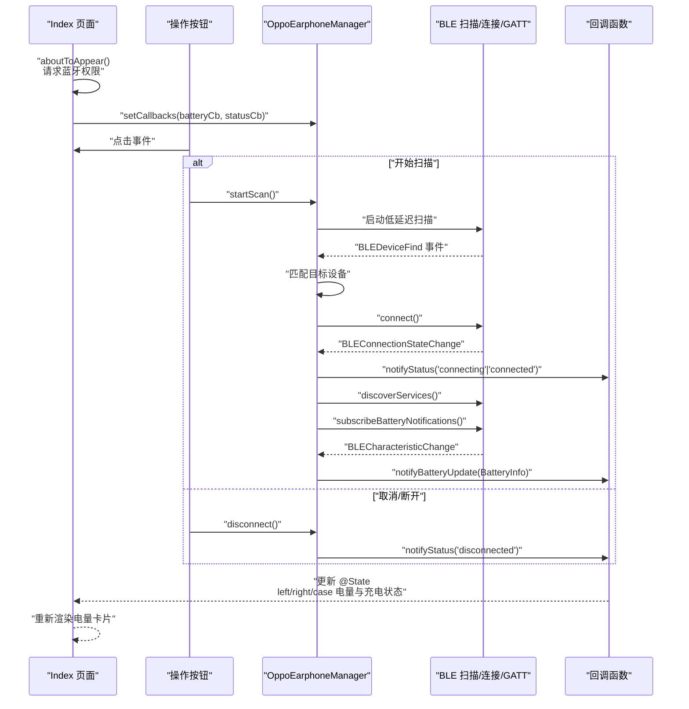
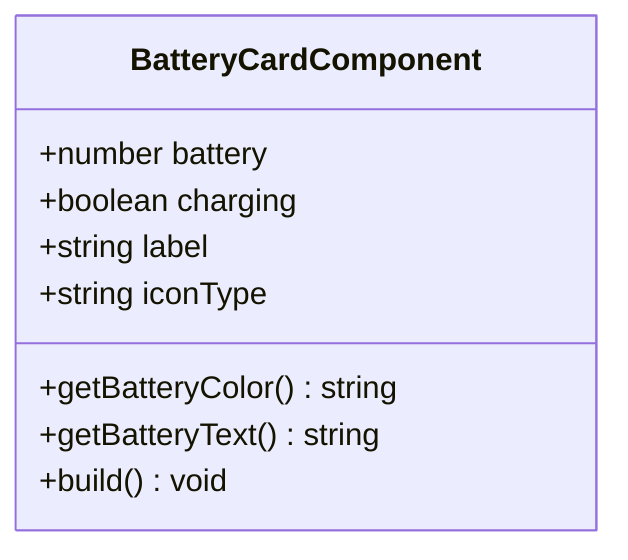
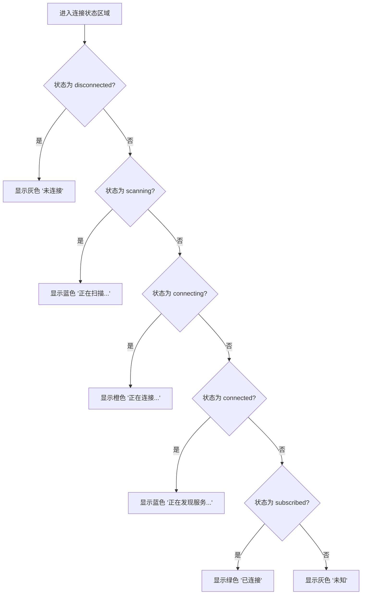
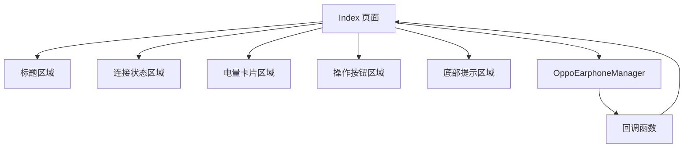
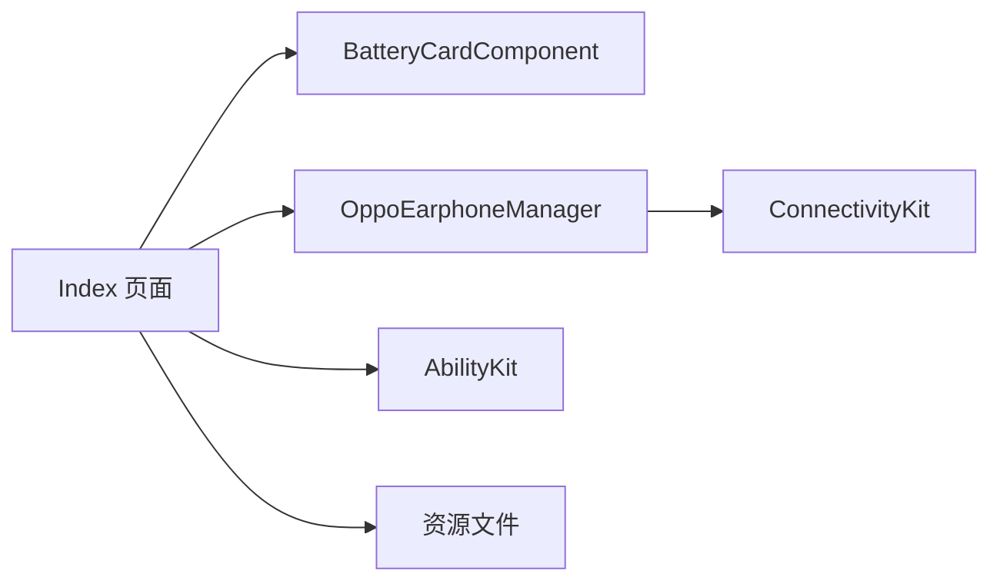

# 用户界面组件

<cite>
**本文引用的文件**
- [Index 页面](file://entry/src/main/ets/pages/Index.ets)
- [Oppo 耳机管理器](file://entry/src/main/ets/manager/OppoEarphoneManager.ets)
- [入口能力](file://entry/src/main/ets/entryability/EntryAbility.ets)
- [备份扩展能力](file://entry/src/main/ets/entrybackupability/EntryBackupAbility.ets)
- [模块配置](file://entry/src/main/module.json5)
- [字符串资源](file://entry/src/main/resources/base/element/string.json)
- [颜色资源](file://entry/src/main/resources/base/element/color.json)
- [浮点资源](file://entry/src/main/resources/base/element/float.json)
- [构建配置](file://build-profile.json5)
- [能力测试](file://entry/src/ohosTest/ets/test/Ability.test.ets)
- [本地单元测试](file://entry/src/test/LocalUnit.test.ets)
</cite>

## 目录
1. [简介](#简介)
2. [项目结构](#项目结构)
3. [核心组件](#核心组件)
4. [架构总览](#架构总览)
5. [详细组件分析](#详细组件分析)
6. [依赖关系分析](#依赖关系分析)
7. [性能考虑](#性能考虑)
8. [故障排查指南](#故障排查指南)
9. [结论](#结论)
10. [附录](#附录)

## 简介
本文件面向 OPPO Enco Air5 Pro 电量监控应用的用户界面组件，重点围绕主界面 Index 页面的布局设计与组件结构展开，详细说明以下内容：
- 电量卡片组件的实现原理与样式定制
- 电量显示组件的数据绑定机制（BatteryInfo 数据模型与实时更新）
- 连接状态指示器的实现（不同状态下的 UI 反馈与视觉样式）
- 完整的组件 API 文档（props 参数、事件处理、样式配置）
- 响应式设计与多设备适配策略
- 组件复用指南与自定义样式最佳实践
- 无障碍访问支持与国际化配置
- 代码示例路径与使用场景演示

## 项目结构
应用采用基于页面与管理器的分层组织方式：
- 入口能力负责窗口阶段加载主页面
- 主页面 Index 负责整体布局与交互控制
- 管理器 OppoEarphoneManager 负责蓝牙扫描、连接、服务发现与电量数据解析
- 资源文件提供字符串、颜色、尺寸等基础配置

**图表来源**
- [入口能力:21-32](file://entry/src/main/ets/entryability/EntryAbility.ets#L21-L32)
- [Index 页面:100-235](file://entry/src/main/ets/pages/Index.ets#L100-L235)
- [Oppo 耳机管理器:49-709](file://entry/src/main/ets/manager/OppoEarphoneManager.ets#L49-L709)
- [模块配置:1-63](file://entry/src/main/module.json5#L1-L63)
- [字符串资源:1-20](file://entry/src/main/resources/base/element/string.json#L1-L20)
- [颜色资源:1-8](file://entry/src/main/resources/base/element/color.json#L1-L8)
- [浮点资源:1-9](file://entry/src/main/resources/base/element/float.json#L1-L9)

**章节来源**
- [入口能力:1-48](file://entry/src/main/ets/entryability/EntryAbility.ets#L1-L48)
- [Index 页面:100-235](file://entry/src/main/ets/pages/Index.ets#L100-L235)
- [Oppo 耳机管理器:49-709](file://entry/src/main/ets/manager/OppoEarphoneManager.ets#L49-L709)
- [模块配置:1-63](file://entry/src/main/module.json5#L1-L63)

## 核心组件
本节聚焦于主界面 Index 的核心布局与两个关键组件：连接状态指示器与电量卡片组件。

- 连接状态指示器
  - 功能：根据当前连接状态动态显示状态文本与颜色，并在连接成功后展示 MAC 地址
  - 实现：通过状态计算函数映射状态到颜色与文本，使用圆角背景与边框增强可读性
  - 交互：点击按钮触发扫描、取消或断开连接操作

- 电量卡片组件 BatteryCardComponent
  - 功能：展示左耳、右耳与充电仓的电量与充电状态，支持环形进度条与百分比显示
  - 数据绑定：通过 @Prop 接收父组件传递的电量与充电状态，内部根据阈值计算颜色与文本
  - 样式定制：统一背景色、边框、圆角与字体大小，支持不同图标类型区分设备

**章节来源**
- [Index 页面:100-235](file://entry/src/main/ets/pages/Index.ets#L100-L235)
- [Index 页面:256-289](file://entry/src/main/ets/pages/Index.ets#L256-L289)
- [Index 页面:291-302](file://entry/src/main/ets/pages/Index.ets#L291-L302)
- [Index 页面:10-98](file://entry/src/main/ets/pages/Index.ets#L10-L98)

## 架构总览
下图展示了从入口能力到主页面、再到蓝牙管理器的数据流与交互流程：

**图表来源**
- [Index 页面:116-142](file://entry/src/main/ets/pages/Index.ets#L116-L142)
- [Index 页面:307-370](file://entry/src/main/ets/pages/Index.ets#L307-L370)
- [Oppo 耳机管理器:115-121](file://entry/src/main/ets/manager/OppoEarphoneManager.ets#L115-L121)
- [Oppo 耳机管理器:131-207](file://entry/src/main/ets/manager/OppoEarphoneManager.ets#L131-L207)
- [Oppo 耳机管理器:289-341](file://entry/src/main/ets/manager/OppoEarphoneManager.ets#L289-L341)
- [Oppo 耳机管理器:419-473](file://entry/src/main/ets/manager/OppoEarphoneManager.ets#L419-L473)
- [Oppo 耳机管理器:497-593](file://entry/src/main/ets/manager/OppoEarphoneManager.ets#L497-L593)

**章节来源**
- [Index 页面:116-142](file://entry/src/main/ets/pages/Index.ets#L116-L142)
- [Oppo 耳机管理器:115-121](file://entry/src/main/ets/manager/OppoEarphoneManager.ets#L115-L121)
- [Oppo 耳机管理器:131-207](file://entry/src/main/ets/manager/OppoEarphoneManager.ets#L131-L207)
- [Oppo 耳机管理器:289-341](file://entry/src/main/ets/manager/OppoEarphoneManager.ets#L289-L341)
- [Oppo 耳机管理器:419-473](file://entry/src/main/ets/manager/OppoEarphoneManager.ets#L419-L473)
- [Oppo 耳机管理器:497-593](file://entry/src/main/ets/manager/OppoEarphoneManager.ets#L497-L593)

## 详细组件分析

### 电量卡片组件 BatteryCardComponent
- 组件职责
  - 展示单个设备（左耳/右耳/充电仓）的电量与充电状态
  - 根据电量阈值动态切换颜色，低电量时高亮警示
  - 支持不同图标类型区分设备类型
- 数据绑定机制
  - 通过 @Prop 接收 battery 与 charging，结合内部 label 与 iconType 控制 UI
  - 依赖父组件 @State 的变化触发响应式更新
- 样式定制
  - 统一圆角背景与边框，居中对齐
  - 环形进度条采用深色背景与主题色填充
  - 百分比文本使用白色粗体字，确保对比度
- 颜色策略
  - 未知电量：灰色
  - 充电中：金色
  - 低电量：红色
  - 中电量：橙色
  - 正常电量：绿色

**图表来源**
- [Index 页面:10-98](file://entry/src/main/ets/pages/Index.ets#L10-L98)

**章节来源**
- [Index 页面:10-98](file://entry/src/main/ets/pages/Index.ets#L10-L98)

### 连接状态指示器
- 状态映射
  - disconnected → 灰色文本“未连接”
  - scanning → 蓝色文本“正在扫描...”
  - connecting → 橙色文本“正在连接...”
  - connected → 蓝色文本“正在发现服务...”
  - subscribed → 绿色文本“已连接”
- 视觉反馈
  - 左侧小圆点根据状态切换颜色
  - 连接成功后显示设备 MAC 地址（等宽字体）
- 交互行为
  - 根据状态决定按钮显示与点击行为（开始扫描/取消/断开）

**图表来源**
- [Index 页面:166-201](file://entry/src/main/ets/pages/Index.ets#L166-L201)

**章节来源**
- [Index 页面:256-289](file://entry/src/main/ets/pages/Index.ets#L256-L289)
- [Index 页面:166-201](file://entry/src/main/ets/pages/Index.ets#L166-L201)

### 主界面 Index 布局与交互
- 布局结构
  - 标题区域：品牌名与副标题
  - 连接状态区域：状态指示灯与状态文本
  - 电量卡片区域：三列等分布局展示左右耳与充电仓
  - 操作按钮区域：根据状态显示不同按钮
  - 底部提示区域：扫描提示与版权信息
- 数据流
  - 父组件通过 @State 管理电量与连接状态
  - 管理器通过回调将 BatteryInfo 与 ConnectionStatus 推送至 UI
- 权限与生命周期
  - 应用启动时请求蓝牙权限
  - 页面出现时设置回调，页面消失时断开连接

**图表来源**
- [Index 页面:212-235](file://entry/src/main/ets/pages/Index.ets#L212-L235)
- [Index 页面:291-302](file://entry/src/main/ets/pages/Index.ets#L291-L302)
- [Index 页面:304-383](file://entry/src/main/ets/pages/Index.ets#L304-L383)

**章节来源**
- [Index 页面:212-235](file://entry/src/main/ets/pages/Index.ets#L212-L235)
- [Index 页面:291-302](file://entry/src/main/ets/pages/Index.ets#L291-L302)
- [Index 页面:304-383](file://entry/src/main/ets/pages/Index.ets#L304-L383)

## 依赖关系分析
- 组件耦合
  - Index 对 BatteryCardComponent 为组合关系，通过 props 传递数据
  - Index 对 OppoEarphoneManager 为依赖关系，通过回调接收状态与电量
- 外部依赖
  - ConnectivityKit 提供 BLE 扫描与 GATT 能力
  - AbilityKit 提供权限请求与 UI 能力上下文
- 资源依赖
  - 字符串资源用于国际化文案
  - 颜色与尺寸资源用于主题化与响应式布局

**图表来源**
- [Index 页面:1-4](file://entry/src/main/ets/pages/Index.ets#L1-L4)
- [Oppo 耳机管理器](file://entry/src/main/ets/manager/OppoEarphoneManager.ets#L1)
- [模块配置:14-25](file://entry/src/main/module.json5#L14-L25)

**章节来源**
- [Index 页面:1-4](file://entry/src/main/ets/pages/Index.ets#L1-L4)
- [Oppo 耳机管理器](file://entry/src/main/ets/manager/OppoEarphoneManager.ets#L1)
- [模块配置:14-25](file://entry/src/main/module.json5#L14-L25)

## 性能考虑
- 低延迟扫描
  - 使用低延迟扫描模式与积极匹配策略，缩短发现目标设备的时间
- 事件驱动更新
  - 仅在电量数据发生有效更新时触发 UI 重绘，避免不必要的渲染
- 生命周期管理
  - 页面消失时主动断开连接与清理资源，防止内存泄漏
- 资源优化
  - 使用统一渐变背景与紧凑布局，减少绘制开销

[本节为通用性能建议，不直接分析具体文件]

## 故障排查指南
- 权限问题
  - 若蓝牙权限未授予，操作按钮不可用且显示提示；检查权限申请与用户授权流程
- 连接异常
  - 若连接状态长时间停留在扫描或连接中，检查设备是否在范围内且充电仓盖已打开
- 电量显示异常
  - 若电量为未知或闪烁，确认设备是否正确识别与订阅通知
- 蓝牙回调未触发
  - 检查回调注册与状态机转换逻辑，确保在连接成功后执行服务发现与订阅

**章节来源**
- [Index 页面:147-161](file://entry/src/main/ets/pages/Index.ets#L147-L161)
- [Index 页面:324-333](file://entry/src/main/ets/pages/Index.ets#L324-L333)
- [Oppo 耳机管理器:131-207](file://entry/src/main/ets/manager/OppoEarphoneManager.ets#L131-L207)
- [Oppo 耳机管理器:289-341](file://entry/src/main/ets/manager/OppoEarphoneManager.ets#L289-L341)
- [Oppo 耳机管理器:419-473](file://entry/src/main/ets/manager/OppoEarphoneManager.ets#L419-L473)

## 结论
本应用通过清晰的页面分层与组件化设计，实现了对 OPPO Enco Air5 Pro 电量的实时监控与直观展示。Index 页面承担了布局与交互控制，BatteryCardComponent 提供可复用的电量展示能力，OppoEarphoneManager 则封装了复杂的蓝牙通信细节。配合资源化的国际化与主题化配置，应用具备良好的可维护性与可扩展性。

[本节为总结性内容，不直接分析具体文件]

## 附录

### 组件 API 文档

- BatteryCardComponent
  - Props
    - battery: number，默认 -1（未知）
    - charging: boolean，默认 false
    - label: string（内部使用，用于显示设备名称）
    - iconType: string（'L'/'R'/'C'，分别对应左耳/右耳/充电仓）
  - 事件
    - 无外部事件；通过 @Prop 接收数据，内部根据阈值计算颜色与文本
  - 样式配置
    - 统一圆角背景、边框与字体大小
    - 环形进度条颜色随电量与充电状态变化
    - 百分比文本使用白色粗体字

- Index 页面
  - 状态
    - connectionStatus: ConnectionStatus
    - leftBattery/rightBattery/caseBattery: number
    - leftCharging/rightCharging/caseCharging: boolean
    - macAddress: string
    - hasPermission: boolean
    - scanTipVisible: boolean
  - 方法
    - requestBluetoothPermission(): Promise<void>
    - getStatusText(): string
    - getStatusColor(): string
    - isBusy(): boolean
  - 事件
    - aboutToAppear(): 在页面出现时请求权限并设置回调
    - aboutToDisappear(): 在页面消失时断开连接
    - onClick: 根据状态触发 startScan()/disconnect()

- OppoEarphoneManager
  - 接口 BatteryInfo
    - leftBattery: number
    - leftCharging: boolean
    - rightBattery: number
    - rightCharging: boolean
    - caseBattery: number
    - caseCharging: boolean
  - 类型 ConnectionStatus
    - 'disconnected' | 'scanning' | 'connecting' | 'connected' | 'subscribed'
  - 方法
    - setCallbacks(batteryCb, statusCb): 注册回调
    - startScan(): 开始扫描
    - stopScan(): 停止扫描
    - getMacAddress(): 获取 MAC 地址
    - disconnect(): 断开连接
    - connectToEarphone(mac): 私有连接方法
    - discoverServices(): 私有服务发现
    - subscribeBatteryNotifications(): 私有订阅通知
    - parseOppoBattery(data): 私有解析电量数据
    - notifyBatteryUpdate(): 私有通知电量更新
    - notifyStatus(status): 私有通知状态变化
    - cleanup(): 私有清理资源

**章节来源**
- [Index 页面:10-98](file://entry/src/main/ets/pages/Index.ets#L10-L98)
- [Index 页面:100-235](file://entry/src/main/ets/pages/Index.ets#L100-L235)
- [Oppo 耳机管理器:13-27](file://entry/src/main/ets/manager/OppoEarphoneManager.ets#L13-L27)
- [Oppo 耳机管理器](file://entry/src/main/ets/manager/OppoEarphoneManager.ets#L37)
- [Oppo 耳机管理器:115-121](file://entry/src/main/ets/manager/OppoEarphoneManager.ets#L115-L121)
- [Oppo 耳机管理器:131-207](file://entry/src/main/ets/manager/OppoEarphoneManager.ets#L131-L207)
- [Oppo 耳机管理器:289-341](file://entry/src/main/ets/manager/OppoEarphoneManager.ets#L289-L341)
- [Oppo 耳机管理器:419-473](file://entry/src/main/ets/manager/OppoEarphoneManager.ets#L419-L473)
- [Oppo 耳机管理器:497-593](file://entry/src/main/ets/manager/OppoEarphoneManager.ets#L497-L593)

### 响应式设计与多设备适配
- 布局策略
  - 使用百分比宽度与居中对齐，保证在不同屏幕尺寸下保持一致的视觉比例
  - Flex 布局与 SpaceEvenly 分布电量卡片，提升横向空间利用率
- 主题与资源
  - 通过资源文件集中管理颜色与字号，便于主题切换与国际化
  - 渐变背景增强视觉层次，同时适配深浅色模式

**章节来源**
- [Index 页面:291-302](file://entry/src/main/ets/pages/Index.ets#L291-L302)
- [Index 页面:231-235](file://entry/src/main/ets/pages/Index.ets#L231-L235)
- [颜色资源:1-8](file://entry/src/main/resources/base/element/color.json#L1-L8)
- [浮点资源:1-9](file://entry/src/main/resources/base/element/float.json#L1-L9)

### 组件复用指南与自定义样式最佳实践
- 复用指南
  - 将 BatteryCardComponent 作为独立组件，通过 props 传入数据，便于在其他页面复用
  - 将状态计算逻辑（颜色与文本）封装在组件内部，降低父组件复杂度
- 自定义样式
  - 通过统一的颜色与字号资源进行主题化配置
  - 使用圆角与边框增强卡片的可读性与一致性
  - 避免在组件内部硬编码颜色，优先使用资源引用

**章节来源**
- [Index 页面:10-98](file://entry/src/main/ets/pages/Index.ets#L10-L98)
- [Index 页面:372-378](file://entry/src/main/ets/pages/Index.ets#L372-L378)
- [颜色资源:1-8](file://entry/src/main/resources/base/element/color.json#L1-L8)
- [浮点资源:1-9](file://entry/src/main/resources/base/element/float.json#L1-L9)

### 无障碍访问支持与国际化配置
- 无障碍访问
  - 使用语义化文本与明确的状态提示，帮助视障用户理解当前连接状态
  - 保持足够的颜色对比度，确保低视力用户可辨识电量状态
- 国际化
  - 文案通过字符串资源集中管理，便于多语言扩展
  - 权限说明使用资源引用，统一对外展示

**章节来源**
- [字符串资源:1-20](file://entry/src/main/resources/base/element/string.json#L1-L20)
- [模块配置:14-25](file://entry/src/main/module.json5#L14-L25)

### 代码示例与使用场景演示
- 示例路径
  - 权限请求与回调设置：[Index 页面:116-142](file://entry/src/main/ets/pages/Index.ets#L116-L142)
  - 扫描与连接流程：[Oppo 耳机管理器:131-207](file://entry/src/main/ets/manager/OppoEarphoneManager.ets#L131-L207)
  - 电量数据解析与通知：[Oppo 耳机管理器:497-593](file://entry/src/main/ets/manager/OppoEarphoneManager.ets#L497-L593)
  - 电量卡片渲染：[Index 页面:291-302](file://entry/src/main/ets/pages/Index.ets#L291-L302)
- 使用场景
  - 用户首次打开应用：请求蓝牙权限并初始化连接状态
  - 用户点击“开始扫描”：触发低延迟扫描并在发现目标后自动连接
  - 用户断开连接：清理资源并重置电量状态

**章节来源**
- [Index 页面:116-142](file://entry/src/main/ets/pages/Index.ets#L116-L142)
- [Oppo 耳机管理器:131-207](file://entry/src/main/ets/manager/OppoEarphoneManager.ets#L131-L207)
- [Oppo 耳机管理器:497-593](file://entry/src/main/ets/manager/OppoEarphoneManager.ets#L497-L593)
- [Index 页面:291-302](file://entry/src/main/ets/pages/Index.ets#L291-L302)