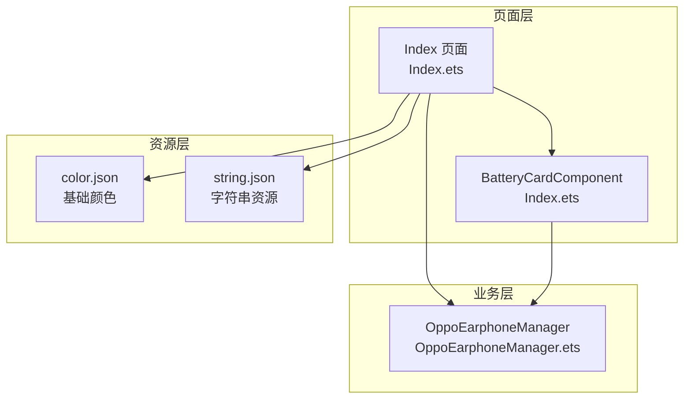
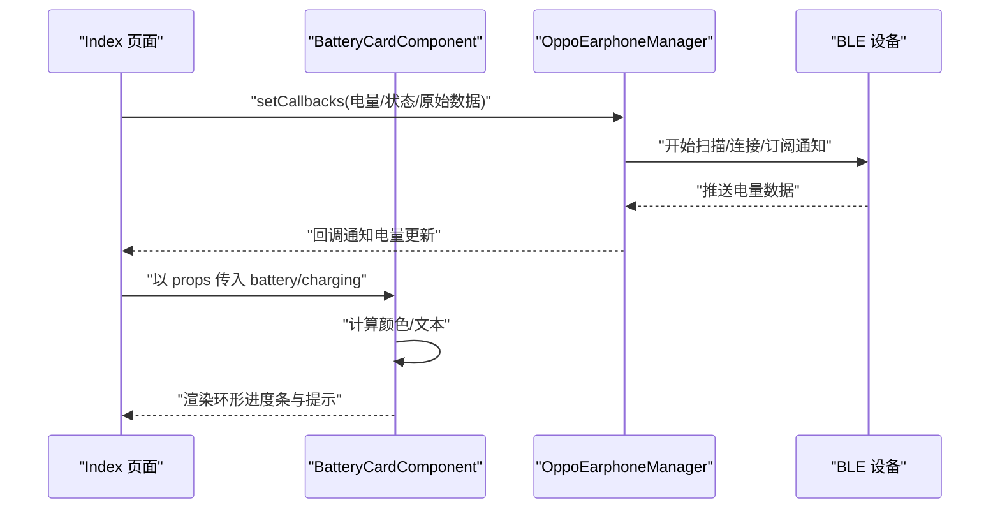
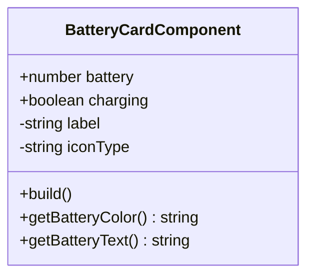
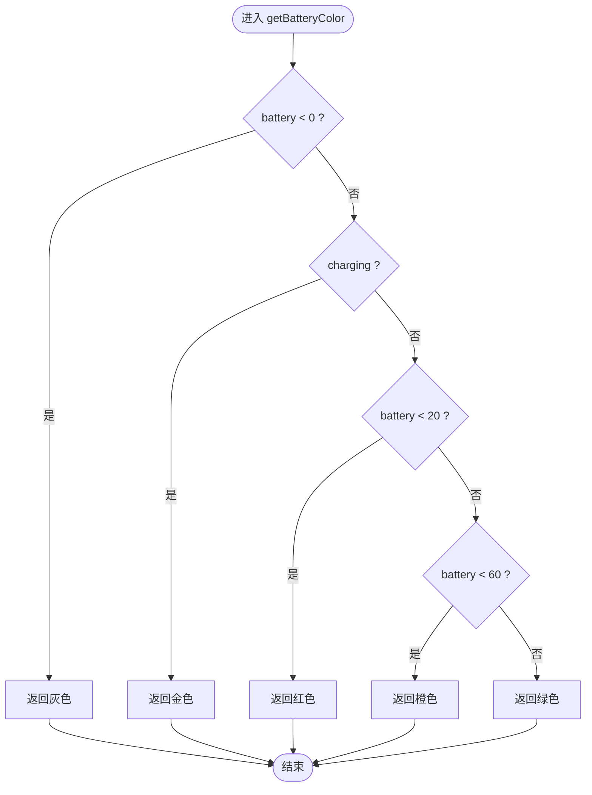
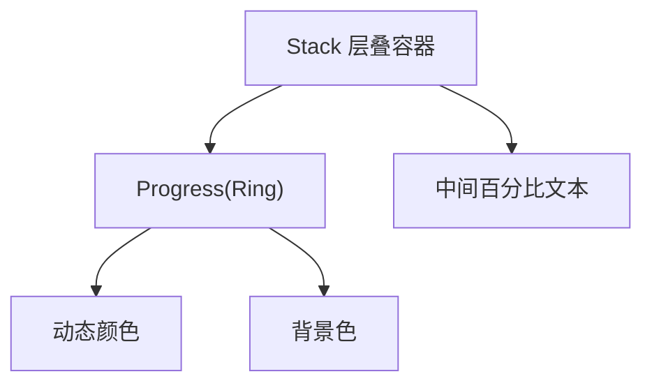
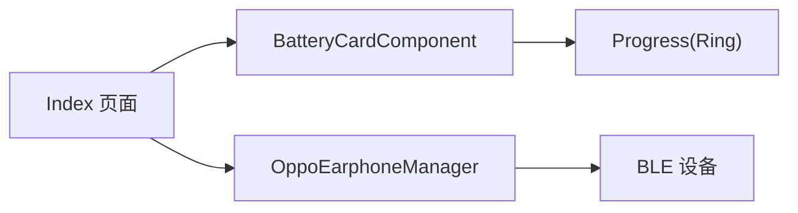

# 电量卡片组件

<cite>
**本文引用的文件**
- [Index.ets](file://entry/src/main/ets/pages/Index.ets)
- [OppoEarphoneManager.ets](file://entry/src/main/ets/manager/OppoEarphoneManager.ets)
- [color.json](file://entry/src/main/resources/base/element/color.json)
- [string.json](file://AppScope/resources/base/element/string.json)
</cite>

## 目录
1. [简介](#简介)
2. [项目结构](#项目结构)
3. [核心组件](#核心组件)
4. [架构总览](#架构总览)
5. [详细组件分析](#详细组件分析)
6. [依赖关系分析](#依赖关系分析)
7. [性能考量](#性能考量)
8. [故障排查指南](#故障排查指南)
9. [结论](#结论)
10. [附录](#附录)

## 简介
本文件系统性地解析电量卡片组件 BatteryCardComponent 的实现原理与最佳实践，涵盖：
- @Prop 装饰器的数据绑定与响应式更新机制
- 电量颜色判断算法（低电量警告、充电状态高亮、正常电量分级）
- 环形进度条 Progress 组件的配置（Ring 类型、尺寸与背景色）
- 组件内部状态管理（iconType 图标类型、label 标签显示、charging 充电状态）
- 完整的组件 API 文档（props 参数、样式定制、事件处理）
- 组件复用与自定义样式的实现方法
- 无障碍访问与国际化配置建议

## 项目结构
本项目采用基于页面与模块的组织方式，电量卡片组件位于页面入口文件中，并通过 Manager 管理蓝牙连接与电量数据。

图表来源
- [Index.ets:1-476](file://entry/src/main/ets/pages/Index.ets#L1-L476)
- [OppoEarphoneManager.ets:1-747](file://entry/src/main/ets/manager/OppoEarphoneManager.ets#L1-L747)
- [color.json:1-8](file://entry/src/main/resources/base/element/color.json#L1-L8)
- [string.json:1-9](file://AppScope/resources/base/element/string.json#L1-L9)

章节来源
- [Index.ets:1-476](file://entry/src/main/ets/pages/Index.ets#L1-L476)
- [OppoEarphoneManager.ets:1-747](file://entry/src/main/ets/manager/OppoEarphoneManager.ets#L1-L747)

## 核心组件
BatteryCardComponent 是一个独立的 UI 组件，负责渲染单个设备（左耳、右耳、充电仓）的电量卡片，包含：
- 设备图标（根据 iconType 决定）
- 环形进度条（Ring 类型）
- 百分比文本
- 设备名称标签
- 充电状态或低电量提示

其核心特性：
- 通过 @Prop 接收父组件传递的 battery 与 charging
- 内部计算电量颜色与文本
- 使用 Stack 层叠布局实现环形进度条与中心文本叠加
- 根据充电状态或电量阈值显示不同提示

章节来源
- [Index.ets:10-98](file://entry/src/main/ets/pages/Index.ets#L10-L98)

## 架构总览
下图展示了从页面到组件再到管理器的数据流与交互关系。

图表来源
- [Index.ets:119-159](file://entry/src/main/ets/pages/Index.ets#L119-L159)
- [OppoEarphoneManager.ets:117-125](file://entry/src/main/ets/manager/OppoEarphoneManager.ets#L117-L125)
- [OppoEarphoneManager.ets:449-479](file://entry/src/main/ets/manager/OppoEarphoneManager.ets#L449-L479)

章节来源
- [Index.ets:119-159](file://entry/src/main/ets/pages/Index.ets#L119-L159)
- [OppoEarphoneManager.ets:117-125](file://entry/src/main/ets/manager/OppoEarphoneManager.ets#L117-L125)

## 详细组件分析

### BatteryCardComponent 组件类图

图表来源
- [Index.ets:10-98](file://entry/src/main/ets/pages/Index.ets#L10-L98)

章节来源
- [Index.ets:10-98](file://entry/src/main/ets/pages/Index.ets#L10-L98)

### 电量颜色判断算法
组件根据 battery 与 charging 的组合决定颜色：
- 无电量数据（battery < 0）：灰色
- 正在充电（charging 为真）：金色
- 电量低于 20%：红色
- 电量 20%-60%：橙色
- 电量高于等于 60%：绿色

图表来源
- [Index.ets:17-31](file://entry/src/main/ets/pages/Index.ets#L17-L31)

章节来源
- [Index.ets:17-31](file://entry/src/main/ets/pages/Index.ets#L17-L31)

### 环形进度条配置
- 类型：Ring（环形）
- 尺寸：宽高均为 100
- 颜色：由 getBatteryColor 动态计算
- 背景色：深色背景用于对比度
- 文本：居中显示百分比或占位符

图表来源
- [Index.ets:44-56](file://entry/src/main/ets/pages/Index.ets#L44-L56)

章节来源
- [Index.ets:44-56](file://entry/src/main/ets/pages/Index.ets#L44-L56)

### 组件内部状态管理
- label：设备名称（左耳/右耳/充电仓）
- iconType：图标类型（L/R/C）
- charging：是否充电
- battery：电量百分比（-1 表示未知）

章节来源
- [Index.ets:12-15](file://entry/src/main/ets/pages/Index.ets#L12-L15)

### 组件 API 文档
- 组件名：BatteryCardComponent
- 输入属性（props）
  - battery: number，默认 -1；表示电量百分比，-1 表示未知
  - charging: boolean，默认 false；表示是否正在充电
- 内部状态
  - label: string；设备名称标签
  - iconType: string；图标类型，取值 L/R/C
- 输出行为
  - 渲染环形进度条（Ring）
  - 渲染设备名称文本
  - 在充电时显示“充电中”提示，在低电量时显示“电量低”提示
- 样式定制
  - 可通过外部容器样式控制宽度、圆角、边框、背景色等
  - 进度条颜色由 getBatteryColor 动态决定
  - 文本颜色与字号可按需调整
- 事件处理
  - 本组件未定义对外事件；通过 props 接收数据并驱动 UI 更新

章节来源
- [Index.ets:10-98](file://entry/src/main/ets/pages/Index.ets#L10-L98)

### 组件复用与自定义样式
- 复用方式
  - 在父组件中多次实例化 BatteryCardComponent，分别传入不同的 battery、charging、label、iconType
  - 示例：左耳、右耳、充电仓三列布局
- 自定义样式
  - 外层容器：可调整宽度、内边距、圆角、边框、背景色
  - 进度条：可调整尺寸、颜色、背景色
  - 文本：可调整字号、粗细、颜色
  - 提示标签：可调整字号、颜色、圆角、背景色

章节来源
- [Index.ets:316-326](file://entry/src/main/ets/pages/Index.ets#L316-L326)

### 无障碍访问与国际化配置
- 无障碍访问
  - 文本内容为纯数字与固定提示词，具备基本可读性
  - 建议：为关键状态添加语义化描述（如屏幕阅读器朗读“充电中”、“电量低”）
- 国际化配置
  - 字符串资源位于 AppScope 的 string.json
  - 建议：将“充电中”、“电量低”等文案抽取至资源文件，按语言切换

章节来源
- [string.json:1-9](file://AppScope/resources/base/element/string.json#L1-L9)

## 依赖关系分析
- BatteryCardComponent 依赖于 Progress 组件（Ring 类型）进行可视化展示
- BatteryCardComponent 由 Index 页面实例化并传入 props
- Index 页面通过 OppoEarphoneManager 管理蓝牙连接与电量数据，回调更新 @State，从而触发 BatteryCardComponent 的响应式更新

图表来源
- [Index.ets:316-326](file://entry/src/main/ets/pages/Index.ets#L316-L326)
- [OppoEarphoneManager.ets:117-125](file://entry/src/main/ets/manager/OppoEarphoneManager.ets#L117-L125)

章节来源
- [Index.ets:316-326](file://entry/src/main/ets/pages/Index.ets#L316-L326)
- [OppoEarphoneManager.ets:117-125](file://entry/src/main/ets/manager/OppoEarphoneManager.ets#L117-L125)

## 性能考量
- 数据更新频率控制
  - 管理器仅在电量为整十数（0,10,20,...,100）时通知 UI 更新，减少不必要的重绘
- 组件渲染优化
  - 使用 @Prop 单向绑定，避免 @Builder 按值传参导致的响应式依赖缺失
  - 进度条与文本叠加在 Stack 中，层级清晰，避免复杂布局嵌套
- 资源与样式
  - 使用统一的深色背景与高对比度文本，提升可读性
  - 颜色计算逻辑简单，开销极低

章节来源
- [Index.ets:124-136](file://entry/src/main/ets/pages/Index.ets#L124-L136)

## 故障排查指南
- UI 不更新
  - 症状：电量变化但界面未刷新
  - 原因：使用 @Builder 按值传参导致响应式依赖缺失
  - 解决：确保通过 @Prop 接收数据，父组件使用 @State 并在回调中更新 @State
- 电量颜色异常
  - 症状：充电状态未高亮或颜色不符合预期
  - 原因：battery 为负值或 charging 未正确传递
  - 解决：检查父组件回调中的 battery 与 charging 传入
- 进度条不显示
  - 症状：环形进度条不显示或颜色异常
  - 原因：value 为负时被限制为 0，或颜色计算错误
  - 解决：确认 battery 与 charging 的传入值范围

章节来源
- [Index.ets:7-9](file://entry/src/main/ets/pages/Index.ets#L7-L9)
- [Index.ets:17-31](file://entry/src/main/ets/pages/Index.ets#L17-L31)
- [Index.ets:44-56](file://entry/src/main/ets/pages/Index.ets#L44-L56)

## 结论
BatteryCardComponent 通过简洁的 @Prop 绑定与高效的颜色计算，实现了对 OPPO 耳机电量的直观展示。结合 OppoEarphoneManager 的蓝牙数据解析与回调机制，组件能够稳定地响应实时电量变化。建议在后续版本中进一步完善无障碍与国际化支持，并考虑将文案与颜色策略抽象为可配置项，以增强复用性与可维护性。

## 附录
- 样式资源参考
  - 基础颜色资源：用于主题色与背景色的统一管理
  - 字符串资源：用于多语言文案的集中管理

章节来源
- [color.json:1-8](file://entry/src/main/resources/base/element/color.json#L1-L8)
- [string.json:1-9](file://AppScope/resources/base/element/string.json#L1-L9)