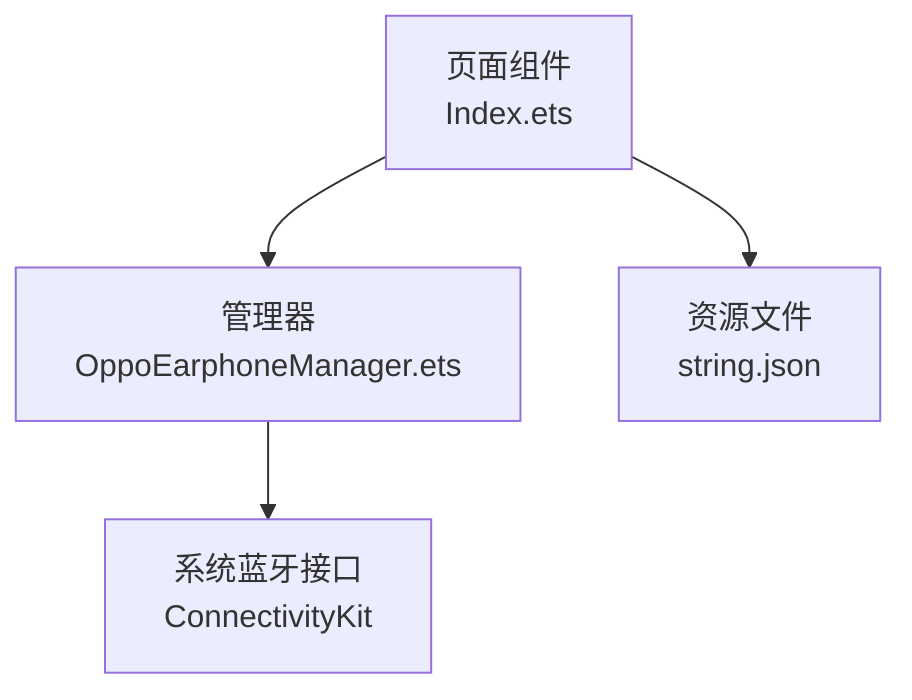
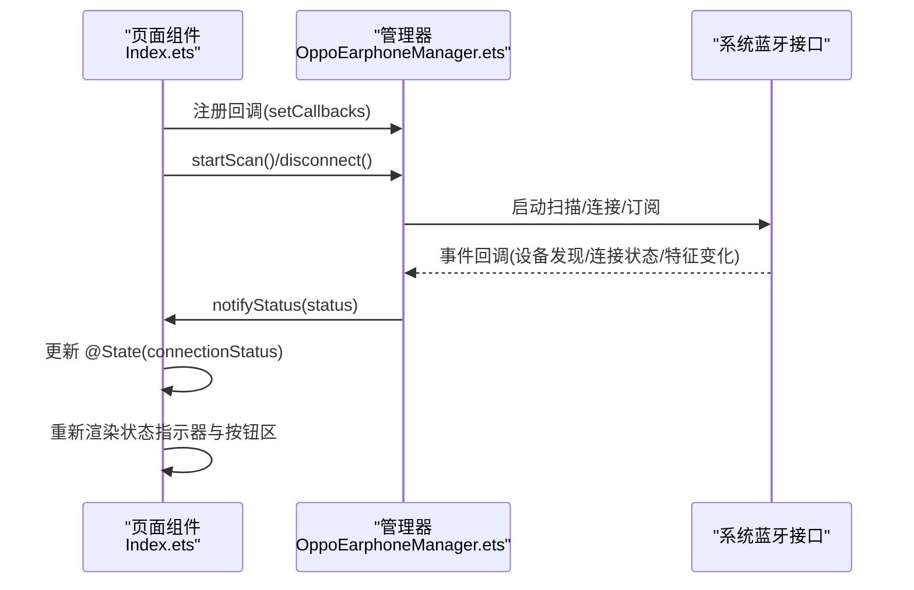
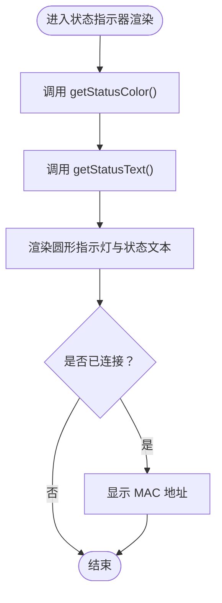
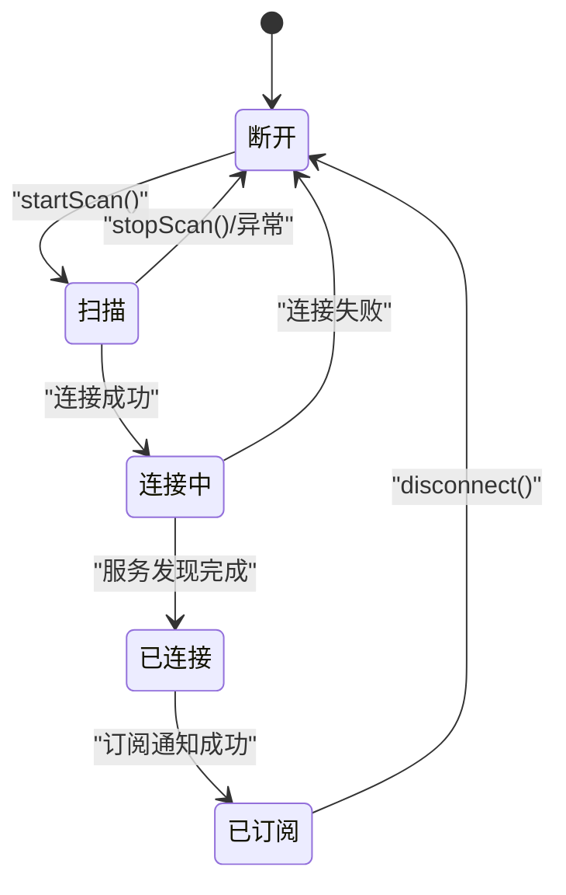
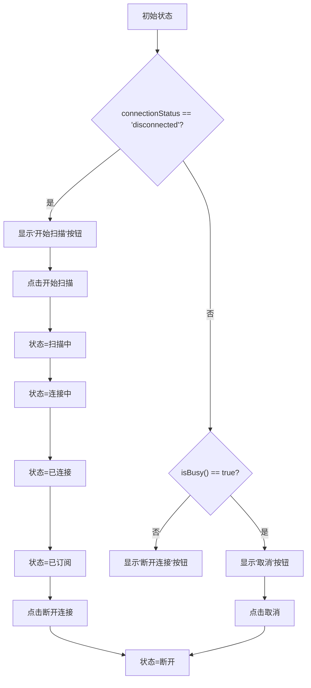
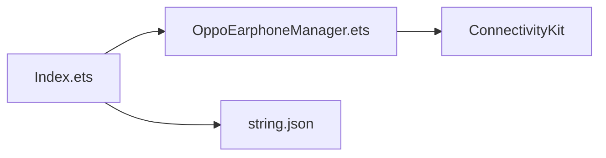

# 连接状态指示器

<cite>
**本文档引用的文件**
- [Index.ets](file://entry/src/main/ets/pages/Index.ets)
- [OppoEarphoneManager.ets](file://entry/src/main/ets/manager/OppoEarphoneManager.ets)
- [string.json](file://AppScope/resources/base/element/string.json)
</cite>

## 目录
1. [简介](#简介)
2. [项目结构](#项目结构)
3. [核心组件](#核心组件)
4. [架构总览](#架构总览)
5. [详细组件分析](#详细组件分析)
6. [依赖关系分析](#依赖关系分析)
7. [性能考虑](#性能考虑)
8. [故障排查指南](#故障排查指南)
9. [结论](#结论)
10. [附录](#附录)

## 简介
本文件围绕连接状态指示器的实现进行系统性说明，重点涵盖：
- 状态指示器的设计思路：圆形状态指示灯与状态文本的组合显示
- ConnectionStatus 枚举类型的处理逻辑：disconnected、scanning、connecting、connected、subscribed 的视觉反馈
- 状态颜色映射表：不同状态对应的颜色配置与情感化设计原则
- 状态文本的本地化处理与动态更新机制
- 状态切换的完整流程：从扫描到订阅的链路与回调触发点
- 状态检查方法 isBusy() 的实现逻辑
- 样式定制指南与动画效果建议
- 状态变化对整体 UI 布局的影响与响应机制

## 项目结构
连接状态指示器位于页面入口组件中，由状态管理器负责状态流转，并通过回调驱动 UI 更新。关键文件与职责如下：
- 页面组件：负责渲染状态指示器、按钮区与提示区，并根据状态动态更新颜色与文案
- 管理器：封装蓝牙扫描、连接、服务发现与订阅流程，统一发出状态变更通知
- 资源文件：提供应用字符串资源（如应用名）

**图表来源**
- [Index.ets:100-476](file://entry/src/main/ets/pages/Index.ets#L100-L476)
- [OppoEarphoneManager.ets:1-747](file://entry/src/main/ets/manager/OppoEarphoneManager.ets#L1-L747)
- [string.json:1-9](file://AppScope/resources/base/element/string.json#L1-L9)

**章节来源**
- [Index.ets:100-476](file://entry/src/main/ets/pages/Index.ets#L100-L476)
- [OppoEarphoneManager.ets:1-747](file://entry/src/main/ets/manager/OppoEarphoneManager.ets#L1-L747)
- [string.json:1-9](file://AppScope/resources/base/element/string.json#L1-L9)

## 核心组件
- 状态指示器区域：由一个圆角矩形指示灯与状态文本组成，颜色与文本随 ConnectionStatus 动态变化
- 状态管理器：负责扫描、连接、服务发现与订阅，并在各阶段发出状态回调
- 页面回调注册：在组件生命周期内注册回调，接收状态变化并更新 @State
- 按钮区联动：根据状态与 isBusy() 控制按钮显示与交互行为

关键实现位置：
- 状态指示器渲染：[Index.ets:280-313](file://entry/src/main/ets/pages/Index.ets#L280-L313)
- 状态文本映射：[Index.ets:184-202](file://entry/src/main/ets/pages/Index.ets#L184-L202)
- 状态颜色映射：[Index.ets:204-222](file://entry/src/main/ets/pages/Index.ets#L204-L222)
- 状态检查 isBusy()：[Index.ets:224-231](file://entry/src/main/ets/pages/Index.ets#L224-L231)
- 管理器状态通知：[OppoEarphoneManager.ets:673-681](file://entry/src/main/ets/manager/OppoEarphoneManager.ets#L673-L681)

**章节来源**
- [Index.ets:184-231](file://entry/src/main/ets/pages/Index.ets#L184-L231)
- [OppoEarphoneManager.ets:673-681](file://entry/src/main/ets/manager/OppoEarphoneManager.ets#L673-L681)

## 架构总览
连接状态指示器的运行时架构如下：

**图表来源**
- [Index.ets:119-159](file://entry/src/main/ets/pages/Index.ets#L119-L159)
- [OppoEarphoneManager.ets:135-211](file://entry/src/main/ets/manager/OppoEarphoneManager.ets#L135-L211)
- [OppoEarphoneManager.ets:293-344](file://entry/src/main/ets/manager/OppoEarphoneManager.ets#L293-L344)
- [OppoEarphoneManager.ets:449-481](file://entry/src/main/ets/manager/OppoEarphoneManager.ets#L449-L481)
- [OppoEarphoneManager.ets:673-681](file://entry/src/main/ets/manager/OppoEarphoneManager.ets#L673-L681)

## 详细组件分析

### 状态指示器设计与实现
- 组成元素
  - 圆形指示灯：使用窄矩形并设置圆角半径形成圆形效果，背景色由状态颜色映射决定
  - 状态文本：显示当前状态的中文描述，颜色与指示灯一致
  - 可选 MAC 地址：在连接成功后显示设备 MAC 地址（等宽字体）
- 响应式更新
  - 页面组件持有 @State connectionStatus，状态变化自动触发 build 重绘
  - 指示灯与文本均通过方法 getStatusColor() 与 getStatusText() 动态计算

关键实现位置：
- 指示器渲染与样式：[Index.ets:280-313](file://entry/src/main/ets/pages/Index.ets#L280-L313)
- 颜色映射方法：[Index.ets:204-222](file://entry/src/main/ets/pages/Index.ets#L204-L222)
- 文本映射方法：[Index.ets:184-202](file://entry/src/main/ets/pages/Index.ets#L184-L202)

**图表来源**
- [Index.ets:204-222](file://entry/src/main/ets/pages/Index.ets#L204-L222)
- [Index.ets:184-202](file://entry/src/main/ets/pages/Index.ets#L184-L202)
- [Index.ets:280-313](file://entry/src/main/ets/pages/Index.ets#L280-L313)

**章节来源**
- [Index.ets:184-222](file://entry/src/main/ets/pages/Index.ets#L184-L222)
- [Index.ets:280-313](file://entry/src/main/ets/pages/Index.ets#L280-L313)

### ConnectionStatus 枚举与状态流转
- 枚举定义：ConnectionStatus 包含五个状态
  - disconnected：初始或断开
  - scanning：扫描中
  - connecting：连接中
  - connected：已连接但尚未订阅
  - subscribed：已订阅通知，可接收电量数据
- 管理器状态推进
  - startScan() → scanning → 发现目标设备 → connecting → 连接成功 → connected → 订阅成功 → subscribed
  - disconnect() → 停止扫描/清理资源 → disconnected
- 回调通知
  - 管理器内部通过 notifyStatus(status) 将状态传递给页面组件

关键实现位置：
- 枚举定义：[OppoEarphoneManager.ets:36-37](file://entry/src/main/ets/manager/OppoEarphoneManager.ets#L36-L37)
- 状态推进链路：
  - 扫描与连接：[OppoEarphoneManager.ets:135-211](file://entry/src/main/ets/manager/OppoEarphoneManager.ets#L135-L211)、[OppoEarphoneManager.ets:293-344](file://entry/src/main/ets/manager/OppoEarphoneManager.ets#L293-L344)
  - 服务发现与订阅：[OppoEarphoneManager.ets:355-411](file://entry/src/main/ets/manager/OppoEarphoneManager.ets#L355-L411)、[OppoEarphoneManager.ets:423-481](file://entry/src/main/ets/manager/OppoEarphoneManager.ets#L423-L481)
  - 断开与清理：[OppoEarphoneManager.ets:271-279](file://entry/src/main/ets/manager/OppoEarphoneManager.ets#L271-L279)、[OppoEarphoneManager.ets:691-743](file://entry/src/main/ets/manager/OppoEarphoneManager.ets#L691-L743)
- 页面接收回调并更新状态：[Index.ets:138-146](file://entry/src/main/ets/pages/Index.ets#L138-L146)

**图表来源**
- [OppoEarphoneManager.ets:135-211](file://entry/src/main/ets/manager/OppoEarphoneManager.ets#L135-L211)
- [OppoEarphoneManager.ets:293-344](file://entry/src/main/ets/manager/OppoEarphoneManager.ets#L293-L344)
- [OppoEarphoneManager.ets:355-411](file://entry/src/main/ets/manager/OppoEarphoneManager.ets#L355-L411)
- [OppoEarphoneManager.ets:423-481](file://entry/src/main/ets/manager/OppoEarphoneManager.ets#L423-L481)
- [OppoEarphoneManager.ets:271-279](file://entry/src/main/ets/manager/OppoEarphoneManager.ets#L271-L279)

**章节来源**
- [OppoEarphoneManager.ets:36-37](file://entry/src/main/ets/manager/OppoEarphoneManager.ets#L36-L37)
- [Index.ets:138-146](file://entry/src/main/ets/pages/Index.ets#L138-L146)

### 状态颜色映射与情感化设计
- 颜色映射表
  - 未连接：灰色
  - 扫描中：蓝色
  - 连接中：橙色
  - 已连接：蓝色
  - 已订阅：绿色
- 设计原则
  - 语义化：蓝色代表稳定/进行中；绿色代表成功；橙色代表警告/处理中；灰色代表不可用
  - 一致性：状态文本与指示灯颜色保持一致，强化视觉识别
  - 可访问性：颜色搭配满足基本对比度要求，避免纯红/绿组合

关键实现位置：
- 颜色映射方法：[Index.ets:204-222](file://entry/src/main/ets/pages/Index.ets#L204-L222)

**章节来源**
- [Index.ets:204-222](file://entry/src/main/ets/pages/Index.ets#L204-L222)

### 状态文本本地化与动态更新
- 文本映射
  - 未连接：未连接
  - 扫描中：正在扫描...
  - 连接中：正在连接...
  - 已连接：正在发现服务...
  - 已订阅：已连接
- 本地化策略
  - 当前项目未提供多语言资源，状态文本直接硬编码为中文
  - 若需国际化，可在资源文件中添加键值对并通过框架 API 获取对应语言文本
- 动态更新机制
  - 页面组件通过回调接收状态变化，立即更新 @State 并触发 UI 重绘
  - 状态文本与颜色均通过方法调用实时计算，保证与当前状态一致

关键实现位置：
- 文本映射方法：[Index.ets:184-202](file://entry/src/main/ets/pages/Index.ets#L184-L202)
- 回调注册与状态更新：[Index.ets:119-159](file://entry/src/main/ets/pages/Index.ets#L119-L159)
- 资源文件（应用名）：[string.json:1-9](file://AppScope/resources/base/element/string.json#L1-L9)

**章节来源**
- [Index.ets:184-202](file://entry/src/main/ets/pages/Index.ets#L184-L202)
- [Index.ets:119-159](file://entry/src/main/ets/pages/Index.ets#L119-L159)
- [string.json:1-9](file://AppScope/resources/base/element/string.json#L1-L9)

### 状态切换流程与 isBusy() 实现
- isBusy() 逻辑
  - 返回 true 的状态：scanning、connecting、connected
  - 用于控制按钮区显示“取消”按钮，避免用户重复操作
- 完整流程
  - 未连接：显示“开始扫描”按钮
  - 扫描/连接/发现服务：显示“取消”按钮
  - 已连接：显示“断开连接”按钮
- 交互细节
  - 扫描提示：开始扫描后短暂显示提示，5 秒后自动隐藏
  - 权限控制：无蓝牙权限时按钮置灰不可用

关键实现位置：
- isBusy() 方法：[Index.ets:224-231](file://entry/src/main/ets/pages/Index.ets#L224-L231)
- 按钮区逻辑：[Index.ets:329-407](file://entry/src/main/ets/pages/Index.ets#L329-L407)
- 扫描提示与权限：[Index.ets:119-159](file://entry/src/main/ets/pages/Index.ets#L119-L159)

**图表来源**
- [Index.ets:224-231](file://entry/src/main/ets/pages/Index.ets#L224-L231)
- [Index.ets:329-407](file://entry/src/main/ets/pages/Index.ets#L329-L407)

**章节来源**
- [Index.ets:224-231](file://entry/src/main/ets/pages/Index.ets#L224-L231)
- [Index.ets:329-407](file://entry/src/main/ets/pages/Index.ets#L329-L407)

### 样式定制指南与动画建议
- 颜色定制
  - 修改状态颜色映射方法中的返回值即可全局调整颜色
  - 建议为深浅色主题分别维护颜色表，结合系统主题切换
- 形状与尺寸
  - 指示灯尺寸与圆角可通过容器属性调整
  - 文本字号与字重可根据品牌规范微调
- 动画效果建议
  - 颜色过渡：使用渐变或过渡动画提升状态切换的顺滑感
  - 缩放/脉冲：在“已订阅”状态下可添加轻微缩放或呼吸动画
  - 提示文案：扫描提示可加入淡入淡出动画
- 布局适配
  - 指示器区域采用居中对齐与圆角背景，确保在不同屏幕尺寸下保持良好可读性

**章节来源**
- [Index.ets:204-222](file://entry/src/main/ets/pages/Index.ets#L204-L222)
- [Index.ets:280-313](file://entry/src/main/ets/pages/Index.ets#L280-L313)

### 状态变化对 UI 布局的影响
- 状态指示器
  - 颜色与文本随状态实时更新，无需额外布局调整
- 按钮区
  - 根据状态与 isBusy() 切换按钮类型与颜色，影响交互层
- 提示区
  - 扫描提示在扫描期间显示，扫描结束后自动隐藏，避免遮挡主内容
- 电量卡片
  - 与连接状态无直接耦合，但连接成功后可触发电量数据更新

**章节来源**
- [Index.ets:329-407](file://entry/src/main/ets/pages/Index.ets#L329-L407)
- [Index.ets:453-474](file://entry/src/main/ets/pages/Index.ets#L453-L474)

## 依赖关系分析
- 页面组件依赖管理器提供的状态回调
- 管理器依赖系统蓝牙接口进行扫描、连接与订阅
- 资源文件为应用级字符串资源，当前项目未在状态指示器中直接使用

**图表来源**
- [Index.ets:100-476](file://entry/src/main/ets/pages/Index.ets#L100-L476)
- [OppoEarphoneManager.ets:1-747](file://entry/src/main/ets/manager/OppoEarphoneManager.ets#L1-L747)
- [string.json:1-9](file://AppScope/resources/base/element/string.json#L1-L9)

**章节来源**
- [Index.ets:100-476](file://entry/src/main/ets/pages/Index.ets#L100-L476)
- [OppoEarphoneManager.ets:1-747](file://entry/src/main/ets/manager/OppoEarphoneManager.ets#L1-L747)
- [string.json:1-9](file://AppScope/resources/base/element/string.json#L1-L9)

## 性能考虑
- 状态更新频率
  - 管理器仅在状态发生实质性变化时发出回调，避免频繁重绘
- UI 渲染优化
  - 状态指示器为轻量组件，使用局部状态更新即可触发最小化重绘
- 数据更新节流
  - 电量更新按整十阈值过滤，减少不必要的 UI 刷新

**章节来源**
- [Index.ets:124-136](file://entry/src/main/ets/pages/Index.ets#L124-L136)

## 故障排查指南
- 无蓝牙权限
  - 现象：扫描按钮不可用，界面提示需要授权
  - 排查：确认权限请求流程执行成功，检查权限结果
  - 参考位置：[Index.ets:168-182](file://entry/src/main/ets/pages/Index.ets#L168-L182)
- 扫描失败或超时
  - 现象：状态停留在扫描中或回到断开
  - 排查：检查系统蓝牙开关、设备距离与干扰情况；查看异常日志
  - 参考位置：[OppoEarphoneManager.ets:187-210](file://entry/src/main/ets/manager/OppoEarphoneManager.ets#L187-L210)
- 连接失败
  - 现象：状态停留在连接中或回到断开
  - 排查：确认目标设备处于可连接状态，检查连接回调与异常处理
  - 参考位置：[OppoEarphoneManager.ets:335-344](file://entry/src/main/ets/manager/OppoEarphoneManager.ets#L335-L344)
- 订阅失败
  - 现象：状态停留在已连接，无法接收电量数据
  - 排查：确认服务与特征存在，检查通知开启回调与异常
  - 参考位置：[OppoEarphoneManager.ets:465-481](file://entry/src/main/ets/manager/OppoEarphoneManager.ets#L465-L481)
- 断开后状态未更新
  - 现象：点击断开后状态仍显示“取消”按钮
  - 排查：确认 disconnect() 是否正确调用并触发清理与回调
  - 参考位置：[OppoEarphoneManager.ets:271-279](file://entry/src/main/ets/manager/OppoEarphoneManager.ets#L271-L279)

**章节来源**
- [Index.ets:168-182](file://entry/src/main/ets/pages/Index.ets#L168-L182)
- [OppoEarphoneManager.ets:187-210](file://entry/src/main/ets/manager/OppoEarphoneManager.ets#L187-L210)
- [OppoEarphoneManager.ets:335-344](file://entry/src/main/ets/manager/OppoEarphoneManager.ets#L335-L344)
- [OppoEarphoneManager.ets:465-481](file://entry/src/main/ets/manager/OppoEarphoneManager.ets#L465-L481)
- [OppoEarphoneManager.ets:271-279](file://entry/src/main/ets/manager/OppoEarphoneManager.ets#L271-L279)

## 结论
连接状态指示器通过简洁的圆形指示灯与状态文本组合，实现了清晰、直观的状态传达。配合完善的管理器状态流转与回调机制，页面能够及时响应状态变化并动态调整 UI。颜色映射遵循情感化设计原则，文本映射与本地化策略明确，isBusy() 有效避免了用户误操作。整体实现结构清晰、扩展性强，便于后续样式定制与动画增强。

## 附录
- 关键方法与位置索引
  - 状态颜色映射：[Index.ets:204-222](file://entry/src/main/ets/pages/Index.ets#L204-L222)
  - 状态文本映射：[Index.ets:184-202](file://entry/src/main/ets/pages/Index.ets#L184-L202)
  - 状态检查 isBusy()：[Index.ets:224-231](file://entry/src/main/ets/pages/Index.ets#L224-L231)
  - 管理器状态通知：[OppoEarphoneManager.ets:673-681](file://entry/src/main/ets/manager/OppoEarphoneManager.ets#L673-L681)
  - 扫描与连接流程：[OppoEarphoneManager.ets:135-211](file://entry/src/main/ets/manager/OppoEarphoneManager.ets#L135-L211)、[OppoEarphoneManager.ets:293-344](file://entry/src/main/ets/manager/OppoEarphoneManager.ets#L293-L344)
  - 订阅与电量解析：[OppoEarphoneManager.ets:423-481](file://entry/src/main/ets/manager/OppoEarphoneManager.ets#L423-L481)、[OppoEarphoneManager.ets:505-599](file://entry/src/main/ets/manager/OppoEarphoneManager.ets#L505-L599)