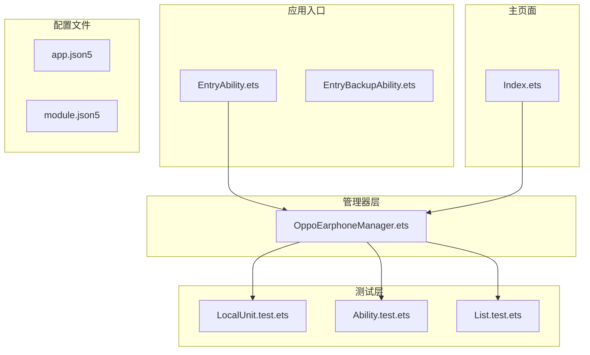
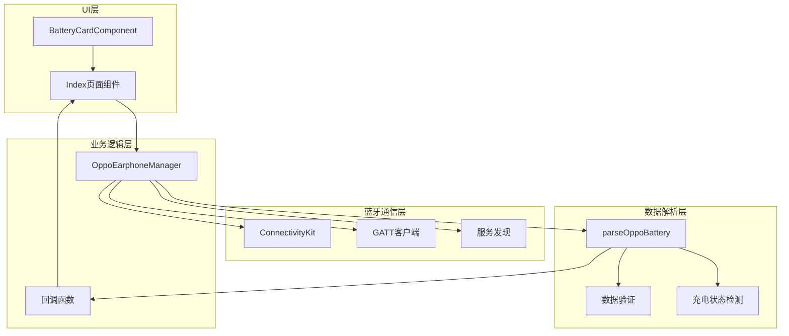
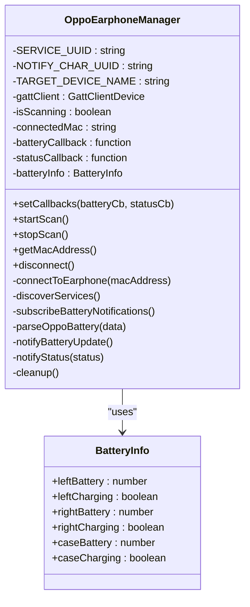
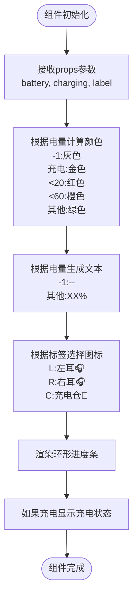
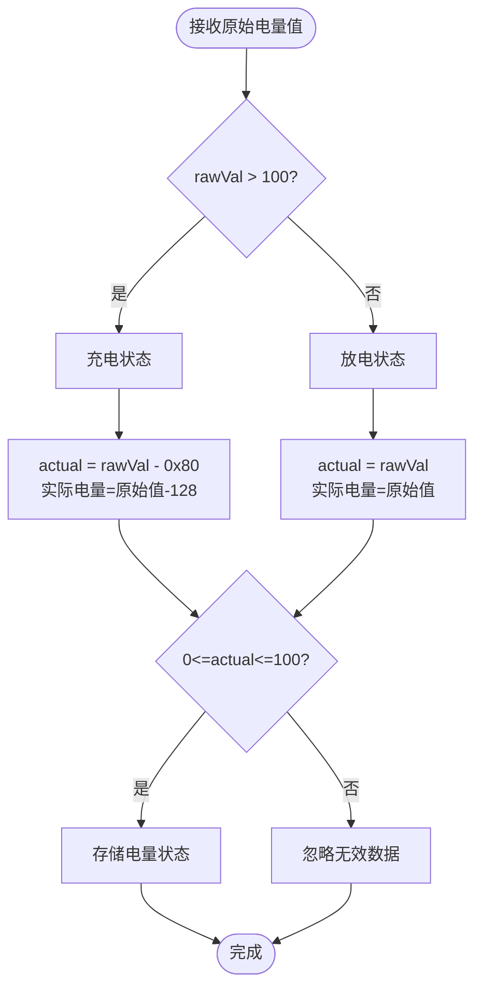
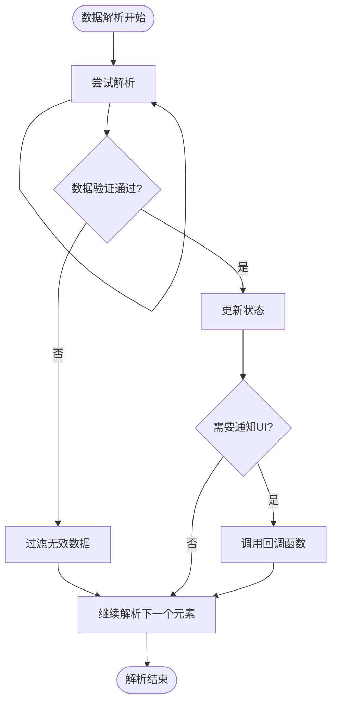
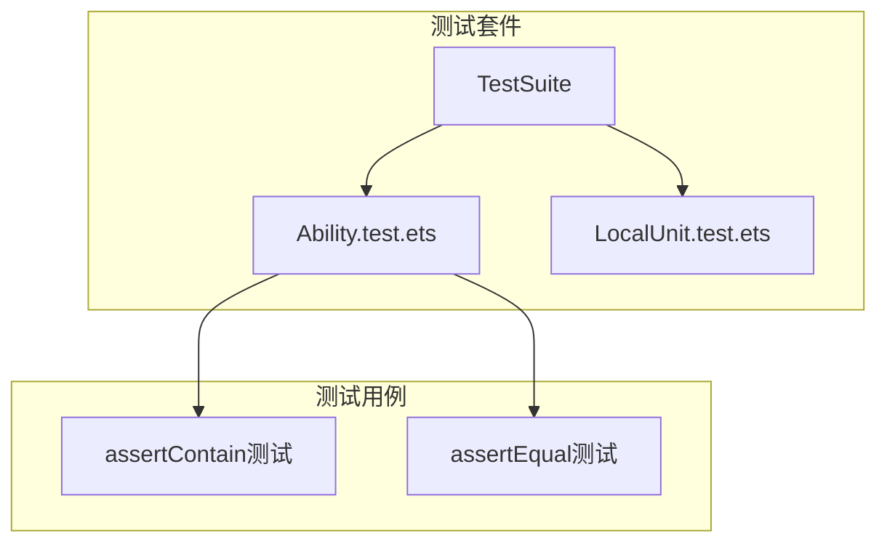

# 电量数据解析

<cite>
**本文档引用的文件**
- [OppoEarphoneManager.ets](file://entry/src/main/ets/manager/OppoEarphoneManager.ets)
- [Index.ets](file://entry/src/main/ets/pages/Index.ets)
- [List.test.ets](file://entry/src/ohosTest/ets/test/List.test.ets)
- [Ability.test.ets](file://entry/src/ohosTest/ets/test/Ability.test.ets)
- [LocalUnit.test.ets](file://entry/src/test/LocalUnit.test.ets)
</cite>

## 目录
1. [简介](#简介)
2. [项目结构](#项目结构)
3. [核心组件](#核心组件)
4. [架构概览](#架构概览)
5. [详细组件分析](#详细组件分析)
6. [数据包格式与协议](#数据包格式与协议)
7. [解析算法详解](#解析算法详解)
8. [边界情况处理](#边界情况处理)
9. [性能考虑](#性能考虑)
10. [测试用例与调试](#测试用例与调试)
11. [故障排除指南](#故障排除指南)
12. [结论](#结论)

## 简介

本技术文档专注于OPPO Enco Air5 Pro蓝牙耳机的电量数据解析系统。该系统实现了完整的蓝牙GATT通信协议，能够准确解析耳机返回的电量数据包，识别左耳、右耳和充电仓的电量状态，并检测充电状态。

该实现基于OpenHarmony平台，采用TypeScript语法编写，提供了从蓝牙扫描、GATT连接到数据解析的完整解决方案。文档将深入分析parseOppoBattery方法的核心算法，解释数据包格式规范，提供完整的解析流程图和算法伪代码。

## 项目结构

项目采用模块化设计，主要包含以下关键目录和文件：



**图表来源**
- [OppoEarphoneManager.ets:1-709](file://entry/src/main/ets/manager/OppoEarphoneManager.ets#L1-L709)
- [Index.ets:1-408](file://entry/src/main/ets/pages/Index.ets#L1-L408)

**章节来源**
- [OppoEarphoneManager.ets:1-709](file://entry/src/main/ets/manager/OppoEarphoneManager.ets#L1-L709)
- [Index.ets:1-408](file://entry/src/main/ets/pages/Index.ets#L1-L408)

## 核心组件

系统由三个核心组件构成：

### 1. OppoEarphoneManager类
负责蓝牙扫描、GATT连接、服务发现和电量数据解析的完整生命周期管理。

### 2. BatteryInfo接口
定义电量数据模型，包含左右耳电量和充电状态信息。

### 3. Index页面组件
提供用户界面展示，实时显示电量状态和连接状态。

**章节来源**
- [OppoEarphoneManager.ets:49-709](file://entry/src/main/ets/manager/OppoEarphoneManager.ets#L49-L709)
- [Index.ets:1-408](file://entry/src/main/ets/pages/Index.ets#L1-L408)

## 架构概览

系统采用分层架构设计，实现了清晰的关注点分离：



**图表来源**
- [OppoEarphoneManager.ets:49-709](file://entry/src/main/ets/manager/OppoEarphoneManager.ets#L49-L709)
- [Index.ets:100-408](file://entry/src/main/ets/pages/Index.ets#L100-L408)

## 详细组件分析

### OppoEarphoneManager类分析

该类实现了完整的蓝牙耳机电量管理系统，包含以下关键功能：

#### 1. 蓝牙连接管理
- 设备扫描和发现
- GATT服务连接
- 特征值通知订阅

#### 2. 电量数据解析
- 三通道电量识别（左耳、右耳、充电仓）
- 充电状态检测机制
- 数据验证和边界检查

#### 3. 状态管理
- 连接状态跟踪
- 电量状态缓存
- 回调通知机制



**图表来源**
- [OppoEarphoneManager.ets:49-709](file://entry/src/main/ets/manager/OppoEarphoneManager.ets#L49-L709)

**章节来源**
- [OppoEarphoneManager.ets:49-709](file://entry/src/main/ets/manager/OppoEarphoneManager.ets#L49-L709)

### BatteryCardComponent组件分析

该组件负责电量信息的可视化展示：



**图表来源**
- [Index.ets:10-98](file://entry/src/main/ets/pages/Index.ets#L10-L98)

**章节来源**
- [Index.ets:10-98](file://entry/src/main/ets/pages/Index.ets#L10-L98)

## 数据包格式与协议

### 数据包结构规范

OPPO Enco Air5 Pro的电量数据包采用特定的字节序列格式：

| 字段 | 类型 | 描述 | 值范围 |
|------|------|------|--------|
| 标识符 | Byte | 设备类型标识 | 0x01(左耳), 0x02(右耳), 0x03(充电仓) |
| 前置字节 | Byte | 前导字节验证 | 0x03, 0x04, 0x64, 0xE4 |
| 电量值 | Byte | 电量百分比或校正值 | 0-100或>100(充电状态) |

### 字节序规则

系统采用标准的网络字节序（大端序）进行数据传输，但在解析过程中使用JavaScript的Uint8Array进行字节访问，无需额外的字节序转换。

### 字段含义说明

#### 设备标识符映射
- 0x01: 左耳设备电量
- 0x02: 右耳设备电量  
- 0x03: 充电仓电量

#### 前置字节验证规则
- 左耳: 前置字节必须为0x03或0x04
- 右耳: 前置字节可以为0x64、0xE4或0x04
- 充电仓: 前置字节可以为0x64、0xE4或0x04

**章节来源**
- [OppoEarphoneManager.ets:485-495](file://entry/src/main/ets/manager/OppoEarphoneManager.ets#L485-L495)

## 解析算法详解

### parseOppoBattery方法核心算法

parseOppoBattery是整个系统的核心，负责解析蓝牙数据包并提取电量信息。

#### 算法流程图

```mermaid
flowchart TD
Start([开始解析]) --> Init[初始化updated标志为false]
Init --> Loop[遍历数据数组 i=0 to length-2]
Loop --> CheckLeft{检查左耳标识<br/>data[i]==0x01<br/>且i>0<br/>且data[i-1]∈{0x03,0x04}}
CheckLeft --> |是| ParseLeft[解析左耳电量]
CheckLeft --> |否| CheckRight{检查右耳标识<br/>data[i]==0x02<br/>且i>0<br/>且data[i-1]∈{0x64,0xE4,0x04}}
ParseLeft --> ValidateLeft{验证电量范围<br/>0<=battery<=100}
ValidateLeft --> |有效| UpdateLeft[更新左耳电量状态]
ValidateLeft --> |无效| Next1[继续下一个元素]
UpdateLeft --> MarkUpdated[标记为已更新]
MarkUpdated --> Next1
CheckRight --> |是| ParseRight[解析右耳电量]
CheckRight --> |否| CheckCase{检查充电仓标识<br/>data[i]==0x03<br/>且i>0<br/>且data[i-1]∈{0x64,0xE4,0x04}}
ParseRight --> ValidateRight{验证电量范围<br/>0<=battery<=100}
ValidateRight --> |有效| UpdateRight[更新右耳电量状态]
ValidateRight --> |无效| Next2[继续下一个元素]
UpdateRight --> MarkUpdated2[标记为已更新]
MarkUpdated2 --> Next2
CheckCase --> |是| ParseCase[解析充电仓电量]
CheckCase --> |否| Next3[继续下一个元素]
ParseCase --> ValidateCase{验证电量范围<br/>0<=battery<=100}
ValidateCase --> |有效| UpdateCase[更新充电仓电量状态]
ValidateCase --> |无效| Next3
UpdateCase --> MarkUpdated3[标记为已更新]
MarkUpdated3 --> Next3
Next3 --> EndCheck{循环结束?}
Next2 --> EndCheck
Next1 --> EndCheck
EndCheck --> |否| Loop
EndCheck --> |是| Notify{updated为true?}
Notify --> |是| CallNotify[调用notifyBatteryUpdate]
Notify --> |否| End([结束])
CallNotify --> End
```

**图表来源**
- [OppoEarphoneManager.ets:497-593](file://entry/src/main/ets/manager/OppoEarphoneManager.ets#L497-L593)

#### 充电状态检测机制

充电状态通过比较电量值与阈值100来判断：



**图表来源**
- [OppoEarphoneManager.ets:511-513](file://entry/src/main/ets/manager/OppoEarphoneManager.ets#L511-L513)

#### 算法伪代码

```
function parseOppoBattery(data):
    updated = false
    
    for i = 0 to length(data) - 2:
        // 解析左耳电量
        if data[i] == 0x01 and i > 0 and data[i-1] in {0x03, 0x04}:
            rawVal = data[i+1]
            charging = rawVal > 100
            battery = charging ? rawVal - 0x80 : rawVal
            
            if 0 <= battery <= 100:
                batteryInfo.leftBattery = battery
                batteryInfo.leftCharging = charging
                updated = true
                
        // 解析右耳电量
        if data[i] == 0x02 and i > 0 and data[i-1] in {0x64, 0xE4, 0x04}:
            rawVal = data[i+1]
            charging = rawVal > 100
            battery = charging ? rawVal - 0x80 : rawVal
            
            if 0 <= battery <= 100:
                batteryInfo.rightBattery = battery
                batteryInfo.rightCharging = charging
                updated = true
                
        // 解析充电仓电量
        if data[i] == 0x03 and i > 0 and data[i-1] in {0x64, 0xE4, 0x04}:
            rawVal = data[i+1]
            charging = rawVal > 100
            battery = charging ? rawVal - 0x80 : rawVal
            
            if 0 <= battery <= 100:
                batteryInfo.caseBattery = battery
                batteryInfo.caseCharging = charging
                updated = true
    
    if updated:
        notifyBatteryUpdate()
```

**章节来源**
- [OppoEarphoneManager.ets:497-593](file://entry/src/main/ets/manager/OppoEarphoneManager.ets#L497-L593)

## 边界情况处理

### 数据验证机制

系统实现了多层次的数据验证来确保解析的准确性：

#### 1. 索引边界检查
- 确保i > 0避免数组越界
- 验证data.length - 1的边界条件

#### 2. 标识符验证
- 严格匹配设备类型标识符
- 前置字节的精确匹配验证

#### 3. 数值范围验证
- 电量值必须在0-100范围内
- 充电状态的逻辑一致性检查

#### 4. 异常处理策略



**图表来源**
- [OppoEarphoneManager.ets:515-525](file://entry/src/main/ets/manager/OppoEarphoneManager.ets#L515-L525)

**章节来源**
- [OppoEarphoneManager.ets:497-593](file://entry/src/main/ets/manager/OppoEarphoneManager.ets#L497-L593)

## 性能考虑

### 时间复杂度分析

parseOppoBattery方法的时间复杂度为O(n)，其中n为数据包长度：
- 单次遍历：O(n)
- 每次迭代的常数时间操作：O(1)
- 总体复杂度：O(n)

### 内存使用优化

- 使用Uint8Array进行高效的数据访问
- 避免不必要的数据复制
- 及时释放GATT连接资源

### 实时性保证

- 仅在电量状态发生变化时触发UI更新
- 减少不必要的回调调用
- 优化数据验证逻辑

## 测试用例与调试

### 测试框架集成

项目集成了OpenHarmony的测试框架，包含单元测试和能力测试：

#### 单元测试结构


**图表来源**
- [List.test.ets:1-5](file://entry/src/ohosTest/ets/test/List.test.ets#L1-L5)
- [Ability.test.ets:1-35](file://entry/src/ohosTest/ets/test/Ability.test.ets#L1-L35)

### 调试技巧

#### 1. 日志记录策略
- 关键操作添加详细日志
- 电量状态变化的详细信息
- 错误情况的错误日志

#### 2. 状态监控
- 连接状态的实时监控
- 电量数据的解析过程跟踪
- 异常情况的捕获和处理

#### 3. 性能监控
- 解析耗时的测量
- 内存使用的监控
- 回调频率的统计

**章节来源**
- [OppoEarphoneManager.ets:521-523](file://entry/src/main/ets/manager/OppoEarphoneManager.ets#L521-L523)
- [OppoEarphoneManager.ets:547-549](file://entry/src/main/ets/manager/OppoEarphoneManager.ets#L547-L549)

## 故障排除指南

### 常见问题及解决方案

#### 1. 蓝牙连接问题
- **症状**: 无法发现耳机设备
- **原因**: 蓝牙权限未授权或设备不在范围内
- **解决**: 检查蓝牙权限，确保设备在有效范围内

#### 2. 数据解析异常
- **症状**: 电量显示为-1或不更新
- **原因**: 数据包格式不符合预期或设备类型不匹配
- **解决**: 验证数据包格式，检查前置字节匹配

#### 3. 充电状态误判
- **症状**: 充电状态频繁切换
- **原因**: 电量值接近100的边界情况
- **解决**: 实施更严格的边界检查逻辑

#### 4. UI更新延迟
- **症状**: 电量变化后界面不及时更新
- **原因**: 回调函数未正确触发
- **解决**: 检查updated标志的设置和notifyBatteryUpdate的调用

### 调试工具和方法

#### 1. 日志分析
- 启用详细日志输出
- 分析连接状态变化
- 跟踪数据包解析过程

#### 2. 状态检查
- 监控连接状态枚举
- 验证电量数据的有效性
- 检查回调函数的执行情况

#### 3. 性能分析
- 监控内存使用情况
- 分析解析性能
- 优化不必要的操作

**章节来源**
- [OppoEarphoneManager.ets:195-205](file://entry/src/main/ets/manager/OppoEarphoneManager.ets#L195-L205)
- [OppoEarphoneManager.ets:331-340](file://entry/src/main/ets/manager/OppoEarphoneManager.ets#L331-L340)

## 结论

OPPO Enco Air5 Pro电量数据解析系统实现了高度可靠的蓝牙耳机电量监控功能。通过精心设计的解析算法和完善的错误处理机制，系统能够准确识别和解析来自耳机的电量数据。

### 主要优势

1. **算法可靠性**: 基于严格的字节匹配规则，确保数据解析的准确性
2. **扩展性强**: 模块化设计便于功能扩展和维护
3. **用户体验**: 实时的电量显示和状态反馈
4. **性能优化**: 高效的解析算法和资源管理

### 技术创新点

1. **智能充电检测**: 通过数值阈值判断充电状态
2. **多设备支持**: 统一的解析逻辑适用于左耳、右耳和充电仓
3. **健壮性设计**: 完善的边界检查和错误处理机制
4. **实时更新**: 基于状态变化的增量更新策略

该系统为开发者提供了完整的参考实现，展示了如何在OpenHarmony平台上构建高性能的蓝牙设备监控应用。