# GATT连接

<cite>
**本文档引用的文件**
- [OppoEarphoneManager.ets](file://entry/src/main/ets/manager/OppoEarphoneManager.ets)
- [Index.ets](file://entry/src/main/ets/pages/Index.ets)
- [EntryAbility.ets](file://entry/src/main/ets/entryability/EntryAbility.ets)
- [module.json5](file://entry/src/main/module.json5)
</cite>

## 目录
1. [简介](#简介)
2. [项目结构](#项目结构)
3. [核心组件](#核心组件)
4. [架构概览](#架构概览)
5. [详细组件分析](#详细组件分析)
6. [依赖关系分析](#依赖关系分析)
7. [性能考虑](#性能考虑)
8. [故障排除指南](#故障排除指南)
9. [结论](#结论)

## 简介

本项目是一个基于HarmonyOS的OPPO Enco Air5 Pro蓝牙耳机电量监控应用。文档详细介绍了GATT连接建立的技术实现，包括`createGattClientDevice`方法的使用、连接状态监听机制、异步连接处理流程以及错误处理策略。

该应用实现了完整的蓝牙连接生命周期管理，从设备扫描、GATT客户端创建、连接建立、服务发现到特征值订阅的全过程。

## 项目结构

项目采用模块化架构设计，主要包含以下关键目录和文件：

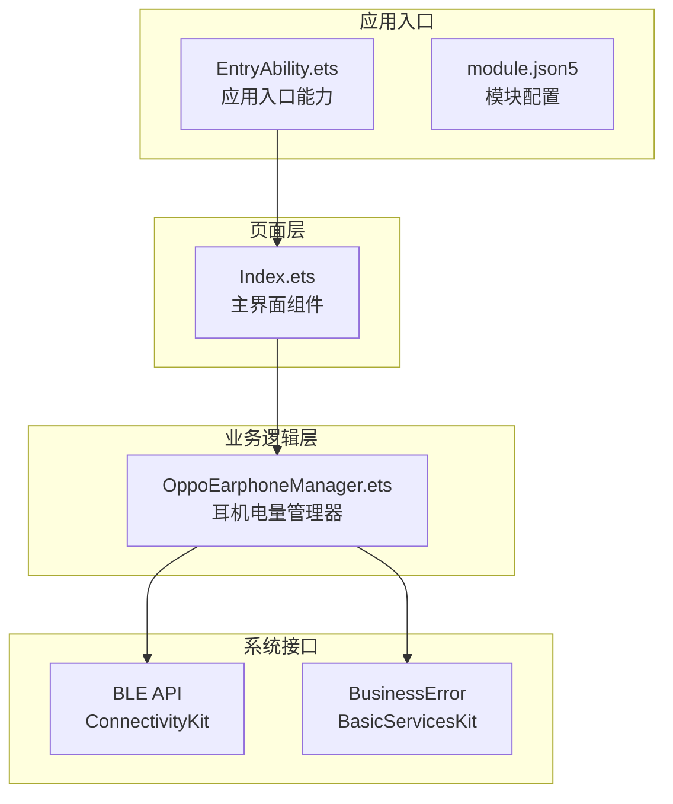

**图表来源**
- [EntryAbility.ets:1-48](file://entry/src/main/ets/entryability/EntryAbility.ets#L1-L48)
- [module.json5:1-63](file://entry/src/main/module.json5#L1-L63)

**章节来源**
- [EntryAbility.ets:1-48](file://entry/src/main/ets/entryability/EntryAbility.ets#L1-L48)
- [module.json5:1-63](file://entry/src/main/module.json5#L1-L63)

## 核心组件

### OppoEarphoneManager类

`OppoEarphoneManager`是整个应用的核心业务逻辑组件，负责蓝牙扫描、GATT连接、服务发现和电量数据解析。

#### 主要职责
- **设备扫描**: 实现低延迟BLE扫描功能
- **连接管理**: 创建GATT客户端设备并管理连接状态
- **服务发现**: 自动发现目标服务UUID
- **数据订阅**: 订阅电量特征值通知
- **数据解析**: 解析OPPO耳机专用的电量协议

#### 关键属性和常量

| 属性名 | 类型 | 描述 | 默认值 |
|--------|------|------|--------|
| `gattClient` | `ble.GattClientDevice \| null` | GATT客户端实例 | null |
| `isScanning` | `boolean` | 扫描状态标志 | false |
| `connectedMac` | `string` | 已连接设备MAC地址 | '' |
| `STATE_CONNECTED` | `number` | 连接状态常量 | 2 |
| `STATE_DISCONNECTED` | `number` | 断开连接状态常量 | 0 |

**章节来源**
- [OppoEarphoneManager.ets:49-103](file://entry/src/main/ets/manager/OppoEarphoneManager.ets#L49-L103)

## 架构概览

应用采用分层架构设计，实现了清晰的关注点分离：

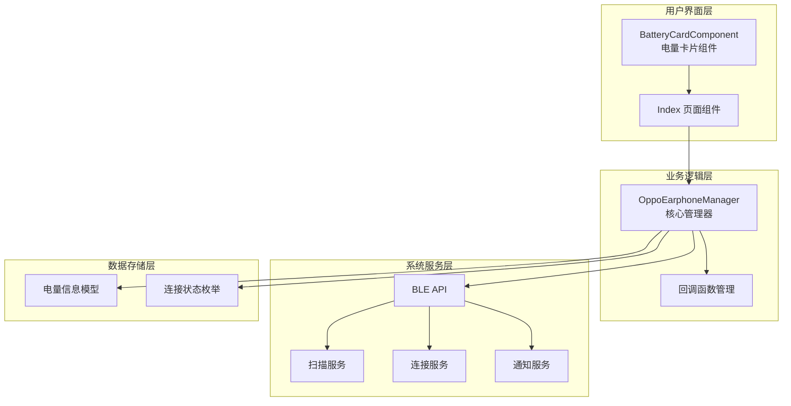

**图表来源**
- [Index.ets:100-117](file://entry/src/main/ets/pages/Index.ets#L100-L117)
- [OppoEarphoneManager.ets:117-125](file://entry/src/main/ets/manager/OppoEarphoneManager.ets#L117-L125)

## 详细组件分析

### GATT客户端创建流程

#### createGattClientDevice方法使用

GATT客户端设备的创建是连接流程的第一步，通过`ble.createGattClientDevice(macAddress)`方法实现：

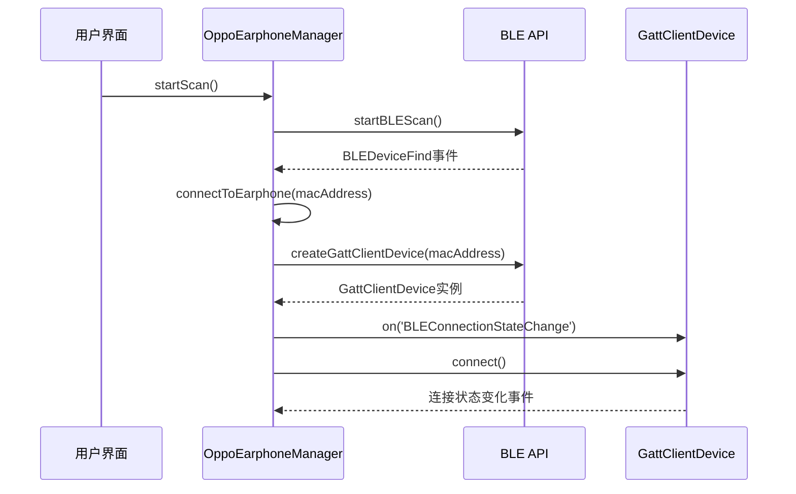

**图表来源**
- [OppoEarphoneManager.ets:293-345](file://entry/src/main/ets/manager/OppoEarphoneManager.ets#L293-L345)

#### 连接状态监听机制

应用实现了完整的连接状态监听机制，使用`BLEConnectionStateChange`事件：

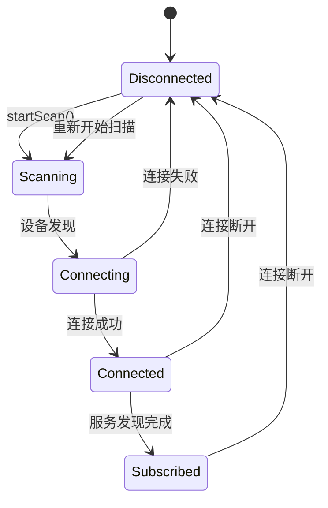

**图表来源**
- [OppoEarphoneManager.ets:309-329](file://entry/src/main/ets/manager/OppoEarphoneManager.ets#L309-L329)

#### 连接建立的异步处理流程

连接建立采用异步模式，确保UI线程不会被阻塞：

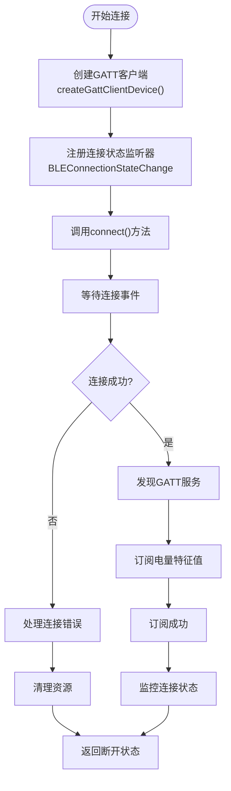

**图表来源**
- [OppoEarphoneManager.ets:293-345](file://entry/src/main/ets/manager/OppoEarphoneManager.ets#L293-L345)

**章节来源**
- [OppoEarphoneManager.ets:293-345](file://entry/src/main/ets/manager/OppoEarphoneManager.ets#L293-L345)

### 连接状态管理

#### 状态常量定义

应用使用数值常量替代已移除的`ProfileConnectionState`：

| 常量名 | 数值 | 描述 |
|--------|------|------|
| `STATE_CONNECTED` | 2 | 连接状态 |
| `STATE_DISCONNECTED` | 0 | 断开连接状态 |

#### 状态转换逻辑

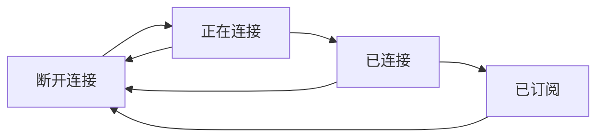

**图表来源**
- [OppoEarphoneManager.ets:63-65](file://entry/src/main/ets/manager/OppoEarphoneManager.ets#L63-L65)

**章节来源**
- [OppoEarphoneManager.ets:63-65](file://entry/src/main/ets/manager/OppoEarphoneManager.ets#L63-L65)

### 错误处理策略

#### BusinessError捕获机制

应用实现了全面的错误处理策略，使用`BusinessError`类型进行异常捕获：

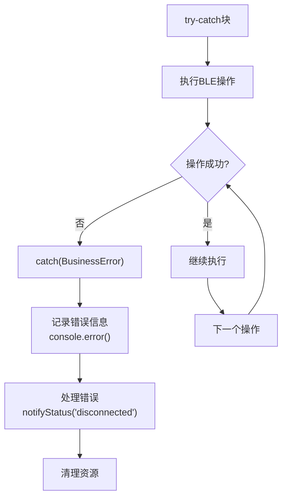

**图表来源**
- [OppoEarphoneManager.ets:335-343](file://entry/src/main/ets/manager/OppoEarphoneManager.ets#L335-L343)

#### 错误分类和处理

| 错误类型 | 处理方式 | 影响范围 |
|----------|----------|----------|
| 权限错误 | 提示用户授予权限 | 扫描和连接功能受限 |
| 连接失败 | 清理资源并返回断开状态 | 完整连接流程中断 |
| 服务发现失败 | 继续尝试订阅特征值 | 部分功能受限 |
| 订阅失败 | 记录错误并保持连接 | 电量数据无法接收 |

**章节来源**
- [OppoEarphoneManager.ets:335-343](file://entry/src/main/ets/manager/OppoEarphoneManager.ets#L335-L343)

### 数据解析和通知机制

#### 电量数据解析算法

应用实现了专门针对OPPO Enco Air5 Pro的电量数据解析算法：

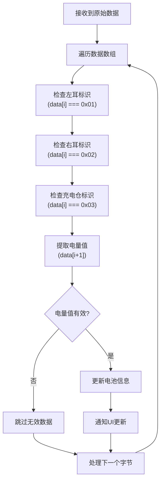

**图表来源**
- [OppoEarphoneManager.ets:505-601](file://entry/src/main/ets/manager/OppoEarphoneManager.ets#L505-L601)

#### 特征值变化监听

应用使用`BLECharacteristicChange`事件监听电量数据变化：

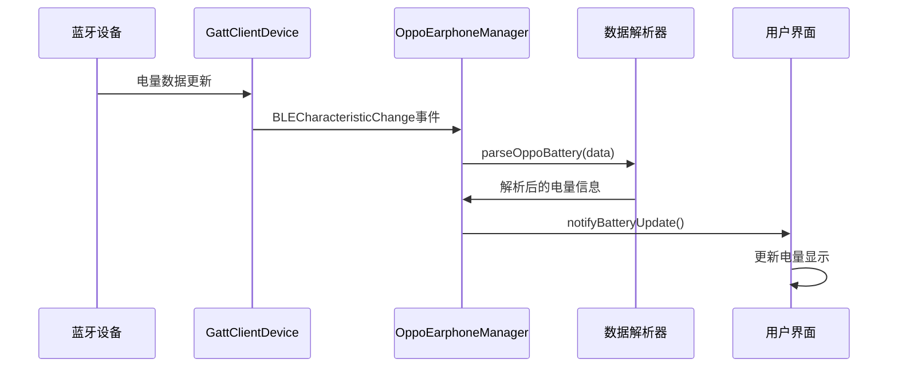

**图表来源**
- [OppoEarphoneManager.ets:449-479](file://entry/src/main/ets/manager/OppoEarphoneManager.ets#L449-L479)

**章节来源**
- [OppoEarphoneManager.ets:505-601](file://entry/src/main/ets/manager/OppoEarphoneManager.ets#L505-L601)

## 依赖关系分析

### 外部依赖

应用依赖以下HarmonyOS系统模块：

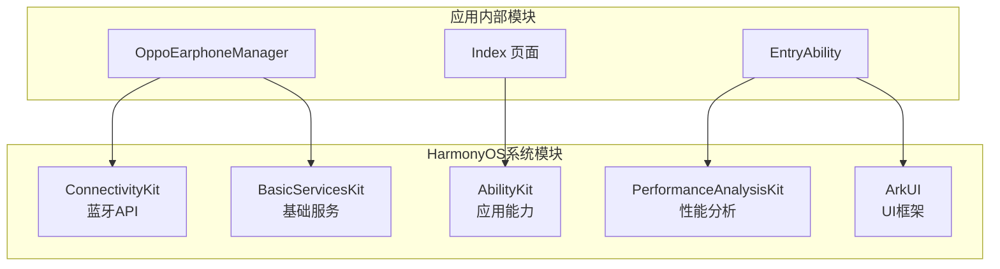

**图表来源**
- [OppoEarphoneManager.ets:1-3](file://entry/src/main/ets/manager/OppoEarphoneManager.ets#L1-L3)
- [Index.ets:1-3](file://entry/src/main/ets/pages/Index.ets#L1-L3)

### 内部模块依赖

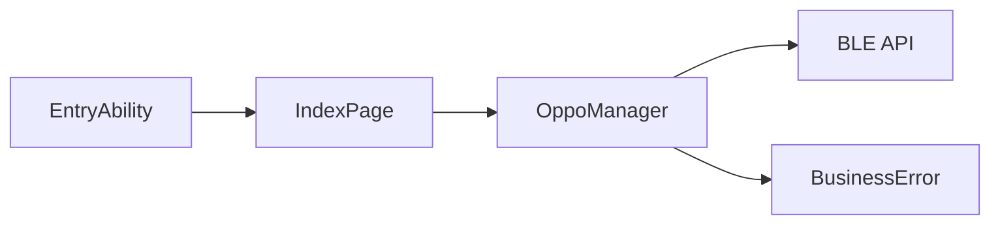

**图表来源**
- [EntryAbility.ets:25](file://entry/src/main/ets/entryability/EntryAbility.ets#L25)
- [Index.ets:117](file://entry/src/main/ets/pages/Index.ets#L117)

**章节来源**
- [OppoEarphoneManager.ets:1-3](file://entry/src/main/ets/manager/OppoEarphoneManager.ets#L1-L3)
- [Index.ets:1-3](file://entry/src/main/ets/pages/Index.ets#L1-L3)

## 性能考虑

### 扫描优化

应用采用了低延迟扫描模式以提高设备发现效率：

- **扫描间隔**: 0ns（最低延迟）
- **扫描模式**: `SCAN_MODE_LOW_LATENCY`
- **匹配模式**: `MATCH_MODE_AGGRESSIVE`

### 连接管理优化

- **资源清理**: 连接断开时及时释放GATT客户端资源
- **事件解绑**: 使用`off()`方法解除事件监听器绑定
- **状态同步**: 通过回调函数确保UI状态与连接状态同步

### 数据处理优化

- **增量更新**: 仅在电量变化时通知UI更新
- **数据过滤**: 仅处理整十电量值以减少UI刷新频率
- **内存管理**: 及时清理扫描结果和连接状态

## 故障排除指南

### 常见问题及解决方案

#### 蓝牙权限问题

**问题症状**: 扫描按钮不可用或扫描失败
**解决方案**: 
1. 检查`ACCESS_BLUETOOTH`权限是否已授予
2. 重新请求权限并确保用户确认
3. 在`module.json5`中确认权限声明正确

#### 连接失败问题

**问题症状**: 连接状态停留在"正在连接..."或立即回到断开状态
**排查步骤**:
1. 检查设备是否在蓝牙范围内
2. 确认耳机充电仓盖子已打开
3. 尝试重新扫描和连接
4. 查看控制台错误日志

#### 服务发现失败

**问题症状**: 连接成功但无法获取电量数据
**解决方案**:
1. 确认目标服务UUID正确无误
2. 检查设备固件版本兼容性
3. 尝试重新连接和订阅

#### 内存泄漏问题

**问题症状**: 长时间使用后应用占用内存增加
**预防措施**:
1. 确保每次断开连接时调用`cleanup()`方法
2. 及时调用`off()`方法解除事件监听
3. 避免在回调函数中持有不必要的引用

**章节来源**
- [OppoEarphoneManager.ets:691-743](file://entry/src/main/ets/manager/OppoEarphoneManager.ets#L691-L743)

### 日志记录和调试

应用实现了多层次的日志记录机制：

- **连接状态日志**: 记录连接建立和断开事件
- **错误日志**: 记录BusinessError异常信息
- **数据日志**: 记录原始HEX数据以便调试
- **性能日志**: 记录关键操作的执行时间

**章节来源**
- [OppoEarphoneManager.ets:313](file://entry/src/main/ets/manager/OppoEarphoneManager.ets#L313)
- [OppoEarphoneManager.ets:339](file://entry/src/main/ets/manager/OppoEarphoneManager.ets#L339)

## 结论

本项目展示了HarmonyOS平台上GATT连接的完整实现方案。通过`OppoEarphoneManager`类，应用实现了从设备扫描到数据订阅的全生命周期管理。

### 主要优势

1. **完整的连接管理**: 实现了从扫描到断开的完整连接生命周期
2. **健壮的错误处理**: 使用BusinessError进行统一的异常处理
3. **高效的资源管理**: 及时清理连接资源避免内存泄漏
4. **用户友好的界面**: 提供直观的状态指示和操作反馈

### 最佳实践建议

1. **连接超时处理**: 建议添加连接超时机制，超过指定时间自动断开
2. **自动重连机制**: 实现指数退避的自动重连策略
3. **状态持久化**: 将连接状态保存到本地存储
4. **性能监控**: 添加连接成功率和平均连接时间统计

该实现为其他蓝牙设备的HarmonyOS应用开发提供了良好的参考模板。