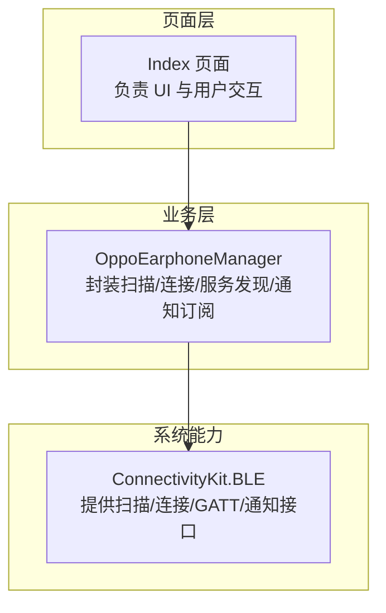
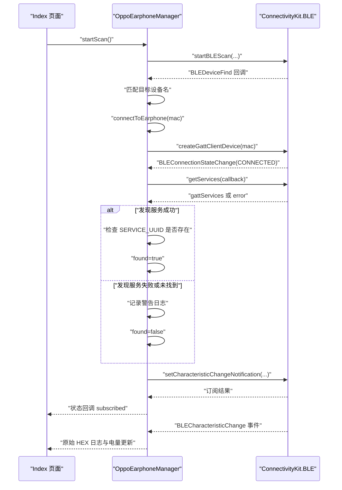
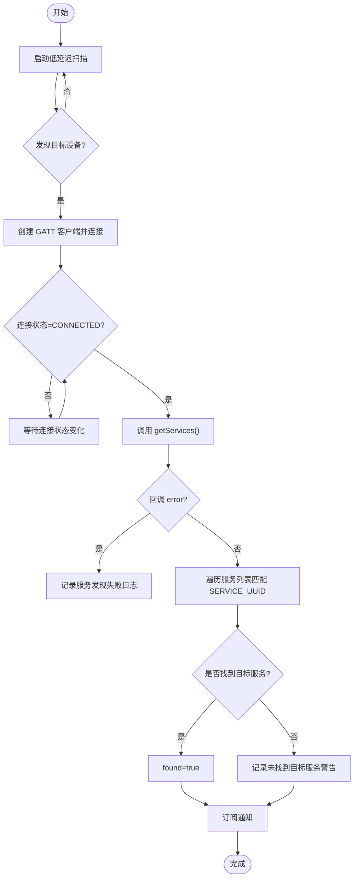
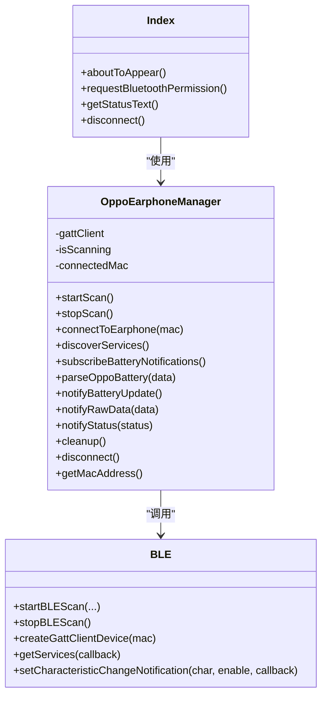

# 服务发现

<cite>
**本文引用的文件**
- [OppoEarphoneManager.ets](file://entry/src/main/ets/manager/OppoEarphoneManager.ets)
- [Index.ets](file://entry/src/main/ets/pages/Index.ets)
- [EntryAbility.ets](file://entry/src/main/ets/entryability/EntryAbility.ets)
</cite>

## 目录
1. [简介](#简介)
2. [项目结构](#项目结构)
3. [核心组件](#核心组件)
4. [架构总览](#架构总览)
5. [详细组件分析](#详细组件分析)
6. [依赖关系分析](#依赖关系分析)
7. [性能考量](#性能考量)
8. [故障排查指南](#故障排查指南)
9. [结论](#结论)
10. [附录](#附录)

## 简介
本技术文档围绕蓝牙 GATT 服务发现功能展开，重点解释以下内容：
- getServices() 方法的使用与服务列表获取流程
- SERVICE_UUID 的查找逻辑与目标服务的验证机制
- 服务发现失败的处理策略（异常捕获与日志记录）
- 即使未找到目标服务 UUID 也继续订阅通知的原因与风险评估
- 调试技巧与常见问题排查
- 超时与重试机制的实现建议

## 项目结构
该项目采用基于模块化的组织方式，主要涉及页面层、业务管理器与系统能力接口：
- 页面层负责用户交互与状态展示
- 管理器封装蓝牙扫描、连接、服务发现与通知订阅等核心流程
- 系统能力通过 ConnectivityKit 提供 BLE 接口

图表来源
- [Index.ets:117-159](file://entry/src/main/ets/pages/Index.ets#L117-L159)
- [OppoEarphoneManager.ets:135-211](file://entry/src/main/ets/manager/OppoEarphoneManager.ets#L135-L211)
- [OppoEarphoneManager.ets:293-345](file://entry/src/main/ets/manager/OppoEarphoneManager.ets#L293-L345)
- [OppoEarphoneManager.ets:355-413](file://entry/src/main/ets/manager/OppoEarphoneManager.ets#L355-L413)
- [OppoEarphoneManager.ets:423-481](file://entry/src/main/ets/manager/OppoEarphoneManager.ets#L423-L481)

章节来源
- [Index.ets:117-159](file://entry/src/main/ets/pages/Index.ets#L117-L159)
- [OppoEarphoneManager.ets:135-211](file://entry/src/main/ets/manager/OppoEarphoneManager.ets#L135-L211)
- [OppoEarphoneManager.ets:293-345](file://entry/src/main/ets/manager/OppoEarphoneManager.ets#L293-L345)
- [OppoEarphoneManager.ets:355-413](file://entry/src/main/ets/manager/OppoEarphoneManager.ets#L355-L413)
- [OppoEarphoneManager.ets:423-481](file://entry/src/main/ets/manager/OppoEarphoneManager.ets#L423-L481)

## 核心组件
- OppoEarphoneManager：负责扫描设备、建立 GATT 连接、执行服务发现、订阅通知以及解析电量数据
- Index 页面：负责请求蓝牙权限、设置回调、展示连接状态与电量，并提供操作入口

章节来源
- [OppoEarphoneManager.ets:49-125](file://entry/src/main/ets/manager/OppoEarphoneManager.ets#L49-L125)
- [Index.ets:117-159](file://entry/src/main/ets/pages/Index.ets#L117-L159)

## 架构总览
整体流程从页面触发开始，经由管理器完成扫描、连接、服务发现与通知订阅，最终回到页面进行 UI 更新与日志输出。

图表来源
- [OppoEarphoneManager.ets:135-211](file://entry/src/main/ets/manager/OppoEarphoneManager.ets#L135-L211)
- [OppoEarphoneManager.ets:293-345](file://entry/src/main/ets/manager/OppoEarphoneManager.ets#L293-L345)
- [OppoEarphoneManager.ets:355-413](file://entry/src/main/ets/manager/OppoEarphoneManager.ets#L355-L413)
- [OppoEarphoneManager.ets:423-481](file://entry/src/main/ets/manager/OppoEarphoneManager.ets#L423-L481)
- [Index.ets:117-159](file://entry/src/main/ets/pages/Index.ets#L117-L159)

## 详细组件分析

### 服务发现流程与 getServices() 使用
- 扫描阶段：启动低延迟扫描，监听设备发现事件，匹配目标设备名后停止扫描并发起连接
- 连接阶段：创建 GATT 客户端，监听连接状态变化；当进入 CONNECTED 状态后触发服务发现
- 服务发现阶段：调用 getServices() 获取服务列表，回调中处理错误与遍历服务以校验目标 SERVICE_UUID
- 验证机制：遍历返回的服务数组，比较 serviceUuid 与预设 SERVICE_UUID，命中则标记 found=true，否则记录警告日志
- 继续订阅：无论是否找到目标服务，均继续执行订阅通知流程

图表来源
- [OppoEarphoneManager.ets:135-211](file://entry/src/main/ets/manager/OppoEarphoneManager.ets#L135-L211)
- [OppoEarphoneManager.ets:293-345](file://entry/src/main/ets/manager/OppoEarphoneManager.ets#L293-L345)
- [OppoEarphoneManager.ets:355-413](file://entry/src/main/ets/manager/OppoEarphoneManager.ets#L355-L413)

章节来源
- [OppoEarphoneManager.ets:135-211](file://entry/src/main/ets/manager/OppoEarphoneManager.ets#L135-L211)
- [OppoEarphoneManager.ets:293-345](file://entry/src/main/ets/manager/OppoEarphoneManager.ets#L293-L345)
- [OppoEarphoneManager.ets:355-413](file://entry/src/main/ets/manager/OppoEarphoneManager.ets#L355-L413)

### SERVICE_UUID 查找逻辑与目标服务验证
- 预设 SERVICE_UUID：在类内定义固定的服务 UUID
- 遍历服务：在 getServices() 的回调中遍历 gattServices 数组，逐项比较 serviceUuid
- 命中条件：当 serviceUuid 严格等于预设 UUID 时，found 标记为 true 并记录成功日志
- 未命中：若遍历结束仍未匹配，记录警告日志，但不影响后续订阅流程

章节来源
- [OppoEarphoneManager.ets:51-57](file://entry/src/main/ets/manager/OppoEarphoneManager.ets#L51-L57)
- [OppoEarphoneManager.ets:377-406](file://entry/src/main/ets/manager/OppoEarphoneManager.ets#L377-L406)

### 服务发现失败的处理策略
- 异常捕获：getServices() 回调中的 error 参数用于判断失败情况
- 日志记录：统一使用控制台输出错误信息，便于调试
- 流程控制：发现失败时直接返回，不再继续后续处理；未发现目标服务时记录警告并继续订阅

章节来源
- [OppoEarphoneManager.ets:365-373](file://entry/src/main/ets/manager/OppoEarphoneManager.ets#L365-L373)
- [OppoEarphoneManager.ets:367-371](file://entry/src/main/ets/manager/OppoEarphoneManager.ets#L367-L371)
- [OppoEarphoneManager.ets:401-405](file://entry/src/main/ets/manager/OppoEarphoneManager.ets#L401-L405)

### 为什么即使未找到目标服务 UUID 也要继续订阅通知
- 设计动机：项目针对特定型号耳机（OPPO Enco Air5 Pro）设计，其服务与特征 UUID 在该型号上是固定的。即便服务发现阶段未找到目标服务，仍可能通过正确的特征订阅获取数据
- 风险评估：
  - 正面：在目标设备上可稳定获取电量数据
  - 负面：在其他设备上可能出现订阅失败或无数据的情况，需要通过日志与状态反馈进行识别与处理
- 实践建议：在 UI 层根据订阅结果与数据更新频率进行提示，避免误导用户

章节来源
- [OppoEarphoneManager.ets:401-405](file://entry/src/main/ets/manager/OppoEarphoneManager.ets#L401-L405)
- [OppoEarphoneManager.ets:423-481](file://entry/src/main/ets/manager/OppoEarphoneManager.ets#L423-L481)

### 订阅通知与数据解析
- 订阅流程：构造特征对象（包含 serviceUuid 与 characteristicUuid），注册 BLECharacteristicChange 事件监听，在 setCharacteristicChangeNotification() 成功回调中通知 UI 进入 subscribed 状态
- 数据解析：收到特征变化后，先输出原始 HEX 日志，再解析电量数据并触发 UI 更新

章节来源
- [OppoEarphoneManager.ets:423-481](file://entry/src/main/ets/manager/OppoEarphoneManager.ets#L423-L481)
- [OppoEarphoneManager.ets:485-601](file://entry/src/main/ets/manager/OppoEarphoneManager.ets#L485-L601)
- [Index.ets:117-159](file://entry/src/main/ets/pages/Index.ets#L117-L159)

## 依赖关系分析
- 页面依赖管理器：Index 通过 OppoEarphoneManager 提供的 API 完成扫描、连接、断开与回调设置
- 管理器依赖系统能力：OppoEarphoneManager 通过 ConnectivityKit 的 BLE 接口完成扫描、连接、GATT 服务发现与通知订阅
- 事件与回调：管理器内部维护多个回调（电量更新、状态变更、原始数据），并通过 UI 层进行展示

图表来源
- [Index.ets:117-159](file://entry/src/main/ets/pages/Index.ets#L117-L159)
- [OppoEarphoneManager.ets:135-211](file://entry/src/main/ets/manager/OppoEarphoneManager.ets#L135-L211)
- [OppoEarphoneManager.ets:293-345](file://entry/src/main/ets/manager/OppoEarphoneManager.ets#L293-L345)
- [OppoEarphoneManager.ets:355-413](file://entry/src/main/ets/manager/OppoEarphoneManager.ets#L355-L413)
- [OppoEarphoneManager.ets:423-481](file://entry/src/main/ets/manager/OppoEarphoneManager.ets#L423-L481)

章节来源
- [Index.ets:117-159](file://entry/src/main/ets/pages/Index.ets#L117-L159)
- [OppoEarphoneManager.ets:135-211](file://entry/src/main/ets/manager/OppoEarphoneManager.ets#L135-L211)
- [OppoEarphoneManager.ets:293-345](file://entry/src/main/ets/manager/OppoEarphoneManager.ets#L293-L345)
- [OppoEarphoneManager.ets:355-413](file://entry/src/main/ets/manager/OppoEarphoneManager.ets#L355-L413)
- [OppoEarphoneManager.ets:423-481](file://entry/src/main/ets/manager/OppoEarphoneManager.ets#L423-L481)

## 性能考量
- 扫描参数：使用低延迟扫描模式以缩短发现时间，同时注意在发现目标设备后及时停止扫描以降低功耗
- 服务发现：getServices() 为一次性调用，避免重复调用造成资源浪费
- 订阅通知：仅在连接成功后开启通知，减少无效网络交互
- UI 更新：对电量更新进行节流（仅对整十数据刷新 UI），降低界面渲染压力

章节来源
- [OppoEarphoneManager.ets:187-197](file://entry/src/main/ets/manager/OppoEarphoneManager.ets#L187-L197)
- [OppoEarphoneManager.ets:221-247](file://entry/src/main/ets/manager/OppoEarphoneManager.ets#L221-L247)
- [Index.ets:124-136](file://entry/src/main/ets/pages/Index.ets#L124-L136)

## 故障排查指南
- 权限问题
  - 症状：扫描失败或连接失败
  - 排查：确认已授权蓝牙权限；查看权限请求回调与错误日志
- 设备不可见
  - 症状：扫描长时间无结果
  - 排查：确保耳机充电仓盖子打开、处于可发现状态；靠近设备范围；适当延长扫描时间
- 连接不稳定
  - 症状：连接后立即断开
  - 排查：检查设备名匹配逻辑；确认连接状态事件回调；查看连接失败日志
- 服务发现失败
  - 症状：getServices() 回调返回 error
  - 排查：记录并分析错误信息；确认设备是否为目标型号；检查 UUID 是否正确
- 未找到目标服务
  - 症状：日志显示未找到目标服务 UUID
  - 排查：确认目标设备型号与 UUID；观察订阅是否仍能正常工作；关注 UI 状态变化
- 订阅通知失败
  - 症状：订阅回调返回错误
  - 排查：确认特征对象配置（serviceUuid、characteristicUuid）；检查连接状态；查看订阅失败日志
- 数据解析异常
  - 症状：UI 电量不更新或显示异常
  - 排查：查看原始 HEX 日志；核对解析算法；确认数据帧格式

章节来源
- [Index.ets:168-182](file://entry/src/main/ets/pages/Index.ets#L168-L182)
- [OppoEarphoneManager.ets:187-210](file://entry/src/main/ets/manager/OppoEarphoneManager.ets#L187-L210)
- [OppoEarphoneManager.ets:301-344](file://entry/src/main/ets/manager/OppoEarphoneManager.ets#L301-L344)
- [OppoEarphoneManager.ets:365-373](file://entry/src/main/ets/manager/OppoEarphoneManager.ets#L365-L373)
- [OppoEarphoneManager.ets:401-405](file://entry/src/main/ets/manager/OppoEarphoneManager.ets#L401-L405)
- [OppoEarphoneManager.ets:465-479](file://entry/src/main/ets/manager/OppoEarphoneManager.ets#L465-L479)
- [OppoEarphoneManager.ets:505-601](file://entry/src/main/ets/manager/OppoEarphoneManager.ets#L505-L601)

## 结论
本项目针对特定型号耳机实现了稳定的 GATT 服务发现与通知订阅流程。尽管在服务发现阶段未找到目标服务的情况下仍会继续订阅通知，但该策略在目标设备上有效，且通过日志与状态反馈提供了良好的可观测性。建议在后续版本中引入超时与重试机制，以进一步提升健壮性与用户体验。

## 附录
- 蓝牙权限请求：页面在首次出现时请求 ACCESS_BLUETOOTH 权限
- 能力入口：应用 Ability 负责加载主页面

章节来源
- [Index.ets:168-182](file://entry/src/main/ets/pages/Index.ets#L168-L182)
- [EntryAbility.ets:21-32](file://entry/src/main/ets/entryability/EntryAbility.ets#L21-L32)