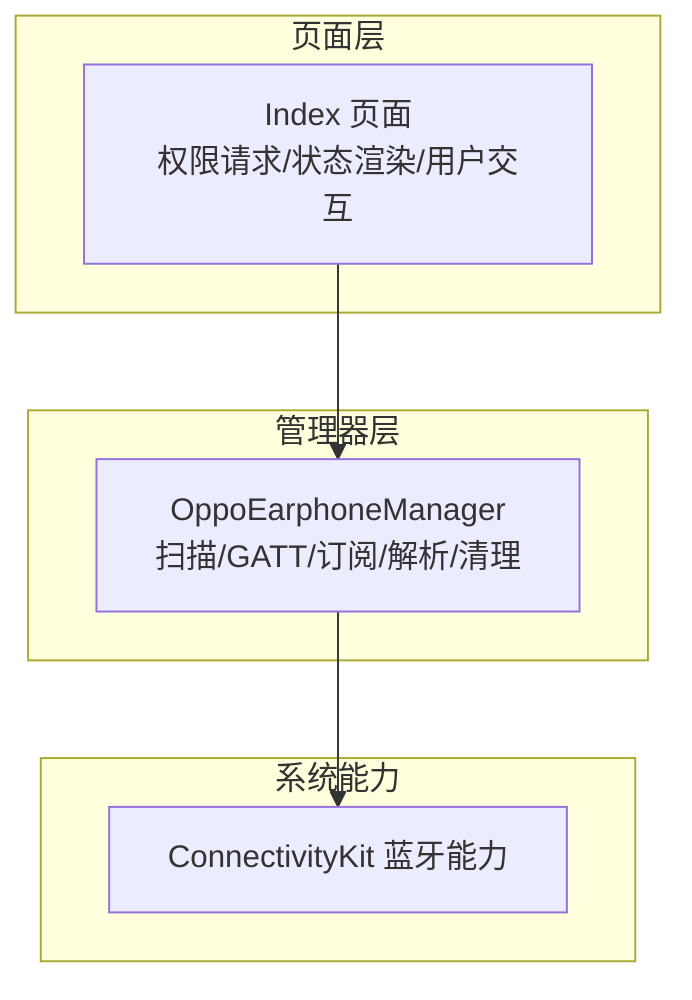
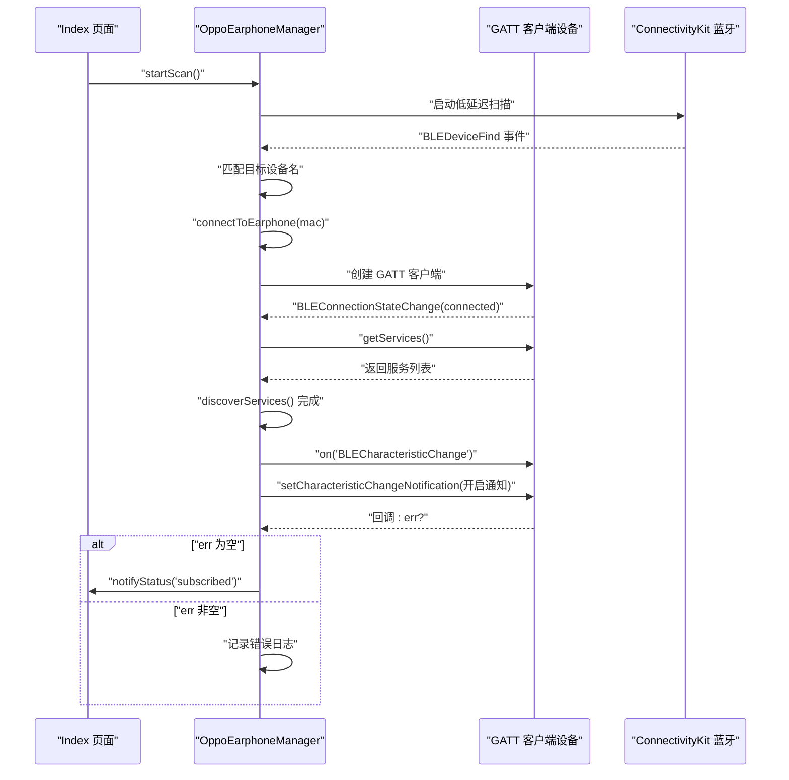
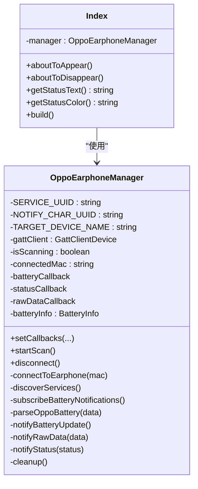
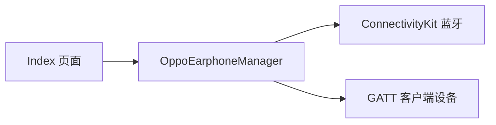

# 特征值订阅

<cite>
**本文引用的文件列表**
- [OppoEarphoneManager.ets](file://entry/src/main/ets/manager/OppoEarphoneManager.ets)
- [Index.ets](file://entry/src/main/ets/pages/Index.ets)
</cite>

## 目录
1. [简介](#简介)
2. [项目结构](#项目结构)
3. [核心组件](#核心组件)
4. [架构总览](#架构总览)
5. [详细组件分析](#详细组件分析)
6. [依赖关系分析](#依赖关系分析)
7. [性能考量](#性能考量)
8. [故障排查指南](#故障排查指南)
9. [结论](#结论)

## 简介
本文件聚焦于蓝牙特征值订阅功能，围绕 OPPO Enco Air5 Pro 的电量通知特征进行深入解析。重点覆盖以下方面：
- NOTIFY_CHAR_UUID 的配置与作用域
- setCharacteristicChangeNotification 方法的使用与通知订阅开启流程
- BLECharacteristicChange 事件的监听机制与数据接收处理
- 订阅失败的错误处理策略（错误信息捕获与日志记录）
- 订阅成功后的状态转换与 subscribed 状态管理
- 订阅断开的处理机制与重新订阅的实现方案

## 项目结构
该项目采用模块化组织，核心逻辑集中在 Manager 层与页面层：
- Manager 层负责蓝牙扫描、GATT 连接、服务发现、特征值订阅与数据解析
- 页面层负责权限请求、状态渲染与用户交互

图表来源
- [Index.ets:119-159](file://entry/src/main/ets/pages/Index.ets#L119-L159)
- [OppoEarphoneManager.ets:135-211](file://entry/src/main/ets/manager/OppoEarphoneManager.ets#L135-L211)

章节来源
- [Index.ets:119-159](file://entry/src/main/ets/pages/Index.ets#L119-L159)
- [OppoEarphoneManager.ets:135-211](file://entry/src/main/ets/manager/OppoEarphoneManager.ets#L135-L211)

## 核心组件
- OppoEarphoneManager：封装蓝牙扫描、GATT 连接、服务发现、特征值订阅与电量解析
- Index 页面：设置回调、渲染状态、展示原始 HEX 日志、触发扫描与断开

章节来源
- [OppoEarphoneManager.ets:49-125](file://entry/src/main/ets/manager/OppoEarphoneManager.ets#L49-L125)
- [Index.ets:117-159](file://entry/src/main/ets/pages/Index.ets#L117-L159)

## 架构总览
下图展示了从页面到管理器再到系统蓝牙能力的整体流程，以及特征值订阅的关键节点。

图表来源
- [OppoEarphoneManager.ets:135-211](file://entry/src/main/ets/manager/OppoEarphoneManager.ets#L135-L211)
- [OppoEarphoneManager.ets:293-345](file://entry/src/main/ets/manager/OppoEarphoneManager.ets#L293-L345)
- [OppoEarphoneManager.ets:355-413](file://entry/src/main/ets/manager/OppoEarphoneManager.ets#L355-L413)
- [OppoEarphoneManager.ets:423-481](file://entry/src/main/ets/manager/OppoEarphoneManager.ets#L423-L481)

## 详细组件分析

### 特征值订阅配置与实现
- NOTIFY_CHAR_UUID 的定义与作用域
  - 在管理器内部以私有常量形式定义，限定在类作用域内，避免外部直接修改
  - 用于定位目标通知特征，作为 setCharacteristicChangeNotification 的参数之一
- 服务与特征的组合
  - 通过构造 ble.BLECharacteristic 对象，指定 serviceUuid 与 characteristicUuid，并保持 characteristicValue 与 descriptors 为空数组
  - 该对象随后传递给 setCharacteristicChangeNotification 以启用通知

章节来源
- [OppoEarphoneManager.ets:53-55](file://entry/src/main/ets/manager/OppoEarphoneManager.ets#L53-L55)
- [OppoEarphoneManager.ets:433-443](file://entry/src/main/ets/manager/OppoEarphoneManager.ets#L433-L443)

### setCharacteristicChangeNotification 使用与订阅开启流程
- 订阅前准备
  - 在 discoverServices 完成后，立即注册 BLECharacteristicChange 事件监听器
  - 构造特征对象，明确服务与特征 UUID
- 订阅执行
  - 调用 setCharacteristicChangeNotification(characteristic, true, callback)
  - 回调中判断 err 是否存在
    - 若 err 为空：记录成功日志并切换状态为 subscribed
    - 若 err 非空：记录错误日志，不改变状态
- 状态流转
  - 订阅成功后，notifyStatus('subscribed') 将状态上报至页面层
  - 页面层据此更新 UI 文案与颜色

章节来源
- [OppoEarphoneManager.ets:447-459](file://entry/src/main/ets/manager/OppoEarphoneManager.ets#L447-L459)
- [OppoEarphoneManager.ets:465-479](file://entry/src/main/ets/manager/OppoEarphoneManager.ets#L465-L479)
- [Index.ets:138-146](file://entry/src/main/ets/pages/Index.ets#L138-L146)

### BLECharacteristicChange 事件监听机制与数据接收处理
- 事件注册
  - 在 subscribeBatteryNotifications 内部注册 on('BLECharacteristicChange')，确保在订阅开启后即可接收通知
- 数据接收与处理
  - 将 characteristicValue 转换为 Uint8Array
  - 先通知原始 HEX 数据（供调试与日志）
  - 再调用解析方法，提取左右耳与充电仓的电量与充电状态
- UI 更新
  - 解析完成后，若电量有更新则触发通知回调，页面按需刷新 UI

章节来源
- [OppoEarphoneManager.ets:447-459](file://entry/src/main/ets/manager/OppoEarphoneManager.ets#L447-L459)
- [OppoEarphoneManager.ets:451-457](file://entry/src/main/ets/manager/OppoEarphoneManager.ets#L451-L457)
- [OppoEarphoneManager.ets:611-633](file://entry/src/main/ets/manager/OppoEarphoneManager.ets#L611-L633)
- [Index.ets:122-137](file://entry/src/main/ets/pages/Index.ets#L122-L137)

### 订阅失败的错误处理策略
- 错误捕获
  - setCharacteristicChangeNotification 的回调中检查 err
- 日志记录
  - 使用 console.error 输出错误信息，便于问题定位
- 状态维持
  - 失败时不主动切换状态，保持当前状态不变
- 建议补充
  - 可在失败后触发重试或降级策略（例如延时重试、切换到轮询模式等），但当前实现未包含此类逻辑

章节来源
- [OppoEarphoneManager.ets:465-479](file://entry/src/main/ets/manager/OppoEarphoneManager.ets#L465-L479)

### 订阅成功后的状态转换与 subscribed 状态管理
- 状态转换
  - 订阅成功后，notifyStatus('subscribed') 触发状态变更
  - 页面层根据状态更新显示文案与颜色
- 状态一致性
  - 页面层在 connected 与 subscribed 两种状态下均会同步显示 MAC 地址，保证用户感知一致

章节来源
- [OppoEarphoneManager.ets:475](file://entry/src/main/ets/manager/OppoEarphoneManager.ets#L475)
- [Index.ets:139-146](file://entry/src/main/ets/pages/Index.ets#L139-L146)

### 订阅断开的处理机制与重新订阅方案
- 断开处理
  - 连接断开时，cleanup() 会移除 BLEConnectionStateChange 与 BLECharacteristicChange 事件监听
  - 断开 GATT 连接并关闭客户端，重置电量状态并通知 UI
- 重新订阅
  - 当连接再次建立后，discoverServices() 会再次调用 subscribeBatteryNotifications()
  - 重新注册事件监听并在回调中再次设置通知
- 建议补充
  - 可在 cleanup() 后增加自动重连与重订阅的策略，减少用户操作

章节来源
- [OppoEarphoneManager.ets:309-329](file://entry/src/main/ets/manager/OppoEarphoneManager.ets#L309-L329)
- [OppoEarphoneManager.ets:691-743](file://entry/src/main/ets/manager/OppoEarphoneManager.ets#L691-L743)
- [OppoEarphoneManager.ets:409](file://entry/src/main/ets/manager/OppoEarphoneManager.ets#L409)

### 类关系与职责划分

图表来源
- [OppoEarphoneManager.ets:49-125](file://entry/src/main/ets/manager/OppoEarphoneManager.ets#L49-L125)
- [Index.ets:117-159](file://entry/src/main/ets/pages/Index.ets#L117-L159)

## 依赖关系分析
- 页面层依赖管理器层提供的回调接口与状态通知
- 管理器层依赖 ConnectivityKit 提供的蓝牙能力
- 订阅流程依赖 GATT 客户端的事件与方法调用

图表来源
- [Index.ets:117](file://entry/src/main/ets/pages/Index.ets#L117)
- [OppoEarphoneManager.ets:1](file://entry/src/main/ets/manager/OppoEarphoneManager.ets#L1)

章节来源
- [Index.ets:117-159](file://entry/src/main/ets/pages/Index.ets#L117-L159)
- [OppoEarphoneManager.ets:1-3](file://entry/src/main/ets/manager/OppoEarphoneManager.ets#L1-L3)

## 性能考量
- 事件监听注册位置靠前，确保订阅开启后即刻接收通知，降低首包延迟
- 页面层对 UI 刷新做了节流（仅在整十电量时刷新），有助于减少不必要的重绘
- 原始 HEX 日志采用滚动展示并限制条数，避免内存占用过高

章节来源
- [OppoEarphoneManager.ets:447-459](file://entry/src/main/ets/manager/OppoEarphoneManager.ets#L447-L459)
- [Index.ets:124-136](file://entry/src/main/ets/pages/Index.ets#L124-L136)
- [Index.ets:147-157](file://entry/src/main/ets/pages/Index.ets#L147-L157)

## 故障排查指南
- 订阅失败
  - 现象：setCharacteristicChangeNotification 回调中出现错误
  - 排查：确认设备处于连接状态；检查 SERVICE_UUID 与 NOTIFY_CHAR_UUID 是否正确；查看日志中的错误信息
  - 处理：当前实现记录错误日志但不自动重试，可在上层增加重试策略
- 无通知数据
  - 现象：BLECharacteristicChange 未触发
  - 排查：确认已成功注册监听；确认设备侧确有通知下发；检查解析逻辑是否过滤了有效数据
- 连接断开
  - 现象：BLEConnectionStateChange 触发 disconnected
  - 排查：确认 cleanup() 是否正确移除了监听并断开连接；检查 UI 是否正确清空电量状态
- 权限问题
  - 现象：扫描或连接失败
  - 排查：确认蓝牙权限已授予；页面层已请求权限并记录结果

章节来源
- [OppoEarphoneManager.ets:465-479](file://entry/src/main/ets/manager/OppoEarphoneManager.ets#L465-L479)
- [OppoEarphoneManager.ets:309-329](file://entry/src/main/ets/manager/OppoEarphoneManager.ets#L309-L329)
- [OppoEarphoneManager.ets:691-743](file://entry/src/main/ets/manager/OppoEarphoneManager.ets#L691-L743)
- [Index.ets:168-182](file://entry/src/main/ets/pages/Index.ets#L168-L182)

## 结论
本实现以 OPPO Enco Air5 Pro 为目标设备，通过固定的服务与特征 UUID 定位通知特征，使用 setCharacteristicChangeNotification 开启通知订阅，并在 BLECharacteristicChange 事件中完成原始数据与电量数据的解析与 UI 更新。订阅成功后进入 subscribed 状态，断开连接时进行资源清理与状态复位。当前版本对订阅失败采取日志记录策略，建议在上层增加自动重试与降级方案以提升鲁棒性。