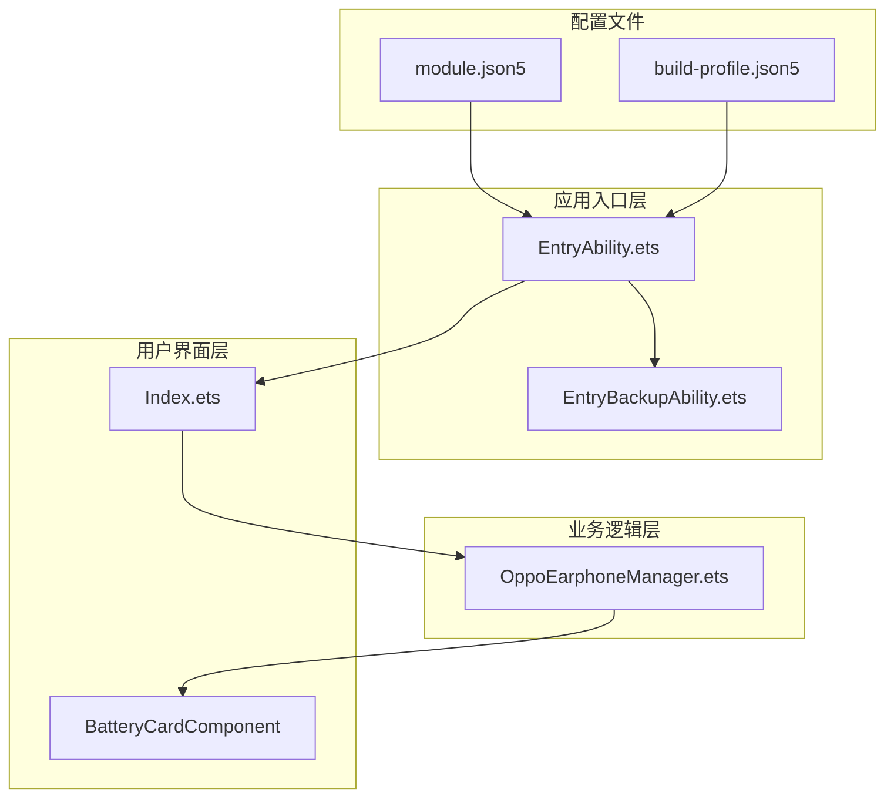
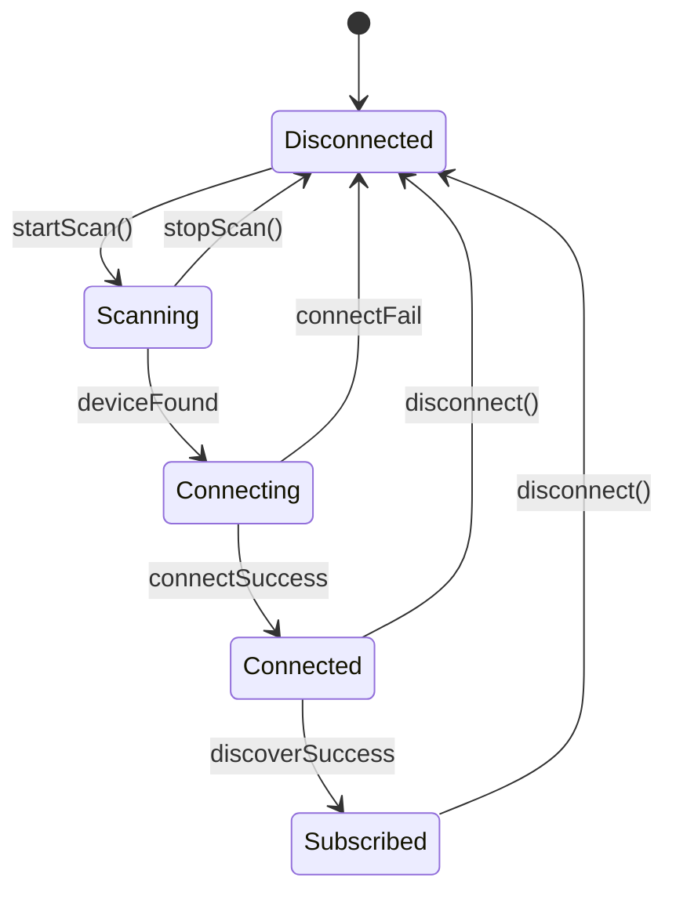
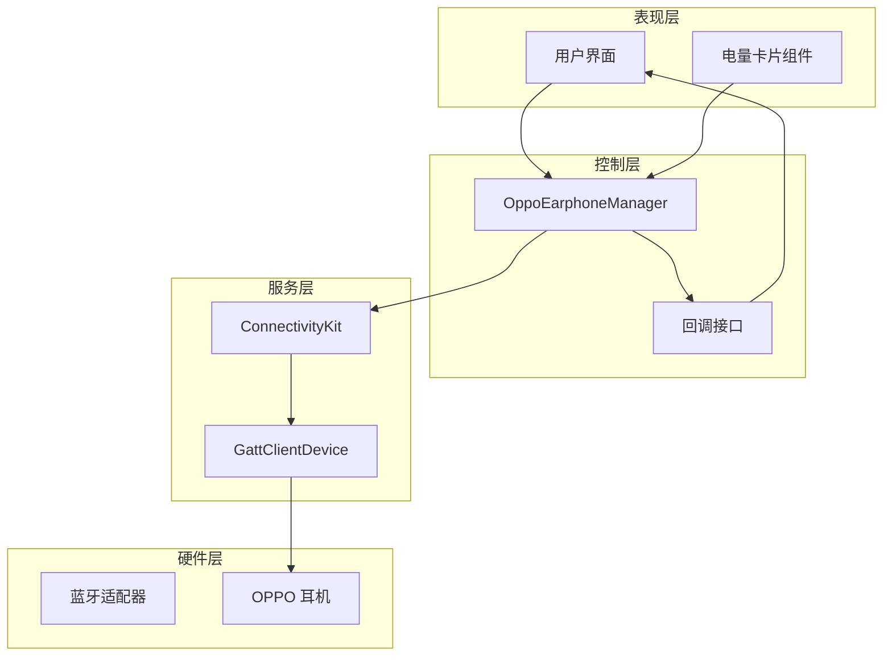
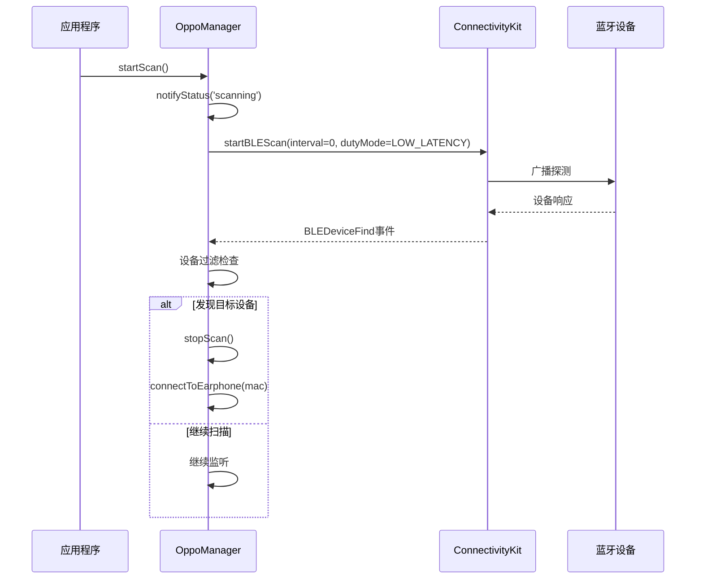
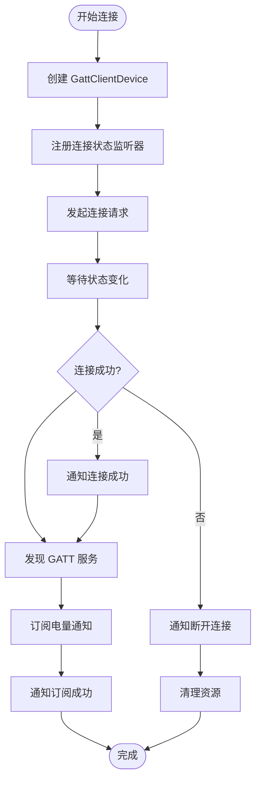
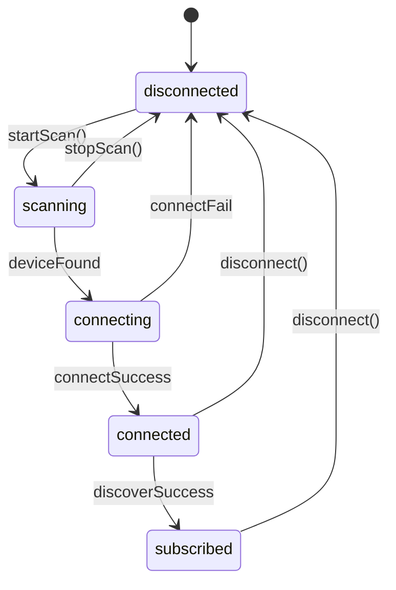
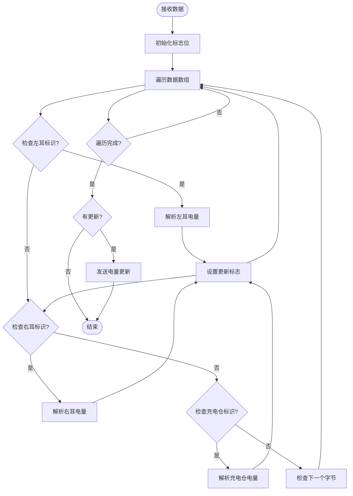
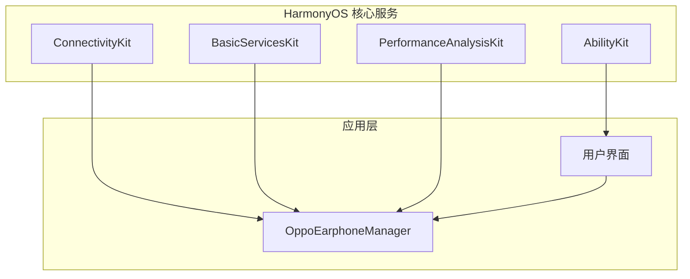

# 蓝牙连接管理

<cite>
**本文档引用的文件**
- [EntryAbility.ets](file://entry/src/main/ets/entryability/EntryAbility.ets)
- [OppoEarphoneManager.ets](file://entry/src/main/ets/manager/OppoEarphoneManager.ets)
- [Index.ets](file://entry/src/main/ets/pages/Index.ets)
- [module.json5](file://entry/src/main/module.json5)
- [EntryBackupAbility.ets](file://entry/src/main/ets/entrybackupability/EntryBackupAbility.ets)
- [build-profile.json5](file://entry/build-profile.json5)
- [oh-package.json5](file://entry/oh-package.json5)
</cite>

## 目录
1. [简介](#简介)
2. [项目结构](#项目结构)
3. [核心组件](#核心组件)
4. [架构概览](#架构概览)
5. [详细组件分析](#详细组件分析)
6. [依赖关系分析](#依赖关系分析)
7. [性能考虑](#性能考虑)
8. [故障排除指南](#故障排除指南)
9. [结论](#结论)
10. [附录](#附录)

## 简介

OPPO Enco Air5 Pro 蓝牙连接管理系统是一个基于 HarmonyOS 的蓝牙耳机电量监控应用。该系统实现了完整的蓝牙扫描、GATT连接建立、服务发现和特征值订阅功能，专门针对 OPPO Enco Air5 Pro 耳机进行优化。

本系统的核心特点包括：
- 低延迟蓝牙扫描模式配置
- 针对特定设备的智能过滤算法
- 固定 UUID 的 GATT 通信协议
- 实时电量数据解析和显示
- 完整的连接状态管理和异常处理

## 项目结构

项目采用模块化设计，主要分为以下几个核心部分：

**图表来源**
- [EntryAbility.ets:1-48](file://entry/src/main/ets/entryability/EntryAbility.ets#L1-L48)
- [OppoEarphoneManager.ets:1-709](file://entry/src/main/ets/manager/OppoEarphoneManager.ets#L1-L709)
- [Index.ets:1-408](file://entry/src/main/ets/pages/Index.ets#L1-L408)

**章节来源**
- [EntryAbility.ets:1-48](file://entry/src/main/ets/entryability/EntryAbility.ets#L1-L48)
- [module.json5:1-63](file://entry/src/main/module.json5#L1-L63)

## 核心组件

### OppoEarphoneManager 类

OppoEarphoneManager 是整个系统的中枢控制器，负责管理蓝牙连接的完整生命周期。

#### 主要职责
- 蓝牙扫描和设备发现
- GATT 连接建立和维护
- 服务发现和特征值订阅
- 电量数据解析和状态通知
- 资源清理和异常处理

#### 关键属性和常量

| 属性名 | 类型 | 默认值 | 描述 |
|--------|------|--------|------|
| SERVICE_UUID | string | '0000079a-d102-11e1-9b23-00025b00a5a5' | OPPO 耳机电量服务 UUID |
| NOTIFY_CHAR_UUID | string | '0200079a-d102-11e1-9b23-00025b00a5a5' | 电量通知特征值 UUID |
| TARGET_DEVICE_NAME | string | 'OPPO Enco Air5 Pro' | 目标设备名称 |
| STATE_CONNECTED | number | 2 | 连接状态常量 |
| STATE_DISCONNECTED | number | 0 | 断开状态常量 |

**章节来源**
- [OppoEarphoneManager.ets:49-101](file://entry/src/main/ets/manager/OppoEarphoneManager.ets#L49-L101)

### 连接状态管理

系统定义了五种连接状态，通过状态机模式管理设备连接生命周期：

**图表来源**
- [OppoEarphoneManager.ets:37](file://entry/src/main/ets/manager/OppoEarphoneManager.ets#L37)
- [OppoEarphoneManager.ets:131](file://entry/src/main/ets/manager/OppoEarphoneManager.ets#L131)

**章节来源**
- [OppoEarphoneManager.ets:37](file://entry/src/main/ets/manager/OppoEarphoneManager.ets#L37)

## 架构概览

系统采用分层架构设计，各层职责明确，耦合度低：

**图表来源**
- [OppoEarphoneManager.ets:1-709](file://entry/src/main/ets/manager/OppoEarphoneManager.ets#L1-L709)
- [Index.ets:1-408](file://entry/src/main/ets/pages/Index.ets#L1-L408)

## 详细组件分析

### 蓝牙扫描实现机制

#### 低延迟扫描模式配置

系统使用了专门配置的低延迟扫描模式，以确保快速发现目标设备：

**图表来源**
- [OppoEarphoneManager.ets:131](file://entry/src/main/ets/manager/OppoEarphoneManager.ets#L131)
- [OppoEarphoneManager.ets:183](file://entry/src/main/ets/manager/OppoEarphoneManager.ets#L183)

#### 设备发现算法

系统采用智能过滤算法来识别目标设备：

1. **名称匹配策略**：使用包含匹配而非精确匹配，支持不同市场版本的设备名称变体
2. **实时过滤**：在扫描过程中实时过滤，发现目标后立即停止扫描
3. **优先级处理**：一旦发现目标设备，立即中断后续处理流程

**章节来源**
- [OppoEarphoneManager.ets:151](file://entry/src/main/ets/manager/OppoEarphoneManager.ets#L151)
- [OppoEarphoneManager.ets:163](file://entry/src/main/ets/manager/OppoEarphoneManager.ets#L163)

### GATT 连接建立过程

#### 连接状态监听

系统通过 BLEConnectionStateChange 事件监听连接状态变化：

**图表来源**
- [OppoEarphoneManager.ets:289](file://entry/src/main/ets/manager/OppoEarphoneManager.ets#L289)
- [OppoEarphoneManager.ets:305](file://entry/src/main/ets/manager/OppoEarphoneManager.ets#L305)

#### 服务发现和特征值订阅

系统使用固定 UUID 进行服务发现和特征值订阅：

**章节来源**
- [OppoEarphoneManager.ets:351](file://entry/src/main/ets/manager/OppoEarphoneManager.ets#L351)
- [OppoEarphoneManager.ets:419](file://entry/src/main/ets/manager/OppoEarphoneManager.ets#L419)

### OPPO Enco Air5 Pro 专用配置

#### UUID 配置说明

系统使用固定的 UUID 配置，这些 UUID 经过验证适用于 OPPO Enco Air5 Pro：

| UUID 类型 | 值 | 用途 |
|-----------|----|------|
| SERVICE_UUID | 0000079a-d102-11e1-9b23-00025b00a5a5 | 电量服务 UUID |
| NOTIFY_CHAR_UUID | 0200079a-d102-11e1-9b23-00025b00a5a5 | 电量通知特征值 UUID |

#### 为什么使用固定 UUID

1. **设备特异性**：OPPO Enco Air5 Pro 使用自定义的非标准 UUID
2. **稳定性保证**：固定 UUID 确保跨版本兼容性
3. **性能优化**：避免动态服务发现的开销
4. **可靠性**：减少因 UUID 变化导致的连接失败

**章节来源**
- [OppoEarphoneManager.ets:53](file://entry/src/main/ets/manager/OppoEarphoneManager.ets#L53)
- [OppoEarphoneManager.ets:55](file://entry/src/main/ets/manager/OppoEarphoneManager.ets#L55)

### 连接状态管理实现

#### 状态转换逻辑

系统实现了完整的状态转换逻辑，确保连接状态的一致性和可预测性：

**图表来源**
- [OppoEarphoneManager.ets:37](file://entry/src/main/ets/manager/OppoEarphoneManager.ets#L37)
- [OppoEarphoneManager.ets:131](file://entry/src/main/ets/manager/OppoEarphoneManager.ets#L131)

#### 异常处理机制

系统实现了多层次的异常处理机制：

1. **扫描异常处理**：捕获扫描启动失败并回退到断开状态
2. **连接异常处理**：捕获连接失败并通知状态变化
3. **资源清理**：确保异常情况下资源得到正确释放
4. **状态同步**：保持内部状态与外部回调的一致性

**章节来源**
- [OppoEarphoneManager.ets:195](file://entry/src/main/ets/manager/OppoEarphoneManager.ets#L195)
- [OppoEarphoneManager.ets:331](file://entry/src/main/ets/manager/OppoEarphoneManager.ets#L331)

### 电量数据解析算法

#### 数据格式规范

系统实现了专门的电量数据解析算法，支持以下设备类型：

| 设备标识 | 前置字节 | 电量值范围 | 充电判断 |
|----------|----------|------------|----------|
| 左耳 | 0x03, 0x04 | 0-100% | >100 表示充电中 |
| 右耳 | 0x64, 0xE4, 0x04 | 0-100% | >100 表示充电中 |
| 充电仓 | 0x64, 0xE4, 0x04 | 0-100% | >100 表示充电中 |

#### 解析算法流程

**图表来源**
- [OppoEarphoneManager.ets:497](file://entry/src/main/ets/manager/OppoEarphoneManager.ets#L497)
- [OppoEarphoneManager.ets:503](file://entry/src/main/ets/manager/OppoEarphoneManager.ets#L503)

**章节来源**
- [OppoEarphoneManager.ets:497](file://entry/src/main/ets/manager/OppoEarphoneManager.ets#L497)

## 依赖关系分析

### 外部依赖

系统依赖于 HarmonyOS 的蓝牙 API 和相关服务：

**图表来源**
- [OppoEarphoneManager.ets:1](file://entry/src/main/ets/manager/OppoEarphoneManager.ets#L1)
- [Index.ets:1](file://entry/src/main/ets/pages/Index.ets#L1)

### 内部模块依赖

**图表来源**
- [EntryAbility.ets:25](file://entry/src/main/ets/entryability/EntryAbility.ets#L25)
- [Index.ets:114](file://entry/src/main/ets/pages/Index.ets#L114)

**章节来源**
- [module.json5:26](file://entry/src/main/module.json5#L26)

## 性能考虑

### 扫描性能优化

1. **低延迟模式**：使用 SCAN_MODE_LOW_LATENCY 减少发现延迟
2. **主动停止**：发现目标设备后立即停止扫描，避免不必要的资源消耗
3. **异步处理**：扫描结果通过事件驱动处理，不阻塞主线程

### 连接性能优化

1. **状态缓存**：避免重复的服务发现操作
2. **资源复用**：连接对象在多次使用中保持不变
3. **及时清理**：断开连接后立即释放相关资源

### 内存管理

1. **回调清理**：断开连接时清理所有事件监听器
2. **状态重置**：清理电量状态和连接信息
3. **对象回收**：确保 GattClient 对象被正确释放

## 故障排除指南

### 常见问题及解决方案

#### 蓝牙权限问题

**症状**：扫描无法启动或返回空结果
**原因**：未获得 ACCESS_BLUETOOTH 权限
**解决方案**：
1. 确认在 module.json5 中声明了蓝牙权限
2. 在运行时请求用户授权
3. 检查权限状态并提供用户友好的错误提示

**章节来源**
- [module.json5:14](file://entry/src/main/module.json5#L14)
- [Index.ets:147](file://entry/src/main/ets/pages/Index.ets#L147)

#### 设备发现失败

**症状**：扫描一段时间后无任何设备响应
**可能原因**：
1. 耳机未处于可发现模式
2. 耳机距离过远或被遮挡
3. 蓝牙功能未开启

**解决方案**：
1. 确保耳机充电仓盖子打开
2. 将耳机靠近手机
3. 检查蓝牙开关状态
4. 重新启动扫描

#### 连接超时

**症状**：连接状态长时间停留在 connecting
**原因**：
1. 耳机处于配对保护状态
2. 蓝牙信号干扰
3. 设备电量过低

**解决方案**：
1. 尝试重新配对耳机
2. 移动到信号更好的位置
3. 确保耳机有足够的电量

#### 电量数据解析错误

**症状**：电量显示异常或频繁跳变
**原因**：
1. 耳机固件版本差异
2. 数据包格式变化
3. 信号质量差导致的数据传输错误

**解决方案**：
1. 检查耳机固件版本
2. 确保稳定的蓝牙连接
3. 重新连接耳机以刷新数据

### 调试技巧

1. **启用日志输出**：利用 hilog 输出详细的调试信息
2. **状态监控**：通过状态回调监控连接状态变化
3. **资源检查**：定期检查内存使用情况和资源泄漏
4. **异常捕获**：确保所有异步操作都有适当的错误处理

**章节来源**
- [EntryAbility.ets:5](file://entry/src/main/ets/entryability/EntryAbility.ets#L5)

## 结论

OPPO Enco Air5 Pro 蓝牙连接管理系统是一个设计精良的蓝牙设备管理解决方案。系统通过以下关键特性实现了稳定可靠的蓝牙连接：

1. **专用化设计**：针对 OPPO Enco Air5 Pro 的专用 UUID 配置确保了连接的稳定性
2. **智能化扫描**：低延迟扫描模式和智能过滤算法提高了发现效率
3. **完整的状态管理**：清晰的状态转换和异常处理机制保证了系统的可靠性
4. **高效的电量解析**：专门设计的解析算法确保了电量数据的准确性

该系统为开发者提供了完整的蓝牙连接管理参考实现，可以作为其他蓝牙设备管理项目的模板。

## 附录

### API 参考

#### OppoEarphoneManager 方法

| 方法名 | 参数 | 返回值 | 描述 |
|--------|------|--------|------|
| setCallbacks | batteryCb, statusCb | void | 设置电量和状态回调 |
| startScan | 无 | void | 开始蓝牙扫描 |
| stopScan | 无 | void | 停止蓝牙扫描 |
| getMacAddress | 无 | string | 获取已连接设备的 MAC 地址 |
| disconnect | 无 | void | 断开连接并清理资源 |

#### 状态枚举

| 状态值 | 描述 | 触发条件 |
|--------|------|----------|
| disconnected | 未连接 | 初始化或断开连接后 |
| scanning | 正在扫描 | 调用 startScan() 后 |
| connecting | 正在连接 | 连接设备后 |
| connected | 已连接 | 服务发现成功后 |
| subscribed | 已订阅 | 电量通知订阅成功后 |

### 配置文件说明

#### module.json5 配置要点

- **权限声明**：必须声明 ACCESS_BLUETOOTH 权限
- **能力配置**：定义 EntryAbility 作为应用入口
- **页面配置**：指定主页面为 Index 页面

**章节来源**
- [module.json5:14](file://entry/src/main/module.json5#L14)
- [module.json5:26](file://entry/src/main/module.json5#L26)