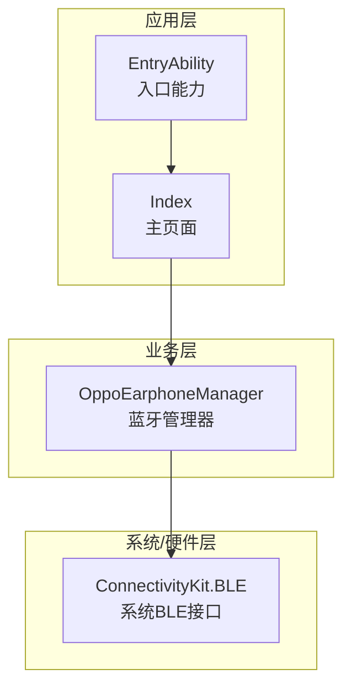
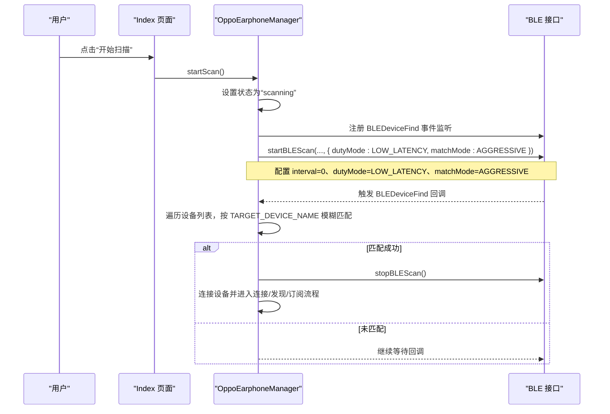
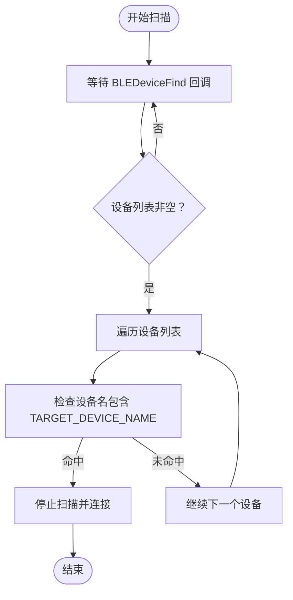
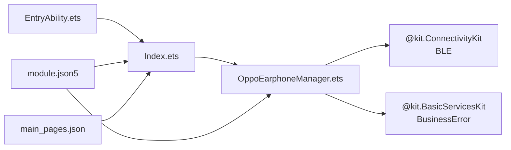

# 设备扫描

<cite>
**本文引用的文件**
- [EntryAbility.ets](file://entry/src/main/ets/entryability/EntryAbility.ets)
- [OppoEarphoneManager.ets](file://entry/src/main/ets/manager/OppoEarphoneManager.ets)
- [Index.ets](file://entry/src/main/ets/pages/Index.ets)
- [module.json5](file://entry/src/main/module.json5)
- [string.json](file://entry/src/main/resources/base/element/string.json)
- [main_pages.json](file://entry/src/main/resources/base/profile/main_pages.json)
</cite>

## 目录
1. [简介](#简介)
2. [项目结构](#项目结构)
3. [核心组件](#核心组件)
4. [架构总览](#架构总览)
5. [详细组件分析](#详细组件分析)
6. [依赖关系分析](#依赖关系分析)
7. [性能考虑](#性能考虑)
8. [故障排查指南](#故障排查指南)
9. [结论](#结论)
10. [附录](#附录)

## 简介
本文件面向 OPPO Enco Air5 Pro 设备扫描功能，系统性阐述低延迟扫描模式的配置原理与实现细节，重点解释以下方面：
- SCAN_MODE_LOW_LATENCY 参数的作用与性能优势
- 设备发现算法与 TARGET_DEVICE_NAME 常量的使用及模糊匹配逻辑
- BLEDeviceFind 事件监听机制与扫描结果回调处理流程
- 正确启动/停止扫描的方法与异常处理策略
- 扫描性能优化建议与常见问题解决方案

## 项目结构
项目采用 ArkTS + HarmonyOS 应用框架，主要涉及入口能力、页面与管理器三层：
- 入口能力负责窗口生命周期与日志输出
- 页面负责 UI 展示、权限请求与交互控制
- 管理器封装 BLE 扫描、连接、服务发现与电量解析

图表来源
- [EntryAbility.ets:1-48](file://entry/src/main/ets/entryability/EntryAbility.ets#L1-L48)
- [Index.ets:114-142](file://entry/src/main/ets/pages/Index.ets#L114-L142)
- [OppoEarphoneManager.ets:131-207](file://entry/src/main/ets/manager/OppoEarphoneManager.ets#L131-L207)

章节来源
- [EntryAbility.ets:1-48](file://entry/src/main/ets/entryability/EntryAbility.ets#L1-L48)
- [Index.ets:114-142](file://entry/src/main/ets/pages/Index.ets#L114-L142)
- [module.json5:1-63](file://entry/src/main/module.json5#L1-L63)
- [main_pages.json:1-6](file://entry/src/main/resources/base/profile/main_pages.json#L1-L6)

## 核心组件
- OppoEarphoneManager：负责扫描、连接、服务发现与电量通知订阅；内部维护扫描状态、连接状态与电量数据，并通过回调对外暴露状态与电量。
- Index 页面：负责权限申请、状态显示、按钮交互与扫描提示；通过回调接收电量与状态变更，驱动 UI 更新。
- EntryAbility：应用生命周期与窗口加载，便于统一日志与上下文初始化。

章节来源
- [OppoEarphoneManager.ets:49-121](file://entry/src/main/ets/manager/OppoEarphoneManager.ets#L49-L121)
- [Index.ets:100-142](file://entry/src/main/ets/pages/Index.ets#L100-L142)
- [EntryAbility.ets:7-32](file://entry/src/main/ets/entryability/EntryAbility.ets#L7-L32)

## 架构总览
下图展示了从用户点击“开始扫描”到完成连接与订阅的端到端流程，包括 BLE 事件监听、扫描配置与状态流转。

图表来源
- [Index.ets:324-333](file://entry/src/main/ets/pages/Index.ets#L324-L333)
- [OppoEarphoneManager.ets:131-207](file://entry/src/main/ets/manager/OppoEarphoneManager.ets#L131-L207)
- [OppoEarphoneManager.ets:151-177](file://entry/src/main/ets/manager/OppoEarphoneManager.ets#L151-L177)

## 详细组件分析

### 低延迟扫描模式配置与原理
- 配置入口：在 startScan 中调用系统 BLE 接口启动扫描，并传入扫描参数对象。
- 关键参数：
  - interval：设置为 0，表示由系统根据 dutyMode 自主导扫描节奏。
  - dutyMode：设置为低延迟模式，优先快速发现设备，降低发现延迟。
  - matchMode：设置为积极匹配模式，提升匹配效率与准确性。
- 性能优势：
  - 低延迟模式在有限时间内最大化扫描强度，缩短首次发现时间，适合耳机等短距离、高移动性的设备场景。
  - 积极匹配模式有助于在设备名不完全一致时仍能识别目标设备（例如厂商命名差异）。

章节来源
- [OppoEarphoneManager.ets:183-205](file://entry/src/main/ets/manager/OppoEarphoneManager.ets#L183-L205)

### 设备发现算法与模糊匹配
- 目标设备常量：TARGET_DEVICE_NAME 定义为目标机型名称字符串。
- 匹配策略：遍历 BLEDeviceFind 回调中的设备数组，使用包含判断进行模糊匹配，兼容不同厂商命名变体。
- 流程要点：
  - 一旦匹配成功，立即停止扫描并发起连接，避免重复扫描与资源浪费。
  - 若未匹配，继续等待后续回调，直到超时或用户取消。

图表来源
- [OppoEarphoneManager.ets:151-177](file://entry/src/main/ets/manager/OppoEarphoneManager.ets#L151-L177)
- [OppoEarphoneManager.ets:57](file://entry/src/main/ets/manager/OppoEarphoneManager.ets#L57)

章节来源
- [OppoEarphoneManager.ets:151-177](file://entry/src/main/ets/manager/OppoEarphoneManager.ets#L151-L177)
- [OppoEarphoneManager.ets:57](file://entry/src/main/ets/manager/OppoEarphoneManager.ets#L57)

### BLEDeviceFind 事件监听机制
- 事件注册：在 startScan 中注册 BLEDeviceFind 事件监听，回调中处理扫描结果。
- 回调处理：
  - 提取设备名与 MAC 地址
  - 使用模糊匹配筛选目标设备
  - 匹配成功后停止扫描并连接
- 事件注销：stopScan 中主动注销事件，防止内存泄漏与重复触发。

章节来源
- [OppoEarphoneManager.ets:149-177](file://entry/src/main/ets/manager/OppoEarphoneManager.ets#L149-L177)
- [OppoEarphoneManager.ets:217-243](file://entry/src/main/ets/manager/OppoEarphoneManager.ets#L217-L243)

### 扫描生命周期与状态管理
- 状态枚举：disconnected、scanning、connecting、connected、subscribed。
- 状态流转：
  - startScan -> scanning
  - 连接成功 -> connected
  - 服务发现完成 -> subscribed
  - disconnect -> disconnected
- 管理器内部通过回调通知外部状态变化，页面据此更新 UI 与按钮状态。

章节来源
- [OppoEarphoneManager.ets:37](file://entry/src/main/ets/manager/OppoEarphoneManager.ets#L37)
- [OppoEarphoneManager.ets:143](file://entry/src/main/ets/manager/OppoEarphoneManager.ets#L143)
- [OppoEarphoneManager.ets:635-643](file://entry/src/main/ets/manager/OppoEarphoneManager.ets#L635-L643)
- [Index.ets:166-181](file://entry/src/main/ets/pages/Index.ets#L166-L181)

### 电量数据解析与订阅
- 服务与特征：固定服务 UUID 与通知特征 UUID。
- 订阅流程：连接成功后发现服务，订阅通知特征，监听特征变化事件并解析电量数据。
- 解析算法：遍历特征值数组，依据标识字节与前置字节判断左耳/右耳/充电仓，并根据阈值判断是否在充电，最终更新 UI。

章节来源
- [OppoEarphoneManager.ets:53-55](file://entry/src/main/ets/manager/OppoEarphoneManager.ets#L53-L55)
- [OppoEarphoneManager.ets:351-409](file://entry/src/main/ets/manager/OppoEarphoneManager.ets#L351-L409)
- [OppoEarphoneManager.ets:419-473](file://entry/src/main/ets/manager/OppoEarphoneManager.ets#L419-L473)
- [OppoEarphoneManager.ets:497-593](file://entry/src/main/ets/manager/OppoEarphoneManager.ets#L497-L593)

### 权限与页面交互
- 权限：声明 ACCESS_BLUETOOTH 权限并在运行时请求。
- 交互：页面根据状态渲染不同按钮与提示；扫描期间显示提示信息，结束后根据连接状态更新 MAC 地址与电量。

章节来源
- [module.json5:14-25](file://entry/src/main/module.json5#L14-L25)
- [string.json:16-18](file://entry/src/main/resources/base/element/string.json#L16-L18)
- [Index.ets:147-161](file://entry/src/main/ets/pages/Index.ets#L147-L161)
- [Index.ets:307-370](file://entry/src/main/ets/pages/Index.ets#L307-L370)

## 依赖关系分析
- 模块依赖：
  - EntryAbility 依赖 window 生命周期与日志工具
  - Index 页面依赖权限管理与 OppoEarphoneManager
  - OppoEarphoneManager 依赖 ConnectivityKit.BLE 与 BasicServicesKit.BusinessError
- 资源依赖：
  - module.json5 声明权限与页面入口
  - main_pages.json 指定主页面路径

图表来源
- [EntryAbility.ets:1-48](file://entry/src/main/ets/entryability/EntryAbility.ets#L1-L48)
- [Index.ets:114](file://entry/src/main/ets/pages/Index.ets#L114)
- [OppoEarphoneManager.ets:1-3](file://entry/src/main/ets/manager/OppoEarphoneManager.ets#L1-L3)
- [module.json5:14-25](file://entry/src/main/module.json5#L14-L25)
- [main_pages.json:2-4](file://entry/src/main/resources/base/profile/main_pages.json#L2-L4)

章节来源
- [module.json5:14-25](file://entry/src/main/module.json5#L14-L25)
- [main_pages.json:2-4](file://entry/src/main/resources/base/profile/main_pages.json#L2-L4)

## 性能考虑
- 低延迟扫描的优势
  - 在有限时间内提高扫描强度，缩短首次发现时间，适合耳机等短距离、高移动性的设备场景。
  - 对于 Enco Air5 Pro，低延迟模式可显著减少用户等待时间。
- 匹配策略优化
  - 使用包含匹配而非严格相等，兼顾命名差异与兼容性。
  - 匹配成功即停止扫描，避免无效扫描循环。
- 资源释放
  - 停止扫描时及时注销事件监听，防止内存泄漏与重复回调。
  - 断开连接时清理 GATT 客户端与回调，重置电量状态，确保下次扫描不受历史状态影响。
- UI 体验
  - 扫描期间显示提示信息，避免用户误以为应用无响应。
  - 根据状态动态禁用/启用按钮，避免并发操作。

章节来源
- [OppoEarphoneManager.ets:183-205](file://entry/src/main/ets/manager/OppoEarphoneManager.ets#L183-L205)
- [OppoEarphoneManager.ets:151-177](file://entry/src/main/ets/manager/OppoEarphoneManager.ets#L151-L177)
- [OppoEarphoneManager.ets:217-243](file://entry/src/main/ets/manager/OppoEarphoneManager.ets#L217-L243)
- [OppoEarphoneManager.ets:653-705](file://entry/src/main/ets/manager/OppoEarphoneManager.ets#L653-L705)
- [Index.ets:324-333](file://entry/src/main/ets/pages/Index.ets#L324-L333)

## 故障排查指南
- 启动扫描失败
  - 现象：抛出异常，状态回退至 disconnected。
  - 排查：确认权限已授予；检查系统 BLE 是否可用；查看错误日志定位具体原因。
- 停止扫描失败
  - 现象：停止扫描时抛出异常。
  - 排查：确认扫描处于进行中；检查事件监听是否已注销；避免重复停止。
- 连接失败
  - 现象：连接状态未切换为 connected。
  - 排查：确认设备处于可连接范围；检查 MAC 地址有效性；查看连接状态回调日志。
- 未发现目标设备
  - 现象：扫描长时间无结果。
  - 排查：确认耳机充电仓盖子打开；确保设备处于蓝牙范围内；检查设备名是否包含目标字符串；适当延长扫描时间或调整匹配策略。
- 电量数据未更新
  - 现象：UI 未显示电量。
  - 排查：确认已成功订阅通知；检查特征值解析逻辑；查看解析日志与回调是否触发。

章节来源
- [OppoEarphoneManager.ets:195-205](file://entry/src/main/ets/manager/OppoEarphoneManager.ets#L195-L205)
- [OppoEarphoneManager.ets:235-241](file://entry/src/main/ets/manager/OppoEarphoneManager.ets#L235-L241)
- [OppoEarphoneManager.ets:297-340](file://entry/src/main/ets/manager/OppoEarphoneManager.ets#L297-L340)
- [OppoEarphoneManager.ets:445-471](file://entry/src/main/ets/manager/OppoEarphoneManager.ets#L445-L471)

## 结论
本项目通过低延迟扫描模式与模糊匹配策略，实现了对 OPPO Enco Air5 Pro 的高效发现与连接。管理器以清晰的状态机与事件驱动方式组织扫描、连接与订阅流程，页面通过回调实时更新 UI。结合合理的资源释放与异常处理，整体具备良好的稳定性与用户体验。建议在实际部署中进一步完善超时控制与重试策略，以应对复杂环境下的不确定性。

## 附录

### 如何正确启动与停止扫描
- 启动扫描
  - 在页面中调用管理器的 startScan 方法，确保已授予蓝牙权限。
  - 管理器会注册 BLEDeviceFind 事件监听并启动低延迟扫描。
- 停止扫描
  - 在页面中调用管理器的 stopScan 方法，或在断开连接时自动停止。
  - 管理器会停止扫描并注销事件监听。

章节来源
- [Index.ets:324-333](file://entry/src/main/ets/pages/Index.ets#L324-L333)
- [OppoEarphoneManager.ets:131-207](file://entry/src/main/ets/manager/OppoEarphoneManager.ets#L131-L207)
- [OppoEarphoneManager.ets:217-243](file://entry/src/main/ets/manager/OppoEarphoneManager.ets#L217-L243)

### 代码示例路径参考
- 启动扫描示例路径
  - [Index.ets:324-333](file://entry/src/main/ets/pages/Index.ets#L324-L333)
  - [OppoEarphoneManager.ets:131-207](file://entry/src/main/ets/manager/OppoEarphoneManager.ets#L131-L207)
- 停止扫描示例路径
  - [OppoEarphoneManager.ets:217-243](file://entry/src/main/ets/manager/OppoEarphoneManager.ets#L217-L243)
- 异常处理示例路径
  - [OppoEarphoneManager.ets:195-205](file://entry/src/main/ets/manager/OppoEarphoneManager.ets#L195-L205)
  - [OppoEarphoneManager.ets:235-241](file://entry/src/main/ets/manager/OppoEarphoneManager.ets#L235-L241)