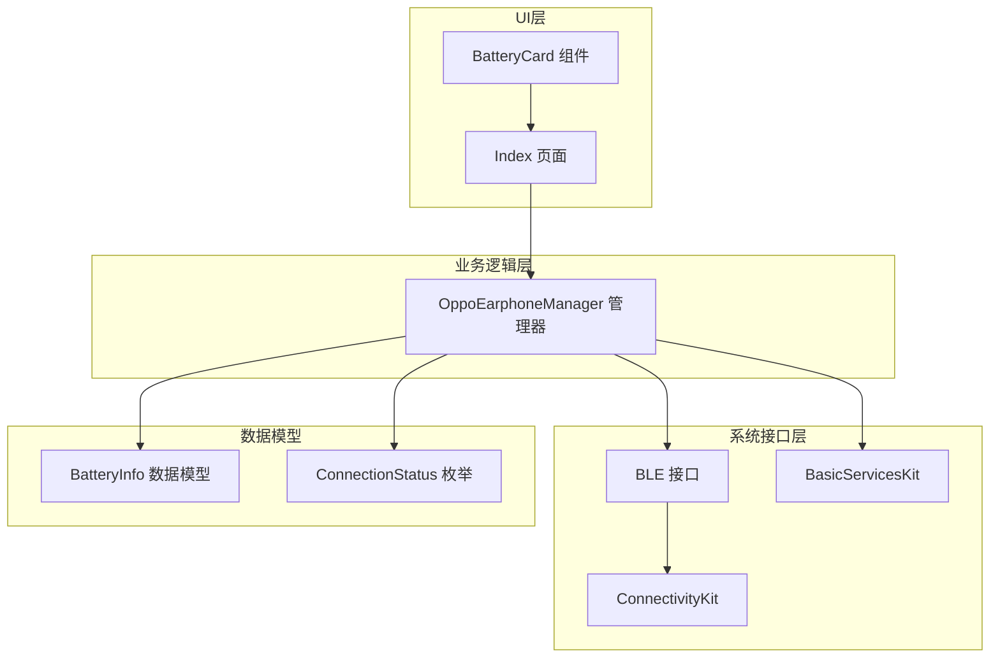
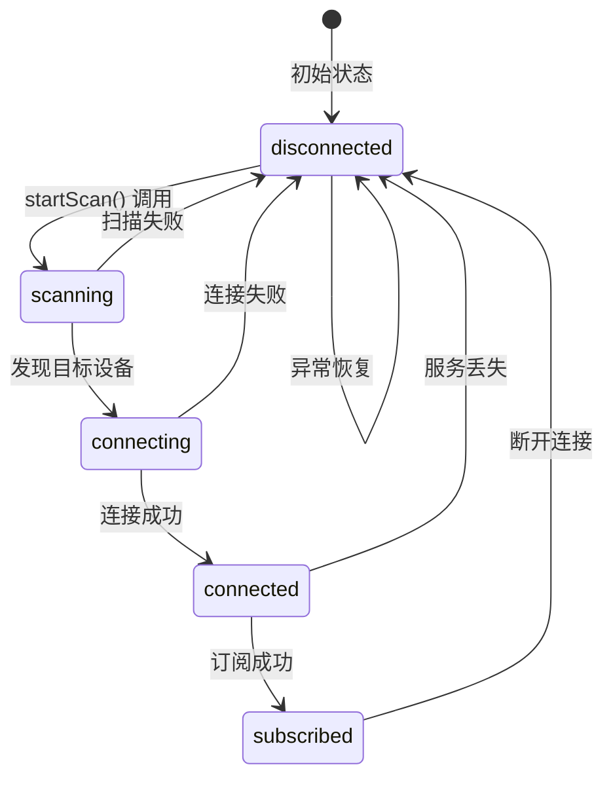
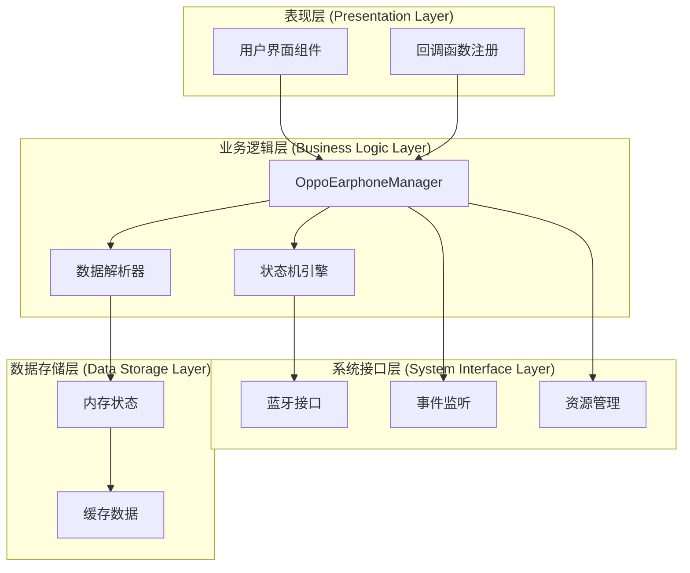
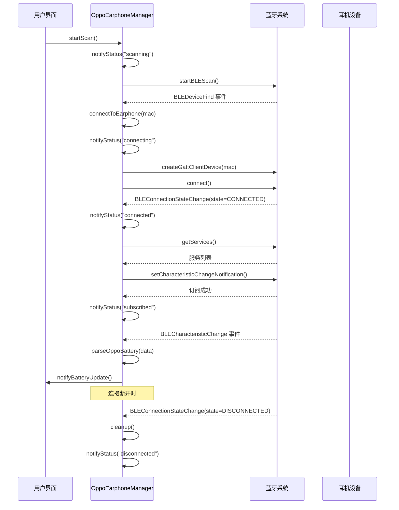
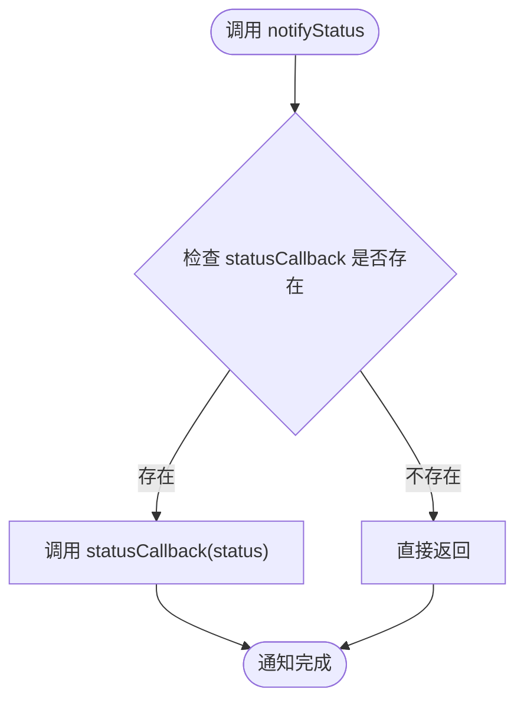
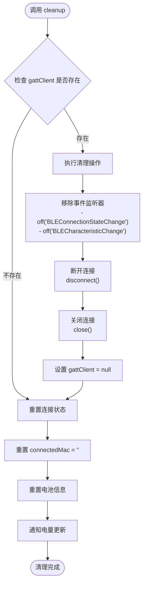
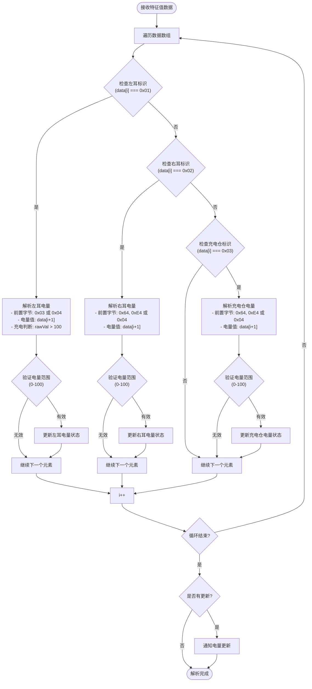
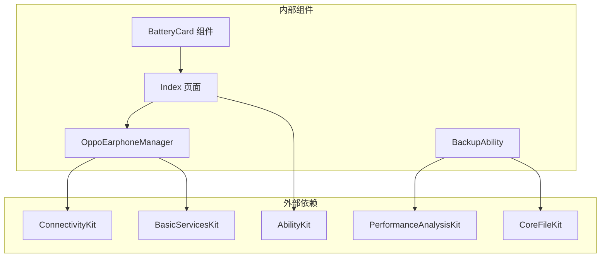
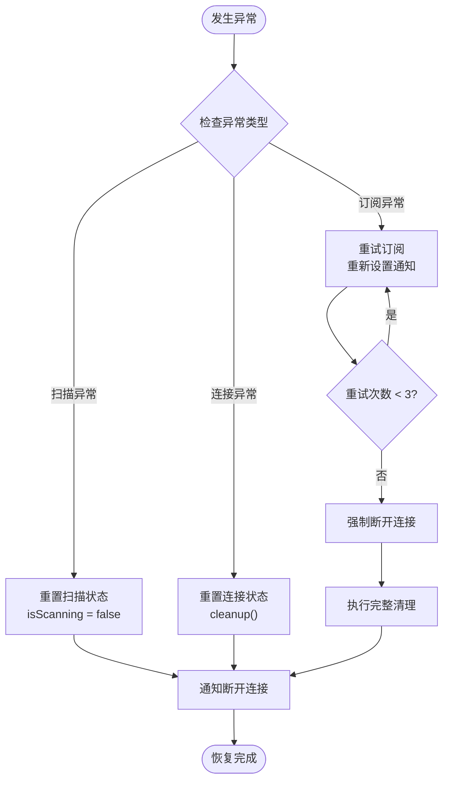

# 连接状态管理

<cite>
**本文档引用的文件**
- [OppoEarphoneManager.ets](file://entry/src/main/ets/manager/OppoEarphoneManager.ets)
- [Index.ets](file://entry/src/main/ets/pages/Index.ets)
- [EntryBackupAbility.ets](file://entry/src/main/ets/entrybackupability/EntryBackupAbility.ets)
</cite>

## 目录
1. [简介](#简介)
2. [项目结构](#项目结构)
3. [核心组件](#核心组件)
4. [架构概览](#架构概览)
5. [详细组件分析](#详细组件分析)
6. [依赖关系分析](#依赖关系分析)
7. [性能考虑](#性能考虑)
8. [故障排除指南](#故障排除指南)
9. [结论](#结论)

## 简介

本项目实现了OPPO Enco Air5 Pro蓝牙耳机电量监控系统，重点围绕连接状态管理进行设计和实现。系统采用状态机模式管理蓝牙连接生命周期，包括扫描、连接、服务发现、特征值订阅等完整流程，并提供了完善的回调通知机制和资源清理策略。

## 项目结构

项目采用模块化架构，主要包含以下关键组件：



**图表来源**
- [OppoEarphoneManager.ets:1-747](file://entry/src/main/ets/manager/OppoEarphoneManager.ets#L1-L747)
- [Index.ets:1-476](file://entry/src/main/ets/pages/Index.ets#L1-L476)

**章节来源**
- [OppoEarphoneManager.ets:1-747](file://entry/src/main/ets/manager/OppoEarphoneManager.ets#L1-L747)
- [Index.ets:1-476](file://entry/src/main/ets/pages/Index.ets#L1-L476)

## 核心组件

### ConnectionStatus 枚举设计

系统定义了五种核心连接状态，每种状态都有明确的语义和转换条件：



**图表来源**
- [OppoEarphoneManager.ets:37](file://entry/src/main/ets/manager/OppoEarphoneManager.ets#L37)

### BatteryInfo 数据模型

电量信息采用统一的数据模型，支持左右耳和充电仓的电量状态：

| 字段名 | 类型 | 描述 | 默认值 |
|--------|------|------|--------|
| leftBattery | number | 左耳电量百分比 (-1表示未知) | -1 |
| leftCharging | boolean | 左耳是否充电中 | false |
| rightBattery | number | 右耳电量百分比 (-1表示未知) | -1 |
| rightCharging | boolean | 右耳是否充电中 | false |
| caseBattery | number | 充电仓电量百分比 (-1表示未知) | -1 |
| caseCharging | boolean | 充电仓是否充电中 | false |

**章节来源**
- [OppoEarphoneManager.ets:13-27](file://entry/src/main/ets/manager/OppoEarphoneManager.ets#L13-L27)

## 架构概览

系统采用分层架构设计，各层职责清晰分离：



**图表来源**
- [OppoEarphoneManager.ets:49-747](file://entry/src/main/ets/manager/OppoEarphoneManager.ets#L49-L747)
- [Index.ets:100-159](file://entry/src/main/ets/pages/Index.ets#L100-L159)

## 详细组件分析

### OppoEarphoneManager 类设计

OppoEarphoneManager 是整个系统的中枢控制器，负责管理完整的蓝牙连接生命周期：

```mermaid
classDiagram
class OppoEarphoneManager {
-SERVICE_UUID : string
-NOTIFY_CHAR_UUID : string
-TARGET_DEVICE_NAME : string
-STATE_CONNECTED : number
-STATE_DISCONNECTED : number
-gattClient : ble.GattClientDevice
-isScanning : boolean
-connectedMac : string
-batteryCallback : Function
-statusCallback : Function
-rawDataCallback : Function
-batteryInfo : BatteryInfo
+setCallbacks(batteryCb, statusCb, rawCb)
+startScan()
+stopScan()
+disconnect()
+getMacAddress() : string
-connectToEarphone(macAddress)
-discoverServices()
-subscribeBatteryNotifications()
-parseOppoBattery(data)
-notifyBatteryUpdate()
-notifyRawData(data)
-notifyStatus(status)
-cleanup()
}
class BatteryInfo {
+leftBattery : number
+leftCharging : boolean
+rightBattery : number
+rightCharging : boolean
+caseBattery : number
+caseCharging : boolean
}
class ConnectionStatus {
<<enumeration>>
"disconnected"
"scanning"
"connecting"
"connected"
"subscribed"
}
OppoEarphoneManager --> BatteryInfo : "使用"
OppoEarphoneManager --> ConnectionStatus : "使用"
```

**图表来源**
- [OppoEarphoneManager.ets:49-747](file://entry/src/main/ets/manager/OppoEarphoneManager.ets#L49-L747)

#### 状态转换流程

系统实现了完整的状态转换逻辑，每个状态转换都有明确的触发条件和处理流程：



**图表来源**
- [OppoEarphoneManager.ets:135-344](file://entry/src/main/ets/manager/OppoEarphoneManager.ets#L135-L344)
- [OppoEarphoneManager.ets:423-481](file://entry/src/main/ets/manager/OppoEarphoneManager.ets#L423-L481)

**章节来源**
- [OppoEarphoneManager.ets:49-747](file://entry/src/main/ets/manager/OppoEarphoneManager.ets#L49-L747)

### 状态通知机制

系统实现了多层次的通知机制，确保状态变化能够及时传达给各个组件：

#### notifyStatus 方法实现

notifyStatus 方法是状态通知的核心实现：



**图表来源**
- [OppoEarphoneManager.ets:673-681](file://entry/src/main/ets/manager/OppoEarphoneManager.ets#L673-L681)

#### 回调函数调用时机

系统在关键节点调用回调函数，确保UI能够及时反映状态变化：

| 状态 | 调用时机 | 回调内容 |
|------|----------|----------|
| scanning | startScan() 开始扫描时 | 通知扫描开始 |
| connecting | connectToEarphone() 连接时 | 通知连接中 |
| connected | 服务发现完成后 | 通知服务发现完成 |
| subscribed | 订阅成功后 | 通知订阅完成 |
| disconnected | 断开连接或异常时 | 通知断开连接 |

**章节来源**
- [OppoEarphoneManager.ets:673-681](file://entry/src/main/ets/manager/OppoEarphoneManager.ets#L673-L681)
- [Index.ets:138-146](file://entry/src/main/ets/pages/Index.ets#L138-L146)

### 资源清理流程

cleanup 方法实现了完整的资源清理策略，确保系统资源得到正确释放：



**图表来源**
- [OppoEarphoneManager.ets:691-743](file://entry/src/main/ets/manager/OppoEarphoneManager.ets#L691-L743)

**章节来源**
- [OppoEarphoneManager.ets:691-743](file://entry/src/main/ets/manager/OppoEarphoneManager.ets#L691-L743)

### 电量数据解析算法

系统实现了专门的OPPO耳机电量解析算法，能够准确识别不同设备的电量数据：



**图表来源**
- [OppoEarphoneManager.ets:505-601](file://entry/src/main/ets/manager/OppoEarphoneManager.ets#L505-L601)

**章节来源**
- [OppoEarphoneManager.ets:505-601](file://entry/src/main/ets/manager/OppoEarphoneManager.ets#L505-L601)

## 依赖关系分析

系统依赖关系清晰，主要依赖于HarmonyOS的ConnectivityKit和BasicServicesKit：



**图表来源**
- [OppoEarphoneManager.ets:1-3](file://entry/src/main/ets/manager/OppoEarphoneManager.ets#L1-L3)
- [Index.ets:1-3](file://entry/src/main/ets/pages/Index.ets#L1-L3)
- [EntryBackupAbility.ets:1-2](file://entry/src/main/ets/entrybackupability/EntryBackupAbility.ets#L1-L2)

**章节来源**
- [OppoEarphoneManager.ets:1-3](file://entry/src/main/ets/manager/OppoEarphoneManager.ets#L1-L3)
- [Index.ets:1-3](file://entry/src/main/ets/pages/Index.ets#L1-L3)
- [EntryBackupAbility.ets:1-2](file://entry/src/main/ets/entrybackupability/EntryBackupAbility.ets#L1-L2)

## 性能考虑

### 扫描优化策略

系统采用了低延迟扫描模式以提高扫描效率：

- **扫描间隔**: 0纳秒（最低延迟）
- **扫描模式**: SCAN_MODE_LOW_LATENCY（低延迟模式）
- **匹配策略**: MATCH_MODE_AGGRESSIVE（激进匹配）

### 内存管理

系统实现了智能的内存管理策略：

- **及时清理**: 连接断开时立即清理资源
- **状态重置**: 清理过程中重置所有状态变量
- **回调解除**: 移除所有事件监听器避免内存泄漏

### UI响应优化

UI层实现了按需更新策略：

- **整十更新**: 仅在整十电量时更新UI，减少不必要的重绘
- **状态缓存**: 在内存中维护最新的状态信息
- **异步处理**: 所有网络操作都是异步执行

## 故障排除指南

### 常见问题及解决方案

| 问题类型 | 症状 | 可能原因 | 解决方案 |
|----------|------|----------|----------|
| 扫描失败 | 状态停留在 disconnected | 蓝牙权限不足或扫描异常 | 检查蓝牙权限，重新授权 |
| 连接超时 | 状态卡在 connecting | 设备不可达或配对失败 | 确保设备在范围内，重试连接 |
| 订阅失败 | 状态停留在 connected | 服务UUID不匹配 | 检查服务UUID配置 |
| 数据解析错误 | 电量显示异常 | 数据格式不符合预期 | 验证数据解析算法 |

### 异常状态恢复策略

系统实现了多层异常处理机制：



**图表来源**
- [OppoEarphoneManager.ets:199-209](file://entry/src/main/ets/manager/OppoEarphoneManager.ets#L199-L209)
- [OppoEarphoneManager.ets:335-343](file://entry/src/main/ets/manager/OppoEarphoneManager.ets#L335-L343)

**章节来源**
- [OppoEarphoneManager.ets:199-209](file://entry/src/main/ets/manager/OppoEarphoneManager.ets#L199-L209)
- [OppoEarphoneManager.ets:335-343](file://entry/src/main/ets/manager/OppoEarphoneManager.ets#L335-L343)

## 结论

本项目的连接状态管理系统设计合理，实现了完整的蓝牙连接生命周期管理。通过状态机模式、回调通知机制和资源清理策略，系统能够稳定地处理各种连接场景。建议在未来版本中考虑添加状态持久化功能，以便在应用重启后能够恢复之前的连接状态。

系统的主要优势包括：
- 清晰的状态定义和转换逻辑
- 完善的异常处理和恢复机制  
- 高效的资源管理和内存控制
- 用户友好的UI反馈和交互