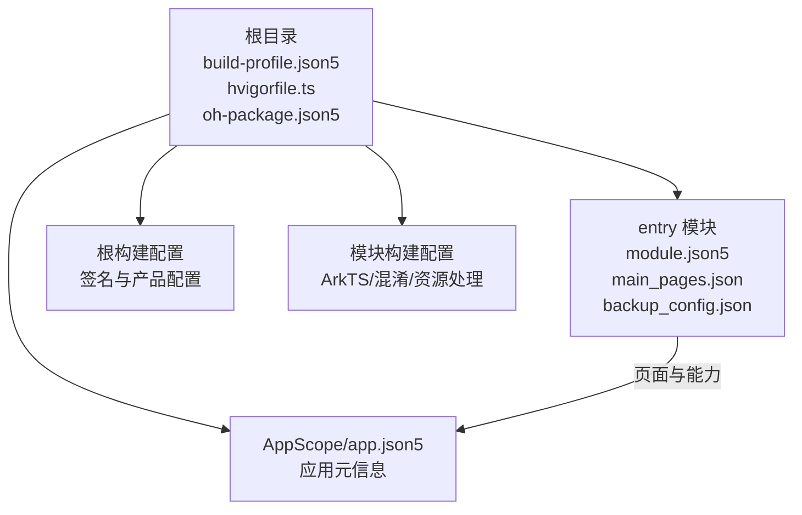
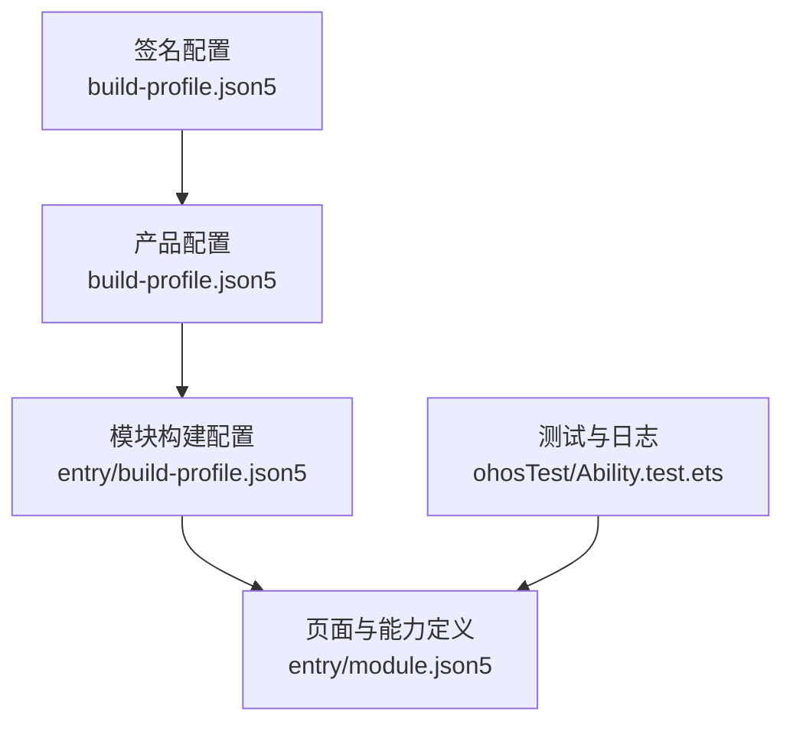
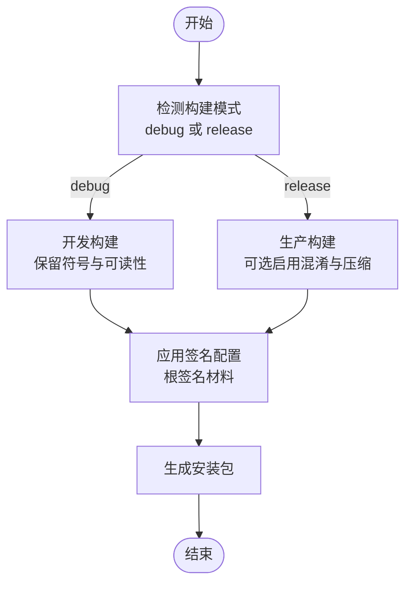
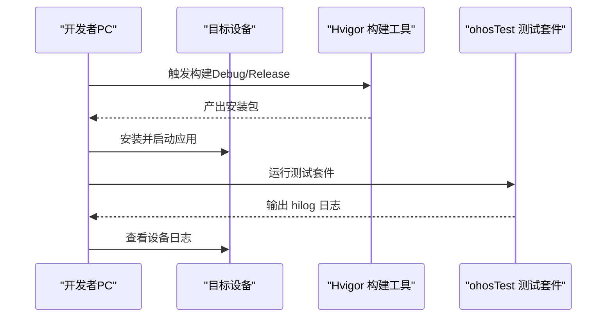
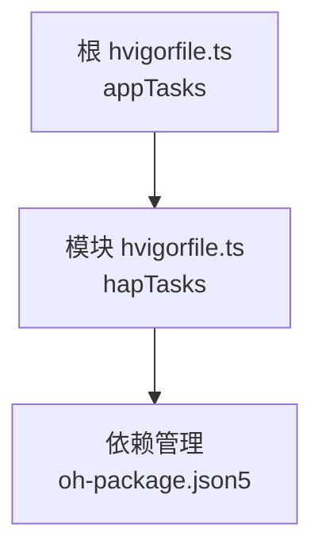

# 部署与发布

<cite>
**本文引用的文件**
- [build-profile.json5（根）](file://build-profile.json5)
- [build-profile.json5（模块 entry）](file://entry/build-profile.json5)
- [hvigorfile.ts（根）](file://hvigorfile.ts)
- [hvigorfile.ts（模块 entry）](file://entry/hvigorfile.ts)
- [oh-package.json5](file://oh-package.json5)
- [AppScope/app.json5](file://AppScope/app.json5)
- [entry/src/main/module.json5](file://entry/src/main/module.json5)
- [entry/src/main/resources/base/profile/main_pages.json](file://entry/src/main/resources/base/profile/main_pages.json)
- [entry/src/main/resources/base/profile/backup_config.json](file://entry/src/main/resources/base/profile/backup_config.json)
- [entry/obfuscation-rules.txt](file://entry/obfuscation-rules.txt)
- [entry/src/ohosTest/ets/test/Ability.test.ets](file://entry/src/ohosTest/ets/test/Ability.test.ets)
- [entry/src/ohosTest/ets/test/List.test.ets](file://entry/src/ohosTest/ets/test/List.test.ets)
</cite>

## 目录
1. [简介](#简介)
2. [项目结构](#项目结构)
3. [核心组件](#核心组件)
4. [架构总览](#架构总览)
5. [详细组件分析](#详细组件分析)
6. [依赖分析](#依赖分析)
7. [性能考量](#性能考量)
8. [故障排查指南](#故障排查指南)
9. [结论](#结论)
10. [附录](#附录)

## 简介
本指南面向 OPPO Enco Air5 Pro 应用的部署与发布，覆盖从编译打包、签名证书配置、分发准备、真机调试与测试、版本管理与更新策略、性能分析与优化、到发布后监控与紧急回滚的全流程。文档基于仓库中的构建与配置文件进行梳理，确保操作可执行且与工程实际一致。

## 项目结构
该工程采用多模块结构，根目录包含应用级配置与构建入口，entry 模块为应用主体，包含页面、能力定义、权限声明与备份扩展等。构建工具链由 Hvigor 提供，使用 build-profile.json5 统一管理产品、签名与构建模式；模块内通过各自 build-profile.json5 控制 ArkTS 编译选项与资源处理策略。

图表来源
- [build-profile.json5（根）:1-56](file://build-profile.json5#L1-L56)
- [build-profile.json5（模块 entry）:1-33](file://entry/build-profile.json5#L1-L33)
- [hvigorfile.ts（根）:1-6](file://hvigorfile.ts#L1-L6)
- [hvigorfile.ts（模块 entry）:1-6](file://entry/hvigorfile.ts#L1-L6)
- [oh-package.json5:1-11](file://oh-package.json5#L1-L11)
- [AppScope/app.json5:1-11](file://AppScope/app.json5#L1-L11)
- [entry/src/main/module.json5:1-63](file://entry/src/main/module.json5#L1-L63)
- [entry/src/main/resources/base/profile/main_pages.json:1-6](file://entry/src/main/resources/base/profile/main_pages.json#L1-L6)
- [entry/src/main/resources/base/profile/backup_config.json:1-3](file://entry/src/main/resources/base/profile/backup_config.json#L1-L3)

章节来源
- [build-profile.json5（根）:1-56](file://build-profile.json5#L1-L56)
- [build-profile.json5（模块 entry）:1-33](file://entry/build-profile.json5#L1-L33)
- [hvigorfile.ts（根）:1-6](file://hvigorfile.ts#L1-L6)
- [hvigorfile.ts（模块 entry）:1-6](file://entry/hvigorfile.ts#L1-L6)
- [oh-package.json5:1-11](file://oh-package.json5#L1-L11)

## 核心组件
- 应用元信息与版本：应用包名、图标、标签、版本号与版本名在 AppScope 的 app.json5 中定义，用于安装包标识与版本管理。
- 模块能力与页面：entry 模块的 module.json5 定义了主能力、页面路径、设备类型、权限声明与备份扩展能力。
- 构建与签名：根 build-profile.json5 声明签名配置与产品信息；模块 build-profile.json5 控制 ArkTS 编译与混淆策略。
- 测试与日志：ohosTest 测试套件引入性能分析日志接口，便于运行期日志采集与问题定位。

章节来源
- [AppScope/app.json5:1-11](file://AppScope/app.json5#L1-L11)
- [entry/src/main/module.json5:1-63](file://entry/src/main/module.json5#L1-L63)
- [build-profile.json5（根）:1-56](file://build-profile.json5#L1-L56)
- [build-profile.json5（模块 entry）:1-33](file://entry/build-profile.json5#L1-L33)
- [entry/src/ohosTest/ets/test/Ability.test.ets:1-35](file://entry/src/ohosTest/ets/test/Ability.test.ets#L1-L35)

## 架构总览
下图展示从配置到产物的关键流转：根构建配置决定签名与产品矩阵，模块构建配置决定 ArkTS 编译与混淆策略，最终生成安装包并携带页面与能力定义。

图表来源
- [build-profile.json5（根）:1-56](file://build-profile.json5#L1-L56)
- [build-profile.json5（模块 entry）:1-33](file://entry/build-profile.json5#L1-L33)
- [entry/src/main/module.json5:1-63](file://entry/src/main/module.json5#L1-L63)
- [entry/src/ohosTest/ets/test/Ability.test.ets:1-35](file://entry/src/ohosTest/ets/test/Ability.test.ets#L1-L35)

## 详细组件分析

### 构建与打包流程（Debug 与 Release）
- Debug 模式
  - 根配置中定义了 debug 与 release 两种构建模式集合，Debug 模式通常不启用严格混淆与压缩，便于调试与定位问题。
  - 模块构建配置未在 release 节点开启 ArkTS 混淆规则文件，意味着默认关闭混淆，有利于调试。
- Release 模式
  - 可通过在模块 build-profile.json5 的 release 节点中启用 ArkTS 混淆与规则文件，以减小体积并提升安全性。
  - 根配置提供签名材料路径与别名，确保 Release 包签名正确。

图表来源
- [build-profile.json5（根）:33-40](file://build-profile.json5#L33-L40)
- [build-profile.json5（模块 entry）:10-24](file://entry/build-profile.json5#L10-L24)

章节来源
- [build-profile.json5（根）:33-40](file://build-profile.json5#L33-L40)
- [build-profile.json5（模块 entry）:10-24](file://entry/build-profile.json5#L10-L24)

### 签名证书配置与管理
- 根配置中包含 HarmonyOS 类型的签名材料，包含证书路径、密钥别名、密码、签名算法与存储文件等字段，用于统一签名。
- 开发证书与发布证书
  - 开发证书：适用于本地调试与预览，根配置已提供示例材料，便于快速调试。
  - 发布证书：应替换为正式发布的证书材料，确保安装包在应用商店与真机侧均能正常签名与校验。
- 管理建议
  - 将证书与密码置于受控环境，避免硬编码在仓库中；可通过 CI 环境变量或安全存储注入。
  - 不同环境（开发/测试/生产）使用不同签名材料，避免交叉污染。

章节来源
- [build-profile.json5（根）:3-16](file://build-profile.json5#L3-L16)

### 应用分发准备
- 应用商店提交要点（基于当前配置）
  - 页面与能力：确保 module.json5 中的 pages 与 abilities 正确指向实际页面与主能力，避免安装失败。
  - 权限声明：已声明蓝牙相关权限，需确保业务场景与权限说明一致，避免审核不通过。
  - 备份能力：已配置备份扩展能力，确保用户数据可迁移，提升体验。
- 版本号与兼容性
  - 版本号：AppScope 的 app.json5 定义了版本号与版本名，遵循语义化版本管理，避免破坏性变更导致兼容性问题。
  - 兼容性：产品配置中包含 targetSdkVersion 与 compatibleSdkVersion，确保与目标系统版本匹配。

章节来源
- [entry/src/main/module.json5:1-63](file://entry/src/main/module.json5#L1-L63)
- [entry/src/main/resources/base/profile/main_pages.json:1-6](file://entry/src/main/resources/base/profile/main_pages.json#L1-L6)
- [entry/src/main/resources/base/profile/backup_config.json:1-3](file://entry/src/main/resources/base/profile/backup_config.json#L1-L3)
- [AppScope/app.json5:1-11](file://AppScope/app.json5#L1-L11)
- [build-profile.json5（根）:18-32](file://build-profile.json5#L18-L32)

### 真机调试与测试
- USB 调试与连接
  - 在设备上启用开发者选项与 USB 调试，使用数据线连接 PC 并选择允许调试。
  - 使用构建工具链进行安装与调试，确保设备端签名与证书匹配。
- 日志收集
  - ohosTest 测试套件中引入性能分析日志接口，可在测试用例中输出 hilog 信息，便于定位问题。
  - 建议在调试阶段开启日志输出，结合设备日志查看器抓取关键信息。
- 自动化测试
  - 已提供测试入口与测试套件，可作为回归测试的基础，建议在每次发布前执行。

图表来源
- [hvigorfile.ts（根）:1-6](file://hvigorfile.ts#L1-L6)
- [hvigorfile.ts（模块 entry）:1-6](file://entry/hvigorfile.ts#L1-L6)
- [entry/src/ohosTest/ets/test/Ability.test.ets:1-35](file://entry/src/ohosTest/ets/test/Ability.test.ets#L1-L35)

章节来源
- [entry/src/ohosTest/ets/test/Ability.test.ets:1-35](file://entry/src/ohosTest/ets/test/Ability.test.ets#L1-L35)
- [entry/src/ohosTest/ets/test/List.test.ets:1-5](file://entry/src/ohosTest/ets/test/List.test.ets#L1-L5)

### 版本管理与更新策略
- 版本号规范
  - 使用 AppScope 的版本号与版本名，建议遵循语义化版本（主.次.修订），并在发布前统一更新。
- 升级兼容性
  - 保持 targetSdkVersion 与 compatibleSdkVersion 一致，避免系统版本差异导致的兼容性问题。
  - 对于页面与能力的变更，需评估对旧版本的影响，必要时提供向后兼容策略。

章节来源
- [AppScope/app.json5:1-11](file://AppScope/app.json5#L1-L11)
- [build-profile.json5（根）:18-32](file://build-profile.json5#L18-L32)

### 性能分析与优化
- ArkTS 混淆与压缩
  - 模块构建配置中可启用 ArkTS 混淆与规则文件，建议在 Release 模式开启，以减小包体并提升运行时性能。
  - 规则文件提供属性名、全局名、文件名与导出名的混淆开关，可根据需要调整。
- 资源与页面
  - main_pages.json 指定主页面，确保页面加载路径正确，避免冷启动时间过长。
  - backup_config.json 启用备份恢复能力，有助于减少重装成本，提升用户留存。

章节来源
- [entry/build-profile.json5:10-24](file://entry/build-profile.json5#L10-L24)
- [entry/obfuscation-rules.txt:1-23](file://entry/obfuscation-rules.txt#L1-L23)
- [entry/src/main/resources/base/profile/main_pages.json:1-6](file://entry/src/main/resources/base/profile/main_pages.json#L1-L6)
- [entry/src/main/resources/base/profile/backup_config.json:1-3](file://entry/src/main/resources/base/profile/backup_config.json#L1-L3)

### 发布后监控与维护
- 日志与指标
  - 在测试与运行期使用 hilog 输出关键信息，建立统一的日志采集与分析流程。
- 回滚机制与紧急修复
  - 通过版本号管理与备份能力，实现快速回滚与紧急修复；建议在发布前准备灰度策略与回滚预案。

章节来源
- [entry/src/ohosTest/ets/test/Ability.test.ets:1-35](file://entry/src/ohosTest/ets/test/Ability.test.ets#L1-L35)
- [entry/src/main/resources/base/profile/backup_config.json:1-3](file://entry/src/main/resources/base/profile/backup_config.json#L1-L3)

## 依赖分析
- 构建工具链
  - 根 hvigorfile.ts 引入应用任务插件，模块 hvigorfile.ts 引入 HAP 任务插件，分别负责应用与模块级构建。
- 依赖管理
  - 项目使用 oh-package.json5 管理依赖与开发依赖，测试框架 hypium 与 hamock 已声明，便于自动化测试。

图表来源
- [hvigorfile.ts（根）:1-6](file://hvigorfile.ts#L1-L6)
- [hvigorfile.ts（模块 entry）:1-6](file://entry/hvigorfile.ts#L1-L6)
- [oh-package.json5:1-11](file://oh-package.json5#L1-L11)

章节来源
- [hvigorfile.ts（根）:1-6](file://hvigorfile.ts#L1-L6)
- [hvigorfile.ts（模块 entry）:1-6](file://entry/hvigorfile.ts#L1-L6)
- [oh-package.json5:1-11](file://oh-package.json5#L1-L11)

## 性能考量
- 构建优化
  - 在 Release 模式启用 ArkTS 混淆与规则文件，减少包体与运行时开销。
  - 关闭不必要的资源复制与测试产物，缩短构建时间。
- 运行时优化
  - 通过备份能力与合理的页面加载策略，降低用户重装与冷启动成本。
  - 使用日志与性能分析工具持续监控关键指标，及时发现并修复性能瓶颈。

章节来源
- [entry/build-profile.json5:10-24](file://entry/build-profile.json5#L10-L24)
- [entry/obfuscation-rules.txt:1-23](file://entry/obfuscation-rules.txt#L1-L23)
- [entry/src/main/resources/base/profile/main_pages.json:1-6](file://entry/src/main/resources/base/profile/main_pages.json#L1-L6)

## 故障排查指南
- 构建失败
  - 检查根与模块的 build-profile.json5 是否存在语法错误或缺失字段。
  - 确认签名材料路径与权限正确，避免签名失败。
- 安装异常
  - 核对 module.json5 中的 abilities 与 pages 是否与实际文件一致。
  - 确保权限声明与业务场景一致，避免安装时权限拒绝。
- 日志与测试
  - 使用 ohosTest 套件输出 hilog 信息，结合设备日志查看器定位问题。
  - 在测试入口中组织测试用例，确保回归测试覆盖关键路径。

章节来源
- [build-profile.json5（根）:1-56](file://build-profile.json5#L1-L56)
- [build-profile.json5（模块 entry）:1-33](file://entry/build-profile.json5#L1-L33)
- [entry/src/main/module.json5:1-63](file://entry/src/main/module.json5#L1-L63)
- [entry/src/ohosTest/ets/test/Ability.test.ets:1-35](file://entry/src/ohosTest/ets/test/Ability.test.ets#L1-L35)

## 结论
本指南基于仓库现有配置，给出了从构建、签名、分发到调试、监控与回滚的完整流程建议。建议在实际发布前完善证书管理、测试覆盖与灰度策略，并持续通过日志与性能分析工具优化用户体验。

## 附录
- 快速检查清单
  - 签名材料是否正确配置并可访问
  - 版本号与页面/能力定义是否与业务一致
  - Release 模式是否启用混淆与压缩
  - 测试套件是否通过并输出关键日志
  - 备份能力是否按需启用并验证可用性