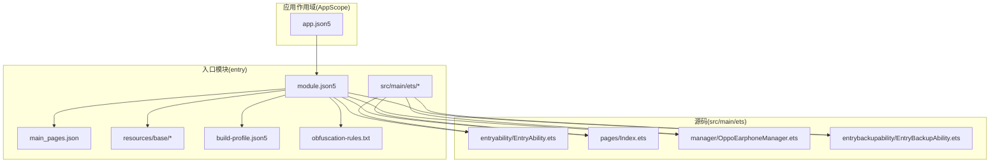
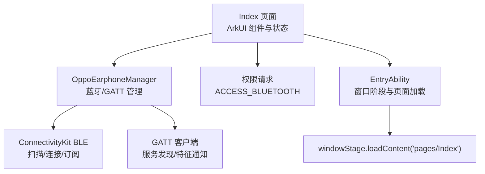
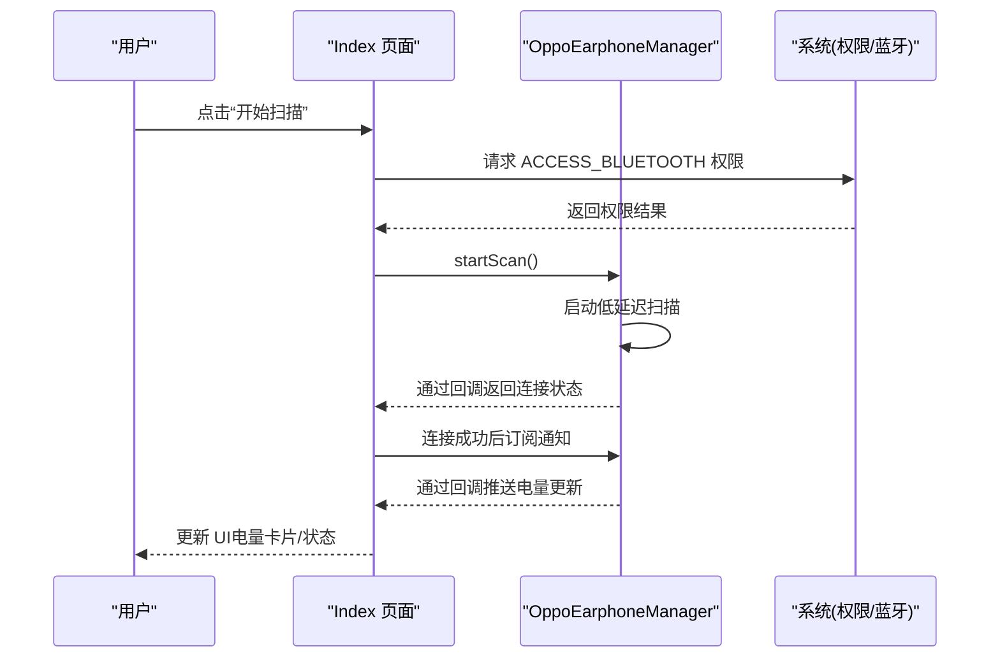
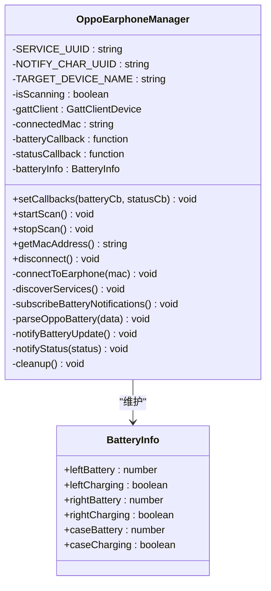
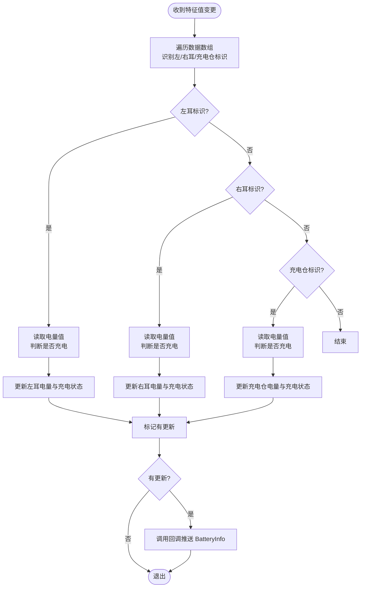
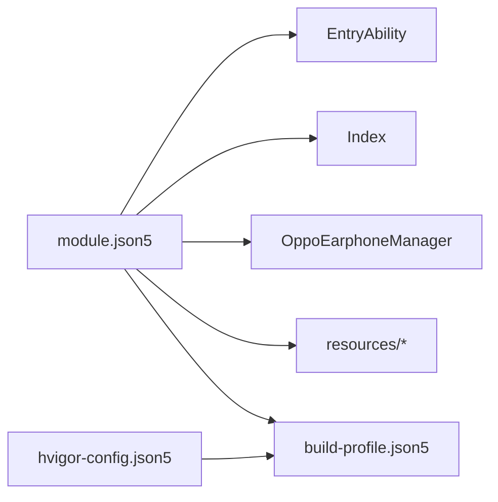

# 项目概述

<cite>
**本文档引用的文件**
- [EntryAbility.ets](file://entry/src/main/ets/entryability/EntryAbility.ets)
- [Index.ets](file://entry/src/main/ets/pages/Index.ets)
- [OppoEarphoneManager.ets](file://entry/src/main/ets/manager/OppoEarphoneManager.ets)
- [module.json5](file://entry/src/main/module.json5)
- [main_pages.json](file://entry/src/main/resources/base/profile/main_pages.json)
- [string.json](file://entry/src/main/resources/base/element/string.json)
- [layered_image.json](file://entry/src/main/resources/base/media/layered_image.json)
- [EntryBackupAbility.ets](file://entry/src/main/ets/entrybackupability/EntryBackupAbility.ets)
- [build-profile.json5](file://entry/build-profile.json5)
- [obfuscation-rules.txt](file://entry/obfuscation-rules.txt)
- [app.json5](file://AppScope/app.json5)
- [hvigor-config.json5](file://hvigor/hvigor-config.json5)
- [Ability.test.ets](file://entry/src/ohosTest/ets/test/Ability.test.ets)
- [List.test.ets](file://entry/src/ohosTest/ets/test/List.test.ets)
</cite>

## 目录
1. [简介](#简介)
2. [项目结构](#项目结构)
3. [核心组件](#核心组件)
4. [架构总览](#架构总览)
5. [详细组件分析](#详细组件分析)
6. [依赖关系分析](#依赖关系分析)
7. [性能考虑](#性能考虑)
8. [故障排除指南](#故障排除指南)
9. [结论](#结论)
10. [附录](#附录)

## 简介
本项目是针对 OPPO Enco Air5 Pro 蓝牙耳机的电量监控应用，基于 HarmonyOS 平台与 ArkTS 开发框架构建。其核心目标是实现实时监控左耳、右耳及充电仓的电量状态，并通过直观的 UI 展示连接状态与设备信息。应用采用 ConnectivityKit 的 BLE 能力进行扫描与 GATT 通信，结合 AbilityKit 生命周期管理与 ArkUI 界面框架，提供流畅的用户体验。

## 项目结构
项目采用“模块化 + 分层”的组织方式：
- AppScope：应用级资源配置与元数据
- entry 模块：应用主体，包含 UI 页面、业务管理器、能力声明与资源
- 测试：本地单元测试与自动化测试套件
- 构建工具：hvigor 与构建配置文件

图表来源
- [module.json5:1-63](file://entry/src/main/module.json5#L1-L63)
- [main_pages.json:1-6](file://entry/src/main/resources/base/profile/main_pages.json#L1-L6)
- [EntryAbility.ets:1-48](file://entry/src/main/ets/entryability/EntryAbility.ets#L1-L48)
- [Index.ets:1-408](file://entry/src/main/ets/pages/Index.ets#L1-L408)
- [OppoEarphoneManager.ets:1-709](file://entry/src/main/ets/manager/OppoEarphoneManager.ets#L1-L709)
- [EntryBackupAbility.ets:1-16](file://entry/src/main/ets/entrybackupability/EntryBackupAbility.ets#L1-L16)
- [build-profile.json5:1-33](file://entry/build-profile.json5#L1-L33)
- [obfuscation-rules.txt:1-23](file://entry/obfuscation-rules.txt#L1-L23)

章节来源
- [module.json5:1-63](file://entry/src/main/module.json5#L1-L63)
- [main_pages.json:1-6](file://entry/src/main/resources/base/profile/main_pages.json#L1-L6)
- [build-profile.json5:1-33](file://entry/build-profile.json5#L1-L33)

## 核心组件
- EntryAbility：应用入口能力，负责窗口阶段创建与页面加载，设置主题色模式与日志输出。
- Index 页面：应用主界面，展示连接状态、MAC 地址、三路电量卡片与操作按钮；负责请求蓝牙权限与管理生命周期回调。
- OppoEarphoneManager：核心业务管理器，封装 BLE 扫描、GATT 连接、服务发现、特征订阅与电量解析逻辑。
- EntryBackupAbility：备份扩展能力，支持应用数据备份与恢复流程。
- 资源与配置：字符串、媒体资源、模块清单、构建配置等。

章节来源
- [EntryAbility.ets:1-48](file://entry/src/main/ets/entryability/EntryAbility.ets#L1-L48)
- [Index.ets:1-408](file://entry/src/main/ets/pages/Index.ets#L1-L408)
- [OppoEarphoneManager.ets:1-709](file://entry/src/main/ets/manager/OppoEarphoneManager.ets#L1-L709)
- [EntryBackupAbility.ets:1-16](file://entry/src/main/ets/entrybackupability/EntryBackupAbility.ets#L1-L16)

## 架构总览
系统采用“UI 页面 + 业务管理器 + 系统服务”的分层架构：
- UI 层：Index 页面使用 ArkUI 组件与状态管理，响应用户交互与回调更新。
- 业务层：OppoEarphoneManager 封装蓝牙扫描、连接、订阅与数据解析。
- 系统层：通过 AbilityKit 生命周期与 ConnectivityKit 蓝牙服务完成系统集成。

图表来源
- [Index.ets:100-142](file://entry/src/main/ets/pages/Index.ets#L100-L142)
- [OppoEarphoneManager.ets:115-121](file://entry/src/main/ets/manager/OppoEarphoneManager.ets#L115-L121)
- [EntryAbility.ets:21-32](file://entry/src/main/ets/entryability/EntryAbility.ets#L21-L32)

## 详细组件分析

### EntryAbility 应用入口
- 职责：初始化颜色模式、记录生命周期日志、加载主页面 Index。
- 关键点：通过 windowStage.loadContent 加载页面；捕获错误并记录日志；前台/后台切换事件记录。

章节来源
- [EntryAbility.ets:1-48](file://entry/src/main/ets/entryability/EntryAbility.ets#L1-L48)
- [main_pages.json:1-6](file://entry/src/main/resources/base/profile/main_pages.json#L1-L6)

### Index 主页面
- 职责：展示连接状态、MAC 地址、三路电量卡片（左耳/右耳/充电仓）、操作按钮与提示信息。
- 权限：动态请求 ACCESS_BLUETOOTH 权限，无权限时禁用扫描按钮。
- 生命周期：aboutToAppear 注册回调，aboutToDisappear 断开连接。
- 电量卡片：BatteryCardComponent 子组件，根据电量与充电状态渲染颜色与文本。

图表来源
- [Index.ets:116-142](file://entry/src/main/ets/pages/Index.ets#L116-L142)
- [Index.ets:307-333](file://entry/src/main/ets/pages/Index.ets#L307-L333)
- [OppoEarphoneManager.ets:131-207](file://entry/src/main/ets/manager/OppoEarphoneManager.ets#L131-L207)

章节来源
- [Index.ets:1-408](file://entry/src/main/ets/pages/Index.ets#L1-L408)

### OppoEarphoneManager 核心管理器
- 职责：封装蓝牙扫描、GATT 连接、服务发现、特征订阅与电量解析。
- 关键流程：
  - startScan：启动低延迟扫描，匹配目标设备名，停止扫描并发起连接。
  - connectToEarphone：创建 GATT 客户端，监听连接状态变化，连接成功后进入服务发现。
  - discoverServices：检查目标服务 UUID，随后订阅通知。
  - subscribeBatteryNotifications：开启特征值变更通知，注册回调。
  - parseOppoBattery：解析二进制数据中的左耳、右耳与充电仓电量，区分充电状态。
  - cleanup/disconnect：断开连接并清理资源，重置电量状态。
- 数据模型：BatteryInfo 描述三路电量与充电状态；ConnectionStatus 表示连接阶段。

图表来源
- [OppoEarphoneManager.ets:49-121](file://entry/src/main/ets/manager/OppoEarphoneManager.ets#L49-L121)
- [OppoEarphoneManager.ets:13-27](file://entry/src/main/ets/manager/OppoEarphoneManager.ets#L13-L27)

图表来源
- [OppoEarphoneManager.ets:497-593](file://entry/src/main/ets/manager/OppoEarphoneManager.ets#L497-L593)

章节来源
- [OppoEarphoneManager.ets:1-709](file://entry/src/main/ets/manager/OppoEarphoneManager.ets#L1-L709)

### EntryBackupAbility 备份扩展
- 职责：实现备份与恢复流程的日志记录与占位逻辑，便于后续扩展。

章节来源
- [EntryBackupAbility.ets:1-16](file://entry/src/main/ets/entrybackupability/EntryBackupAbility.ets#L1-L16)

## 依赖关系分析
- 模块清单 module.json5 声明入口能力、权限与页面映射。
- main_pages.json 指定主页面 Index。
- 字符串与媒体资源提供本地化标签与图标配置。
- 构建配置 build-profile.json5 控制 ArkTS 编译与混淆策略。
- hvigor 配置文件提供构建执行参数与日志级别控制。

图表来源
- [module.json5:1-63](file://entry/src/main/module.json5#L1-L63)
- [main_pages.json:1-6](file://entry/src/main/resources/base/profile/main_pages.json#L1-L6)
- [build-profile.json5:1-33](file://entry/build-profile.json5#L1-L33)
- [hvigor-config.json5:1-24](file://hvigor/hvigor-config.json5#L1-L24)

章节来源
- [module.json5:1-63](file://entry/src/main/module.json5#L1-L63)
- [string.json:1-20](file://entry/src/main/resources/base/element/string.json#L1-L20)
- [layered_image.json:1-7](file://entry/src/main/resources/base/media/layered_image.json#L1-L7)
- [build-profile.json5:1-33](file://entry/build-profile.json5#L1-L33)
- [hvigor-config.json5:1-24](file://hvigor/hvigor-config.json5#L1-L24)

## 性能考虑
- 扫描优化：使用低延迟扫描模式以提升发现速度，同时在发现目标设备后立即停止扫描，降低功耗。
- 连接与订阅：仅在连接成功后进行服务发现与通知订阅，避免无效操作。
- UI 响应：通过回调驱动状态更新，减少不必要的重绘。
- 构建混淆：按需启用属性/全局/文件名/导出混淆，平衡安全性与可维护性。

## 故障排除指南
- 权限问题：若蓝牙权限未授予，扫描按钮不可用。确认权限申请流程与系统授权状态。
- 连接失败：检查设备名称匹配、距离与遮挡情况；查看日志中连接状态变化与错误信息。
- 电量不更新：确认已成功订阅通知；检查数据解析逻辑是否命中对应标识与范围。
- 资源清理：断开连接或异常退出后，确保清理 GATT 客户端与回调，防止内存泄漏。

章节来源
- [Index.ets:147-161](file://entry/src/main/ets/pages/Index.ets#L147-L161)
- [OppoEarphoneManager.ets:267-275](file://entry/src/main/ets/manager/OppoEarphoneManager.ets#L267-L275)
- [OppoEarphoneManager.ets:653-683](file://entry/src/main/ets/manager/OppoEarphoneManager.ets#L653-L683)

## 结论
本项目以清晰的分层架构与模块化设计实现了 OPPO Enco Air5 Pro 的电量监控功能。通过 ArkTS 与 HarmonyOS 能力的有机结合，应用在保证易用性的同时具备良好的可维护性与扩展性。建议后续增强异常场景处理、完善测试覆盖与日志体系。

## 附录

### 技术栈说明
- ArkTS：应用开发语言，支持声明式 UI 与类型安全。
- ArkUI：声明式 UI 框架，提供丰富的组件与布局能力。
- AbilityKit：应用生命周期管理与权限访问控制。
- ConnectivityKit：蓝牙 BLE 能力封装，支持扫描、连接与特征订阅。
- HarmonyOS Stage 模型：模块化构建与运行时环境。

章节来源
- [Index.ets:1-408](file://entry/src/main/ets/pages/Index.ets#L1-L408)
- [OppoEarphoneManager.ets:1-709](file://entry/src/main/ets/manager/OppoEarphoneManager.ets#L1-L709)
- [module.json5:1-63](file://entry/src/main/module.json5#L1-L63)

### 开发环境与构建
- 构建工具：hvigor
- 构建配置：build-profile.json5 控制 ArkTS 编译与混淆规则
- 混淆策略：obfuscation-rules.txt 定义混淆选项
- 应用元数据：app.json5 定义包名、版本与图标

章节来源
- [build-profile.json5:1-33](file://entry/build-profile.json5#L1-L33)
- [obfuscation-rules.txt:1-23](file://entry/obfuscation-rules.txt#L1-L23)
- [app.json5:1-11](file://AppScope/app.json5#L1-L11)

### 快速开始指南
- 准备工作：安装 DevEco Studio，配置 HarmonyOS SDK 与模拟器/真机调试环境。
- 导入项目：打开仓库根目录，选择 Stage 模型项目导入。
- 权限配置：确保 module.json5 中声明 ACCESS_BLUETOOTH 权限。
- 运行调试：连接设备，点击运行按钮，观察日志与 UI 行为。
- 扫描与连接：在 Index 页面点击“开始扫描”，等待发现目标设备并自动连接。
- 电量查看：连接成功后，UI 将显示左耳、右耳与充电仓的实时电量与充电状态。

章节来源
- [module.json5:14-25](file://entry/src/main/module.json5#L14-L25)
- [Index.ets:307-333](file://entry/src/main/ets/pages/Index.ets#L307-L333)
- [EntryAbility.ets:21-32](file://entry/src/main/ets/entryability/EntryAbility.ets#L21-L32)

### 测试与验证
- 本地测试：entry/src/test 与 entry/src/ohosTest 提供基础测试样例。
- 自动化测试：Ability.test.ets 展示了测试套件的基本结构与断言方法。

章节来源
- [List.test.ets:1-5](file://entry/src/test/List.test.ets#L1-L5)
- [Ability.test.ets:1-35](file://entry/src/ohosTest/ets/test/Ability.test.ets#L1-L35)